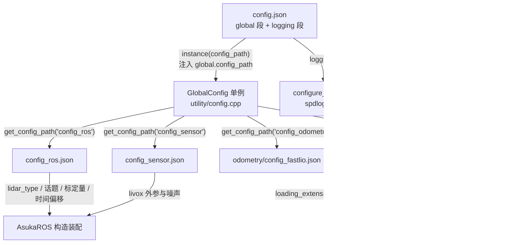

# 全局配置层级

## 概览：四份 JSON 文件与一个单例入口

asuka 的配置系统由一个顶层入口文件和若干份按职责拆分的子配置组成，全部位于 `src/asuka/config/` 下，通过 `GlobalConfig` 单例统一解析与访问：

| 文件 | 职责 | 主要消费者 |
|---|---|---|
| `config.json` | 顶层入口：登记各子配置文件名 + 日志系统参数 | `GlobalConfig::instance()`、`configure_logging()` |
| `config_ros.json` | ROS 边界参数：话题名、雷达类型、标定量、地图保存路径 | `asuka_ros.cpp` 构造装配 |
| `config_sensor.json` | 传感器参数：外参、噪声、零偏、协方差（按雷达分段） | 里程计/预处理层 |
| `config_extensions.json` | 扩展插件 so 加载名单 + 各扩展模块自身参数段 | `ExtensionModule` dlopen 加载 |

（另有 `config_odometry` 指向算法参数文件，属于算法配置变体页面的主题，本页只涉及它在 `global` 段中的登记方式。）

## config.json：顶层入口与文件名间接表

`config.json` 分两段：

- **`global` 段**（L2-L7）：是一个"逻辑名 → 文件名"的间接表，登记 `config_ros`、`config_sensor`、`config_odometry`、`config_extensions` 四个键。注意 `config_odometry` 的值是 `odometry/config_fastlio.json`，即文件名支持带子目录的相对路径。
- **`logging` 段**（L8-L17）：控制日志通道——`console_output`/`console_level`、`file_output`/`logging_dir`/`logging_level`、以及轮转参数 `rotate_logs`/`max_file_size_kb`/`max_files`。该段由 `GlobalConfig::instance()` 内调用的 `configure_logging()` 消费，把 config.json 与日志系统（见日志系统页）串接起来。

## 解析与访问机制（utility/config）

`Config`/`GlobalConfig`（`config.hpp` + `config.cpp`）是所有配置读取的必经之路，有三个关键设计：

**1. 单例 + 路径注入**。`GlobalConfig::instance(config_path)` 在首次调用时 `new GlobalConfig(config_path + "/config.json")`，随即把传入目录用 `override_param("global", "config_path", ...)` 注回配置自身（config.cpp L72-L81）。此后 `get_config_path()` 做两级解析：目录取自注入的 `global.config_path`，文件名取自 `global.<config_name>` 键，若键缺失则回退为 `config_name + ".json"`（L83-L88）。因此上层模块只需：

```cpp
auto path = GlobalConfig::get_config_path("config_ros");  // → <config_path>/config_ros.json
```

**2. 带注释的 JSON 解析**。构造函数中 `nlohmann::json::parse(ifs, nullptr, true, true)` 打开了 ignore_comments（config.cpp L29）。这不是小事：`config_sensor.json` 中整段注释掉的 `robosense`、`config_extensions.json` 中注释掉的 loam/miao so 名，都依赖这一能力实现"注释即切换"。

**3. 类型化读取**。`Config` 提供 `has_param`/`param<T>`（返回 `optional` 或带默认值）/`param_nested`/`param_cast`/`override_param` 等接口（config.hpp L17-L44）；config.cpp L57-L70 用 `ASUKA_DEFINE_CONFIG_IO` 显式实例化了标量、`std::vector` 以及 `Eigen::Vector3d`/`Matrix3d`/`Quaterniond`/`Isometry3d` 等 IO 特化——这正好覆盖 config_sensor 中外参平移（3 维）与旋转矩阵（9 元素）的读取需求。

## config_ros.json：ROS 边界参数

`ros` 段集中了所有"ROS 世界与算法世界交界"的参数：

| 参数 | 作用 |
|---|---|
| `lidar_type: "livox"` | 决定 `insert_frame` 的点云分发分支（Livox/Robosense），同时也是 config_sensor 的段选择键 |
| `imu_topic` / `lidar_topic` | 订阅 `sensor_msgs::Imu` 与 `PointCloud2` 的话题名 |
| `acc_scale: 9.80665` | IMU 加计标定系数，在 `insert_imu` 中叠加 |
| `imu_time_offset` / `time_offset_lidar_to_imu` | 时间戳补偿，分别在 IMU 接入与点云接入时施加 |
| `enable_map_saving` / `map_saving_path` | 控制退出时是否落盘 `mapping_*.pcd`；该路径同时作为扩展模块 `at_exit(map_saving_path)` 的入参 |

这一文件的存在意义与"IMU 接入与标定补偿"页的结论一致：**所有标定类修正被收敛在 ROS 封装层**，改传感器或换话题只动这一份文件，算法层无需感知。

## config_sensor.json：传感器标定与噪声

按传感器名分段（当前激活 `livox`，`robosense` 整段注释保留）。每段包含：

- **外参**：`extrinsic_T`（3 维平移）、`extrinsic_R`（3x3 旋转，按行展开的 9 元素数组），对应 Eigen IO 特化；
- **噪声模型**：`acc_noise`/`gyro_noise`（3 维）与标量协方差 `gyr_cov`/`acc_cov`；
- **零偏模型**：`acc_bias`/`gyro_bias`（3 维）与 `b_gyr_cov`/`b_acc_cov`。

跨文件耦合点：config_ros 的 `lidar_type` 值即本文件中应激活的段名——当前 `"livox"` 对应 `"livox"` 段。换用 Robosense 需同时改两处：`lidar_type` 改值 + 取消 `robosense` 段注释。

## config_extensions.json：扩展插件名单

结构分两部分：

- **`extensions.loading_extension_modules`**（L3-L8）：待 dlopen 的 so 名单。当前激活 `libasuka_imu_prediction.so` 与 `libasuka_rviz_viewer.so`；`libasuka_optimization_loam.so`、`libasuka_optimization_miao.so` 被注释（后端切换即注释行级别的操作）。AsukaROS 退出时统一 stop 列表中的模块并调用 `at_exit(map_saving_path)`。
- **各扩展的参数段**（L10-L56）：`rviz_viewer`（frame id 与各发布开关）、`imu_prediction`（`gravity`、`imu_scale`）、`optimization_loam`（关键帧间距、回环搜索半径等十余项）、`optimization_miao`（回环/NDT 阈值、运动与回环噪声等）。扩展模块被装载后从自己的同名段读参——**名单项与参数段同文件共置**，是"加载谁"与"它怎么配"的单一事实来源。

## 装配链路



关键节点说明：

- **GlobalConfig 单例**是唯一的解析点；`instance()` 传入 `override_path=true` 可整体重载（实现中会 `delete` 旧单例再重建，持有旧指针的调用方需注意失效）。
- **get_config_path** 是唯一推荐的子配置寻址方式，上层代码不硬编码文件名，改文件名只动 config.json。
- **AsukaROS 构造装配**（C）是 config_ros 与 config_sensor 的汇合点：先读话题与 lidar_type，再取传感器外参/噪声，随后按扩展名单装载模块。
- **扩展插件**（X）的参数读取发生在各自模块内部，与主链路解耦。

## 边界条件

1. **文件打开失败**：`spdlog::error` 后继续，config 为空 JSON——所有 `param<T>(带默认值)` 调用退回默认值，进程不会因缺配置而崩溃，但会以"全默认参数"运行，排障时应先查该错误日志。
2. **JSON 解析失败**：同样只报错并置空，坏语法不会抛出到上层。
3. **注释合法**：ignore_comments 打开，但注释内参数不参与解析，"注释切换"必须是整行级。
4. **文件名回退**：`global` 段缺键时回退 `<config_name>.json`，因此删除 config.json 中的某行不一定报错，可能只是静默换到同名默认文件。
5. **单例重载语义**：`override_path=true` 会销毁重建单例，适合运行期整体换配置目录，但不适合频繁调用。

## 扩展点

- **新增子配置文件**：在 config.json 的 `global` 段加一行 `"<逻辑名>": "<文件名>.json"`，代码侧用 `get_config_path("<逻辑名>")` 寻址即可，无需改 GlobalConfig 本身。
- **接入新扩展模块**：在 `loading_extension_modules` 加 so 名 + 在同文件加同名参数段，两步完成；停用则注释对应行。
- **切换传感器标定**：利用注释保留的多段结构（livox/robosense），配合 `lidar_type` 改值完成整套标定切换。
- **切换里程计实现**：`global.config_odometry` 改指向不同 JSON（如 `config_batchlio.json`）——具体超参对比见"里程计配置变体与实现切换"页。

Sources:
- `src/asuka/config/config.json#L1-L18`
- `src/asuka/config/config_ros.json#L1-L12`
- `src/asuka/config/config_sensor.json#L1-L86`
- `src/asuka/config/config_extensions.json#L1-L57`
- `src/asuka/src/asuka/utility/config.cpp#L1-L97`
- `src/asuka/include/asuka/utility/config.hpp#L1-L68`

## 关联源码

- `src/asuka/config/config.json`
- `src/asuka/config/config_ros.json`
- `src/asuka/config/config_sensor.json`
- `src/asuka/config/config_extensions.json`
