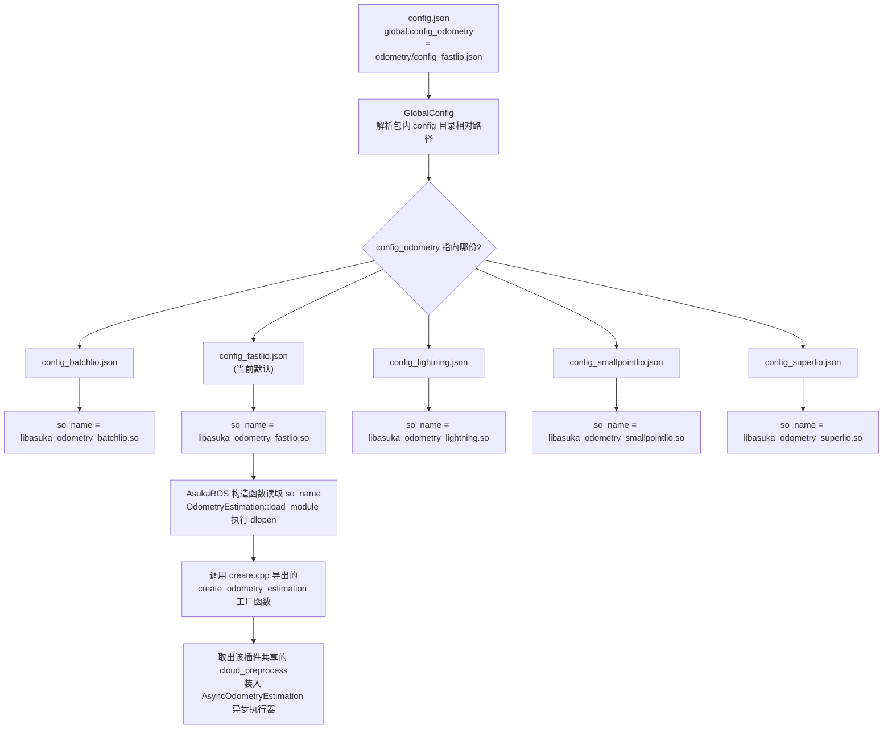

# 里程计配置变体与实现切换

## 页面定位

`src/asuka/config/odometry/` 目录下存放五种里程计算法各自的参数文件，**一种算法对应一份独立 JSON**。这些文件是「算法矩阵」的参数边界：文件内 `odometry.so_name` 指明该算法编译出的动态库名，其余分段收纳各算法私有的超参。而顶层 `config.json` 的 `global.config_odometry` 键决定运行时读取哪一份——**更换里程计实现只需修改这一行指向**。

## 配置文件清单

| 文件 | 体量 | 顶层分段 | so_name |
|---|---|---|---|
| `config_batchlio.json` | 1294 B / 63 行（最详尽） | odometry / batch / mapping / preprocess / filter / publish | `libasuka_odometry_batchlio.so` |
| `config_fastlio.json` | 512 B / 25 行 | odometry / preprocess / mapping / filter | `libasuka_odometry_fastlio.so` |
| `config_lightning.json` | 794 B / 37 行 | odometry / preprocess / mapping / roi | `libasuka_odometry_lightning.so` |
| `config_smallpointlio.json` | 919 B / 43 行 | odometry / imu / preprocess / filter / publish | `libasuka_odometry_smallpointlio.so` |
| `config_superlio.json` | 690 B / 37 行 | odometry / kf / imu / hash_map / preprocess / extrinsic / eva | `libasuka_odometry_superlio.so` |

五份文件共同构成一个「最小公共契约 + 算法私有命名空间」的结构。

## 公共契约：`odometry` 分段

五份配置的 `odometry` 分段都包含相同的三元组：

- **`so_name`**：动态库文件名，是 `OdometryEstimation::load_module` 执行 `dlopen` 的目标，也是整个切换机制的锚点；
- **`imu_buffer_capacity: 1000`**、**`lidar_buffer_capacity: 50`**：两行完全一致，属于框架级（而非算法级）参数，供异步执行器的双队列容量使用。

除此之外，`odometry` 分段在不同文件中的「占用程度」差异明显：fastlio 在其中放了 `max_iteration: 3`、`laser_point_cov: 0.001`；lightning 更是把多达 14 个算法键（迭代次数、ICP 权重、关键帧阈值、Anderson 加速开关 `use_aa`、`imu_filter` 等）全部塞进 `odometry`；而 batchlio/smallpointlio/superlio 的 `odometry` 分段只保留公共三元组，算法参数下沉到各自命名段。

## 各算法配置剖面

### batchlio：参数最重的一份
63 行中 `mapping` 段独占约 36 行，涵盖：饱和检查（`check_satu`/`satu_acc: 3.0`/`satu_gyro: 35.0`）、全套噪声协方差（`acc_cov_output: 500.0`、`gyr_cov_output: 1000.0`、偏置协方差等）、ivox 局部地图（分辨率 `2.0`、近邻类型 `6`）、重力向量与初始重力两组三元组、滤波传播方式开关（`use_imu_as_input: false`、`prop_at_freq_of_imu: true`）。独有的 `batch` 段（`dt: 0.001`、`deskew: true`、`enable_openmp: false`）直接反映其批量式处理特性。

### fastlio：当前被选中的默认实现
`config.json#L5` 写着 `"config_odometry": "odometry/config_fastlio.json"`——仓库当前默认运行 FastLIO。配置最紧凑：预处理 `scan_line: 4`、`point_filter_num: 3`，配准侧仅 `fov_degree: 360` 与体素滤波参数（`filter_size_surf: 0.15`、`cube_side_length: 1000`）。

### lightning：算法键集中在 odometry 段
除迭代次数 `max_iteration: 8` 外，还有 ICP 混合权重（`enable_icp_part`、`plane_icp_weight`、`icp_weight: 100`）、关键帧策略（`kf_dis_th: 2.0`、`kf_angle_th: 15.0`、`skip_lidar_num: 5`、`proj_kfs`/`max_proj_kfs`）。独有的 `roi` 段以 `height_max/height_min` 划定高度带。ivox 参数为 `0.2` / `18`——与 batchlio 的 `2.0` / `6` 相差一个数量级，说明两者对局部地图的粒度假设完全不同。

### smallpointlio：独立 `imu` 段与完整滤波协方差
`imu` 段收纳重力向量、`fix_gravity_direction`、饱和检查（`satu_acc: 3.0`/`satu_gyro: 35.0`/`acc_norm: 9.80665`）——注意这组数值与 batchlio `mapping` 段中的同名语义参数**完全相同但分段不同**，属于各文件自行复制的标定量。`filter` 段给出全套协方差与配准阈值（`plane_threshold: 0.1`、`match_squared: 81.0`、`map_resolution: 0.5`）。

### superlio：分段命名最「自立门户」
`kf`（`max_iterations: 4`、`align_gravity`、`quit_eps`）、`imu`（噪声密度 `imu_na/ng/nba/nbg`）、`hash_map`（容量 `2000000`、体素分辨率 `0.5`）、`extrinsic`（`odom_robo` 六维外参，五份配置中唯一的外参键）、`eva`（计时开关）。预处理键名也独树一帜：用 `filter_rate: 3` 而非别处的 `point_filter_num`。

## 跨文件命名漂移（阅读时需警惕）

同义概念在各文件中的键名并不统一：

| 语义 | 常见写法 | superlio 写法 |
|---|---|---|
| 点抽稀比例 | `point_filter_num` | `filter_rate` |
| 迭代上限 | `max_iteration`（fastlio/lightning） | `max_iterations` |
| 平面阈值 | `plane_thr`（batchlio）/ `plane_threshold`（smallpointlio） | — |
| 匹配距离² | `match_s`（batchlio）/ `match_squared`（smallpointlio） | — |
| 重力 | 向量 `gravity`（batchlio/smallpointlio） | 标量 `gravity_norm` |

因此**参数不能跨文件盲目复制**：每种实现只通过 `param<T>` 读取自己文件里的键，换实现后必须在目标算法自己的键名下调参。

## 切换机制的调用链

**关键节点解释**：

- **`config.json`（A）**：唯一的切换开关。`global` 下并列四个配置指针（ros / sensor / odometry / extensions），本页只关心 `config_odometry`；
- **五份 JSON（D1–D5）**：互斥读取，运行时只有被指向的那份生效；未被指向的文件对进程完全不可见；
- **`so_name`（E1–E5）**：配置到代码的桥。库文件名前缀 `libasuka_odometry_` + 算法名，与 `src/asuka/src/asuka/odometry/` 下五个子目录一一对应；
- **`load_module` → `create_odometry_estimation`（F–G）**：dlopen 拿到句柄后调用各实现 `create.cpp` 导出的 extern C 工厂，构造具体的 `OdometryEstimation` 子类实例；
- **`cloud_preprocess` 共享取出（H）**：插件创建时连带交出算法私有的点云预处理实现，ROS 层在 `insert_frame` 中只面向该接口调用——这正是配置选择能整体替换「预处理 + 估计」闭环的原因。

## 边界条件

1. **so_name 必须与实际编译产物一致**：若目标 `.so` 未编译或改名，`dlopen` 在启动装配阶段即失败，进程无法建立里程计；
2. **切换 ≠ 参数继承**：换掉 `config_odometry` 后，原算法的所有超参（协方差、重力、抽稀、滤波分辨率）不会迁移，需在新文件中按其键名重新确认；
3. **切换同时切换了传感器画像**：`scan_line`（fastlio 4 / batchlio 6 / lightning 32）、距离范围（superlio 2.0–60 m vs batchlio 0.5–1000 m）、ivox 分辨率（0.2 vs 2.0）差异巨大，指向新配置前必须核对新算法参数是否匹配实际挂载的雷达与场景；
4. **公共三元组应保持一致**：五份文件的 `imu_buffer_capacity: 1000` / `lidar_buffer_capacity: 50` 是刻意对齐的框架参数，新增或修改配置时不宜单独偏离；
5. **标定量重复存放**：饱和阈值与重力相关参数在 batchlio 与 smallpointlio 中各存一份，若重新标定传感器需同步修改多份文件，否则不同实现的行为会悄然分叉。

## 扩展点

- **新增第六种算法**：仿照现有模式，在 `odometry/` 下新建实现目录并提供 `create.cpp` 导出工厂函数，在 `config/odometry/` 新增一份以 `odometry.so_name = libasuka_odometry_<名>.so` 为锚的 JSON，最后把 `config.json` 的 `config_odometry` 改指向新文件即可，框架层（AsukaROS、异步执行器、预处理接口）零改动；
- **`odometry` 分段的键位约定**：公共三元组之外，该分段既可像 fastlio/lightning 那样直接放算法键，也可像 batchlio/superlio 那样只留锚点、把参数拆进私有分段——两种风格在仓库中并存，新增实现可任选，但建议与所选算法的参数读取代码保持对应；
- **与扩展模块同构**：`config_extensions.json` 以「名单 + so 名」的方式控制扩展插件加载，与本页「单选指针 + so_name」形成对照——前者是集合加载，后者是五选一切换。

## Sources

- `src/asuka/config/config.json#L1-L18`
- `src/asuka/config/odometry/config_batchlio.json#L1-L63`
- `src/asuka/config/odometry/config_fastlio.json#L1-L25`
- `src/asuka/config/odometry/config_lightning.json#L1-L37`
- `src/asuka/config/odometry/config_smallpointlio.json#L1-L43`
- `src/asuka/config/odometry/config_superlio.json#L1-L37`
- `src/asuka/src/asuka/asuka_ros.cpp#L1-L80`
- `src/asuka/src/asuka/utility/load_module.cpp#L1-L80`

Sources: `src/asuka/config/odometry/config_batchlio.json#L1` `src/asuka/config/odometry/config_fastlio.json#L1` `src/asuka/config/odometry/config_lightning.json#L1` `src/asuka/config/odometry/config_smallpointlio.json#L1` `src/asuka/config/odometry/config_superlio.json#L1`

## 关联源码

- `src/asuka/config/odometry/config_batchlio.json`
- `src/asuka/config/odometry/config_fastlio.json`
- `src/asuka/config/odometry/config_lightning.json`
- `src/asuka/config/odometry/config_smallpointlio.json`
- `src/asuka/config/odometry/config_superlio.json`
