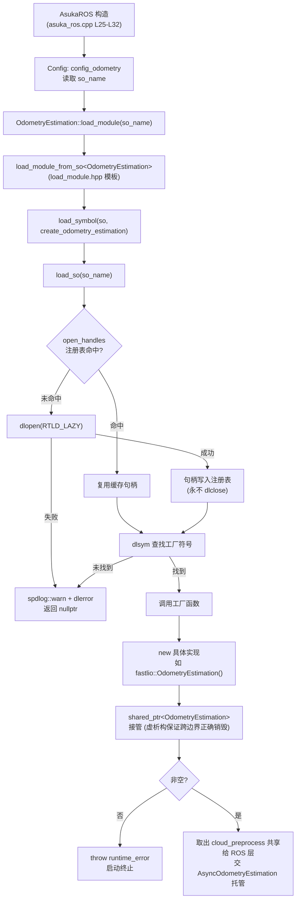
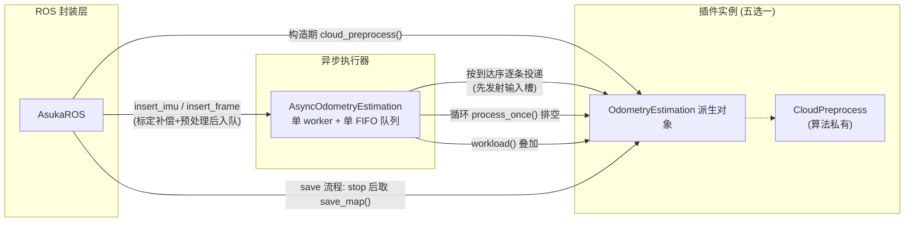

# 里程计抽象接口与插件契约

## 模块定位

`asuka::OdometryEstimation` 是整个里程计体系的**唯一接口面**：ROS 封装层（AsukaROS）、异步执行器（AsyncOdometryEstimation）与五种算法实现（batchlio / fastlio / lightning / smallpointlio / superlio）之间只通过这个基类对话。契约由两个层次构成：

- **C++ 能力面**：一组虚函数，约定算法如何接收数据、被驱动、报告负载、停机与导出地图；
- **C ABI 插件面**：`extern "C" OdometryEstimation* create_odometry_estimation()` 工厂符号，是 dlopen/dlsym 能够跨越编译边界的唯一入口。

实现代码刻意保持极薄：接口头文件 `odometry_estimation.hpp` 仅 983 字节，`odometry_estimation.cpp` 仅 319 字节（三行转发）；而五种算法的实现 cpp 从 14.9KB 到 43.8KB 不等——典型的"薄接口、厚实现"结构。

主要文件：

| 文件 | 角色 |
|---|---|
| `include/asuka/core/odometry_estimation.hpp` | 虚函数契约 + extern C 工厂声明 |
| `src/asuka/core/odometry_estimation.cpp` | static `load_module` 的符号绑定 |
| `include/asuka/utility/load_module.hpp` | `load_module_from_so` 模板 + 卸载顺序注释 |
| `src/asuka/utility/load_module.cpp` | dlopen 句柄注册表与 dlsym |
| `src/asuka/odometry/*/create.cpp` | 各算法的插件导出（181–193 字节） |

## 虚函数契约逐项解读

| 虚函数 | 默认实现 | 职责 | 典型调用方 |
|---|---|---|---|
| `insert_imu(const ImuData::ConstPtr&)` | 空操作 | 接收 IMU 数据 | 异步执行器 worker（按到达序） |
| `insert_frame(double stamp, const PointCloudT::ConstPtr&)` | 空操作 | 接收预处理后的点云帧 | 异步执行器 worker |
| `process_once()` | 返回 `false` | 单步推进计算，返回是否有进展 | 异步执行器的排空循环 |
| `workload() const` | 返回 `0` | 报告算法内部积压 | wait_idle / 保存判定 |
| `stop()` | 空操作 | 停止内部线程与计算、清空缓冲 | 析构链路 |
| `save_map()` | 返回 `nullptr` | 导出地图（fastlio 从 ikd-tree 现场导出，batchlio/superlio 返回累积地图，lightning 导出全局地图） | save 流程（stop 之后） |
| `cloud_preprocess()` | 返回 `nullptr` | **反向交付**算法私有点云预处理器 | AsukaROS 构造期 |

三个设计要点：

1. **全部为带默认实现的虚函数，而非纯虚**。默认值同时充当"未实现"信号：`workload()==0` 视为无积压、`process_once()==false` 视为无事可做、`save_map()`/`cloud_preprocess()` 返回 `nullptr` 视为未提供。基类因此允许部分实现，但这也意味着上层必须对默认值保持容忍（见下文边界条件）。
2. **`protected` 默认构造函数**：外部无法直接实例化基类，对象只能经由派生类构造、再以基类指针/智能指针流转——这正是插件工厂模式的结构性约束。
3. **虚析构 `virtual ~OdometryEstimation() = default`**：加载侧用 `shared_ptr<OdometryEstimation>` 接管插件内 `new` 出来的派生对象，跨 so 边界的 `delete` 依赖该虚析构正确下落到派生类。

## 插件边界：load_module 与 create_odometry_estimation

静态工厂一侧（`odometry_estimation.cpp`）把 so 名与符号名绑定：

```cpp
return load_module_from_so<OdometryEstimation>(so_name, "create_odometry_estimation");
```

`load_module_from_so<Module>`（模板，load_module.hpp）完成三步：`dlsym` 取符号 → 强转为函数指针并调用 → 返回的裸指针交给 `shared_ptr` 托管（未携带自定义 deleter）。

插件一侧以 fastlio 的 `create.cpp` 为最小样例（全文 6 行）：

```cpp
extern "C" asuka::OdometryEstimation* create_odometry_estimation() {
  return new asuka::fastlio::OdometryEstimation();
}
```

`extern "C"` 关闭 C++ 名字修饰，保证 `dlsym` 按字面名 `"create_odometry_estimation"` 命中；五种实现共享同一符号约定，仅类名不同。

### dlopen 句柄注册表

`load_module.cpp` 维护进程级 `std::map<std::string, void*> open_handles`（互斥锁保护），按 so 名缓存句柄：

- 重复装载同一 so 直接命中缓存，不会二次 `dlopen`；
- 以 `RTLD_LAZY` 打开（符号延迟解析）；
- 失败路径统一 `spdlog::warn` 并打印 `dlerror()` 后返回 `nullptr`；
- 注释明确：**句柄永不关闭**，插件代码常驻进程至进程结束。该注册表是未来 unload/reload 实现的接缝，`load_module.hpp` 注释已预写三步卸载顺序（先停所有可发射回调的线程 → 销毁模块使其退订回调槽 → 从注册表取句柄 `dlclose` 并删除条目），当前未实现。

## 装配与调用链

AsukaROS 构造函数（asuka_ros.cpp L25–L32）是契约的第一消费者：

1. 读取 `config_odometry` 的 `odometry.so_name`；
2. `OdometryEstimation::load_module(so_name)`，返回 `nullptr` 时直接 `throw std::runtime_error` —— so 缺失或符号缺失都会在启动期暴露；
3. `cloud_preprocess = odometry->cloud_preprocess()`：把算法私有的点云预处理器取出，共享给 ROS 层的点云入口（数据入口与算法的解耦点）；
4. `async = std::make_unique<AsyncOdometryEstimation>(odometry)`：同一实例交异步执行器接管其计算生命周期。

**一个插件实例被两方共享**：ROS 层只使用它的 `cloud_preprocess()`，异步执行器拥有它的全部运行期契约（insert / process_once / workload / stop / save_map）。

### 加载链



关键节点：`open_handles` 命中判定保证同一 so 只加载一次；`J`（失败）在链路上只会产生告警日志，真正的硬失败点被推迟到装配层的 `throw`；`R` 体现接口的反向交付——契约不仅约定算法如何被驱动，也约定算法如何向框架提供自己的数据入口预处理。

### 运行期契约使用



## 边界条件

- **失败链路**：`dlopen` 失败或 `dlsym` 找不到 `create_odometry_estimation` 都只返回 `nullptr`（伴随 warn 日志），最终在 AsukaROS 构造中以异常终止——插件错误不会以静默降级的方式流入运行期。
- **`cloud_preprocess()` 默认 `nullptr`**：若插件未覆写，ROS 层 `insert_frame` 中 `processed == nullptr` 直接 return，点云静默不入队。因此实际算法实现**必须**覆写该函数，否则整个 LIO 链路的激光侧断流。
- **`workload()` 默认 `0`**：未实现的算法在 wait_idle 判定中永远"空闲"，可能导致上层提前执行 save。
- **`process_once()` 默认 `false`**：异步排空循环立即视为无事可做，等价于算法不参与计算。
- **`save_map()` 默认 `nullptr`**：上层取地图时须判空。
- **句柄不关闭 + RTLD_LAZY**：so 一旦加载无法卸载；更换算法需修改 `config_odometry` 的 `so_name` 并重启进程。
- **跨边界 delete**：`create` 在插件翻译单元内 `new`，主程序侧 `shared_ptr` 析构；正确性依赖虚析构与同进程地址空间，且当前 `shared_ptr` 未携带自定义 deleter。

## 扩展点：新增一种里程计算法

1. 在 `src/asuka/odometry/<name>/` 新建目录，实现 `asuka::OdometryEstimation` 子类（头文件参照各现有 `odometry_estimation.hpp`）；
2. 按契约覆写七个虚函数：数据入口 `insert_imu` / `insert_frame`、计算驱动 `process_once`、负载与停机 `workload` / `stop`、导出 `save_map`、反向交付 `cloud_preprocess`。注意输入槽 `on_insert_imu` / `on_insert_frame` 由异步执行器统一发射，算法无需自行触发；
3. 编写 `create.cpp` 导出 `extern "C"` 工厂（fastlio 的 6 行文件即最小模板）；
4. 编译为 so，并在 `config_odometry` 中将 `so_name` 指向它——ROS 层与异步执行器零改动，即完成算法切换。

这一扩展路径正是五种现存实现全部走的路：接口层不变，差异全部收敛在每个算法目录的实现厚度里（14.9KB–43.8KB 的 `odometry_estimation.cpp`，外加各自的预处理与配套数学组件）。

Sources:
- `src/asuka/include/asuka/core/odometry_estimation.hpp#L1-L40`
- `src/asuka/src/asuka/core/odometry_estimation.cpp#L1-L11`
- `src/asuka/include/asuka/utility/load_module.hpp#L1-L31`
- `src/asuka/src/asuka/utility/load_module.cpp#L1-L61`
- `src/asuka/src/asuka/odometry/fastlio/create.cpp#L1-L6`
- `src/asuka/src/asuka/asuka_ros.cpp#L1-L120`

## 关联源码

- `src/asuka/include/asuka/core/odometry_estimation.hpp`
- `src/asuka/src/asuka/core/odometry_estimation.cpp`
