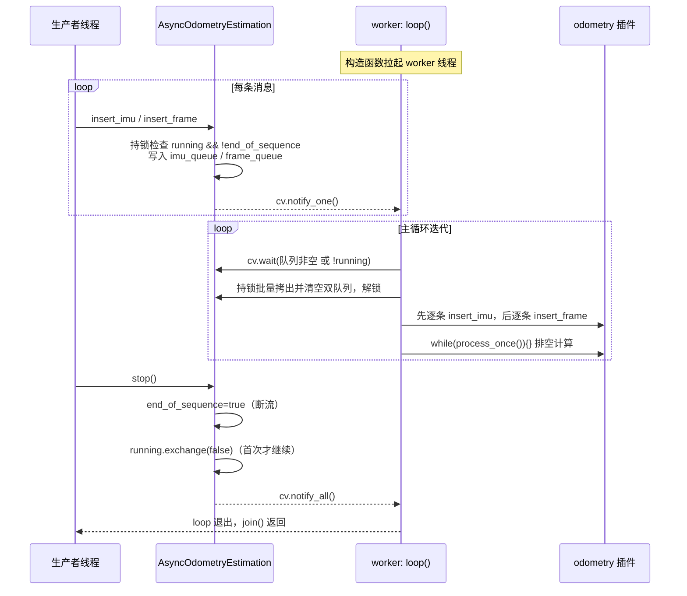

# 异步执行器 AsyncOdometryEstimation

## 模块定位与职责

`AsyncOdometryEstimation` 是 ROS 消息线程与里程计算法之间的**唯一并发边界**：它不承载任何算法逻辑，只负责把生产者（ROS spinner / nodelet / rosbag 回放线程）投递的 IMU 与点云数据，搬运到一个独立 worker 线程上，按固定顺序喂给被包装的 `OdometryEstimation` 插件，并驱动其计算排空。整个类只有两个源文件：1149 字节的头文件与 2533 字节的实现，是一个体量极小但并发语义密集的枢纽组件（`async_odometry_estimation.hpp` L15-L45、`async_odometry_estimation.cpp` L1-L86）。

它的五条公共 API 正好刻画了五项职责：

| API | 职责 | 证据 |
|---|---|---|
| `insert_imu` / `insert_frame` | 生产端入队（持锁、可拒绝） | cpp L17-L33 |
| `workload` | 聚合输入缓冲与算法内部负载 | cpp L35-L38 |
| `wait_idle` | 轮询等待系统完全空闲 | cpp L40-L50 |
| `stop` | 幂等停机并 join 线程 | cpp L52-L57 |
| `loop`（私有） | worker 主循环：批取出 → 喂入 → 排空 | cpp L59-L83 |

## 运行机制

### 构造即启动，析构即停机

构造函数只做一件事：保存共享的 odometry 插件指针，然后 `worker = std::thread(&AsyncOdometryEstimation::loop, this)` 立即拉起消费线程（cpp L8-L11）；析构函数直接调 `stop()`（cpp L13-L15）。这意味着**对象存活期间 worker 必然存活**，上层不需要手动管理线程生命周期。

### 生产端：双环形队列 + 可静默拒绝的入队

内部维护两个 `boost::circular_buffer`：`imu_queue` 容量 1000，`frame_queue` 容量 50（hpp L28-L29、L40-L41）。`insert_imu`/`insert_frame` 的结构完全对称：持 `mtx` 锁后先检查 `!running || end_of_sequence`，若执行器已停机则**直接 return，不入队、无日志、无返回值**（cpp L20、L29）；否则写入队列，出锁后 `cv.notify_one()` 唤醒 worker（cpp L23、L32）。

注意这两个容量与 `asuka_rosnode.cpp` 中 ROS 订阅端队列精确对齐：IMU 订阅队列 1000、点云订阅队列 50（asuka_rosnode.cpp L19、L24）。生产端链路（`AsukaROS::insert_imu` → 标定补偿 → `async->insert_imu`，asuka_ros.cpp L59-L70）在锁外完成转换，临界区只剩一次 `push_back`，对 ROS spinner 的阻塞极小。

### 消费端：批取出、锁外处理、先 IMU 后帧、循环排空

worker 的 `loop()` 是整个模块的核心（cpp L59-L83），每轮迭代分四步：

1. **等待**：`cv.wait(lock, ...)` 的谓词是 `!running || !imu_queue.empty() || !frame_queue.empty()`（L64），即"被要求停机"或"任一队列有数据"都会醒来。
2. **批取出**：谓词满足且 `running` 仍为真时，在持锁状态下把两个队列**整体拷贝**到局部 `std::vector`，然后清空源队列、立即 `unlock()`（L66-L72）。一次锁窗口搬运整批数据，锁竞争被压到最小；同时批内数据保持 IMU 与帧的相对到达顺序。
3. **喂入**：锁外先逐条 `odometry->insert_imu(...)`，再逐条 `odometry->insert_frame(...)`，源码注释明确写着 *"Feed IMU samples before frames, matching glim_ros's executor ordering"*（L75）——喂入顺序继承自 glim 的执行器约定，IMU 先于帧是滤波类里程计正确前向传播的前提。
4. **排空**：`while (odometry->process_once()) {}` 循环调用直至算法返回 false（L79-L80），即"把这一批数据引发的所有待处理计算全部消化完"才回到等待。`processing` 原子标志在喂入前置位、排空后清零（L74、L81），供 `wait_idle` 观测。

`process_once` 的"返回 false 表示无事可做"语义来自基类 `OdometryEstimation` 的默认实现 `{ return false; }`（odometry_estimation.hpp L27），五种算法插件都遵循这一契约。

### stop：先断流、再翻转、后 join 的幂等停机

`stop()` 的三行代码顺序经过精心设计（cpp L52-L57）：

1. `end_of_sequence = true` —— 先置位，此后任何 `insert_*` 在持锁检查处被拒绝，**流被第一时间切断**；
2. `if (!running.exchange(false)) return;` —— 原子翻转并检测：只有**第一个**调到 stop 的线程（exchange 返回 true）继续往下走，后续调用（包括析构函数的重复调用）直接返回，这就是幂等性；
3. `cv.notify_all()` + `worker.join()` —— 唤醒可能阻塞在 `cv.wait` 的 worker，然后等线程退出。

`AsukaROS` 正是依赖这一幂等性串联停机链：`save()` 先 `async->stop()` 再调 `odometry->save_map()`（asuka_ros.cpp L124-L125），析构函数再次 `async->stop()`（asuka_ros.cpp L50）。save 处的注释明确解释了动机：*workload 只反映输入缓冲，worker 可能仍在 `process_scan()` 里写 `map_cloud`，不 join 直接读地图是数据竞争/堆损坏*（asuka_ros.cpp L119-L123）。

### workload 与 wait_idle：上层等待与保存的依据

`workload()` 在持锁状态下返回 `imu_queue.size() + frame_queue.size() + odometry->workload()`（cpp L35-L38），把"队列积压"与"算法内部负载"（基类契约，odometry_estimation.hpp L23）合成一个标量。`AsukaROS::wait(auto_quit)` 以 100Hz 轮询 `workload() == 0` 决定 rosnode 何时退出 spin 等待（asuka_ros.cpp L110-L116），rosnode 主流程即 `ros::spin() → wait(true) → save(map_saving_path)`（asuka_rosnode.cpp L28-L30）。

`wait_idle()` 是比 workload 更强的条件：它循环检查三个条件——**双队列皆空、`processing` 为 false、`odometry->workload() == 0`**——三者同时满足才返回，否则睡 10ms 重试（cpp L40-L50）。它弥补了 workload 的盲区：workload 无法覆盖"数据已出队、正在被算法处理"的在途窗口，而 `processing` 标志正好补上。注意两个函数都声明为 `const`，靠 `mutable std::mutex`（hpp L35）在只读语义下加锁。

## 关键交互时序

图中有三个节点值得强调：**生产者的入队检查**发生在持锁段内，因此 stop 置位 `end_of_sequence` 后不存在"已停机却还在入队"的窗口；**批量拷出后立即解锁**是锁外执行算法调用的前提，否则喂入和排空期间 ROS spinner 会被完全卡死；**首次 stop 才执行 join**配合 AsukaROS 析构中的二次 stop，构成"save 停一次、析构再停一次"的安全链。

## 关键状态一览

| 状态 | 类型 | 写者 | 读者 | 语义 |
|---|---|---|---|---|
| `running` | `atomic<bool>`，初值 true | 仅 `stop()`（exchange） | `loop`、`insert_*` | 线程存续开关，exchange 返回值实现幂等 |
| `end_of_sequence` | `atomic<bool>`，初值 false | 仅 `stop()`（首个动作） | `insert_*` | 输入断流标志，先于 running 置位 |
| `processing` | `atomic<bool>`，初值 false | 仅 worker（L74/L81） | `wait_idle` | 在途计算标志，锁外读写 |
| `imu_queue` / `frame_queue` | `circular_buffer`，容量 1000/50 | 生产者（写）、worker（读+清空） | 双方，均持 `mtx` | 输入缓冲，溢出静默丢最旧 |
| `mtx` + `cv` | `mutable mutex` + condition_variable | 全体 | — | 保护双队列；cv 负责 worker 睡眠/唤醒 |

## 边界条件

- **停机丢弃残余缓冲**：`loop` 中 `cv.wait` 醒来后先判 `if (!running) break;`（cpp L65），此时队列中尚未处理的 IMU/帧**不会被消费，直接废弃**。这与 `save()` 的语义一致——保存的地图只包含已处理数据，且 join 保证 `save_map` 期间无并发写。
- **环形缓冲溢出无告警**：`circular_buffer` 的 `push_back` 在满时静默覆盖最旧元素。IMU 1000 条、帧 50 条的容量远高于正常消费速率，但若算法长时间阻塞（如 process_once 卡死），生产端会无声丢数据，仅有上游 `handle_loop_back` 的时间戳告警可作间接线索（asuka_ros.cpp L171-L183）。
- **workload 不含在途计算**：这正是 `wait_idle` 存在的理由；`AsukaROS::wait` 只看 workload，故它只适合"生产已停止后等排空"的场景，不适合作为写地图前的安全判据——代码注释对此有明确告诫（asuka_ros.cpp L119-L123）。
- **wait_idle 是 10ms 轮询而非事件驱动**：`processing` 为普通 atomic，没有配套条件变量，因此存在最长约 10ms 的检测延迟；对"保存地图前的最终等待"这一使用场景足够。
- **插入端静默失败**：停机后调用 `insert_*` 无任何反馈，上层若在 stop 后继续投递不会得到错误，也不会崩溃。
- **`stop()` 在 end_of_sequence 已置位但线程仍在排空最后一批时再次被调**：exchange 返回 false，直接返回，不会重复 join 也不会打扰正在收尾的 worker。

## 文件职责

- **`src/asuka/include/asuka/core/async_odometry_estimation.hpp`（45 行）**：完整类定义。声明五个公共 API、私有 `loop`，并以成员声明顺序呈现全部并发原语：`std::thread worker`、`mutable std::mutex mtx`、`std::condition_variable cv`、三个 `atomic<bool>`、两个定容 `circular_buffer`（L33-L41）。头文件即并发契约文档。
- **`src/asuka/src/asuka/core/async_odometry_estimation.cpp`（86 行）**：全部行为实现，86 行内完成构造/析构、生产入队、负载统计、空闲等待、幂等停机与 worker 主循环。
- **`src/asuka/include/asuka/core/odometry_estimation.hpp`**：被包装者的抽象契约——`insert_imu`/`insert_frame`/`process_once`/`workload`/`save_map` 等虚函数，以及 `load_module` 工厂与 `extern "C" create_odometry_estimation` 插件边界（L15-L37）。异步执行器只依赖此接口，因此对五种算法实现完全透明。
- **`src/asuka/src/asuka/asuka_ros.cpp`**：装配与使用方。构造函数按 `so_name` 加载插件 → 取出共享 `cloud_preprocess` → `make_unique<AsyncOdometryEstimation>(odometry)`（L26-L32）；`save()` 与析构函数定义了 stop 的调用纪律（L45-L57、L118-L125）；`insert_imu`/`insert_frame` 是执行器的上游生产者（L59-L104）。
- **`src/asuka/apps/asuka_rosnode.cpp`**：生命周期锚点，展示"spin → wait(true) → save"的退出时序（L28-L30），其中 save 内部即触发 stop-join。

## 扩展点

- **算法无关性即最大扩展面**：执行器通过基类指针持有任意 `OdometryEstimation` 实现，更换 batchlio/fastlio/lightning/smallpointlio/superlio 只需改配置的 `so_name`，执行器零改动。
- **队列容量与批处理粒度**：`imu_queue_capacity`/`frame_queue_capacity` 是 `constexpr`（hpp L28-L29），调整它们即调整背压水位与每批处理量，无需触碰逻辑。
- **排空策略**：`while (odometry->process_once()) {}` 是单点 hook，若某算法需要限频排空或批内中断检查，只需改这一处循环。
- **空闲判定策略**：`wait_idle` 的三条件与 10ms 轮询间隔是可调参数；若引入 `processing` 专属条件变量，可将其改为事件驱动。
- **潜在的卸载接缝**：worker 线程是 odometry 插件代码的常驻引用点，任何未来的插件卸载/热重载方案都必须先过 `stop()` 的 join 这道门。

Sources: `src/asuka/src/asuka/core/async_odometry_estimation.cpp#L1-L86`
Sources: `src/asuka/include/asuka/core/async_odometry_estimation.hpp#L1-L45`
Sources: `src/asuka/include/asuka/core/odometry_estimation.hpp#L1-L40`
Sources: `src/asuka/src/asuka/asuka_ros.cpp#L1-L186`
Sources: `src/asuka/apps/asuka_rosnode.cpp#L1-L33`

## 关联源码

- `src/asuka/src/asuka/core/async_odometry_estimation.cpp`
- `src/asuka/include/asuka/core/async_odometry_estimation.hpp`
