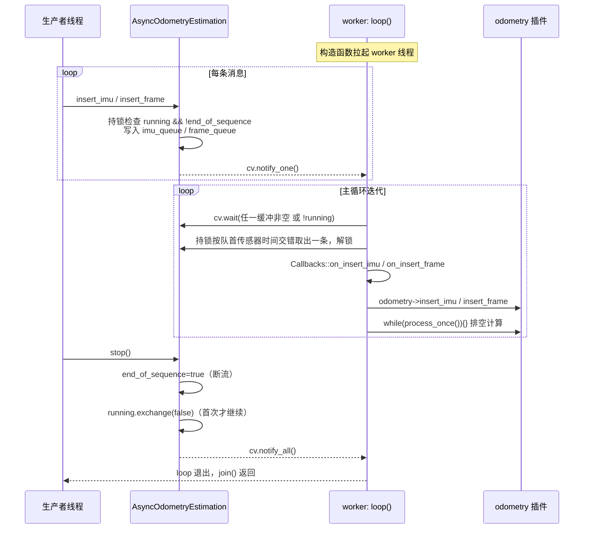

# 异步执行器 AsyncOdometryEstimation

## 模块定位与职责

`AsyncOdometryEstimation` 是 ROS 消息线程与里程计算法之间的**唯一并发边界**：它不承载任何算法逻辑，只负责把生产者（ROS spinner / nodelet / rosbag 回放线程）投递的 IMU 与点云事件搬运到一个独立 worker 线程上，按到达序逐条喂给被包装的 `OdometryEstimation` 插件，并驱动其计算排空。

逐条投递（而非批量喂入）是有意为之：这复刻了上游算法所假设的 ROS 回调执行器语义——每条消息一次 insert + 一次排空。批量喂入或按类型重排会改变算法内部每一步的缓冲窗口，进而改变初始化窗口、关键帧边界甚至初始重力估计。

它的公共 API 刻画了各项职责：

| API | 职责 |
|---|---|
| `insert_imu` / `insert_frame` | 生产端入队（持锁、可拒绝、满则丢最旧） |
| `workload` | 聚合输入队列与算法内部负载 |
| `wait_idle` | 轮询等待系统完全空闲 |
| `stop` | 幂等停机并 join 线程 |
| `loop`（私有） | worker 主循环：逐条取出 → 发射输入槽 → 喂入 → 排空 |

## 运行机制

### 构造即启动，析构即停机

构造函数只做一件事：保存共享的 odometry 插件指针，然后 `worker = std::thread(&AsyncOdometryEstimation::loop, this)` 立即拉起消费线程；析构函数直接调 `stop()`。这意味着**对象存活期间 worker 必然存活**，上层不需要手动管理线程生命周期。

### 生产端：两条有界环形缓冲

IMU 与帧各有一条 `boost::circular_buffer`：`imu_queue` 容量 1000，`frame_queue` 容量 50（后者元素为 `std::pair<double, PointCloudT::ConstPtr>`，即时间戳 + 点云）。`insert_imu`/`insert_frame` 结构对称：持 `mtx` 锁后先检查 `!running || end_of_sequence`，若执行器已停机则**直接 return，不入队、无日志、无返回值**；随后 `push_back` 入队（环形缓冲写满时自动覆盖该流最旧事件），出锁后 `cv.notify_one()` 唤醒 worker。

环形缓冲写满丢最旧是"算法长时间停滞"才应触发的兜底：正常路径上，上层以 `workload()` 施加背压（rosbag 入口在积压时暂停推帧），缓冲不应打满。一旦触发，丢弃即破坏与原版算法（无界缓冲）的行为一致性——这是有界缓冲换稳健性的刻意取舍。

### 消费端：按传感器时间交错逐条取出、先发射输入槽、循环排空

worker 的 `loop()` 是整个模块的核心，每轮迭代分四步：

1. **等待**：`cv.wait(lock, ...)` 的谓词是 `!running || !imu_queue.empty() || !frame_queue.empty()`，即"被要求停机"或"任一缓冲有数据"都会醒来；`!running` 时直接退出循环。
2. **取出**：持锁按**队首传感器时间交错**取出一条事件——IMU 队首时间戳较早（或某条缓冲为空）则取该流队首，随后解锁。一次锁窗口只搬一条数据，锁竞争被压到最小；交错策略保证投递顺序与到达顺序一致。
3. **发射输入槽 + 喂入**：置 `processing = true`，**先调用 `Callbacks::on_insert_imu`（或 `on_insert_frame`），再调用 `odometry->insert_imu(imu)`（或 `insert_frame`）**。输入槽在框架层统一发射，保证"喂给算法的每条数据同时可见于订阅的扩展"，且与 `on_new_frame`（各算法在同一 worker 线程上发射）保持程序序——`imu_prediction` 的锚定-预测循环正依赖这一顺序。
4. **排空**：`while (odometry->process_once()) {}` 循环调用直至算法返回 false，即"把这一条数据引发的所有待处理计算全部消化完"才取下一条。`processing` 原子标志在喂入前置位、排空后清零，供 `wait_idle` 观测。

`process_once` 的"返回 false 表示无事可做"语义来自基类 `OdometryEstimation` 的默认实现 `{ return false; }`，五种算法插件都遵循这一契约。

### stop：先断流、再翻转、后 join 的幂等停机

`stop()` 的顺序经过精心设计：

1. `end_of_sequence = true` —— 先置位，此后任何 `insert_*` 在持锁检查处被拒绝，**流被第一时间切断**；
2. `if (!running.exchange(false)) return;` —— 原子翻转并检测：只有**第一个**调到 stop 的线程继续往下走，后续调用（包括析构函数的重复调用）直接返回，这就是幂等性；
3. `cv.notify_all()` + `worker.join()` —— 唤醒可能阻塞在 `cv.wait` 的 worker，然后等线程退出。

`AsukaROS` 正是依赖这一幂等性串联停机链：`save()` 先 `async->stop()` 再调 `odometry->save_map()`，析构函数再次 `async->stop()`。save 处的注释明确解释了动机：*workload 只反映输入缓冲，worker 可能仍在 `process_scan()` 里写地图，不 join 直接读地图是数据竞争/堆损坏*。

### workload 与 wait_idle：上层等待与保存的依据

`workload()` 在持锁状态下返回 `queue.size() + odometry->workload()`，把"队列积压"与"算法内部负载"合成一个标量。`AsukaROS::wait(auto_quit)` 以 100Hz 轮询 `workload() == 0` 决定 rosnode 何时退出 spin 等待，rosnode 主流程即 `ros::spin() → wait(true) → save(map_saving_path)`。

`wait_idle()` 是比 workload 更强的条件：它循环检查三个条件——**输入队列空、`processing` 为 false、`odometry->workload() == 0`**——三者同时满足才返回，否则睡 10ms 重试。它弥补了 workload 的盲区：workload 无法覆盖"数据已出队、正在被算法处理"的在途窗口，而 `processing` 标志正好补上。注意两个函数都声明为 `const`，靠 `mutable std::mutex` 在只读语义下加锁。

## 关键交互时序

图中有三个节点值得强调：**生产者的入队检查**发生在持锁段内，因此 stop 置位 `end_of_sequence` 后不存在"已停机却还在入队"的窗口；**取出后立即解锁**是锁外执行算法调用的前提，否则喂入和排空期间 ROS spinner 会被完全卡死；**首次 stop 才执行 join** 配合 AsukaROS 析构中的二次 stop，构成"save 停一次、析构再停一次"的安全链。

## 关键状态一览

| 状态 | 类型 | 写者 | 读者 | 语义 |
|---|---|---|---|---|
| `running` | `atomic<bool>`，初值 true | 仅 `stop()`（exchange） | `loop`、`insert_*` | 线程存续开关，exchange 返回值实现幂等 |
| `end_of_sequence` | `atomic<bool>`，初值 false | 仅 `stop()`（首个动作） | `insert_*` | 输入断流标志，先于 running 置位 |
| `processing` | `atomic<bool>`，初值 false | 仅 worker | `wait_idle` | 在途计算标志，锁外读写 |
| `imu_queue` | `circular_buffer`，容量 1000 | 生产者（写）、worker（读+弹出） | 双方，均持 `mtx` | IMU 事件缓冲，满覆盖最旧 |
| `frame_queue` | `circular_buffer<pair<double, PointCloudT::ConstPtr>>`，容量 50 | 同上 | 同上 | 点云帧缓冲，满覆盖最旧 |
| `mtx` + `cv` | `mutable mutex` + condition_variable | 全体 | — | 保护两条缓冲；cv 负责 worker 睡眠/唤醒 |

## 边界条件

- **停机丢弃残余缓冲**：`loop` 中 `cv.wait` 醒来后先判 `if (!running) break;`，此时两条缓冲中尚未处理的事件**不会被消费，直接废弃**。这与 `save()` 的语义一致——保存的地图只包含已处理数据，且 join 保证 `save_map` 期间无并发写。
- **缓冲满丢最旧、无告警**：`circular_buffer` 的 `push_back` 写满时静默覆盖该流最旧事件。若算法长时间阻塞，生产端会无声丢数据，仅有上游 `handle_loop_back` 的时间戳告警可作间接线索。
- **workload 不含在途计算**：这正是 `wait_idle` 存在的理由；`AsukaROS::wait` 只看 workload，故它只适合"生产已停止后等排空"的场景，不适合作为写地图前的安全判据——代码注释对此有明确告诫。
- **wait_idle 是 10ms 轮询而非事件驱动**：`processing` 为普通 atomic，没有配套条件变量，因此存在最长约 10ms 的检测延迟；对"保存地图前的最终等待"这一使用场景足够。
- **插入端静默失败**：停机后调用 `insert_*` 无任何反馈，上层若在 stop 后继续投递不会得到错误，也不会崩溃。
- **`stop()` 在 worker 仍在处理最后一条时再次被调**：exchange 返回 false，直接返回，不会重复 join 也不会打扰正在收尾的 worker。

## 文件职责

- **`src/asuka/include/asuka/core/async_odometry_estimation.hpp`**：完整类定义。声明公共 API、私有 `loop`、两条环形缓冲容量常量，类注释解释了逐条投递与上游 ROS 回调执行器语义的对应关系。头文件即并发契约文档。
- **`src/asuka/src/asuka/core/async_odometry_estimation.cpp`**：全部行为实现——构造/析构、生产入队、负载统计、空闲等待、幂等停机与 worker 主循环（含输入槽发射点）。
- **`src/asuka/include/asuka/core/odometry_estimation.hpp`**：被包装者的抽象契约——`insert_imu`/`insert_frame`/`process_once`/`workload`/`save_map` 等虚函数，以及 `load_module` 工厂与 `extern "C" create_odometry_estimation` 插件边界。异步执行器只依赖此接口，因此对五种算法实现完全透明。
- **`src/asuka/src/asuka/asuka_ros.cpp`**：装配与使用方。构造函数按 `so_name` 加载插件 → 取出共享 `cloud_preprocess` → `make_unique<AsyncOdometryEstimation>(odometry)`；`save()` 与析构函数定义了 stop 的调用纪律；`insert_imu`/`insert_frame` 是执行器的上游生产者。
- **`src/asuka/apps/asuka_rosnode.cpp`**：生命周期锚点，展示"spin → wait(true) → save"的退出时序，其中 save 内部即触发 stop-join。

## 扩展点

- **算法无关性即最大扩展面**：执行器通过基类指针持有任意 `OdometryEstimation` 实现，更换 batchlio/fastlio/lightning/smallpointlio/superlio 只需改配置的 `so_name`，执行器零改动。
- **缓冲容量**：`imu_queue_capacity` / `frame_queue_capacity` 是 `constexpr`，调整它们即调整背压水位，无需触碰逻辑。
- **排空策略**：`while (odometry->process_once()) {}` 是单点 hook，若某算法需要限频排空或批内中断检查，只需改这一处循环。
- **空闲判定策略**：`wait_idle` 的三条件与 10ms 轮询间隔是可调参数；若引入 `processing` 专属条件变量，可将其改为事件驱动。
- **潜在的卸载接缝**：worker 线程是 odometry 插件代码的常驻引用点，任何未来的插件卸载/热重载方案都必须先过 `stop()` 的 join 这道门。

Sources: `src/asuka/src/asuka/core/async_odometry_estimation.cpp`
Sources: `src/asuka/include/asuka/core/async_odometry_estimation.hpp`
Sources: `src/asuka/include/asuka/core/odometry_estimation.hpp`
Sources: `src/asuka/src/asuka/asuka_ros.cpp`
Sources: `src/asuka/apps/asuka_rosnode.cpp`

## 关联源码

- `src/asuka/src/asuka/core/async_odometry_estimation.cpp`
- `src/asuka/include/asuka/core/async_odometry_estimation.hpp`
