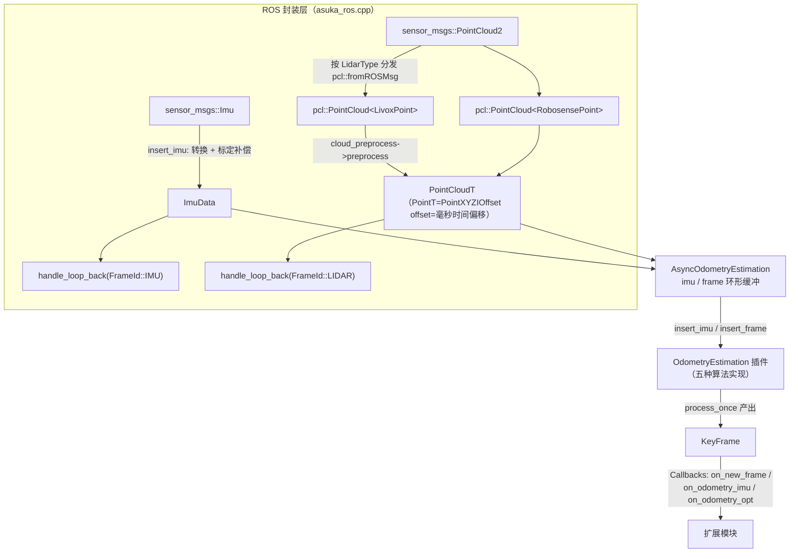

# 核心公共数据类型 types.hpp

## 模块定位

`src/asuka/include/asuka/core/types.hpp`（96 行，纯头文件）是整个仓库**最小的共享数据契约层**。它不包含任何算法逻辑，只定义三类内容：

1. **枚举**：`FrameId`（坐标系标识）、`LidarType`（雷达厂商类型）；
2. **数据结构**：`ImuData`（IMU 测量）、`LivoxPoint` / `RobosensePoint`（厂商原始点布局）、`KeyFrame`（里程计输出关键帧）；
3. **点云类型别名**：`PointT` / `PointCloudT` / `PointVectorT`，统一全仓库的点云表示。

正因为它是 ROS 封装层与五种算法插件（batchlio / fastlio / lightning / smallpointlio / superlio）之间**唯一**共同依赖的头文件，任何跨模块传递的数据类型都必须先在这里定约。例如 `batchlio/common.hpp` 中直接以 `using PointType = PointT; using PointCloudXYZI = PointCloudT;` 复用这些别名，算法层不再自造点类型。

## 类型清单与语义

### `FrameId`（L18）

```cpp
enum class FrameId { WORLD = 0, LIDAR = 1, IMU = 2 };
```

三值坐标系标识。它的实际消费点有两个：

- `asuka_ros.cpp` 的 `handle_loop_back(stamp, frame_id)` 用它区分 IMU 与激光两条时间戳回退检测通道（L171-L183）；
- `KeyFrame::frame_id` 默认取 `FrameId::IMU`，标注关键帧位姿的参考系。

### `ImuData`（L20-L27）

最小 IMU 测量单元：`stamp`（双精度秒）+ `linear_acc` + `angular_vel`（两个 `Eigen::Vector3d`）。它剥离了 ROS 消息的所有包装，是算法插件看到的唯一 IMU 形态。**所有传感器标定类修正都发生在 ROS 层构造该结构时**：`asuka_ros.cpp` 的 `insert_imu`（L59-L70）在填充字段后叠加 `imu_time_offset` 与 `acc_scale`，算法层无需感知标定参数的存在。

### 统一点云类型（L29-L53）

```cpp
// 32 字节紧凑点类型（替代 48B 的 pcl::PointXYZINormal，normal 字段全仓库未用）
struct EIGEN_ALIGN16 PointXYZIOffset {
  PCL_ADD_POINT4D;
  float intensity;
  float offset;      // 见下方契约
  ...
};
static_assert(sizeof(PointXYZIOffset) == 32);
using PointT = PointXYZIOffset;
using PointCloudT = pcl::PointCloud<PointT>;
using PointVectorT = std::vector<PointT, Eigen::aligned_allocator<PointT>>;
```

这里藏着全仓库最重要的一个**隐式契约**：

> `PointT::offset` 存储的是点相对扫描开始的时间偏移，单位**毫秒**。

去畸变（deskew）、时间窗口压缩（如 batchlio 的 `time_compressing`）全部依赖各算法预处理阶段正确写入该字段。`PointVectorT` 用 `Eigen::aligned_allocator` 保证 SSE 对齐，供 ikd_tree / IVox 等近邻结构使用。

### 厂商原始点类型（L34-L49 与 L76-L94）

`LivoxPoint`（含 `tag`、`line`、`timestamp`）与 `RobosensePoint`（含 `ring`、`timestamp`）均以 `EIGEN_ALIGN16` + `PCL_ADD_POINT4D` 定义，并在**命名空间外**通过 `POINT_CLOUD_REGISTER_POINT_STRUCT` 宏注册字段布局。注册的意义在于让 `pcl::fromROSMsg` 能直接把 `sensor_msgs::PointCloud2` 反序列化成这两种结构——`asuka_ros.cpp` 的 `insert_frame`（L72-L88）正是按 `lidar_type` switch 分发后调用它。注意两种雷达的逐点时间戳字段名不同（`line` vs `ring`），各自的 `cloud_preprocess` 实现负责将其换算到统一的 `offset` 毫秒语义上。

### `LidarType` 与 `parse_lidar_type`（L51-L57）

字符串到枚举的解析器，同时接受 `"LIVOX"/"livox"`、`"ROBOSENSE"/"robosense"` 大小写两种写法；**未知字符串直接抛 `std::runtime_error`**。`AsukaROS` 构造函数（asuka_ros.cpp L35-L36）在装配期调用它，因此配置错误会在进程启动瞬间失败，而非运行中途——这是典型的 fail-fast 边界设计。

### `KeyFrame`（L59-L72）

算法对外的**输出货币**：`id`（默认 -1）、`stamp`、`frame_id`、位姿 `T_world_imu`（`Eigen::Isometry3d`）、速度 `v_world_imu`、六维 IMU 偏置 `imu_bias`，以及去畸变后的点云 `cloud_imu`。关于 `cloud_imu` 的所有权，源码注释给出明确契约（L69-L71）：

> 点云在 IMU 系下、每帧全新分配、由 KeyFrame 持有；观察者可以任意长时间持有该帧。

这条契约排除了"内部缓冲被复用导致悬空数据"的风险——对比 `feats_down_body` 等 `PointCloudT::Ptr(10000, 1)` 预分配复用缓冲，`cloud_imu` 的每次新分配是有意为之的所有权设计。`KeyFrame` 经由 `Callbacks` 的 `on_new_frame` / `on_odometry_imu` / `on_odometry_opt` 三个回调槽流向扩展模块（rviz 可视化、图优化等），是 types.hpp 中唯一直接面向扩展模块的类型。

## 数据流中的位置



**关键节点解释**：

- `ImuData` 与 `PointCloudT` 是跨过异步队列边界的仅有的两种输入形态；转换与标定全部在队列之前完成，队列与算法层拿到的是"干净"数据。
- `LivoxPoint`/`RobosensePoint` 只存活于 ROS 层内部，出不了 `insert_frame` 的 switch 分支——厂商差异被关在 `asuka_ros.cpp` 里。
- `KeyFrame` 是唯一从算法层反向流出的核心类型，承载位姿/速度/偏置/去畸变点云，扩展模块只依赖它而不依赖任何具体算法内部状态。
- `FrameId` 在图中出现在回环检测分支，说明这个三值枚举在输入侧的实际用途是区分两条时间戳监控通道。

## 边界条件与契约要点

| 契约 | 违反后果 |
|---|---|
| `offset` = 毫秒级扫描内时间偏移 | 去畸变与时间窗错乱，配准精度崩塌 |
| `parse_lidar_type` 未知值抛异常 | 进程装配期失败（有意设计），不会静默回落 |
| `KeyFrame::cloud_imu` 每帧新分配 | 观察者持有点云期间数据不会被原地改写 |
| `PointVectorT` / `EIGEN_ALIGN16` 对齐 | 使用普通 `std::vector` 可能触发 Eigen 对齐断言 |
| `KeyFrame` 默认 `id=-1`、`frame_id=IMU`、`cloud_imu=nullptr` | 使用方需处理未初始化关键帧 |

另外注意 `insert_frame` 的 switch（asuka_ros.cpp L74-L87）**只覆盖两个枚举值且无 default 分支**：新增雷达类型时，编译器不会强制提醒补全此 switch，属于需要人工同步的扩展点。

## 扩展点

1. **新增雷达厂商**：需同步修改三处——`LidarType` 枚举与 `parse_lidar_type`（types.hpp）、新增对应 `XXXPoint` 结构与 `POINT_CLOUD_REGISTER_POINT_STRUCT` 注册（types.hpp 文件尾）、`AsukaROS::insert_frame` 的 switch 分支与重载（asuka_ros.cpp）。types.hpp 刻意把这三个改动点收敛在同一文件及其唯一消费者中。
2. **新增算法插件**：零改动。插件只需以 `PointT`/`ImuData` 为输入面实现 `OdometryEstimation` 接口（其头文件 include 了 types.hpp），由 `load_module` 工厂动态装载。
3. **扩展模块消费数据**：订阅 `Callbacks` 中的槽即可获得 `ImuData` / `PointCloudT` / `KeyFrame`，无需触碰 ROS 消息层。

## 阅读建议

此文件是全仓库依赖图的根：向上被 `asuka_ros.hpp`、`callbacks.hpp`、各 `odometry_estimation.hpp` 包含，向下只依赖 Eigen 与 PCL。理解了 `PointXYZIOffset` 的 `offset` 毫秒契约和 `KeyFrame::cloud_imu` 所有权契约，后续阅读任何算法的 `cloud_preprocess` 与输出回调时都不会误读数据语义。

Sources: `src/asuka/include/asuka/core/types.hpp#L1-L96` | `src/asuka/src/asuka/asuka_ros.cpp#L1-L186` | `src/asuka/include/asuka/core/odometry_estimation.hpp#L1-L40` | `src/asuka/include/asuka/core/callbacks.hpp#L1-L17` | `src/asuka/include/asuka/odometry/batchlio/common.hpp#L1-L120`

## 关联源码

- `src/asuka/include/asuka/core/types.hpp`
