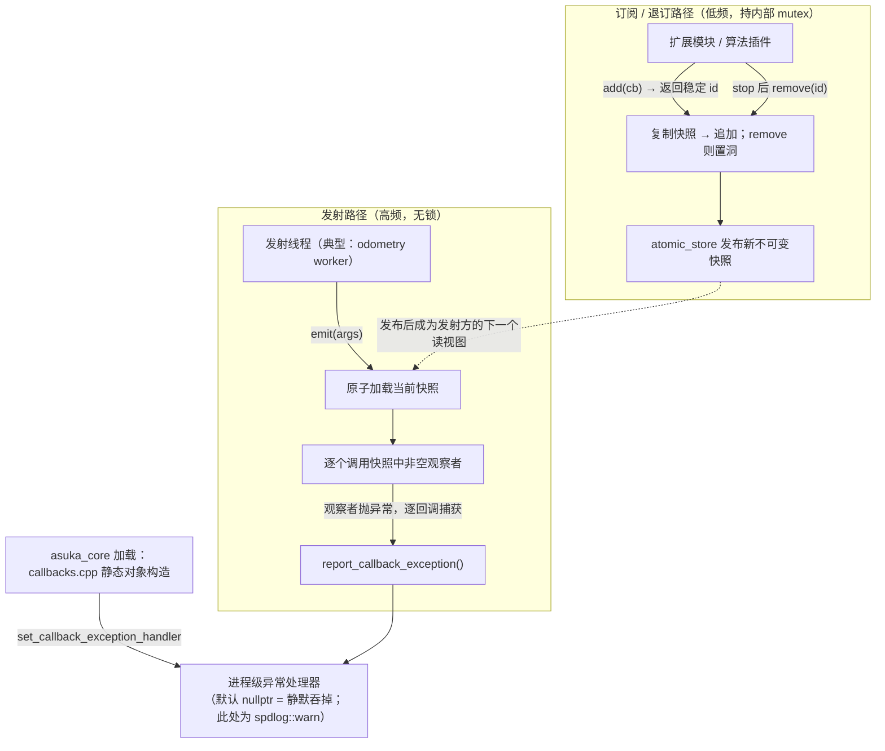

# 全局回调定义（core/callbacks）

## 模块职责

本模块只由两个很小的文件构成，却承担了整个进程的**跨模块事件总线声明**：

- `callbacks.hpp`：以 `asuka::Callbacks` 结构体集中声明 5 个静态 `CallbackSlot` 成员，即"系统里存在哪些事件通道、各自签名是什么"；
- `callbacks.cpp`：给出这 5 个静态成员的**唯一定义**，并在静态初始化期安装进程级的观察者异常处理器。

它与 `utility/callback_slot.hpp`（8.3KB 的 `CallbackSlot` 模板实现，详见"回调槽 CallbackSlot"页）构成分工：callbacks 回答"**有哪些**事件通道"，callback_slot 回答"通道**如何工作**"。ROS 层、异步执行器、dlopen 加载的算法插件与扩展模块之间不直接互相持有指针，而是通过这 5 个槽完成事件解耦。

## 五个回调槽

载荷类型全部来自 `core/types.hpp` 的共享数据契约：

| 槽 | 签名 | 载荷 | 发射者与时机 |
|---|---|---|---|
| `on_insert_imu` | `void(const ImuData::ConstPtr&)` | IMU 样本（stamp / linear_acc / angular_vel） | `AsyncOdometryEstimation` 在 worker 线程上、把事件喂给算法之前（每条送达事件恰好一次） |
| `on_insert_frame` | `void(double, const PointCloudT::ConstPtr&)` | 时间戳 + `PointXYZIOffset` 点云 | 同上，针对点云帧 |
| `on_new_frame` | `void(const KeyFrame::ConstPtr&)` | 关键帧（位姿/速度/bias/去畸变点云） | 前端算法在 worker 线程产出关键帧时 |
| `on_odometry_imu` | `void(const KeyFrame::ConstPtr&)` | 同上 | imu_prediction 在自己的处理线程上按 IMU 频率发射 |
| `on_odometry_opt` | `void(const KeyFrame::ConstPtr&)` | 同上 | 后端优化扩展在发布线程上按配置频率发射 |

完整的发射契约（发射者、线程、相对顺序、被队列丢弃的事件不发射等）以
`callbacks.hpp` 的类注释为准。三个"链路槽"共用前端 worker 线程，相对顺序即算法的
程序序——`imu_prediction` 的锚定-预测循环正依赖这一顺序。另注意 `KeyFrame::cloud_imu`
的注释——"每帧新分配、由 KeyFrame 持有，观察者可任意久持有"——这一所有权模型正是为
回调观察者（如可视化、后端优化模块）设计的。

## callbacks.cpp 做的两件事

**1. 在 .cpp 中定义静态成员（L7–L11）——跨 .so 单例的关键。** `callback_slot.hpp` L95–100 的注释明确说明：需要跨 `.so` 边界共享的静态槽**必须**定义在 asuka_core 的 .cpp 里，而不能作为头文件内的 inline 成员——否则每个动态库各自持有一份实例，插件里 `add()` 的注册会"静默消失"（写到自己的副本上）。`callbacks.cpp` 位于 asuka_core，是全进程唯一的存储点：五个算法 so 与扩展模块订阅的都是同一批对象。

**2. 安装异常处理器（L13–L31）。** 匿名命名空间中的 `CallbackExceptionLogger` 静态对象 `g_callback_exception_logger` 在 asuka_core 加载时构造，调用 `set_callback_exception_handler` 安装一个把 `std::exception_ptr` 重抛并转成 `spdlog::warn("[callbacks] observer exception: ...")` 的处理函数。头文件刻意让 handler 只是普通函数指针（`CallbackExceptionHandler`），避免把 spdlog 拖进每个包含该模板头的编译单元；默认未安装时异常被静默吞掉。

## 运行时模型：一次读、一次写

关键节点说明：

- **H（异常处理器）**：安装发生在静态初始化期，由主 DSO 完成，插件因此自动继承同一日志出口；单个坏观察者不会中断其余观察者，也不会打断 odometry worker。
- **P → M → PB（写路径）**：`add/remove` 在互斥锁下复制—修改—原子发布；`add` 返回稳定 id（vector 下标），`remove` 只置空留洞、id 永不复用，非法 id 静默忽略。
- **W → L → I（读路径）**：发射只做一次原子读 + 逐个解引用调用，无锁、无分配、无 `std::function` 拷贝，注释自述"tuned for high-frequency emission"。
- **虚线（copy-on-write 交接）**：正在进行的发射持有旧快照，因此回调内重入 add/remove/emit 只影响**后续**发射，不影响在途这一次。

## 边界条件

- **异常隔离**：观察者异常逐回调捕获上报，处理函数本身也被 `noexcept` + 双层 try 包裹，连"装坏的 logger"都无法逃逸终止发射线程。
- **跨 DSO 陷阱**：槽定义或 handler 安装若放进头文件，插件订阅会静默丢失——这是本模块存在的核心理由。
- **编译一致性**：`shared_ptr` 原子自由函数仅在启用 `cmpxchg16b`（`-mcx16`）时走无锁路径，所有编译单元必须统一策略，否则出现共享同一 `shared_ptr` 的未定义行为。
- **假共享防护**：mutex 以 `alignas(64)` 独占缓存行，避免写路径的锁操作干扰发射路径对 snapshot / subscriber_count 的热读。
- **编译期右值防护**：槽签名只接受左值引用或 trivially copyable 按值参数——否则第一个观察者 move 走实参，后续观察者拿到空壳。5 个槽的签名全部采用 `ConstPtr`（左值引用），符合该约束。
- **停机协议**：`AsukaROS` 析构先 `async->stop()` join 发射线程，再停全部扩展模块，之后模块才能安全 `remove(id)` 退订并析构——注释原文强调"所有 stop 返回后不存在在途发射，退订不会与发射者竞争"。`CallbackSlot` 本身不可拷贝不可移动，杜绝多副本。

## 扩展点

- **新增事件通道**：在 `Callbacks` 结构体加一个静态槽声明（callbacks.hpp），并在 callbacks.cpp 加对应定义，两处保持同步即可；`CallbackSlot` 是通用模板，任何签名都能挂。
- **更换异常策略**：调用 `set_callback_exception_handler` 替换（应从主 DSO 设置），恢复静默则传 `nullptr`。
- **插件接入模式**：模块加载时 `add(cb)` 保存返回的稳定 id，`stop()` 后 `remove(id)` 退订——这一 add/remove 对与 `ExtensionModule` 的 stop/at_exit 生命周期天然对齐。

（注：`callback_slot.hpp` 证据截取至 L220，`emit` 方法体未含在内，其行为描述以类文档注释为准。）

Sources:
- `src/asuka/include/asuka/core/callbacks.hpp#L1-L17`
- `src/asuka/src/asuka/core/callbacks.cpp#L1-L34`
- `src/asuka/include/asuka/utility/callback_slot.hpp#L1-L220`
- `src/asuka/include/asuka/core/types.hpp#L1-L96`
- `src/asuka/src/asuka/asuka_ros.cpp#L45-L57`
- `src/asuka/src/asuka/core/async_odometry_estimation.cpp#L59-L83`

## 关联源码

- `src/asuka/include/asuka/core/callbacks.hpp`
- `src/asuka/src/asuka/core/callbacks.cpp`
