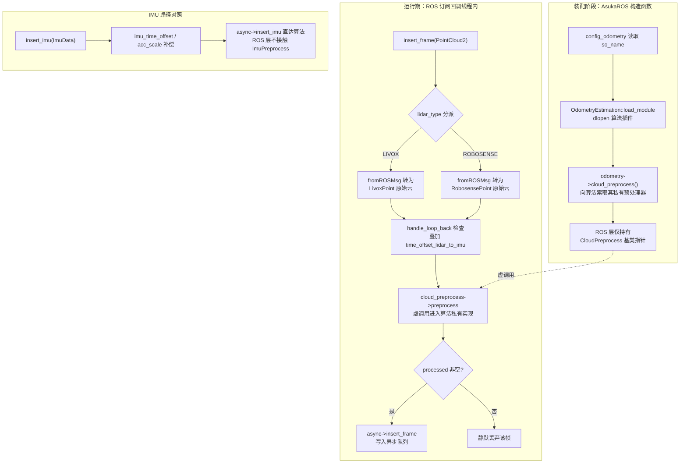

# 通用预处理接口 cloud/imu preprocess

## 模块职责

本页的两个文件是 `asuka::core` 下的一对**纯头文件抽象基类**，构成 ROS 封装层与五种里程计算法之间关于"预处理"的稳定接缝：

- **`CloudPreprocess`**（`cloud_preprocess.hpp`）：把雷达原生点型的原始云（`LivoxPoint` / `RobosensePoint`，定义在 `core/types.hpp`）转换为全链路统一的 `PointCloudT::Ptr`。ROS 层只认它，具体"怎么降采样、怎么滤距离、怎么提特征"全部由算法自己说了算。
- **`ImuPreprocess`**（`imu_preprocess.hpp`）：算法私有的 IMU 数据承接与初始化状态查询接口，服务于各算法进入正式估计前的静止初始化/重力对齐阶段。

两个类的共同设计模式值得注意：

- **按需覆盖的虚函数契约**：都不是纯虚接口——所有虚函数给出"无害默认体"（点云版返回 `nullptr`，IMU 版为空操作、返回 `false` 或零向量），子类只重写自己关心的方法，未覆盖部分自动退化为安全默认值。
- **protected 构造函数**（`CloudPreprocess` L28、`ImuPreprocess` L22）：禁止绕过子类直接实例化基类，接口本身不可作为对象存在。
- **零编译产物**：`core` 目录的 cpp 只有 `async_odometry_estimation.cpp`、`callbacks.cpp`、`odometry_estimation.cpp` 三个，两个预处理接口完全以头文件内联实现，随包含方（ROS 层与各算法 so）各自编译，接口本体不产生独立目标文件。

## 与里程计插件契约的连接

解耦的关键交接点在 `OdometryEstimation` 基类上：

- `odometry_estimation.hpp` L6 直接包含 `cloud_preprocess.hpp`，L29 声明 `virtual std::shared_ptr<CloudPreprocess> cloud_preprocess() { return nullptr; }`——**每个算法插件都被要求"可以"交出一个点云预处理器**，默认交不出（返回空）。
- `AsukaROS` 构造函数（`asuka_ros.cpp` L27–L31）在 `load_module(so_name)` 动态装载算法后，立即执行 `cloud_preprocess = odometry->cloud_preprocess()`。这是 ROS 层与算法私有预处理之间的**唯一交接动作**：实例化哪个预处理器、参数怎么配，决策权完全在算法插件内部；ROS 层从始至终只持有基类指针。

## 点云路径调用链与 IMU 路径对照

**关键节点解释：**

- **装配阶段（A→D）**：解耦的实现机制一目了然——ROS 层不在编译期链接任何算法的预处理器，而是在运行期通过插件工厂取出实例；换算法只换 so，接口指针照常工作。
- **`lidar_type` 分派（F）**：ROS 层只负责把 ROS 消息反序列化为两种原生点型之一，随后调用**对应的重载版本**的 `preprocess`；点型相关的分发在接口层就通过两个重载固化下来。
- **时间补偿先于预处理（I）**：`preprocess` 收到的已经是 `stamp + time_offset_lidar_to_imu` 的调整后时间戳，预处理层看到的是对齐到 IMU 时基的时间，不应再自行做雷达-IMU 时间偏移。
- **虚调用点 J 与空判定 K**：`asuka_ros.cpp` L93/L101 的 `cloud_preprocess ? ... : nullptr` 加 `if (!processed) return;` 是本接口的运行期收口——无论"没拿到预处理器"还是"预处理后为空"，统一表现为该帧不入队。
- **IMU 路径对照（N→P）**：ROS 的 `insert_imu`（L59–L70）只做回环检查与标定补偿后直入异步队列，**从不调用 `ImuPreprocess` 的任何方法**。

## ImuPreprocess 的真实消费方

`ImuPreprocess` 的五个方法刻画了典型的 LIO 静止初始化状态机：

| 方法 | 语义 |
|---|---|
| `insert_imu(imu)` | 算法私有地承接 IMU 数据（如存入自己的缓冲） |
| `initialize(lidar_start_time)` | 以首帧雷达时间戳锚定初始化窗口的截止点 |
| `is_initialized()` | 初始化是否完成的门控状态 |
| `get_mean_acceleration()` / `get_mean_gyroscope()` | 初始化窗口内的加速度/陀螺均值，供重力方向与零偏估计使用 |

由于 ROS 层完全不引用该接口，其消费方只能是各算法的 `odometry_estimation` 内部——这与目录结构一致：五个算法子目录各自携带同名 `imu_preprocess.hpp/cpp`。"算法内部消费"这一点是从接口设计与目录布局推出的结论，与各算法主页的内容相互印证。

## 五种算法实现矩阵

| 算法目录 | cloud_preprocess.cpp | imu_preprocess.cpp | 体量对比反映的取舍 |
|---|---|---|---|
| batchlio | 5319 B | 3202 B | 参数最全：`min_distance=0.5`、`max_distance=300.0`、`point_filter_num=2`、`num_scans=6`、`scan_rate=10`，并按点型分派 `build_livox_surf` / `build_robosense_surf` 两条构造路径 |
| fastlio | 4198 B | **8693 B** | IMU 预处理为各实现中最重，前向传播与时间同步职责下沉于此 |
| lightning | 3015 B | 2897 B | 两边都不重，核心逻辑沉在 thirdparty/lightning 库内 |
| smallpointlio | **6360 B** | **709 B** | 点云侧最重（特征处理），IMU 侧极简：仅覆盖 `insert_imu`，持有 `circular_buffer` 与 `last_timestamp_imu` |
| superlio | 2806 B | 1219 B | 点云预处理最轻，计算重心在 ESKF 与八叉体素地图 |

## 关键状态

- **接口层**：`ImuPreprocess::is_initialized()`（初始化门控）、均值查询返回的 `Vector3d`（重力对齐输入）、`initialize` 的 `lidar_start_time`（初始化窗口锚点）。
- **实现层示例**：smallpointlio 的 `imu_deque`（环形缓冲）与 `last_timestamp_imu`（时序跟踪，初值 -1.0）；batchlio 的五项预处理参数（成员默认值，构造时确定）。
- **ROS 层**：成员 `cloud_preprocess`（可能为空，全代码以三目运算防护）；`last_timestamp_lidar/imu`（回环检测，先于预处理执行）。

## 边界条件

1. **双重空值静默丢帧**：`cloud_preprocess()` 返回空（算法未覆盖该虚函数）与 `preprocess` 返回空（过滤后无点）在 ROS 层表现为同一种行为——该帧不进异步队列，仅表现为 `workload()` 不增长，无任何告警。误配置算法时 symptoms 是"队列永远为空"。
2. **点型重载不匹配**：接口按 Livox/Robosense 提供两个重载；若配置切到某雷达类型而算法未覆盖对应重载，会落到基类默认体返回 `nullptr`，同样是静默失败。
3. **预处理在回调线程同步执行**：`preprocess` 发生在 ROS 订阅回调内、入队之前，其开销计入订阅线程而非里程计 worker；`workload()` 只统计入队后的数据。
4. **时间语义**：预处理收到的已是叠加偏移后的时间戳；回环检查也在预处理之前完成，预处理层看不到原始 ROS 时间。
5. **partial override 合法**：因为默认体无害（而非 `= 0`），子类可以只实现一个重载（如 smallpointlio 的 IMU 侧只覆盖 `insert_imu`），编译期不强制完整实现。

## 扩展点

- **新增算法**：在 `odometry/<新算法>/` 下提供 `cloud_preprocess` 与 `imu_preprocess` 的同名子类实现，在其 `odometry_estimation` 中覆盖 `cloud_preprocess()` 交出实例，`create.cpp` 导出 `create_odometry_estimation`，改 `config_odometry` 的 `so_name` 即可切换——ROS 层与主链路零改动、零重编译。
- **预处理内部自由演化**：接口只有 2 个（点云）或 5 个（IMU）方法且返回类型稳定，算法内部的滤波、特征提取、缓冲策略调整完全不波及主链路。
- **参数私有**：预处理超参（如 batchlio 的五项）是各实现自己的状态，随各自算法配置文件加载，不进入 `config_ros.json` 的 ROS 边界参数。

Sources:
- `src/asuka/include/asuka/core/cloud_preprocess.hpp#L1-L32`
- `src/asuka/include/asuka/core/imu_preprocess.hpp#L1-L26`
- `src/asuka/include/asuka/core/odometry_estimation.hpp#L1-L40`
- `src/asuka/src/asuka/asuka_ros.cpp#L1-L186`
- `src/asuka/include/asuka/odometry/batchlio/cloud_preprocess.hpp#L1-L39`
- `src/asuka/include/asuka/odometry/smallpointlio/imu_preprocess.hpp#L1-L29`

## 关联源码

- `src/asuka/include/asuka/core/cloud_preprocess.hpp`
- `src/asuka/include/asuka/core/imu_preprocess.hpp`
