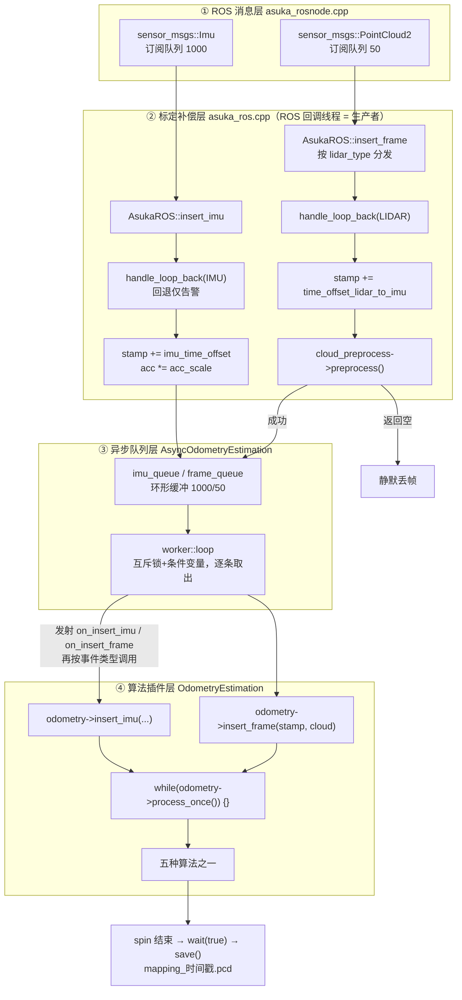

# 端到端数据流主链路

本页梳理一条 IMU/点云数据从 ROS 话题进入系统、最终被里程计算法消费的完整路径。整条链路贯穿四个层次：

1. **ROS 消息层**（`apps/asuka_rosnode.cpp`）：订阅话题，把回调转发给 AsukaROS；
2. **ROS 封装层**（`src/asuka/src/asuka/asuka_ros.cpp`）：回环检查、时间偏移与尺度补偿、雷达类型分发、算法私有预处理；
3. **异步队列层**（`core/async_odometry_estimation.cpp`）：IMU/帧两条环形缓冲 + 单 worker 按到达序逐条消费；
4. **算法插件层**（`core/odometry_estimation.hpp` 契约 + 五种实现）：`insert_imu`/`insert_frame` 喂数据，`process_once` 排空计算。

一个核心设计事实：**所有时间偏移与尺度修正（`imu_time_offset`、`acc_scale`、`time_offset_lidar_to_imu`）只在 `asuka_ros.cpp` 中读取和应用**，算法层看到的已经是补偿后的数据，无需感知传感器标定差异。

## 主链路数据流图

**关键节点说明：**

- **CB1/CB2**：`ros::spin()` 的回调线程就是生产者线程；ROS 订阅端队列 IMU 1000、点云 50（`asuka_rosnode.cpp#L19-L26`），与异步队列层两条环形缓冲（1000/50）的容量一一对应。
- **LB1/LB2**：回环检查发生在**补偿之前**，用的是原始 `header.stamp`（`asuka_ros.cpp#L62`、`#L91`）。
- **CAL1/CAL2**：三项修正的唯一下发点，这是本页最重要的结论。
- **PRE**：点云预处理**在生产者线程同步执行**，只有预处理成功（返回非空）才入队；预处理实现来自已装载的里程计插件（构造函数 `odometry->cloud_preprocess()`，`asuka_ros.cpp#L31`）。
- **W**：单 worker 从两条环形缓冲按队首传感器时间交错逐条取出事件，在锁外完成全部计算。
- **F1/F2 + D**：每条事件**先发射 `on_insert_imu` / `on_insert_frame` 再喂给算法**（发射点在执行器统一实现，见 `callbacks.hpp` 契约注释），随后 `while(process_once())` 排空算法内部计算。

## 第一层：ROS 订阅入口

`apps/asuka_rosnode.cpp` 是最薄的一层：`ros::init` 后构造 `AsukaROS`，从 `config_ros` 读取 `imu_topic`、`lidar_topic`、`map_saving_path`，分别以队列 1000/50 订阅两类消息，lambda 内仅调用 `asuka_ros.insert_imu(msg)` / `insert_frame(msg)`（L19-L26）。`ros::spin()` 返回后依次执行 `wait(true)`（排空残余数据）和 `save(map_saving_path)`（L28-L30），构成主链路的收口。

## 第二层：asuka_ros.cpp —— 修正的收敛点

**IMU 路径**（`insert_imu`，L59-L70）：
1. `sensor_msgs::Imu` → `ImuData`（stamp、linear_acc、angular_vel，类型定义见 `types.hpp#L20-L27`）；
2. `handle_loop_back(stamp, FrameId::IMU)`；
3. `stamp += imu_time_offset`、`linear_acc *= acc_scale`；
4. `async->insert_imu(imu)`。

**点云路径**（`insert_frame`，L72-L104）：
1. 按 `lidar_type`（构造时由 `parse_lidar_type` 解析，非法值在启动期直接抛异常，`types.hpp#L76-L80`）分派 Livox/Robosense 两种 PCL 点类型并 `fromROSMsg`；
2. 私有重载中先 `handle_loop_back(stamp, FrameId::LIDAR)`；
3. `adjusted_stamp = stamp + time_offset_lidar_to_imu`；
4. 调用共享的 `cloud_preprocess->preprocess(adjusted_stamp, raw)`，**返回空则直接 return，该帧不入队**；
5. 成功则以修正后的时间戳调用 `async->insert_frame`。

**`handle_loop_back`**（L171-L183）：分别跟踪 `last_timestamp_imu` 与 `last_timestamp_lidar`，检测到时间回退（典型场景是 rosbag 循环播放）时仅输出 warn，**不拦截、不清缓冲**——它是数据流入的第一道防线，真正的恢复动作留给上层或算法。

## 第三层：异步队列与 worker 消费节奏

`AsyncOdometryEstimation` 用互斥锁 + 条件变量维护**两条环形缓冲**（`imu_queue` 容量 1000、`frame_queue` 容量 50，元素为时间戳 + 点云对）：

- `insert_imu`/`insert_frame` 在锁内检查 `running && !end_of_sequence`，通过后 `push_back` 并 `cv.notify_one()`。stop 之后到达的数据被直接丢弃；缓冲写满时由环形缓冲语义覆盖该流最旧事件；
- `loop()` 在锁内 `cv.wait` 直到有数据或被停止，随后**逐条取出并解锁**，置 `processing = true`，**先发射 `on_insert_imu` / `on_insert_frame` 再喂给 odometry**，再 `while (odometry->process_once()) {}` 排空计算，最后清 `processing`。逐条投递复刻了上游算法假设的 ROS 回调执行器语义（每条消息一次 insert + 一次排空）。

`workload()` 聚合队列长度与 `odometry->workload()`；`asuka_rosnode` 退出前的 `wait(true)` 就是以 100Hz 轮询该值归零（`asuka_ros.cpp#L110-L116`）。

## 第四层：算法插件契约

`OdometryEstimation` 基类定义了本链路的全部算法侧接缝：`insert_imu`、`insert_frame`、`process_once`、`workload`、`save_map`，以及 `cloud_preprocess()`——基类默认返回 `nullptr`，实现类返回自己的预处理实例后，ROS 层的 `PRE` 节点即自动切换为该算法的私有预处理。这一设计使"换算法 = 换 `so_name`"对主链路零改动。具体由 `create_odometry_estimation` 的 extern C 工厂经 dlopen 装载（插件机制详见目录中专门页面）。

链路终点：`save()` 先 `async->stop()` join worker，再取 `save_map()` 的点云，转为 `PointXYZI` 以 `mapping_YYYYMMDD_HHMMSS.pcd` 二进制落盘（L118-L155）。注意代码注释明确指出：`workload()` 只反映输入缓冲，不 stop 就读 `map_cloud` 会与 worker 内 `process_scan` 的写操作构成数据竞争。

## 关键状态一览

| 状态 | 位置 | 含义 |
|---|---|---|
| `running` | AsyncOdometryEstimation，atomic，初值 true | worker 生命周期开关；`stop()` 中 `exchange(false)` 保证幂等 |
| `end_of_sequence` | 同上，atomic | 置位后所有 `insert_*` 直接丢弃新数据 |
| `processing` | 同上，atomic | worker 正在消费一批；`wait_idle` 的三条件之一 |
| `last_timestamp_imu/lidar` | AsukaROS 成员 | 回环检测的时间基准（用原始未补偿时间戳比较） |
| `imu_queue` / `frame_queue` | AsyncOdometryEstimation，环形缓冲 1000/50 | 输入缓冲，按队首传感器时间交错取出，满覆盖最旧 |
| `lidar_type`、`acc_scale`、`imu_time_offset`、`time_offset_lidar_to_imu` | AsukaROS 成员，构造时从 config_ros 读取 | 本层独有的标定/时间修正参数 |

## 边界条件

- **预处理失败丢帧**：`preprocess` 返回空指针时该帧静默丢弃，不入队（L94、L102）。
- **stop 后的生产者调用**：`running`/`end_of_sequence` 守卫使迟到消息被安全忽略，不会崩溃。
- **回环只告警**：`handle_loop_back` 不做任何数据清理，回退数据仍会流入下游（各算法内部也不再有第二道回环处理）。
- **缓冲溢出**：环形缓冲写满时覆盖该流最旧事件，代码未显式告警。
- **未知 lidar_type**：`parse_lidar_type` 在构造期抛异常，故障前移到启动时刻而非运行期。
- **save 与 worker 的竞争**：必须先 stop 再 save，`workload()==0` 不足以证明 worker 已离开 `process_scan`。

## 扩展点

- **新增算法**：实现 `OdometryEstimation` 五个核心虚函数 + `create_odometry_estimation` 导出，并提供 `cloud_preprocess()`；主链路其余代码零修改。
- **新增雷达类型**：在 `types.hpp` 补点结构并注册，在 `insert_frame` 的 switch 中增加分支；分发边界收敛在 asuka_ros.cpp 内。
- **新增传感器修正项**：按既有设计应继续收敛在 `insert_imu`/`insert_frame`，保持算法层对标定无感知。
- **异步粒度调整**：预处理目前在生产者线程同步执行；若预处理变重，可将其移入 worker 侧，但需重新评估丢帧与队列水位语义。

Sources:
- `src/asuka/src/asuka/asuka_ros.cpp#L1-L186`
- `src/asuka/apps/asuka_rosnode.cpp#L1-L33`
- `src/asuka/src/asuka/core/async_odometry_estimation.cpp#L1-L86`
- `src/asuka/include/asuka/core/async_odometry_estimation.hpp#L1-L45`
- `src/asuka/include/asuka/core/odometry_estimation.hpp#L1-L40`
- `src/asuka/include/asuka/core/types.hpp#L1-L120`

## 关联源码

- `src/asuka/apps/asuka_rosnode.cpp`
- `src/asuka/src/asuka/asuka_ros.cpp`
- `src/asuka/include/asuka/core/cloud_preprocess.hpp`
- `src/asuka/src/asuka/core/async_odometry_estimation.cpp`
