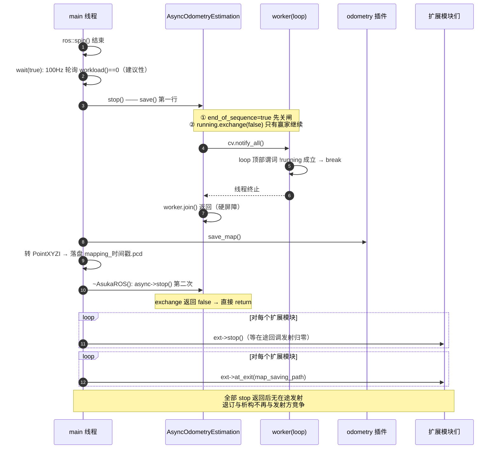

# 线程模型与停机时序（风险点）

本页聚焦 asuka 的并发骨架：数据在哪些线程之间流动、双队列如何同步、停机为什么必须按特定顺序执行。核心结论先行：**`wait`/`wait_idle` 这类等待是"建议性"的，真正的并发正确性屏障是 `save()` 与析构路径里的 `stop()` + `join()`**。源码注释在两处（`asuka_ros.cpp` 的 `save()` 与 `~AsukaROS()`）逐条给出了这样设计的原始动机——一处规避对地图数据的数据竞争，一处规避模块销毁时的回调竞态。

涉及文件：

| 文件 | 职责 |
|---|---|
| `src/asuka/include/asuka/core/async_odometry_estimation.hpp` | 异步执行器的全部并发原语声明：线程、互斥锁、条件变量、三个原子标志、两个环形队列 |
| `src/asuka/src/asuka/core/async_odometry_estimation.cpp` | 消费循环、插入闸门、幂等 `stop()` 的实现 |
| `src/asuka/src/asuka/asuka_ros.cpp` | 上层停机编排：`save()` 强制 join、析构三段式排序 |
| `src/asuka/apps/asuka_rosnode.cpp` / `asuka_rosbag.cpp` | 两种入口各自的收尾时序（spin→wait→save / 读包→wait→save） |

---

## 一、线程清单与角色

从证据可见的线程共三类：

| 线程 | 角色 | 生命周期 |
|---|---|---|
| 主线程（ROS spinner / rosbag 循环） | **生产者**：回调 `insert_imu`/`insert_frame` 入队；同时也是停机的发起者（`save`、析构） | 进程全程 |
| `AsyncOdometryEstimation::worker` | **唯一消费者**：成批取走双队列，喂给 odometry 插件并排空计算 | 构造函数 `std::thread(&…::loop, this)` 启动（.cpp L10），`stop()` 中 join |
| 扩展模块线程 | 各模块私有，由各自 `stop()` 管理 | 析构注释明确"then all module threads"，即所有模块线程必须在销毁前归零 |

构造顺序上有一个隐含保证：`asuka_ros.cpp` L27-32 先 `OdometryEstimation::load_module` 装载插件、再 `make_unique<AsyncOdometryEstimation>(odometry)`，因此 worker 启动时 `odometry` 共享指针必然已就绪，消费循环永远不会看到空算法。

---

## 二、生产者路径：insert 的锁与闸门

`insert_imu`（.cpp L17-24）与 `insert_frame`（L26-33）结构完全一致：

```cpp
{
  std::lock_guard<std::mutex> lock(mtx);
  if (!running || end_of_sequence) return;   // 闸门：停机中一律丢弃
  imu_queue.push_back(imu);
}
cv.notify_one();                             // 锁外通知，减少惊群
```

三个要点：

1. **闸门先行**：`running`（worker 存活开关）与 `end_of_sequence`（单向停机闸）任一为假即静默丢弃。这保证 `stop()` 的 exchange 与 join 之间不会有新数据溜进队列——否则 join 返回后队列里还残留未处理数据，"停机即排空"的语义就不成立。
2. **notify 在锁外**：入队成功后才 `notify_one()`，避免持锁唤醒带来的额外争用。
3. **有界有损队列**：队列是 `boost::circular_buffer`（hpp L28-29，IMU 容量 1000、帧容量 50），满时 `push_back` 会**覆盖最老元素**而非阻塞生产者。这与入口订阅队列深度（rosnode 中 IMU 1000 / 点云 50，见 `asuka_rosnode.cpp` L19/L24）对齐，形成端到端一致的有界策略：过载时丢旧数据，绝不反压 ROS 回调线程。

---

## 三、消费者路径：loop 的锁纪律

`loop()`（.cpp L59-83）把每一轮拆成"锁内短临界区 + 锁外长计算"两段：

```cpp
// 锁内：等待 + 批量搬运
cv.wait(lock, [this] { return !running || !imu_queue.empty() || !frame_queue.empty(); });
if (!running) break;
imus.assign(...imu_queue 全量...);   // 整体搬到局部 vector
frames.assign(...frame_queue 全量...);
imu_queue.clear(); frame_queue.clear();
lock.unlock();

// 锁外：计算
processing = true;
for (auto& imu : imus) odometry->insert_imu(imu);      // 先喂 IMU
for (auto& f : frames) odometry->insert_frame(f.first, f.second); // 再喂帧
while (odometry->process_once()) {}                     // 排空算法内部计算
processing = false;
```

设计动机：

- **批处理摊薄锁开销**：一次加锁搬空整个积压，而不是逐条取。
- **计算绝不持锁**：状态估计可能耗时数十毫秒以上，锁外执行保证生产者（ROS 回调）永远不被 worker 卡住——这对实时订阅是硬要求。
- **喂入顺序固定**：注释 "Feed IMU samples before frames, matching glim_ros's executor ordering" 表明先 IMU 后帧不是随意选择，而是继承上游 glim 执行器的时序契约（IMU 需覆盖帧时间戳区间才能做前向传播）。
- **`process_once()` 排空循环**：一批数据入算法后可能产生多步内部计算，循环调用直到返回 false，保证批与批之间算法内部无残留负载。

---

## 四、关键状态一览

| 状态 | 类型/初始值 | 作用 | 谁写 / 谁读 |
|---|---|---|---|
| `running` | `atomic<bool>` / `true` | worker 生命周期主开关；`stop()` 中 `exchange(false)`，**只有赢家负责 notify+join** | stop 写；loop/wait 谓词读 |
| `end_of_sequence` | `atomic<bool>` / `false` | 单向闸门，置位后所有 insert 丢弃；**从不复位**（对象一次性） | stop 写；insert 读 |
| `processing` | `atomic<bool>` / `false` | worker 正在消费/排空；`wait_idle` 判定条件之一 | loop 锁外翻转；wait_idle 原子读 |
| `mtx` + `cv` | mutex + condition_variable | 保护双队列、唤醒 worker | 全体 |
| `imu_queue` / `frame_queue` | circular_buffer（1000 / 50） | 双输入批队列，满覆盖最老 | 锁内读写 |

三个标志用 `atomic` 而非锁保护，是因为它们在**不持锁的路径**上也被读取（`wait_idle` L47 的 `processing`、`stop()` 自身的 exchange），原子性保证了内存可见性；而队列本身只在 `mtx` 内触碰。

---

## 五、stop() 的幂等设计逐步解析

```cpp
void AsyncOdometryEstimation::stop() {
  end_of_sequence = true;                    // ① 先关闸
  if (!running.exchange(false)) return;      // ② 只有一个调用者赢
  cv.notify_all();                           // ③ 唤醒可能阻塞的 worker
  if (worker.joinable()) worker.join();      // ④ 回收线程
}
```

四步各自的风险规避理由：

1. **① 先置闸门再翻转 running**：在 exchange 与 join 之间的任何并发 insert 都被拒绝，杜绝"join 期间还在入队"的窗口。
2. **② `exchange` 实现幂等**：`exchange` 返回旧值，只有第一次调用看到 `true` 并继续执行；后续调用直接 return。这不仅是便利——**对已 join 的线程再次 join 是未定义行为**，②就是唯一的防线。
3. **③ `notify_all` 必要**：worker 可能正停在 `cv.wait` 的睡眠里，谓词含 `!running`，唤醒后即走 break 分支。
4. **④ `joinable()` 检查 + join**：单次 join，之后 `worker` 永久失效。

幂等性在代码里被真实使用了三次：`save()`（asuka_ros.cpp L124）、`~AsukaROS()`（L50）、`~AsyncOdometryEstimation()`（.cpp L13-15 转调 `stop()`）。同一对象最多经历三次 `stop()` 调用，**只有第一次真正执行 join**，后两次是零开销空转。这正是"save 前强制 join"与"析构再 stop"能同时写下的前提。

---

## 六、save() 强制 join：数据竞争点的注释还原

`asuka_ros.cpp` L118-125 的注释是本页最重要的并发证据，逐句拆解：

> "workload() only reflects the input buffers, so the worker may still be inside process_scan() writing map_cloud while save() reads it (data race / heap corruption)."

含义：`workload()`（含 `wait_idle()`、`wait(true)`）只是**队列长度的近似**。即使它显示为 0，也不能推出"现在读 `map_cloud` 是安全的"——worker 可能刚搬走一批数据正在算法内部处理、往地图里写点。若 `save()` 不停 worker 就直接调 `save_map()` 读地图，就是"一边写一边读同一份堆内存"，轻则读到脏数据，重则堆损坏。

> "The worker is joined here; the destructor's stop() is idempotent."

解决方案：`save()` 第一行 `async->stop()` **join 掉 worker**。join 返回是一个硬同步点：此后不可能有任何代码再触碰 `map_cloud`，`save_map()` 才被调用。而注释同时预告了析构里还会再来一次 `stop()`——幂等设计使其安全。

join 之后的落盘路径本身是单线程的：`odometry->save_map()` 取地图 → 逐点转 `pcl::PointXYZI` → 文件名按 `mapping_YYYYmmdd_HHMMSS.pcd` 生成（路径含扩展名则原样使用，否则 `create_directories` 后拼接）→ `savePCDFileBinary` 二进制落盘，`pcl::IOException` 被捕获降级为 warn 而非中断退出。

---

## 七、析构时序：worker → 扩展模块 → at_exit

`~AsukaROS()`（asuka_ros.cpp L45-57）是一个三段式收尾，注释给出了完整理由：

```cpp
if (async) async->stop();              // ① 先停 odometry worker
for (auto& ext : extension_modules) ext->stop();      // ② 再停所有模块线程
for (auto& ext : extension_modules) ext->at_exit(map_saving_path); // ③ 最后统一退出清理
```

注释原文的逻辑链：

> "Stop every producer before destroying anything: the odometry worker, then all module threads. Once stop() has returned everywhere there are no in-flight slot emissions left, so the modules can unsubscribe from the callback slots and destruct without racing an emitter."

即：**①②都是"停生产者"**——odometry worker 与各扩展模块线程都可能通过全局回调槽（callbacks / CallbackSlot，见对应页面）对外发射事件；只要还有一个线程在跑，就可能有一次"在途发射"（in-flight emission）。②全部返回后，在途发射归零，此时模块才能安全地**退订回调槽并析构**，不会与某个正在执行的发射方竞争。③与②刻意拆成两个循环：先让**所有**线程归零，才开始做任何模块的退出收尾（`at_exit` 可能触及其它模块的回调）。

析构函数体执行完后，成员按声明逆序销毁；`async`（unique_ptr）析构时 `~AsyncOdometryEstimation` 再次调 `stop()`——由于 §五 的幂等性，这是第三次安全空转，不会重复 join。

---

## 八、完整停机时序图

以独立节点为例（rosbag 入口的收尾序列相同，只是 wait 前多了读包背压）：



**关键节点解读**：
- 节点 4-9 是唯一具备"happens-before"效力的段落：`join()` 返回保证 worker 对 odometry 状态（含 `map_cloud`）的所有写操作对 main 线程可见，`save_map()` 因此安全。
- 节点 11 展示幂等的实际收益：不早退的话，对已 join 线程重复 join 会直接是 UB。
- 两个 `loop` 块的先后不可交换：所有 `stop` 完成前执行任何 `at_exit`，都可能撞上仍在发射的其它模块。

worker 生命周期对应的状态图：

```mermaid
stateDiagram-v2
    state "Running: running=true, 接受插入" as R
    state "Stopping: running=false, 闸门已关" as S
    state "Joined: worker 已回收" as J

    [*] --> R: 构造函数 std::thread(loop)
    R --> R: 锁内批搬空双队列 → 锁外喂 IMU/帧 + process_once 排空
    R --> S: stop(): end_of_sequence=true; exchange(false); notify_all
    S --> J: loop 顶部谓词 !running → break; join 返回
    J --> [*]: 析构中再次 stop() 直接早退

    note right of S
        此后所有 insert_imu / insert_frame
        在锁内被闸门拒绝并丢弃
        end_of_sequence 从不复位
    end note
```

Running 的自环是稳态：每轮"锁内短临界区 + 锁外长计算"。Stopping→Joined 只有一条路径（谓词 `!running` 的 break 分支），不存在半停状态；`end_of_sequence` 单向性使整个状态机不可逆，即执行器对象一次性。

---

## 九、wait / workload / wait_idle：建议性等待层

这一层为上层提供"还剩多少活"的估计，但如 §六 所述，它们不是安全屏障：

- `workload()`（.cpp L35-38）：锁内取 `imu_queue.size() + frame_queue.size()`，再加算法内部的 `odometry->workload()`。
- `wait_idle()`（L40-50）：10ms 轮询三条件——输入队列空 && `!processing` && 算法负载 0。注意它**不使用条件变量**，是纯轮询。
- `wait(true)`（asuka_ros.cpp L110-116）：100Hz 轮询 `workload()==0`，供 main 在 spin 结束后排空残余。
- rosbag 背压（asuka_rosbag.cpp L139-149）：离线回放没有实时节奏约束，读帧前以 `workload() > 10` 阻流防积压失控，并带 500ms 无进展的逃生 break，避免卡死在异常停滞上。

所有这些路径的正确性兜底最终都落在 `save()` 里那次 join 上——即使 wait 提前返回、worker 还在处理最后一批，join 也会等它做完当前批（批数据已搬到 loop 的局部 vector，cv.wait 只在下一轮顶部检查 `!running`），然后才进入 `save_map()`。

---

## 十、边界条件与风险清单

从锁纪律出发可以读出的几个值得记录的点：

1. **`stop()` 全程不持 `mtx`**：`running.exchange(false)` 与 `cv.notify_all()` 都在锁外。若 notify 恰好落在 worker"已通过谓词检查、尚未进入阻塞"的缝隙里，且此后再无任何 notify，worker 会睡眠到永远，`join` 悬挂。该窗口极窄、实践中几乎不可达，但它是"修改条件变量关联状态应持同一把锁"这一经典规则的偏离点，审查并发代码时应知晓（修复方向：stop 中锁内置标志再 notify）。
2. **`processing` 在锁外翻转的瞬时窗口**：批搬运 `unlock` 之后、`processing=true` 之前，队列已空、processing 尚未置位、算法负载未增长——`wait_idle`/`workload()` 可能瞬时读到"全空闲"。正如 §六，真正的安全网是 join；等待层只应作进度参考。
3. **环形队列满覆盖**：过载时最老 IMU/帧被**静默丢弃**（返回值均为 void，调用方无感知）。在线运行时通常意味着算力不足正在掉历史数据，而非报错。
4. **`end_of_sequence` 不可逆**：`stop()` 之后执行器不可复用，后续 insert 全部静默丢弃。当前生命周期（每进程一个 AsukaROS）下无害，但复用对象前必须重审此契约。
5. **`workload()` 中 `odometry->workload()` 在持锁状态下调用**（L36-37），要求算法插件的该实现必须轻量且无内部阻塞，否则会反过来阻塞生产者——这是对插件实现的一条隐含契约。

---

## 十一、扩展点

- **新算法插件**：只需正确实现 `workload()`（暴露内部积压）即可自动接入 `wait_idle` / rosbag 背压语义；无需感知线程模型——所有并发收敛在 AsyncOdometryEstimation 一层。
- **新扩展模块**：必须遵守 `stop()` + `at_exit()` 双阶段协议，且契约是"stop 返回后不再有任何回调槽发射"，否则会破坏 `~AsukaROS` 的销毁安全链。
- **未来运行时热替换/卸载**：`end_of_sequence → exchange → notify → join` 的停机模式与 dlopen 注册表"句柄常驻"的设计（详见 dlopen 加载器页面）是现成接缝；卸载插件前以同样序列停掉其消费者即可获得无竞态的卸载窗口。

---

Sources: `src/asuka/src/asuka/core/async_odometry_estimation.cpp#L1-L86`, `src/asuka/include/asuka/core/async_odometry_estimation.hpp#L1-L45`, `src/asuka/src/asuka/asuka_ros.cpp#L1-L186`, `src/asuka/include/asuka/asuka_ros.hpp#L1-L64`, `src/asuka/apps/asuka_rosnode.cpp#L1-L33`, `src/asuka/apps/asuka_rosbag.cpp#L1-L176`

## 关联源码

- `src/asuka/src/asuka/core/async_odometry_estimation.cpp`
- `src/asuka/src/asuka/asuka_ros.cpp`
