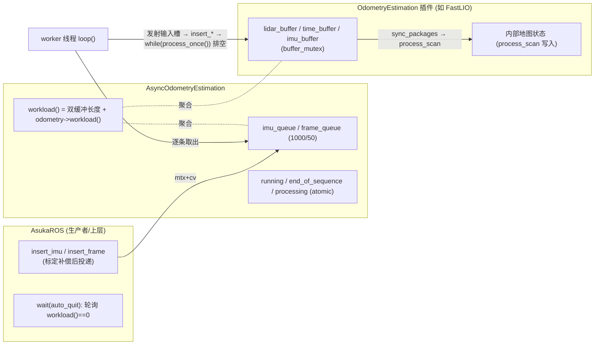
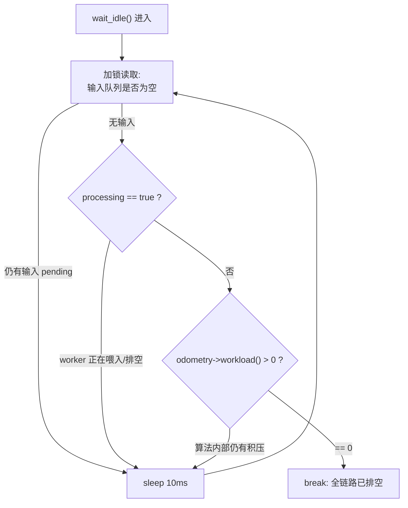

# 核心状态与缓冲管理

本页聚焦三个问题：**负载如何被量化**（`workload()`）、**“排空”如何被等待**（`wait_idle()`）、**算法内部状态如何被统一管理**（`stop` / `save_map` / `process_once` 接口面）。这三者共同构成了“异步队列层 → 算法插件层”之间的状态契约，是理解停机时序与地图保存安全性的前置知识。

## 模块职责划分

状态与缓冲被明确切分为三层，各自拥有独立的保护机制：

| 层 | 文件 | 持有的状态 | 保护方式 |
|---|---|---|---|
| 缓冲调度层 | `core/async_odometry_estimation.{hpp,cpp}` | IMU/帧两条环形缓冲（1000/50）；`running` / `end_of_sequence` / `processing` 三个原子标志 | `mtx` + `cv` 管队列，原子变量管生命周期 |
| 算法接口层 | `core/odometry_estimation.hpp` | 只定义契约，不持状态 | 虚函数默认实现全部为“空操作/零负载” |
| 算法实现层 | `odometry/fastlio/odometry_estimation.cpp` 等 | 各自的 lidar/imu 内部缓冲、地图状态、滤波器状态 | 各自的 `buffer_mutex`（以 FastLIO 为例） |

关键约束是：**只有 worker 线程会调用算法的 `insert_imu` / `insert_frame` / `process_once`**（见 `loop()`），算法内部估计状态因此在正常路径上是单线程的；但 `save_map` / `stop` 会被其他线程调用，所以 FastLIO 用 `buffer_mutex` 把这两者与 `sync_packages` 的出队操作互斥起来。

## workload()：两层负载的聚合

`AsyncOdometryEstimation::workload()` 的语义是一个加法聚合：

```
workload = imu_queue.size() + frame_queue.size() + odometry->workload()
```

- 第二项来自基类契约 `virtual int workload() const { return 0; }`，不报告内部负载的算法自动退化为“只看输入队列”。
- FastLIO 的实现返回 `lidar_buffer.size()`——注意它**不含 `imu_buffer`**，即“算法负载”的口径由各实现自行决定。
- 上层 `AsukaROS::workload()` 只是透传。

两个必须记住的边界：

1. **`workload() == 0` 不等于“计算已结束”**。worker 在 `loop()` 中逐条取出事件、进入 `processing = true` 的排空段；此期间输入队列可能是空的，但 `process_scan` 仍在运行并写内部地图状态。`save()` 处的注释明确指出这正是数据竞争来源。
2. **`odometry->workload()` 在 async 的 `mtx` 持有下被调用**。算法实现者必须保证自己的 `workload()` 轻量且不可重入回 async 层，否则会自锁。



图中要点：`workload()` 是跨越缓冲层与算法层的**聚合视图**；`processing` 标志恰好覆盖“队列已空但计算未完”的窗口，是 `workload` 口径的补丁。

## wait_idle()：三条件轮询排空

`wait_idle()`（async_odometry_estimation.cpp L40-50）以 10ms 轮询等待三个条件同时成立，是全链路“真正空闲”的强判据：



- 三个条件分别对应三层状态：**输入队列空**（mtx 保护）、**`processing == false`**（原子读，锁外）、**算法负载为 0**（算法自报）。缺一不可，这正好补上了 `workload()==0` 的语义漏洞。
- 函数签名为 `const`，靠 `mutable std::mutex`（hpp L35）实现“只读等待”，允许上层在 const 上下文中阻塞等待。
- 与之对照，`AsukaROS::wait(auto_quit)`（asuka_ros.cpp L110-116）只以 100Hz 轮询 `async->workload() == 0`，**不检查 `processing`**——这是弱判据，主入口依赖后续 `save()` 中的 `stop()` join 来兜底。需要精确排空的调用方（如离线回放等待收尾）应使用 `wait_idle` 而非 `wait`。

## stop 与入队拒绝：缓冲层生命终点

`stop()` 通过 `end_of_sequence = true` + `running.exchange(false)` 实现幂等：重复调用、或析构函数再次调用都安全。`end_of_sequence` 与 `!running` 一旦置位，`insert_imu` / `insert_frame` 直接丢弃新数据，保证 join 之后不会再有生产者写入。另一个隐含边界：两条输入缓冲是**有界环形缓冲（1000/50）**，满员时静默覆盖该流最旧事件，生产速率超过消费速率时不会阻塞 ROS 回调，而是丢历史。

## 算法状态管理接口面

基类为状态管理定义了三个可覆盖的钩子，默认全为空操作：

| 接口 | 默认 | FastLIO 示范 | 调用方 |
|---|---|---|---|
| `stop()` | 空 | 清空三个内部缓冲并复位 `lidar_pushed`，即 **stop 兼具 flush 语义** | 析构链路（异步执行器停机另有自己的 `stop()`） |
| `save_map()` | 返回 `nullptr` | 在 `buffer_mutex` 下 flatten ikd-tree 现场导出（受 `mapping.enable_map_saving` 门控） | AsukaROS::save |
| `process_once()` | 返回 `false` | `sync_packages` 失败返回 false，成功则 `process_scan` 并返回 true | worker 排空循环 |

`process_once()` 是**泵式接口**：worker 用 `while (odometry->process_once()) {}` 循环调用直到返回 false，算法用它表达“还有完整量测组可处理”。FastLIO 的 `sync_packages` 展示了典型协议——帧与 IMU 按时间戳对齐成 `ImuMeasureGroup`，不足则返回 false 等待下一轮。

一个必须理解的线程安全细节：`save_map()` 返回的是地图的**共享指针句柄**（fastlio 为 ikd-tree 的现场导出副本，batchlio/superlio 为运行期累积缓冲）；如果调用方不先 `stop()` join worker，`process_scan` 仍可能在读句柄的同时写地图——这正是 `save()` 注释中“data race / heap corruption”警告的机制。算法状态的正确读出协议是 **stop → join → save_map**。

## 边界条件小结

- `workload()==0` ≠ 计算完成：需要 `processing` 补判（`wait_idle` 已包含，`wait` 未包含）。
- 算法 `workload()` 口径自定（FastLIO 不含 `imu_buffer`），不同实现的“空闲”含义不完全一致。
- 环形缓冲满即覆盖该流最旧数据，无告警、无阻塞。
- `stop()` 后入队被静默丢弃；`wait_idle` 在 stop 之后会立即返回（三条件天然满足）。
- `workload()` 在 async 互斥锁内调用算法实现——实现不得阻塞或回调 async 层。
- `save_map()` 能力因算法而异：fastlio 现场导出（受 `mapping.enable_map_saving` 门控）、batchlio/superlio 返回累积缓冲、lightning 导出全局地图、smallpointlio 返回空。

## 扩展点

- **新算法接入**：务必诚实实现 `workload()`，否则 `wait_idle` 对该算法退化为“只等输入排空”，可能在其内部仍有积压时提前返回；`save_map()` 也应返回真实地图而非 nullptr（或明确以 nullptr 表达"不产出地图"）。
- **等待机制升级**：`wait_idle` 目前是 10ms 轮询而非条件变量唤醒，若将来有低延迟需求，可在 `processing` 置 false 处增加 `cv.notify` 改造为事件驱动，轮询结构本身即为接缝。

## Sources

Sources: `src/asuka/src/asuka/core/async_odometry_estimation.cpp#L1-L86`
Sources: `src/asuka/include/asuka/core/async_odometry_estimation.hpp#L1-L45`
Sources: `src/asuka/include/asuka/core/odometry_estimation.hpp#L1-L40`
Sources: `src/asuka/src/asuka/asuka_ros.cpp#L1-L186`
Sources: `src/asuka/src/asuka/odometry/fastlio/odometry_estimation.cpp#L1-L260`

## 关联源码

- `src/asuka/include/asuka/core/odometry_estimation.hpp`
- `src/asuka/src/asuka/core/async_odometry_estimation.cpp`
