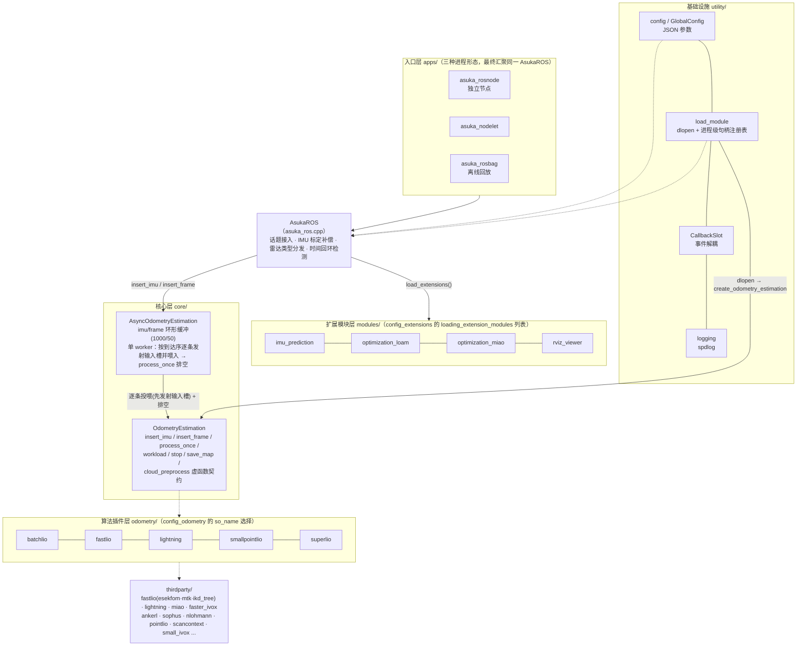
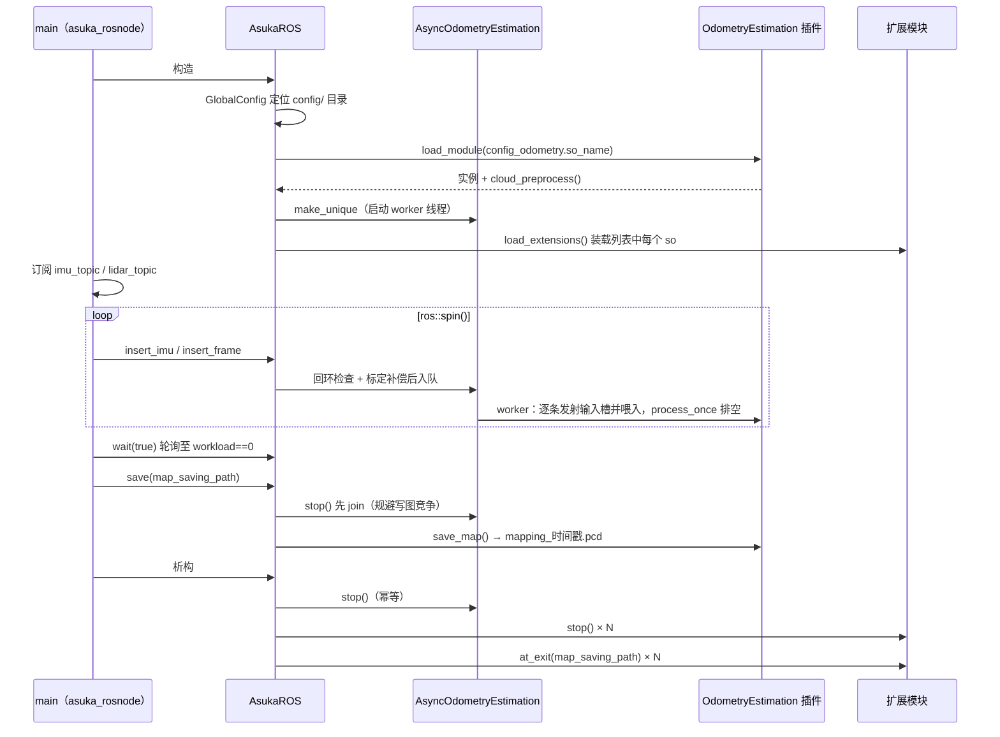

# 项目总览与架构地图

AsukaROS 是一个以 **ROS 封装层为中枢、算法插件为外沿** 的激光-惯导里程计（LIO）框架。它的骨架可以概括为一句话：ROS 节点订阅 IMU 与点云两类话题，经标定补偿与回环检查后写入异步环形缓冲队列；由独立 worker 线程按到达序逐条投喂给通过 `so_name` 动态装载（dlopen）的五种里程计算法之一；配置系统、扩展模块与第三方库在其外围供装配。理解了这个中枢，整个仓库的其余页面都是围绕它的展开。

## 架构总图

**关键节点说明：**

- **入口层**：`asuka_rosnode.cpp` 是最小入口（33 行）；`asuka_nodelet.cpp` 与 `asuka_rosbag.cpp` 提供动态加载与离线回放两种形态，三者最终都落到同一套 `AsukaROS` 数据链路（详见专题页）。
- **AsukaROS**：所有传感器标定类修正（时间偏移、加速度尺度）被**集中收敛在这一层**，算法层无需感知；它同时是插件装载与扩展模块装载的装配点。
- **AsyncOdometryEstimation**：生产者-消费者枢纽，用互斥锁 + 条件变量维护 IMU/帧两条环形缓冲，按传感器时间交错逐条投喂，把 ROS 回调线程与算法计算线程解耦。
- **OdometryEstimation**：纯虚契约 + `static load_module` 工厂 + `extern "C" create_odometry_estimation`，构成算法动态插件的边界。构造函数中 `odometry->cloud_preprocess()` 把算法私有的预处理实例**反向共享**给 ROS 层使用。
- **utility/**：`load_module.cpp` 是 dlopen 的唯一通道（`RTLD_LAZY`，句柄永不关闭）；`CallbackSlot`（8.3KB）是模块间事件订阅/发布的中枢原语。

## 主线索：一条数据的完整旅程

阅读代码时建议跟随三条链路，它们贯穿全部四个层次：

1. **IMU 链**：`sensor_msgs::Imu` → `AsukaROS::insert_imu`：转 `ImuData`（stamp / linear_acc / angular_vel）→ `handle_loop_back(stamp, FrameId::IMU)` 回环检查 → `stamp += imu_time_offset`、`linear_acc *= acc_scale` → `async->insert_imu` 入 imu_queue。
2. **点云链**：`sensor_msgs::PointCloud2` → `AsukaROS::insert_frame`：按 `lidar_type` 分发 Livox / Robosense 两种自定义点 → `pcl::fromROSMsg` 转 PCL → `handle_loop_back(stamp, FrameId::LIDAR)` → `stamp += time_offset_lidar_to_imu` → 共享的 `cloud_preprocess->preprocess(...)`（**返回 null 则整帧丢弃**）→ `async->insert_frame` 入队。
3. **消费链**：worker 线程在条件变量上等待 → 逐条取出事件并解锁 → **先发射 `on_insert_imu` / `on_insert_frame` 再喂给算法**（输入槽由执行器统一发射，三个链路槽同线程保持程序序）→ `while (odometry->process_once()) {}` 循环排空计算。

## 进程生命周期

**时序要点：**

- **装配顺序**（构造函数 L19-43）：定位 config 目录 → 初始化日志 → 读 `config_odometry` 的 `so_name` 装载算法（失败即 `throw std::runtime_error`）→ 取出共享 `cloud_preprocess` → 创建异步执行器 → 读 ROS 边界参数（`lidar_type`、`acc_scale`、`imu_time_offset`、`time_offset_lidar_to_imu`、`map_saving_path`）→ 最后装载扩展模块。
- **停机顺序**（析构 L45-57）：先 `async->stop()` 停 odometry worker，再逐个 `ext->stop()`，最后逐个 `ext->at_exit(map_saving_path)`。注释明确：先停掉所有生产者，确保没有在途的槽发射后，模块才能退订回调并析构，避免与发射方竞争。
- **save 的强制前置**：`workload()` 只反映输入缓冲，不停 worker 就调用 `save_map` 会与正在 `process_scan()` 写 `map_cloud` 的线程发生数据竞争乃至堆损坏，因此 `save()` 第一步就是 `async->stop()`（worker 被 join，析构中的 stop 幂等）。地图按 `mapping_%Y%m%d_%H%M%S.pcd` 命名，路径带扩展名则直接使用，否则建目录后落时间戳文件名，以 PCL 二进制写出。

## 模块分布地图

| 目录 | 职责 | 代表文件 |
|---|---|---|
| `apps/` | 三种进程形态入口（独立节点 / nodelet / rosbag） | `asuka_rosnode.cpp`（1.1KB 最小入口）等三个可执行目标 |
| `src/asuka` + `include/asuka`（顶层） | ROS 封装中枢：装配、输入适配、停机 | `asuka_ros.cpp`（6.8KB）/ `asuka_ros.hpp` |
| `core/` | 异步执行器、插件契约、公共类型、预处理抽象 | `async_odometry_estimation.cpp`、`odometry_estimation.hpp`、`types.hpp` |
| `odometry/` | 五种算法插件：batchlio / fastlio / lightning / smallpointlio / superlio | 各实现目录的 `create.cpp` 导出 `create_odometry_estimation` |
| `modules/` | 扩展模块：IMU 前向预测、LOAM 点面优化、miao 图优化、RViz 可视化 | `optimization_loam.cpp`（20.3KB，模块中最大） |
| `utility/` | 配置系统、dlopen 装载器、CallbackSlot、日志 | `config.cpp`、`load_module.cpp`、`callback_slot.hpp`（8.3KB） |
| `config/` | JSON 配置层级与五种算法参数变体 | `config.json`（顶层）、`config_ros.json`、`config_odometry/*.json`、`config_extensions.json` |
| `launch/` | 三形态启动文件 + RViz 显示配置 | `rosnode.launch` / `nodelet.launch` / `rosbag.launch` / `config.rviz` |
| `thirdparty/` | 算法依赖库（各算法页详解） | fastlio（esekfom 78KB + ikd_tree 61KB）、lightning、miao、ankerl、sophus、nlohmann 等 |

## 关键状态一览

- **AsukaROS 成员状态**：`lidar_type` / `acc_scale` / `imu_time_offset` / `time_offset_lidar_to_imu` / `map_saving_path` 均在构造时一次性读入；`last_timestamp_lidar` / `last_timestamp_imu` 初始为 -1，用于时间戳只增跟踪。
- **AsyncOdometryEstimation 状态**：三个原子标志 `running`（初值 true）、`end_of_sequence`、`processing`，加上两条容量固定的环形缓冲（imu_queue 1000、frame_queue 50）。
- **负载聚合**：`workload() = 队列长度 + odometry->workload()`（算法内部负载）；`wait_idle()` 以 10ms 轮询等待三条件同时成立——无输入、无 processing、算法负载为 0。`wait(true)` 正是靠它支撑"队列清空再退出"。

## 边界条件与风险点

1. **插件装载失败**：`load_module` 返回空时构造函数直接抛异常，进程不会带病运行。
2. **预处理丢弃**：`cloud_preprocess` 返回 null 的帧被静默丢弃，不进入队列。
3. **停机后的插入**：`insert_imu/insert_frame` 在 `!running || end_of_sequence` 时直接返回——stop 之后的迟到数据被丢弃。
4. **队列容量**：两条环形缓冲均有界（1000/50），满载时覆盖该流最旧事件。
5. **回环检测只告警**：`handle_loop_back` 检测到 IMU 或激光时间回退（如 rosbag 循环播放）仅输出 warn，不丢数、不重置，是数据流入的第一道防线而非拦截器。
6. **save 竞争**：见上文时序要点，`save()` 必须先 join worker，代码注释逐条说明了原因。
7. **句柄永不关闭**：`load_module.cpp` 的进程级 `open_handles` 注册表按 so 名缓存句柄，重复装载直接命中缓存；注释明确句柄永不 `dlclose`、插件代码常驻进程，该注册表是未来卸载/重载实现的接缝。

## 扩展点

- **新增里程计算法**：继承 `OdometryEstimation` 实现虚函数契约，在 `create.cpp` 导出 `extern "C" create_odometry_estimation`，新增一份 `config_odometry/*.json` 指定 `so_name` 与超参——切换算法只需改配置指向。
- **定制预处理**：`CloudPreprocess` / `ImuPreprocess` 为抽象基类，各算法子目录提供同名定制实现，ROS 层只依赖接口。
- **新增扩展模块**：`ExtensionModule` 与里程计基类同构（同为 dlopen 插件），把 so 名加入 `config_extensions.json` 的 `loading_extension_modules` 列表即可被装载，退出时统一收到 `stop()` 与 `at_exit(map_saving_path)`。

## 推荐阅读顺序

1. `apps/asuka_rosnode.cpp` —— 33 行看懂进程生命周期；
2. `src/asuka/asuka_ros.cpp` —— 装配顺序与输入适配、标定收敛点；
3. `core/async_odometry_estimation.cpp` —— 并发模型与停机语义；
4. `core/odometry_estimation.hpp` + `utility/load_module.cpp` —— 插件契约与装载机制；
5. `odometry/<选定算法>/` —— 从 `create.cpp`（最小样例）进入主实现，对照 `config_odometry` JSON；
6. `modules/` 与 `thirdparty/` —— 按需深入对应专题页。

Sources: `src/asuka/apps/asuka_rosnode.cpp#L1-L33` | `src/asuka/src/asuka/asuka_ros.cpp#L1-L186` | `src/asuka/include/asuka/asuka_ros.hpp#L1-L64` | `src/asuka/include/asuka/core/odometry_estimation.hpp#L1-L40` | `src/asuka/include/asuka/core/async_odometry_estimation.hpp#L1-L45` | `src/asuka/src/asuka/core/async_odometry_estimation.cpp#L1-L86` | `src/asuka/src/asuka/utility/load_module.cpp#L1-L61`

## 关联源码

- `src/asuka/src/asuka/asuka_ros.cpp`
- `src/asuka/apps/asuka_rosnode.cpp`
- `src/asuka/include/asuka/asuka_ros.hpp`
