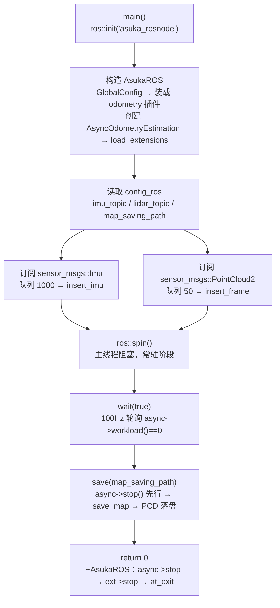

# ROS 节点入口 asuka_rosnode

## 模块职责

`apps/asuka_rosnode.cpp` 是整个 asuka 包最小、最直接的进程入口（仅 33 行）。它自身不做任何算法与数据处理，只承担四件事：

1. **初始化 ROS**：`ros::init(argc, argv, "asuka_rosnode")` 并持有 `ros::NodeHandle`；
2. **装配核心对象**：构造 `AsukaROS asuka_ros(nh)`，由后者完成配置定位、里程计插件装载、异步执行器与扩展模块的创建；
3. **接线上游话题**：读取 `config_ros` 中的 `imu_topic`、`lidar_topic` 与 `map_saving_path`，订阅 `sensor_msgs::Imu` 与 `sensor_msgs::PointCloud2`，把消息原样转发给 `insert_imu` / `insert_frame`；
4. **定义进程生命周期**：`ros::spin()` 阻塞 → `wait(true)` 排空队列 → `save(map_saving_path)` 落盘地图 → 返回并触发析构。

换言之，`main` 是进程生命周期的"骨架"，而所有实质性装配与数据路径都封装在 `AsukaROS` 中。

## main 函数逐段解读

### 装配阶段（L8–L17）

```cpp
ros::init(argc, argv, "asuka_rosnode");
ros::NodeHandle nh;
asuka::AsukaROS asuka_ros(nh);
```

`AsukaROS` 构造函数（`asuka_ros.cpp` L19–L43）在 `main` 看不见的地方完成了真正的装配：定位 `asuka` 包的 `config` 目录初始化 `GlobalConfig`，按 `config_odometry` 的 `so_name` 通过 `OdometryEstimation::load_module` 动态装载算法插件并取出其共享的 `cloud_preprocess`，创建 `AsyncOdometryEstimation` 异步执行器，再读取 `lidar_type`、`acc_scale`、`imu_time_offset`、`time_offset_lidar_to_imu`、`map_saving_path` 等 ROS 边界参数，最后 `load_extensions()` 装载扩展模块。**注意：`AsukaROS` 构造失败会直接抛 `std::runtime_error`（L28–L30），`main` 未捕获，即插件装载失败等价于进程启动失败。**

随后 `main` 自己再次打开 `config_ros`：

```cpp
asuka::Config config(asuka::GlobalConfig::get_config_path("config_ros"));
const std::string imu_topic        = config.param<std::string>("ros", "imu_topic", "/livox/imu");
const std::string lidar_topic      = config.param<std::string>("ros", "lidar_topic", "/livox/lidar");
const std::string map_saving_path  = config.param<std::string>("ros", "map_saving_path", "");
```

三个参数都带兜底默认值：IMU 话题 `/livox/imu`、点云话题 `/livox/lidar`、保存路径为空串。`main` 读取的 `map_saving_path` 用于传给 `save()`，与构造函数中读入成员的同名配置同源，二者天然一致。

### 订阅阶段（L19–L26）

```cpp
ros::Subscriber imu_sub = nh.subscribe<sensor_msgs::Imu>(imu_topic, 1000, [&](const sensor_msgs::Imu::ConstPtr& msg) {
  asuka_ros.insert_imu(msg);
});
ros::Subscriber points_sub =
  nh.subscribe<sensor_msgs::PointCloud2>(lidar_topic, 50, [&](const sensor_msgs::PointCloud2::ConstPtr& msg) {
    asuka_ros.insert_frame(msg);
  });
```

两个回调都是纯转发：lambda 以 `[&]` 捕获栈上的 `asuka_ros`（其生命周期覆盖 `spin/wait/save` 全程，安全）。值得注意的是**队列长度不对称**：IMU 1000、点云 50，反映 IMU 频率远高于雷达帧率；这两个数值硬编码在入口中，不在配置里。真正的转换、回环检查、标定补偿都发生在 `AsukaROS::insert_imu/insert_frame` 内部，入口层完全不感知。

### 生命周期阶段（L28–L31）

```cpp
ros::spin();
asuka_ros.wait(true);
asuka_ros.save(map_saving_path);
return 0;
```

这四行是理解进程生命周期的关键序列：

- **`ros::spin()`**：主线程阻塞，ROS 回调队列在此被分发。进程常态停留在这一行（流式在线运行）；
- **`wait(true)`**（`asuka_ros.cpp` L110–L116）：以 `ros::WallRate(100)` 即 100Hz 轮询 `async->workload()`，直到输入队列与算法内部负载清零才返回，保证退出前"消化完"积压数据；
- **`save(map_saving_path)`**（L118–L155）：**先 `async->stop()` 强制停止并 join worker 线程**，再调用 `odometry->save_map()`。代码注释明确说明原因：`workload()` 只反映输入缓冲，不先停 worker，它可能仍在 `process_scan` 中写 `map_cloud`，与保存读取构成数据竞争/堆破坏；
- **`return 0`**：随后按声明逆序析构局部对象（订阅器 → `config` → `asuka_ros`），`~AsukaROS`（L45–L57）依次 `async->stop()`（幂等）→ 各扩展模块 `stop()` → `at_exit(map_saving_path)`。

## 进程生命周期图



关键节点解释：

- **B → C**：配置被读取两次（构造函数读 ROS 参数集、`main` 读话题与保存路径），同源同键，不会失配；
- **F**：spin 期间回调在 ROS spinner 线程执行，算法计算在 `AsyncOdometryEstimation` 的 worker 线程执行，二者经互斥锁保护的双队列解耦；
- **G → H 的顺序不可颠倒**：`wait` 只保证"无积压"，`save` 内部的 `stop()` 才保证"worker 已 join"，两道闸门共同消除保存时的数据竞争；
- **I**：析构链是 `save` 之后的第一道也是最后一道防线，`stop()` 的幂等性（`running.exchange(false)`）使重复停止安全。

## 关键状态

`AsukaROS` 在入口装配后持有的核心状态（`asuka_ros.hpp` L44–L60）：

| 状态 | 来源 | 作用 |
|---|---|---|
| `odometry` / `cloud_preprocess` | `config_odometry` 的 `so_name` | 算法插件与其私有预处理 |
| `async` | 构造时创建 | 双队列异步执行器，持有 worker 线程 |
| `lidar_type` / `acc_scale` / 两个时间偏移 | `config_ros` | 点云分发与 IMU 标定补偿 |
| `map_saving_path` | `config_ros` | `save()` 与扩展模块 `at_exit` 共用 |
| `last_timestamp_lidar/imu` | 运行时更新 | 时间回环检测基准（初值 -1.0） |

进程级状态迁移：**spin 中（在线流式）→ 排空中（drain）→ 保存中（stop + 落盘）→ 析构（worker → 扩展模块 → at_exit）**。状态推进完全由 `main` 的四行顺序驱动，无额外状态机。

## 边界条件

1. **spin 的返回条件**：`ros::spin()` 只在节点被关闭（SIGINT / `ros::shutdown`）时返回；正常使用中 `save` 每进程仅执行一次，位于退出路径上。
2. **`wait(true)` 依赖 `ros::ok()`**：循环条件是 `while (ros::ok())`。若 spin 因 Ctrl+C 返回，`ros::ok()` 通常已为 false，循环体不会执行，"排空等待"退化为立即返回；此时仍留在双队列中未消费的数据不会被处理，`save` 内的 `stop()` 会 join worker 并保存已积分的部分。
3. **`map_saving_path` 为空**（默认值）时，`save()` 的条件 `cloud && !cloud->empty() && !path.empty()` 不满足，直接跳过落盘，进程仍正常退出。
4. **路径语义二分**：`save` 中若路径带扩展名则视为完整文件名直接使用；否则视为目录，`create_directories` 后按时间戳写 `mapping_%Y%m%d_%H%M%S.pcd`（PCL 二进制格式，点类型压平为 `PointXYZI`）。
5. **落盘失败不致命**：`pcl::IOException` 被 catch 后仅 `logger->warn`，退出流程继续。
6. **IMU/点云队列溢出**：入口的 1000/50 为 ROS 订阅队列，处理过慢时旧消息会被丢弃，这属于 ROS 层行为，`AsukaROS` 不感知。

## 扩展点

- **话题重接线**：`imu_topic` / `lidar_topic` 全部由 `config_ros.json` 控制，换话题不需要重新编译；
- **保存目标定制**：通过给 `map_saving_path` 一个带扩展名的路径可固定输出文件名，否则走时间戳目录约定；
- **退出前插入自定义逻辑**：`save(...)` 与 `return 0` 之间是天然挂载点；扩展模块侧则统一通过 `at_exit(map_saving_path)` 收尾；
- **非 spin 驱动的入口**：`main` 暴露的 `insert_imu / insert_frame / workload / wait / save` 正是 `AsukaROS` 的完整对外接口面，其他运行形态（nodelet、rosbag 离线回放）复用同一接口汇聚到同一数据链路，仅替换外层驱动方式。

## 主要文件

| 文件 | 角色 |
|---|---|
| `src/asuka/apps/asuka_rosnode.cpp` | 入口 `main`，定义进程生命周期（33 行） |
| `src/asuka/src/asuka/asuka_ros.cpp` | `AsukaROS` 实现：装配、回调转发、等待与保存 |
| `src/asuka/include/asuka/asuka_ros.hpp` | 对外接口与成员状态声明 |
| `src/asuka/config/config_ros.json` | 话题名、雷达类型、标定参数与保存路径的默认配置 |

Sources: `src/asuka/apps/asuka_rosnode.cpp#L1-L33` | `src/asuka/src/asuka/asuka_ros.cpp#L1-L186` | `src/asuka/include/asuka/asuka_ros.hpp#L1-L64` | `src/asuka/config/config_ros.json#L1-L12` | `src/asuka/src/asuka/core/async_odometry_estimation.cpp#L1-L86`

## 关联源码

- `src/asuka/apps/asuka_rosnode.cpp`
