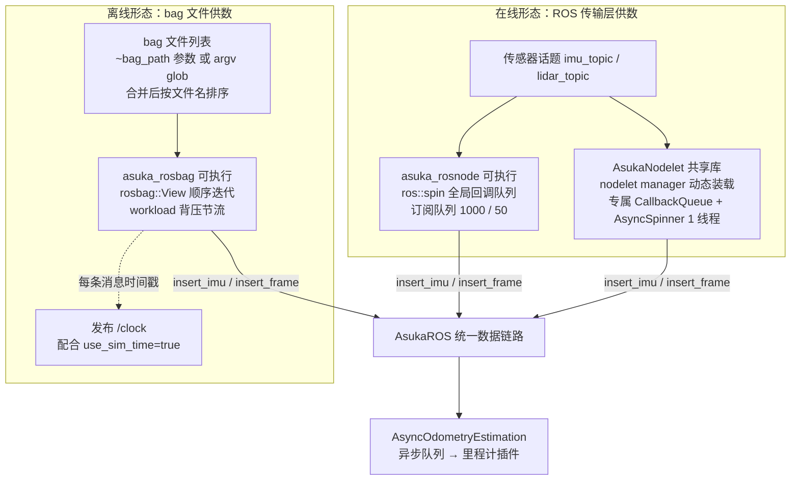
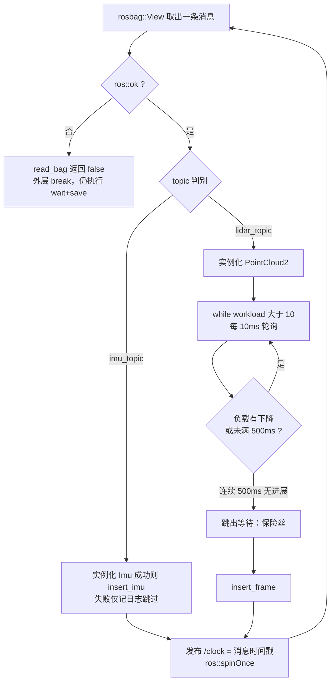

# nodelet 与 rosbag 两种运行形态

`src/asuka/apps/` 下共有三个入口源文件：`asuka_rosnode.cpp`（独立节点，前一页已展开）、`asuka_nodelet.cpp`（nodelet 插件）与 `asuka_rosbag.cpp`（离线回放）。严格地说，nodelet 的编译产物不是可执行文件而是共享库——`nodelet_plugins.xml` 声明 `<library path="libasuka_nodelet">`，由 nodelet manager 在运行期经 pluginlib 装载；另外两个才是常规可执行目标。三者启动方式迥异，但都收敛到同一套契约：构造 `AsukaROS`、逐条消息调用 `insert_imu` / `insert_frame`、结束时 `wait(true)` 排空队列再 `save(map_saving_path)`。

## 三种入口对照

| 维度 | asuka_rosnode | AsukaNodelet | asuka_rosbag |
|---|---|---|---|
| 构建产物 | 可执行文件 | 共享库 `libasuka_nodelet` | 可执行文件 |
| 装载方式 | 直接运行 | nodelet manager 经 pluginlib 动态加载 | 直接运行 |
| 消息来源 | ROS 传输层订阅 | ROS 传输层订阅（专属 CallbackQueue） | `rosbag::View` 直接迭代，不经传输层 |
| 回调驱动 | `ros::spin()` 单线程全局队列 | `AsyncSpinner(1)` 消费专属队列 | main 线程顺序读取 |
| NodeHandle | 全局命名空间 | `getPrivateNodeHandle()` | `"~"` 私有命名空间 |
| 配置来源 | config_ros.json | config_ros.json（launch 不传 rosparam） | config_ros.json + `~bag_path` / argv |
| 流控 | 订阅队列 IMU 1000 / 点云 50 | 同左 | `workload()>10` 节流 + 500ms 逃逸 |
| 时钟 | 系统时间 | 系统时间 | 自发布 `/clock`，launch 置 `use_sim_time` |
| 收尾 | spin 返回 → wait → save | 析构 → stop spinner → wait → save | bag 循环结束 → wait → save |

## 总览：三路汇聚

关键节点说明：上半部分是在线两形态，消息经 ROS 传输层进入订阅回调；下半部分离线形态绕过传输层，由程序自己迭代 bag 并直接喂数，同时把 bag 时间写向 `/clock` 以维持仿真时间语义。三条路径全部落在 `AsukaROS` 上——此后才是异步队列与算法插件，对入口形态完全无感。图中未画出的共同契约是收尾：三个入口最终都执行 `wait(true)` + `save(map_saving_path)`。

## 基线：独立节点 asuka_rosnode

`asuka_rosnode.cpp` 全文仅 33 行，是最小参照系：全局 `ros::NodeHandle nh;` 传给 `AsukaROS`（因此 AsukaROS 内部经该句柄读取的 rosparam 落在**全局**命名空间），`ros::spin()` 阻塞至 Ctrl-C，返回后 `wait(true)` → `save`。`rosnode.launch` 不传任何 rosparam（可选启动 rviz，加载 `config.rviz`），一切配置来自 JSON 文件。

## nodelet：装载进 manager 的动态库形态

**插件注册链由三处字符串互相咬合**：`asuka_nodelet.cpp` 末尾的 `PLUGINLIB_EXPORT_CLASS(asuka::AsukaNodelet, nodelet::Nodelet)`（L80）把类注册进 pluginlib；包根的 `nodelet_plugins.xml` 声明类名 `asuka/AsukaNodelet` 位于 `libasuka_nodelet`；`nodelet.launch` 用 `args="load asuka/AsukaNodelet $(arg nodelet_manager)"` 按名装载。三者任一改名即断链。

**onInit（L49-L68）构建独立的回调体系**：

1. `ros::NodeHandle(getPrivateNodeHandle())` 取私有句柄，参数解析落在 nodelet 私有命名空间；
2. `node->setCallbackQueue(&callback_queue)` 让后续订阅挂到 nodelet **自己的** CallbackQueue，而非 manager 的全局队列，从而与同进程内其他 nodelet 隔离；
3. 用同一私有句柄构造 `AsukaROS(*node)`；
4. 话题名仍读 config_ros.json（默认 `/livox/imu`、`/livox/lidar`），订阅队列 1000/50 与独立节点一致；
5. `ros::AsyncSpinner(1, &callback_queue)` 单线程 spinner 只服务这个队列。

注意装配顺序：先构造 `AsukaROS`、再创建订阅、最后 `spinner->start()`，保证回调不会早于依赖就绪。nodelet.launch 本身不含任何 `<param>`——这是它与其他形态在参数传递上的显著差异：全部配置走 JSON。

**收尾在析构（L39-L47）**：先 `spinner->stop()` 掐断回调流入，再 `wait(true)`、`save(map_saving_path)`；`if (spinner)` / `if (asuka_ros)` 判空保证 onInit 未完成时析构也安全。`save` 的触发时机因此是 manager 卸载该 nodelet（或进程退出）之时。

## rosbag：离线回放形态

**启动装配（L61-L78）**：`ros::init` 命名 `asuka_rosbag`，私有句柄 `nh("~")` 同时用于创建 `/clock` 发布器（队列长度 1）与构造 `AsukaROS`；话题名与 `map_saving_path` 依旧读 config_ros.json。

**bag 来源双通道（L80-L101）**：先取私有参数 `~bag_path`（由 rosbag.launch 的 node 内 `<param>` 注入），再把 `argv[1..]` 逐个经 `glob(3)` 展开，两路合并后 `std::sort` 按**文件名字典序**排序；列表为空则报错返回 1。

**单条消息处理循环**是本文件的核心（`read_bag`，L108-L163）：

关键节点说明：

- **`ros::ok()` 检查**把 Ctrl-C 转化为"提前结束但仍落盘"：返回 false 使 `read_bag` 返回 false，外层 break，但 `wait(true)` + `save` 无条件执行；
- **topic 判别**完成 IMU/点云分流，`TopicQuery` 已把视图限定在两个话题上，实例化失败只跳过不致命；
- **workload 轮询（L137-L149）是离线形态独有的限速器**：`while (workload() > 10)` 以 10ms 步长等待；只要观察到 workload 较上次下降就刷新 `last_progress`；连续 500ms 无任何下降则放弃等待直接插入——防止算法停滞时回放器永久卡死。该节流只加在帧前，IMU 消息直接入队：帧才是计算昂贵原语；
- **`/clock` 发布 + `spinOnce`**：每条消息处理后把其 bag 时间戳发往 `/clock` 并 `spinOnce`（本节点自身无订阅，主要用于维持 ROS 内部回调与关闭流程）。配合 rosbag.launch 顶层的 `use_sim_time=true`，ROS 图内其他节点看到的"当前时间"即 bag 时间轴。

**SpeedCounter（L23-L57）是纯诊断设施**：以 15 秒真实时间为节流窗口输出一次 `playback speed`（回放推进的 bag 时间 / 真实耗时）与百分比进度；除法处有 `max(1e-9)` 与 `duration > 0` 防零保护，首次调用只建立基准。

**rosbag.launch 的参数传递**：`bag_path` 默认 `/share/rosbag/mapping.bag`，经 node 内嵌 `<param>` 变成私有 `~bag_path`；`required="true"` 使节点退出即整个 roslaunch 退出，适合脚本化批处理；顶层 `use_sim_time=true` 与代码中的 `/clock` 发布配对使用。

## 收敛点：入口为何可以随意替换

三个入口对 AsukaROS 的使用完全同构：① 构造 `AsukaROS(NodeHandle&)`（差别只在句柄命名空间：全局 / nodelet 私有 / `"~"`）；② 喂数 `insert_imu` / `insert_frame`；③ 收尾 `wait(true)` → `save(map_saving_path)`。因此算法装载、异步执行、扩展模块对入口形态零感知；新增入口（如直连驱动源）只需复刻这三步。

## 边界条件与扩展点

- **硬编码常量**：订阅队列 1000/50、背压阈值 10、轮询步长 10ms、逃逸窗口 500ms、SpeedCounter 节流 15s 均为字面量，调优需改代码，是天然的参数化扩展点；
- **多 bag 顺序按文件名而非起始时间排序**：若文件名序与时间序不一致，跨 bag 会出现时间戳回退——这正是 AsukaROS 入口处时间回环检测所防御的场景；
- **失败路径**：单条消息实例化失败仅跳过；某个 bag 打开失败会中断其后所有 bag；无论哪种退出路径（含 Ctrl-C），wait+save 都会执行；
- **`map_saving_path` 默认空串**，三个入口都原样传给 `save`，空路径行为由 save 自身定义；
- **glob 展开失败的 pattern 被静默忽略**；`~bag_path` 与 argv 可同时给出，合并后统一排序；
- **nodelet 的 save 依赖析构被调用**：若 manager 进程被 SIGKILL 强杀，析构不会执行，地图不落盘——以此形态部署时需保证 manager 正常退出；
- **扩展位置**：`nodelet_plugins.xml` 可注册更多 Nodelet 类；变速回放、断点续播等需求可落在 `read_bag` 循环与 SpeedCounter 上改造。

## Sources

- `src/asuka/apps/asuka_rosnode.cpp#L1-L33`
- `src/asuka/apps/asuka_nodelet.cpp#L1-L81`
- `src/asuka/apps/asuka_rosbag.cpp#L1-L176`
- `src/asuka/launch/rosnode.launch#L1-L11`
- `src/asuka/launch/nodelet.launch#L1-L7`
- `src/asuka/launch/rosbag.launch#L1-L11`
- `src/asuka/nodelet_plugins.xml#L1-L7`

Sources: `src/asuka/apps/asuka_nodelet.cpp#L1` `src/asuka/apps/asuka_rosbag.cpp#L1` `src/asuka/launch/nodelet.launch#L1` `src/asuka/launch/rosbag.launch#L1`

## 关联源码

- `src/asuka/apps/asuka_nodelet.cpp`
- `src/asuka/apps/asuka_rosbag.cpp`
- `src/asuka/launch/nodelet.launch`
- `src/asuka/launch/rosbag.launch`
