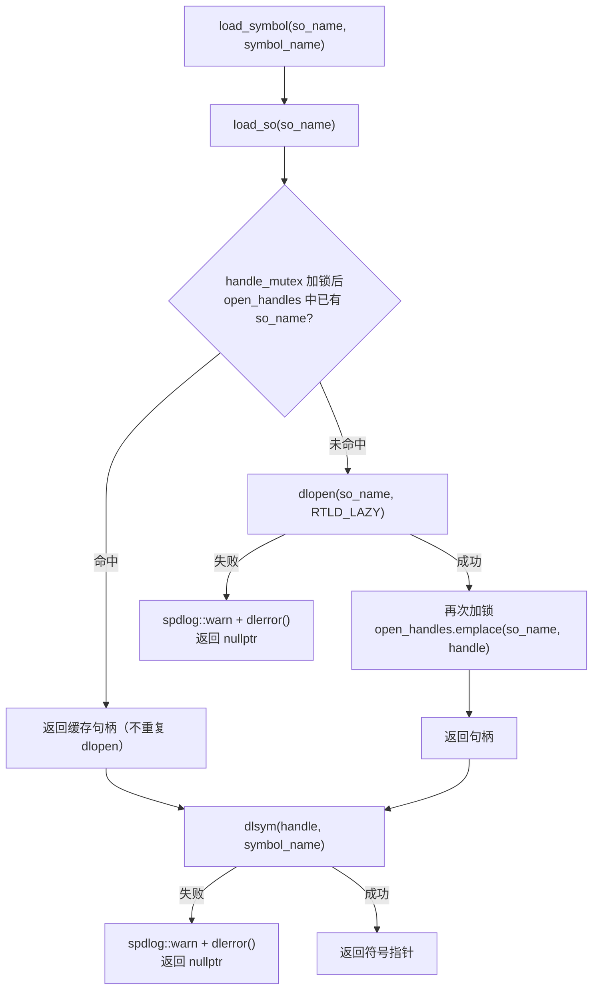

# dlopen 动态加载器与句柄注册表

## 模块职责

本页对应 `utility/load_module.{hpp,cpp}`，是整个仓库唯一的动态库加载通道。它只有两个公开函数加一个模板包装，却支撑起全部插件体系——五种里程计算法与所有扩展模块都要经过它进入进程：

- **`load_so(so_name)`**：`dlopen(RTLD_LAZY)` 的带缓存封装。先查进程级注册表，命中直接返回句柄；未命中才真正 `dlopen` 并登记。
- **`load_symbol(so_name, symbol_name)`**：先经 `load_so` 拿句柄，再 `dlsym` 取符号，失败时通过 spdlog 输出 `dlerror()` 并返回 `nullptr`。
- **`load_module_from_so<Module>(so_name, func_name)`**（头文件模板）：把 `load_symbol` 返回的指针强转为 `Module*(*)()` 工厂函数并调用，结果包成 `std::shared_ptr<Module>` 返回。

加载策略选用 `RTLD_LAZY`：函数符号延迟到首次调用时才绑定，加快装载速度。两个工厂入口分别固定了符号名：

| 调用方 | 符号名 | 来源 |
|---|---|---|
| `OdometryEstimation::load_module` | `create_odometry_estimation` | 各算法目录的 `create.cpp`，`extern "C"` 导出 |
| `ExtensionModule::load_module` | `create_extension_module` | 各扩展模块导出 |

以 fastlio 的 `create.cpp` 为例，整个插件契约就是 6 行：`extern "C"` 函数内 `new` 具体实现类并返回裸指针，其余（智能指针包装、句柄缓存、错误处理）全部由本模块统一承担。

## 关键状态

加载器的全部状态收敛在 `load_module.cpp` 的匿名命名空间中，属于进程级单例：

```cpp
std::mutex handle_mutex;                    // 保护注册表
std::map<std::string, void*> open_handles;  // so 名 → dlopen 句柄
```

两个语义要点（源码注释原文明确）：

1. **句柄只进不出、永不 `dlclose`**："Handles are intentionally never closed today: plugin code must stay resident for the lifetime of the process."。这是正确性前提而非偷懒——`load_module_from_so` 返回的 `shared_ptr` 所指对象，其虚表与方法代码都在 so 的代码段里；一旦句柄被关闭而实例仍存活，任何虚调用都会落到已卸载的内存上。
2. **注册表是未来卸载/重载的唯一接缝**："The registry is the seam for a future unload/reload implementation"。头文件还预先写明了尚未实现的卸载三步序（见下文扩展点）。

## 调用链



关键节点说明：

- **缓存检查与登记是两段独立加锁**：先在锁内查缓存，出锁后再 `dlopen`，成功后回锁内 `emplace`。两次加锁之间允许其他线程插入，但 `std::map::emplace` 对已存在的 key 是无操作，且 `dlopen` 对同一库本身幂等，因此注册表不会出现覆盖或不一致。
- **两条失败路径都只 warn 不抛异常**：加载器层面把"是否致命"的决定权上交给调用方。

上游链路（以里程计为例）：

```mermaid
sequenceDiagram
    participant R as AsukaROS 构造函数
    participant F as OdometryEstimation::load_module
    participant T as load_module_from_so
    participant L as load_symbol / load_so
    participant G as open_handles 注册表
    participant D as dlopen / dlsym
    R->>F: so_name（读自 config_odometry）
    F->>T: (so_name, "create_odometry_estimation")
    T->>L: load_symbol
    L->>G: 查缓存
    alt 未命中
        L->>D: dlopen(RTLD_LAZY)
        D-->>L: handle
        L->>G: emplace(so_name, handle)
    end
    L->>D: dlsym(handle, "create_odometry_estimation")
    D-->>L: extern "C" 工厂指针
    L-->>T: func
    T->>T: func() 内部 new 具体算法类
    T-->>R: shared_ptr&lt;OdometryEstimation&gt;
```

扩展模块链路完全同构：`AsukaROS::load_extensions` 读 `config_extensions` 的 `loading_extension_modules` 列表，逐个调 `ExtensionModule::load_module`（符号名换为 `create_extension_module`），成功的压入 `extension_modules`。同一进程内重复加载同名 so 时，第二次调用在注册表处短路，直接复用句柄——这也是五种算法与扩展混用时符号不会重复初始化的保障。

## 主要文件

- `src/asuka/src/asuka/utility/load_module.cpp`（1.4KB / 61 行）：实现本体，注册表、`load_so`、`load_symbol` 全部在此。
- `src/asuka/include/asuka/utility/load_module.hpp`（1KB / 31 行）：API 声明、缓存/所有权契约注释、未实现的卸载三步序，以及 `load_module_from_so` 模板。
- 消费方（理解调用面用）：`core/odometry_estimation.cpp`（11 行）、`utility/extension_module.cpp`（12 行）、各算法的 `create.cpp`（约 180 字节）、`asuka_ros.cpp` 的构造函数与 `load_extensions`。

## 边界条件

- **加载失败的两种结局由调用方决定**：里程计 so 加载失败时，`AsukaROS` 构造函数直接 `throw std::runtime_error`，进程拒绝启动；扩展模块失败则仅跳过，不阻断主链路。加载器本身始终温和返回 `nullptr`。
- **`RTLD_LAZY` 把符号错误推迟到调用点**：`dlopen` 成功不代表 so 内所有函数符号可解析；缺失的函数符号会在首次调用时才暴露，`dlerror` 无法在装载期提前拦截。这是速度换稳定性的一个固有风险。
- **无类型检查的强转**：`load_module_from_so` 把 `dlsym` 结果盲目转成 `Module*(*)()`，若 so 导出了同名但签名不同的符号，行为未定义。防线只有约定：插件侧必须以 `extern "C"` 按精确名字导出工厂函数。
- **注册表键是原始配置字符串**：若同一 so 以不同路径字符串被加载，注册表会出现多个条目（动态链接器底层仍会复用同一文件句柄，功能无害但注册表语义被稀释）。
- **并发首次加载**：缓存检查与 `dlopen` 不在同一临界区内，两个线程可能同时未命中而并发 `dlopen`；POSIX 保证 `dlopen` 线程安全且同一库返回相同句柄，加之 `emplace` 不覆盖，结果仍一致——这是"检查不完整但正确"的典型案例。

## 扩展点：卸载/重载的接缝

头文件以注释形式预先规定了尚未实现的卸载顺序：

1. 停掉所有可能触发 callback slot 发射的线程（即 AsukaROS 的拆除顺序）；
2. 销毁模块，使其从 callback slot 退订；
3. 从注册表取走句柄，`dlclose()` 并删除条目。

对照现有代码，前两步已经落地——`AsukaROS` 析构严格按 `async->stop()` → 各扩展 `stop()` → `at_exit(map_saving_path)` 执行，保证没有在途回调后模块才退订、析构；真正缺失的只有第 3 步，而 `open_handles` 的存在正是为了让这一步"取句柄再关闭"有处可寻。若未来要支持算法热重载，改动点也收敛在同一张表：删条目、`dlclose`、重新 `load_so` 即可得到全新代码段。

## 稳定性与扩展性风险边界

本模块体现了典型的取舍：**"永不关闭"是把双刃剑**。一方面它保证插件对象整个生命周期内代码段有效，是所有 `shared_ptr<Module>` 安全存在的隐式前提；另一方面符号表与映射内存只增不减，进程无法回收任何插件，也无法在运行期替换算法实现。叠加 `RTLD_LAZY` 的延迟绑定和未检查的函数指针强转，这里构成全仓库稳定性上最敏感、同时又是扩展性上最关键的接缝——阅读任何涉及插件生命周期的改动（尤其是析构顺序与回调退订）时，都应回到这 61 行实现来核对前提是否仍然成立。

Sources: `src/asuka/src/asuka/utility/load_module.cpp#L1-L61` `src/asuka/include/asuka/utility/load_module.hpp#L1-L31` `src/asuka/src/asuka/core/odometry_estimation.cpp#L1-L11` `src/asuka/src/asuka/utility/extension_module.cpp#L1-L12` `src/asuka/src/asuka/odometry/fastlio/create.cpp#L1-L6` `src/asuka/src/asuka/asuka_ros.cpp#L19-L57` `src/asuka/src/asuka/asuka_ros.cpp#L157-L169`

## 关联源码

- `src/asuka/src/asuka/utility/load_module.cpp`
- `src/asuka/include/asuka/utility/load_module.hpp`
