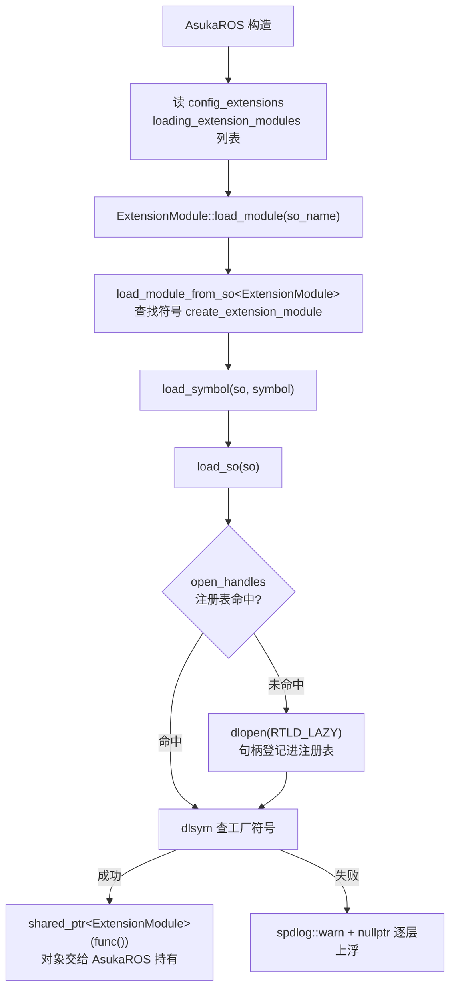
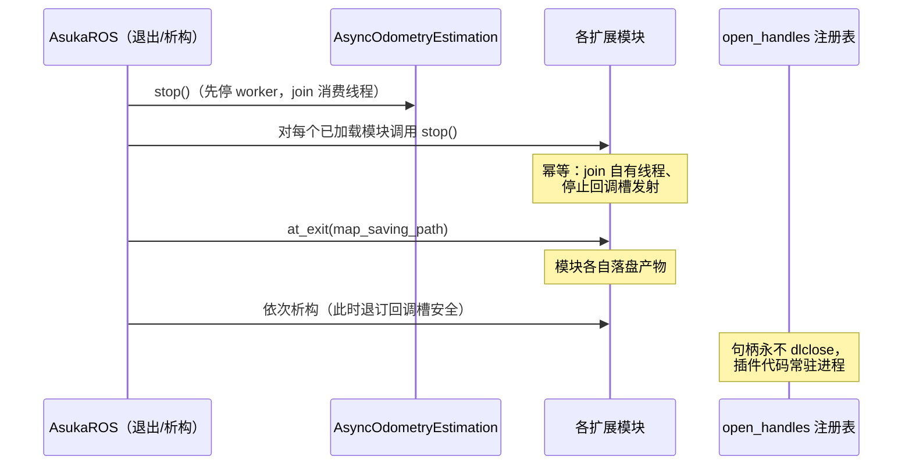

# 扩展模块机制 ExtensionModule

## 职责定位

`ExtensionModule` 是 asuka 中"扩展插件"的抽象基类，与里程计插件基类 `OdometryEstimation` 完全同构：同样以 `static load_module` 为唯一装载入口，同样通过 dlopen 打开 so 并调用其导出的 extern C 工厂函数。差别在契约面——里程计基类定义数据处理接口（insert_imu / process_once / save_map 等），而 `ExtensionModule` 只约定两个生命周期钩子：`stop()` 与 `at_exit(dump_path)`。扩展模块的具体功能（点面优化、图优化、可视化等）不直接进入数据主链路，而是通过全局回调槽（CallbackSlot）被动接入。

加载集合由配置驱动：AsukaROS 构造时读取 config_extensions 的 `loading_extension_modules` 列表，对其中每个 so 名调用一次 `load_module`；仓库内已知实现位于 `src/asuka/src/asuka/modules/`（imu_prediction、optimization_loam、optimization_miao、rviz_viewer）。

## 契约面：两个虚函数 + 一个静态工厂

`extension_module.hpp` 全文仅 26 行，包含三件事：

- **`virtual void at_exit(const std::string& dump_path) {}`** — 进程退出钩子，默认空实现。AsukaROS 退出时把 config_ros 的 `map_saving_path` 传入，模块据此把各自的产物（轨迹、位姿图等）落到与地图相同的目录。
- **`virtual void stop() {}`** — 停机钩子，默认空实现。头文件注释给出明确契约：join 模块拥有的所有线程、停止其回调槽发射；**必须幂等，且允许从析构函数中被再次调用**。
- **`static std::shared_ptr<ExtensionModule> load_module(const std::string& so_name)`** — 工厂入口。

注释同时揭示了一个跨模块停机协议：AsukaROS 在销毁**任何**模块之前，先对**所有**已加载模块调用 `stop()`。`stop()` 返回后不再有 in-flight 的槽发射，此时模块从回调槽退订并析构才是安全的——这是与 CallbackSlot 解耦机制配套的竞态防护设计。

## 加载调用链

`extension_module.cpp` 全文 308 字节，核心只有一行：

```cpp
return load_module_from_so<ExtensionModule>(so_name, "create_extension_module");
```

完整链路落在共享的 `load_module.hpp/cpp` 中：



关键节点：

- **open_handles 命中判断**：同一 so 若被里程计插件与扩展模块同时依赖，只会 dlopen 一次，注册表按库名进程级去重。
- **create_extension_module**：扩展插件必须导出的 extern C 工厂符号，与里程计侧的 `create_odometry_estimation` 平行。
- **失败路径**：dlopen/dlsym 失败均只 `spdlog::warn`（附 dlerror）并返回 nullptr，不抛异常；是否容忍某个模块缺失由 AsukaROS 决策。

## 退出与停机时序



顺序依据（头文件注释与仓库停机约定一致）：先停 odometry worker，再停扩展模块，最后 `at_exit`，之后才析构模块对象。`load_module.hpp` 注释还描述了**尚未实现**的完整卸载三步：① stop 所有可能发射回调槽的线程；② 析构模块使其退订回调槽；③ 从注册表取句柄、`dlclose()` 并删除条目。当前实现只做到前两步，第三步被刻意搁置。

## 关键状态：句柄注册表

`load_module.cpp` 匿名命名空间中的两个静态变量是本机制的核心状态：

- `std::mutex handle_mutex` + `std::map<std::string, void*> open_handles` — 进程级、按 so 名索引的 dlopen 句柄表。
- 句柄"intentionally never closed"：插件代码（vtable、静态数据）必须常驻进程——若析构模块后 dlclose，悬垂的虚表指针会立刻致命。注释明确该注册表是未来 unload/reload 实现的接缝，属于稳定性风险边界。

一个实现细节：`load_so` 在"查表 → dlopen → 登记"之间存在无锁窗口，两线程可能并发打开同一库；由于 dlopen 对同一库本身是引用计数、幂等的（POSIX 语义），该窗口是良性的。

## 边界条件

- **so 缺失 / 依赖缺失**：dlopen 返回 nullptr，warn 输出 so 名与 dlerror()，链路上浮 nullptr。
- **工厂符号缺失**：dlsym 返回 nullptr，warn 后同样上浮 nullptr。
- **RTLD_LAZY 的副作用**：函数符号延迟到首次调用才解析，部分符号问题不会在加载期暴露，排查插件故障时需注意。
- **钩子可选**：`at_exit`/`stop` 均有空默认实现，模块可按需只覆写其一；虚析构保证经 `shared_ptr<ExtensionModule>` 销毁时行为正确。
- **stop 幂等的现实来源**：正常退出路径调用一次，析构兜底路径可能再调用一次，契约要求两次调用都安全。

## 扩展点：新增一个扩展模块

1. 编写继承 `asuka::ExtensionModule` 的类，按需覆写 `stop()` / `at_exit()`；
2. 导出 `extern "C"` 工厂 `create_extension_module`（与 `create_odometry_estimation` 同构）；
3. 编译为 .so，将库名加入 config_extensions.json 的 `loading_extension_modules`；
4. 通过全局回调槽订阅/发布事件接入主链路，避免对 AsukaROS 或具体算法的反向依赖。

## 与 OdometryEstimation 的同构与差异

| 维度 | OdometryEstimation | ExtensionModule |
| --- | --- | --- |
| 装载入口 | `static load_module` | `static load_module` |
| 底层设施 | `load_module_from_so` 模板 | 同一模板 |
| 工厂符号 | `create_odometry_estimation` | `create_extension_module` |
| 契约面 | 数据处理（insert / process_once / save_map…） | 生命周期（stop / at_exit） |
| 与主链路关系 | 被 AsyncOdometryEstimation 驱动 | 经回调槽被动接入 |

两者共享 `load_so`/`load_symbol` 与句柄注册表，因此"句柄永不关闭、插件代码常驻进程"的约束同时覆盖算法插件与扩展插件；未来任何卸载/重载改造也必须同时处理两类模块。

Sources:
- `src/asuka/include/asuka/utility/extension_module.hpp#L1-L26`
- `src/asuka/src/asuka/utility/extension_module.cpp#L1-L12`
- `src/asuka/include/asuka/utility/load_module.hpp#L1-L31`
- `src/asuka/src/asuka/utility/load_module.cpp#L1-L61`

## 关联源码

- `src/asuka/src/asuka/utility/extension_module.cpp`
- `src/asuka/include/asuka/utility/extension_module.hpp`
