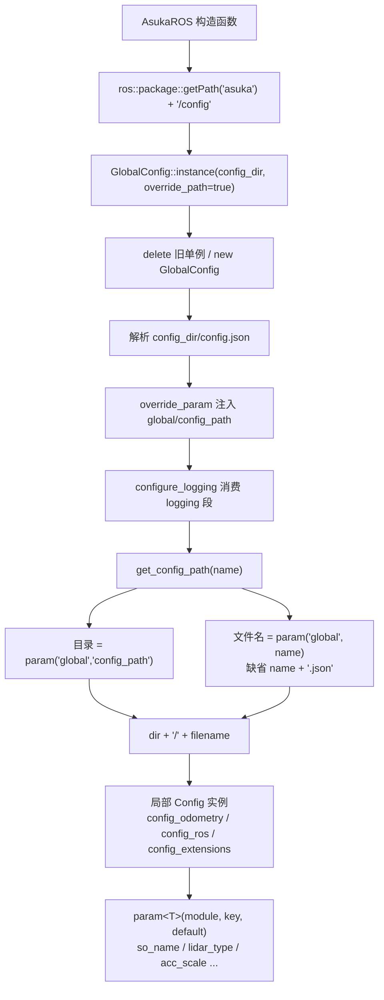

# 配置系统与 JSON 读取

## 模块职责与文件分层

配置系统由三个文件协作完成，分层非常清晰：

| 文件 | 职责 |
|---|---|
| `utility/config.hpp` | 对外接口。声明 `Config` 基类与 `GlobalConfig` 单例；所有模板访问接口**只有声明**。用 `std::any config` 擦除 JSON 类型，使头文件不暴露 `nlohmann::json` |
| `utility/config_impl.hpp` | 模板实现载体。包含 `ConfigTraits` 类型转换特质与 `param<T>` 系列模板的定义，并用 `ASUKA_DEFINE_CONFIG_IO` 宏对常用类型显式实例化 |
| `utility/config.cpp` | 非模板部分：JSON 文件解析、`has`/`has_param`/`save`、14 个类型的显式实例化声明，以及单例与配置路径解析逻辑 |

由于模板定义在 `config_impl.hpp` 而非 `config.hpp`，使用方若要调用 `param<T>` 必须显式包含实现头——`asuka_ros.cpp` 就同时 include 了两份。

## 配置的形状与加载

JSON 采用**两层结构**：顶层按模块名分组，每个模块下是键值对，即 `{module: {param: value}}`。`config.json` 作为顶层入口，其 `global` 段登记各子配置文件的文件名（`config_ros`、`config_sensor`、`config_odometry`、`config_extensions`），`logging` 段则由 `configure_logging()` 消费。

`Config` 构造函数（config.cpp L17-L35）的加载行为：

- **文件名为空**：直接持有空 JSON（纯内存配置）；
- **打开失败**：`spdlog::error` 后继续，得到空 JSON——所有后续 `param` 都会走默认值分支，进程不崩溃；
- **解析异常**：捕获 `nlohmann::json::exception` 并记录错误。`parse(ifs, nullptr, true, true)` 的两个 `true` 表示允许抛异常、忽略注释，因此配置文件中可以写注释。

## 类型化访问接口与三级失败策略

`param<T>` 的实现路径是：`any_cast` 取回 JSON → 逐层 `find(module_name)`、`find(param_name)` → 用 `ConfigTraits<T>::convert(parameter->get<InType>())` 完成类型转换。同一读取能力提供三种失败语义：

| 接口 | 参数缺失时 | 日志 |
|---|---|---|
| `param<T>(module, key)` 返回 `optional<T>` | `nullopt` | 无 |
| `param<T>(module, key, default)` | 返回默认值 | `warn` |
| `param_cast<T>(module, key)` | `std::abort()` 终止进程 | `critical` |

`param_nested` 系列支持深层嵌套：按 `nested_module_names` 顺序逐层下钻，任一层缺失即返回 `nullopt`（空列表同样返回 `nullopt`）。`override_param` 则反向写入：`json[module][param] = ConfigTraits<T>::invert(value)`，恒返回 `true`，用于运行时改写内存中的配置。`save` 以 `setw(2)` 缩进落盘；`GlobalConfig::dump` 先 `create_directories` 再保存 `config.json`。

## ConfigTraits：JSON 数组到 Eigen 的桥

匿名命名空间中的特质模板定义了"JSON 中怎么存、C++ 里怎么取"的约定：

- **主模板**：`InType = OutType = T`，直通转换；
- **`Eigen::Matrix<T,N,M>`**：JSON 侧是 `vector<double>`，长度必须等于 `N*M` 否则 `nullopt`；列向量（M==1）直接 `Map`，一般矩阵按 **RowMajor** 读入与写出；
- **`Quaternion<T>`**：4 个 double，读入后自动 `normalized()`，序列化顺序为 `x,y,z,w`；
- **`Isometry3d`**：7 个 double，格式 `[tx,ty,tz,qx,qy,qz,qw]`，四元数归一化后转旋转矩阵；`invert` 反向分解为平移 + 四元数。

## GlobalConfig 单例与路径解析链

`GlobalConfig` 继承 `Config`，构造函数私有，通过静态 `inst` 指针维护单例（config.cpp L72-L81）。`instance(config_path, override_path)` 在 `inst == nullptr || override_path` 时执行 `delete inst; new GlobalConfig(config_path + "/config.json")`，随后把目录注入 JSON（`override_param("global", "config_path", config_path)`）并调用 `configure_logging()`。

`get_config_path(config_name)` 是两段式解析：目录取自 `global/config_path`（缺省 `"."`），文件名取自 `global/<config_name>`（缺省 `config_name + ".json"`），二者用 `/` 拼接。由于只是字符串拼接，文件名可以携带子目录——`config.json` 中 `config_odometry` 指向 `odometry/config_fastlio.json` 就是靠这一点生效。

## 调用链示例

`AsukaROS` 构造函数（asuka_ros.cpp L19-L43）是标准用法样本：先定位包内 config 目录并引导单例，再为每个子系统构造**独立的局部 `Config` 实例**读取参数：

关键节点说明：**引导**（A→E）只用一次 `ros::package::getPath` 定位包内目录；**注入**（F）把目录写进单例内存，之后所有 `get_config_path` 无需再传路径；**两段拼接**（I/J→K）让"换哪个文件"成为纯数据改动——切换里程计实现只需修改 `global.config_odometry` 的值；**局部 Config**（L）各自持有独立 JSON，与单例解耦。

## 边界条件

- 空文件名 / 打不开 / 解析失败均**降级为空 JSON**，不会让构造函数抛异常，但所有参数回落默认值；
- 三种失败策略严格区分：缺失是常态（warn + 默认），`param_cast` 缺失视为致命（abort）；但**类型不匹配**（如数字位置放了字符串）会由 `get<InType>()` 抛 nlohmann 异常，接口层未捕获；
- Eigen 转换有尺寸校验（N*M / 4 / 7），不符返回 `nullopt` 走缺失路径；
- `instance(..., override_path=true)` 会销毁并重建单例，此前持有的 `GlobalConfig*` 全部失效（裸 `new`/`delete`）；
- 四元数读取自动归一化，写入时按 `x,y,z,w` 平铺。

## 扩展点

- **新参数类型**：为 `ConfigTraits<T>` 添加 `InType/OutType/convert/invert` 特化，并在 config.cpp 追加一行 `ASUKA_DEFINE_CONFIG_IO(新类型)` 完成预实例化（当前覆盖 bool/int/size_t/float/double/string、三种 vector、Vector3d/Vector4d/Matrix3d/Quaterniond/Isometry3d）；
- **派生配置类**：`Config` 提供虚析构与 `protected std::any config`，子类可复用整套模板接口并定制存储；
- **运行时改写**：`override_param` + `save`/`dump` 可把程序内计算的值固化回磁盘；
- 与上游消费方的衔接：`get_config_path` 的四个名字正好对应 `config.json` 的 `global` 段，ROS 层、扩展模块加载与各算法子配置都经由本页接口取参。

Sources: `src/asuka/src/asuka/utility/config.cpp#L1` `src/asuka/include/asuka/utility/config.hpp#L1` `src/asuka/include/asuka/utility/config_impl.hpp#L1`

## 关联源码

- `src/asuka/src/asuka/utility/config.cpp`
- `src/asuka/include/asuka/utility/config.hpp`
- `src/asuka/include/asuka/utility/config_impl.hpp`
