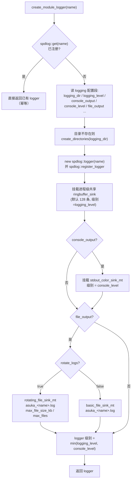

# 日志系统

## 模块职责

日志系统是 `asuka` 包里最薄的一层公共设施，全部实现集中在两个文件：

- 接口：`src/asuka/include/asuka/utility/logging.hpp`（708 B，仅 27 行）
- 实现：`src/asuka/src/asuka/utility/logging.cpp`（4677 B，129 行）

它基于 spdlog 提供四件事：

1. **模块化命名 logger**：`create_module_logger(module_name)` 为每个调用方（ROS 封装、算法插件、扩展模块）创建/复用一个以模块名注册的 spdlog logger，是全仓库统一的日志入口；
2. **统一输出通道装配**：每个模块 logger 默认挂三类 sink——进程级共享的 **ringbuffer_sink**、可选的**彩色控制台 sink**、可选的**滚动/普通文件 sink**；
3. **级别控制**：`log_level_from_string` 把配置字符串映射为 spdlog 级别，`configure_logging` 在启动阶段对全局及所有已注册 logger 做一次级别广播；
4. **默认 logger 的存取**：`get/set_default_logger` 直接转发到 spdlog 的默认 logger，允许整体替换。

## 配置契约

所有行为由 `config.json` 顶层 `logging` 段驱动（经 GlobalConfig 的 `param<T>` 读取，与配置系统共用一套访问方式）：

| 配置键 | 代码默认值 | 作用 |
|---|---|---|
| `logging_level` | `"info"` | 基础级别，作用于全局、ringbuffer sink 与文件 sink |
| `console_output` | `true` | 是否为模块 logger 挂控制台 sink |
| `console_level` | `"info"` | 控制台 sink 的独立级别，可与 `logging_level` 不同 |
| `file_output` | `true` | 是否写文件 |
| `rotate_logs` | `true` | `true` 用 rotating_file_sink，`false` 用 basic_file_sink |
| `max_file_size_kb` | `8192` | 单文件上限（KB） |
| `max_files` | `10` | 滚动保留份数 |
| `logging_dir` | `"/tmp"` | 日志目录，不存在则递归创建 |

仓库当前实际配置（`config/config.json#L8-L17`）全部启用，目录指向 `/share/pilot_ws/src/asuka/logs`，级别均为 `info`，8 MB × 10 份滚动。

## create_module_logger 装配流程

这是整个模块的核心函数（logging.cpp#L68-L126），一次调用完成"查缓存 → 读配置 → 建 sink → 定级别"：

关键节点说明：

- **`spdlog::get(name)` 缓存命中**（L69-L72）：同名模块重复构造（例如扩展模块被多次实例化）不会重复建 sink，直接返回注册表里的既有实例；
- **文件名特例**（L76）：模块名为 `"asuka"` 时文件名取 `"main"`，其余直接用模块名，最终落盘为 `<logging_dir>/asuka_<name>.log`（如 `asuka_ros.log`、`asuka_rviz.log`）；
- **共享 ringbuffer sink**（L91-L93）：`get_ringbuffer_sink` 是进程级单例（匿名命名空间静态变量，L18-L20），所有模块 logger 共享同一个内存环形缓冲，首调用以默认 128 条容量创建，之后传入的 `buffer_size` 被忽略；该函数在公开头文件中导出，为外部（如崩溃处理）读取最近日志预留了接缝；
- **双层级别过滤**：每个 sink 各自带级别，logger 自身级别取 `min(logging_level, console_level)`（L119-L123）。效果是：低于 `logging_level` 的消息任何 sink 都收不到；控制台额外受 `console_level` 约束。例如 `logging_level=info, console_level=debug` 时，debug 消息只上屏、不进文件与环形缓冲。

`configure_logging`（L44-L66）是另一条独立的初始化路径：读一次 `logging_level` 后通过 `spdlog::set_level` + `apply_all` 广播到所有已注册 logger；若 `console_output=false`，则用 `dynamic_cast` 识别并从**默认 logger** 的 sink 列表中剔除 stdout sink（同时检查 `_mt` 与 `_st` 两种）。

## 使用方与调用链

证据中可见的两类调用方：

- **ROS 封装层**：`AsukaROS` 构造函数第二件事就是 `logger = create_module_logger("ros")`（asuka_ros.cpp#L23），随后所有关键路径都经由它输出——IMU/雷达时间回环告警（`logger->warn("lidar/imu loop back detected...")`，L174、L179）、地图保存结果（`logger->info("saved map...")` 与 `logger->warn("failed to save map...")`，L150、L152）；
- **扩展模块**：`RvizViewer` 构造函数同样以 `create_module_logger("rviz")` 获得自己的输出通道（rviz_viewer.cpp#L10）。

按页面定位，五种里程计算法插件与其它扩展模块共用同一入口——任何模块只要在构造期调用 `create_module_logger("<自己的名字>")`，即可自动获得"环形缓冲 + 可选控制台 + 可选滚动文件"的完整通道，无需各自管理文件句柄或级别。

## 关键状态

- **spdlog 全局注册表**：`create_module_logger` 的幂等性完全依赖 `spdlog::get/register_logger`，注册表内没有的 logger 才会新建；
- **进程级 ringbuffer 单例**：匿名命名空间内的静态 `shared_ptr`，生命周期与进程一致；
- **配置快照**：logger 的 sink 组合与级别在**首次创建时**从 GlobalConfig 读定，之后 `create_module_logger` 再次被调用只会返回缓存，不会重读配置。

## 边界条件与风险

- **级别字符串容错**：`log_level_from_string` 做小写归一后匹配 `trace/debug/info/warn|warning/error/critical/off`，未知字符串**静默回退为 info**，配置拼写错误不会有任何提示；
- **ringbuffer 惰性初始化无锁**：`get_ringbuffer_sink` 的 `if (!ringbuffer_sink)` 检查没有互斥保护，多线程同时首次调用存在理论竞争；实际使用中各模块通常在主线程构造期串行创建 logger，风险不触发；
- **`console_output=false` 的作用范围有限**：`configure_logging` 只摘除**默认 logger** 上的 stdout sink；已通过 `create_module_logger` 创建的模块 logger 若此前挂了控制台 sink，不会被这次清理触及（新创建的模块 logger 则因读到 `console_output=false` 自然不带控制台）；
- **日志目录可写性**：`logging_dir` 不存在会自动 `create_directories`，但挂载点只读或磁盘满时文件 sink 构造会抛异常，代码未在此处兜底；
- **文件名前缀固定 `asuka_`**：多进程若共用同一 `logging_dir` 会写同名文件，滚动 sink 并发写同一文件属未定义行为，部署时需隔离目录。

## 扩展点

- **新 sink 类型**：`create_module_logger` 是唯一的 sink 装配点，接入网络/远程 sink 只需在此追加分支，调用方零改动；
- **崩溃日志导出**：`get_ringbuffer_sink` 公开导出且全模块共享，天然的"最近 N 条日志"内存快照，可被终止处理函数读取落盘；
- **按模块分级**：当前 `logging_level` 全局生效，若需按模块控制级别，可在 `create_module_logger` 内增加 `<module>_level` 之类的配置键读取，接口形态无需变化。

Sources:
- `src/asuka/include/asuka/utility/logging.hpp#L1-L27`
- `src/asuka/src/asuka/utility/logging.cpp#L1-L129`
- `src/asuka/config/config.json#L1-L18`
- `src/asuka/src/asuka/asuka_ros.cpp#L19-L43`
- `src/asuka/src/asuka/asuka_ros.cpp#L118-L183`
- `src/asuka/src/asuka/modules/rviz_viewer.cpp#L9-L35`

## 关联源码

- `src/asuka/src/asuka/utility/logging.cpp`
- `src/asuka/include/asuka/utility/logging.hpp`
