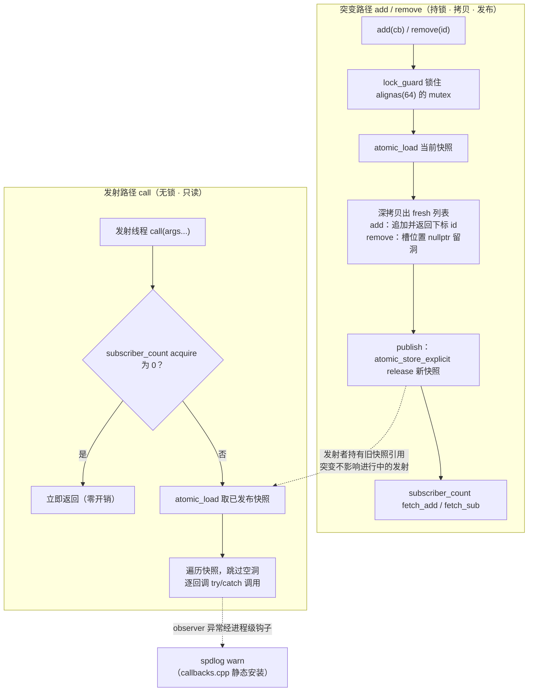
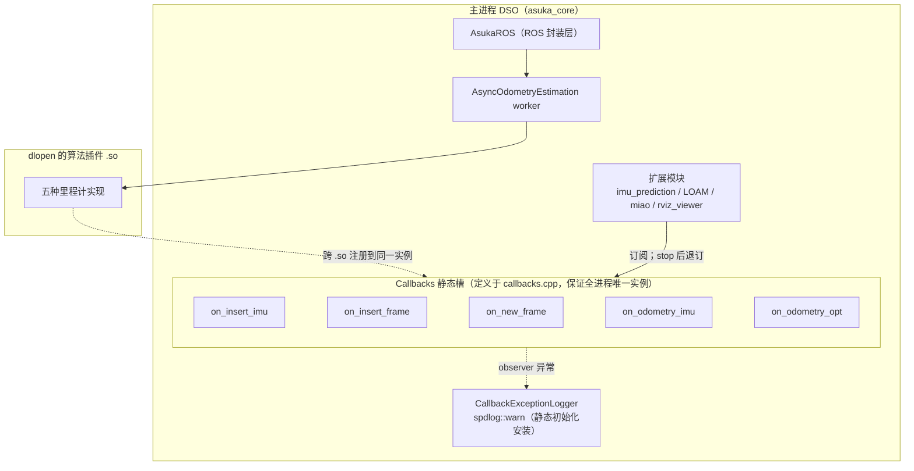

# 回调槽 CallbackSlot

## 模块定位与职责

`utility/callback_slot.hpp`（8.3KB，227 行）定义了 `asuka::CallbackSlot<Func>` —— 一个**支持运行期增删、为高频发射调优的多播回调槽**。它是整个 asuka 框架中模块间事件通信的中枢原语：与 `OdometryEstimation` 插件接口构成的"数据面"不同，CallbackSlot 承担的是"事件面"——ROS 层、异步执行器、算法插件与扩展模块通过它彼此解耦，互相不需要持有对方指针。

围绕它有两个直接配套文件：

- `core/callbacks.hpp`：声明全局回调面 `asuka::Callbacks`，聚合 5 个静态槽；
- `core/callbacks.cpp`：在 asuka_core 的翻译单元中**定义**这 5 个槽（原因见下文跨 .so 约束），并通过静态初始化器安装 spdlog 版异常钩子。

## 头文件结构：异常钩子 + 槽模板

头文件前半部分是进程级异常处理机制，与模板类完全解耦：

- `CallbackExceptionHandler` 是普通函数指针 `void(*)(std::exception_ptr) noexcept`。刻意不用 `std::function`，使这个模板头不拖入任何日志框架；asuka_core 通过 `set_callback_exception_handler()` 安装 spdlog 版实现；
- 钩子存放在函数级静态 `std::atomic`（`detail::callback_exception_sink()`）中，写入用 release、读取用 acquire；
- `report_callback_exception()` 由发射线程的 `catch(...)` 调用，其自身又被 try/catch 包裹——即使被安装的 logger 本身行为异常再抛异常，也只会被吞掉，**绝不会终止发射线程**；
- 默认钩子为 `nullptr`，即观察者抛出的异常被静默吞掉。

## 核心数据结构：写时复制快照

```cpp
std::shared_ptr<const CallbackList> snapshot;      // 不可变回调列表快照
std::atomic<std::size_t> subscriber_count{0};      // 发射快速短路计数
alignas(64) mutable std::mutex mutex;              // 仅串行化突变
```

设计的核心是**读写双路径分离**：

- **发射路径无锁**：`call()` 只做一次 `atomic_load` 读当前已发布快照，无互斥锁、无内存分配、无 `std::function` 拷贝，逐个原地解引用调用；
- **突变路径持锁**：`add/remove` 在内部 mutex 上串行，拷贝快照、施加变更、再原子发布新快照。正在发射的线程因持有旧快照的 `shared_ptr`，旧快照在其调用期间保持存活，互不干扰；
- **缓存行隔离**：`alignas(64)` 让 mutex 独占一条缓存行——突变时写 mutex，发射时热读 snapshot 与 subscriber_count，避免两条路径间的伪共享；
- 槽**不可拷贝、不可移动**（四个特殊成员函数全部 delete），保证静态槽的地址稳定，可作为跨模块身份。



图中关键节点：**E（publish）** 是读写两路径的唯一交汇点，release 发布保证新列表在读者 acquire 读到之前完全构造；**I** 说明旧快照不会立刻析构——发射者还握着 `shared_ptr`；**K** 对应默认吞掉或 spdlog 告警两种结局。

## 发射路径 `call()` 的两个防线

1. **编译期右值防护（static_assert）**：实参要么是左值引用、要么是 trivially copyable 的按值类型。因为同一实参被转发给**每一个**观察者——非平凡右值会在第一个观察者处被 move-from，其余观察者看到残缺状态；trivially copyable 类型 move == copy 才安全。非平凡结构体必须传左值。
2. **逐回调异常隔离**：循环内 `try { cb(...) } catch (...) { report_callback_exception(); }`，一个坏掉的观察者既不中断后续观察者，也不打断发射线程（例如 odometry worker）。

另有快速短路：`subscriber_count == 0` 时一次 acquire 读即返回；快照为空（从未 add 过）同样直接返回。`operator()` 是 `call` 的运算符形式，`explicit operator bool` 基于订阅计数。

**重入语义**：每次发射在入口锁定的快照上进行——回调内部 add/remove 订阅、或递归 emit 同一槽，只影响**后续**发射，绝不影响正在进行的一次。

## 突变路径与稳定 ID

- `add` 返回追加位置的 vector 下标作为**稳定 ID**；
- `remove(id)` 对负 ID、越界、已置空的槽位一律静默无操作（no-op），否则置 `nullptr` **留洞**——ID 永不复用，持有 ID 的一方无需担心失效后误删他人；
- 典型生命周期：模块构造时 `Callbacks::on_xxx.add(...)` 记下返回的 id；`stop()/at_exit` 时用该 id `remove(id)` 退订。

## 全局回调面 Callbacks 与跨 .so 约束

`Callbacks` 声明了 5 个静态槽，构成全框架的事件总线：

| 槽 | 签名（自 callbacks.hpp） | 推断的事件语义 |
|---|---|---|
| `on_insert_imu` | `void(const ImuData::ConstPtr&)` | IMU 数据进入 |
| `on_insert_frame` | `void(double, const PointCloudT::ConstPtr&)` | 点云帧进入 |
| `on_new_frame` | `void(const KeyFrame::ConstPtr&)` | 新关键帧产生 |
| `on_odometry_imu` | `void(const KeyFrame::ConstPtr&)` | IMU 前向传播结果 |
| `on_odometry_opt` | `void(const KeyFrame::ConstPtr&)` | 优化后位姿结果 |

（各槽的具体发射方/订阅方需到各模块源码确认，但命名已清晰刻画了数据链路上的生命周期锚点。）



图中两条架构级约束（头文件注释明示）：

1. **跨 .so 共享的静态槽必须定义在 asuka_core 的 .cpp 中**（callbacks.cpp 正是这么做的），绝不能是头文件里的 `inline`/静态成员——否则每个动态库各自持有一份槽实例，**插件注册的回调会静默消失**。异常钩子同理：必须从主 DSO 安装，插件才能共享同一个 spdlog sink。
2. **编译策略一致性**：libstdc++ 的 `shared_ptr` 原子自由函数只有在启用 `-mcx16`（cmpxchg16b）时才走无锁路径。所有包含此头的 TU 必须采用同一编译策略，否则无锁读者与持锁写者会在同一进程内共享同一个 `shared_ptr` 对象——未定义行为。

异常钩子的安装由 callbacks.cpp 中的静态初始化器 `g_callback_exception_logger` 完成：rethrow `exception_ptr` 后按异常类型输出 `spdlog::warn("[callbacks] observer exception: ...")`。

## 与停机时序的配合

`asuka_ros.cpp` 析构函数的注释直接印证了槽的使用方式：先 `async->stop()` 停 odometry worker，再逐个停扩展模块——**所有 stop() 返回后不再有进行中的槽发射**，此后模块才能安全地退订并析构，不会与发射者产生竞争。这是 CallbackSlot 无锁发射语义在销毁时序上的镜像要求：发射方先于退订方终止。

## 边界条件清单

| 场景 | 行为 |
|---|---|
| `remove` 传入负 id / 越界 / 已是空洞 | 静默 no-op |
| `call` 时无订阅者 | 计数短路，立即返回 |
| 快照从未初始化（无任何 add） | 返回 |
| 观察者抛异常 | 逐回调捕获；默认吞掉，或经钩子告警；钩子自身抛异常也被吞 |
| `call` 传入非平凡右值实参 | 编译期 static_assert 报错 |
| 静态槽定义在头文件 / 钩子安装位置错误 | 每个 .so 一份实例，插件注册静默丢失（架构级陷阱） |
| 各 TU 的 `-mcx16` 不一致 | shared_ptr 原子操作 UB（编译级陷阱） |

## 扩展点

- **新增事件**：在 `Callbacks` 中添加新的 `static CallbackSlot<签名>` 成员，并在 callbacks.cpp 中给出定义即可接入事件总线；
- **替换异常策略**：`set_callback_exception_handler()` 可安装自定义钩子（须保持 `noexcept`），默认行为是静默吞掉；
- **泛型复用**：`CallbackSlot<Func>` 对任意可调用签名开放，不局限于 `Callbacks` 中的五个槽——扩展模块内部也可自建私有槽实现局部解耦。

Sources:
- `src/asuka/include/asuka/utility/callback_slot.hpp#L1-L227`
- `src/asuka/include/asuka/core/callbacks.hpp#L1-L17`
- `src/asuka/src/asuka/core/callbacks.cpp#L1-L34`
- `src/asuka/src/asuka/asuka_ros.cpp#L1-L120`

## 关联源码

- `src/asuka/include/asuka/utility/callback_slot.hpp`
