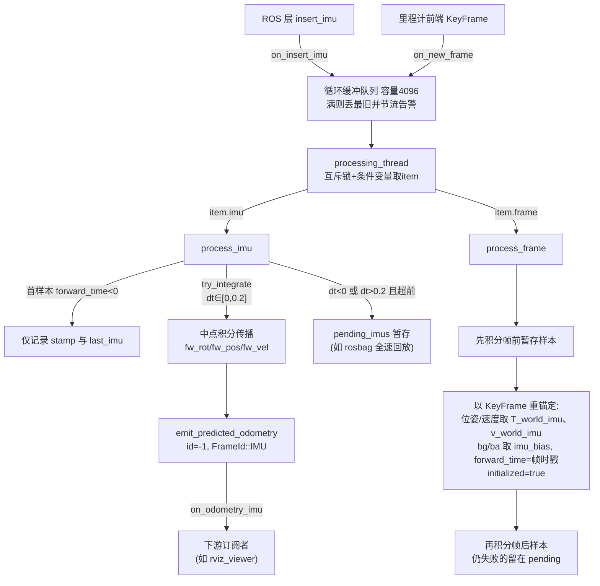

# IMU 前向预测模块

## 模块定位与职责

`ImuPrediction`（`src/asuka/src/asuka/modules/imu_prediction.cpp`，约 5.6KB）是 `modules/` 下的一个**扩展模块**（继承 `ExtensionModule`，见 `extension_module.hpp`），而非里程计插件。它的职责是：**在两个前端关键帧之间，用纯 IMU 数据做中点法前向积分，以 IMU 频率持续发布预测位姿**，为下游（如 RViz 可视化、点云配准初值）提供高频运动先验。

头文件注释明确说明其来源：这是对 Super-LIO 前向传播路径的忠实移植——原实现中 `ROSWrapper::imuHandler` 调用 `ESKF::Predict` 在前向状态 `fw_R_/fw_p_/fw_v_` 上积分，每次扫描在 `ESKF::Update()` 内重锚定；本模块改为**以前端 `KeyFrame` 作为锚点**，预测状态仍按 IMU 频率发布。

## 装载与调用链

模块由 `config_extensions.json` 的 `loading_extension_modules` 列表激活（`libasuka_imu_prediction.so` 处于启用状态），经 `ExtensionModule::load_module` 的 dlopen 工厂创建。运行期链路完全通过全局回调 `Callbacks` 解耦：

- **输入 1**：ROS 封装层 `insert_imu` → `on_insert_imu` → `ImuPrediction::on_insert_imu` 入队；
- **输入 2（锚点）**：里程计前端产出关键帧 → `on_new_frame` → `on_new_frame` 入队；
- **输出**：积分结果 → `emit_predicted_odometry` → `on_odometry_imu` 广播给订阅者。

构造函数从 `config_extensions` 读取 `imu_prediction.gravity`（默认 9.81）与 `imu_scale`（默认 1.0），并固定 `gravity_vec = (0, 0, -gravity)`。设计上**积分只跑在独立的 `processing_thread` 上**，回调仅入队，ROS 订阅线程与里程计 worker 都不为积分付费。

## 数据流与锚定-预测循环

**关键节点解释**：

- **队列**：`boost::circular_buffer<QueueItem>`（容量 4096），满时覆盖最旧项，`dropped_items` 每累计 100 打印一次 warn，避免日志风暴；
- **try_integrate**（cpp L98-L121）：拒绝 `dt < 0`（过期）与 `dt > 0.2`（超前过多），对应原实现 `Predict` 的返回语义；积分采用中点加速度/角速度：`acc = imu_scale * 0.5(a₁+a₀) - ba`，`gyr = 0.5(ω₁+ω₀) - bg`，旋转用文件内自带的 Rodrigues 公式 `exp_so3`（hpp 注明与 Super-LIO `SO3::Exp` 一致）；
- **process_frame 重锚定**（cpp L123-L153）：先补积分早于帧时戳的暂存样本，再用关键帧重置前向状态——注意 `last_imu` **刻意不重置**（注释：保持原始行为），随后继续积分时戳晚于帧的暂存样本，仍失败的保留在 `pending_imus`；
- **输出帧语义**：预测位姿打包成 `KeyFrame` 但 `id=-1`、`frame_id=FrameId::IMU`、无 bias/点云，与前端关键帧语义“松散匹配”以复用轨迹输出通道（`types.hpp` 中 `KeyFrame` 定义）。

## 关键状态

| 状态 | 含义 | 归属线程 |
|---|---|---|
| `fw_rot / fw_pos / fw_vel` | 前向传播的世界系位姿与速度 | 仅 processing 线程触碰 |
| `bg / ba` | 陀螺/加计零偏，来自最近关键帧的 `imu_bias` | 仅 processing 线程 |
| `forward_time / last_imu` | 积分时间基准与上一 IMU 样本 | 仅 processing 线程 |
| `initialized` | 未收到首个关键帧前为 false，所有 IMU 直接丢弃 | 仅 processing 线程 |
| `pending_imus`（容量 4096） | 超前于当前锚点的样本暂存区 | 仅 processing 线程 |
| `queue / kill_switch` | 输入队列与停止开关 | mutex+cv 保护 / atomic |

## 边界条件与容错

1. **未初始化**：首个关键帧到来前 `process_imu` 直接返回，IMU 样本被丢弃；
2. **首样本分支**：`forward_time < 0` 时只记录时戳与样本，不积分（对应 Super-LIO ESKF 的 first-sample 分支）；
3. **dt 校验失败**：过期样本直接丢弃；超前样本进入 `pending_imus` 等锚点——这覆盖了 **rosbag 全速回放、IMU 先于前端到达** 的典型场景；实时运行时该缓冲保持为空，流程与原始实现完全一致；
4. **双缓冲溢出**：输入队列与 pending 均为环形缓冲，溢出丢旧并节流告警；
5. **停机语义**：`stop()` 用 `kill_switch.exchange(true)` 保证幂等，notify 后 join；worker 在 `kill_switch && queue.empty()` 时才退出，即**停止时会排空剩余队列**。按 `extension_module.hpp` 的契约，AsukaROS 先对所有模块 `stop()` 再销毁，因此析构中退订回调槽是安全的；
6. **有意的近似**（头文件注释明确列出）：无扫描观测的模块无法复现原实现的两项在线估计——重力方向固定为世界系 `(0,0,-gravity)`（原实现由点面观测估计）、`imu_scale` 取配置值（原实现由初始化静止加速度均值估计）；机器人系输出 `g_odom_robo` 属 ROS 封装层职责，未移植。

## 扩展点

- **锚点来源可换**：当前订阅 `on_new_frame`（前端关键帧），可改为订阅 `on_odometry_opt` 等回调以优化后位姿重锚定；
- **在线重力/尺度估计**：若给模块引入扫描观测接口，可还原 Super-LIO 的原始在线估计行为；
- **公共组件复用**：模块只依赖全局回调与 `KeyFrame` 契约，与五种里程计实现零耦合——任何向 `on_insert_imu`/`on_new_frame` 发事件的上游都能驱动它，这正是“可被多种里程计复用”的结构基础；
- **配置**：仅需调整 `config_extensions.json` 中 `imu_prediction` 段的 `gravity`/`imu_scale`，加载与否由 `loading_extension_modules` 名单控制。

Sources:
- `src/asuka/src/asuka/modules/imu_prediction.cpp#L1-L178`
- `src/asuka/include/asuka/modules/imu_prediction.hpp#L1-L124`
- `src/asuka/config/config_extensions.json#L1-L57`
- `src/asuka/include/asuka/core/callbacks.hpp#L1-L17`
- `src/asuka/include/asuka/core/types.hpp#L1-L96`
- `src/asuka/include/asuka/utility/extension_module.hpp#L1-L26`

## 关联源码

- `src/asuka/src/asuka/modules/imu_prediction.cpp`
- `src/asuka/include/asuka/modules/imu_prediction.hpp`
