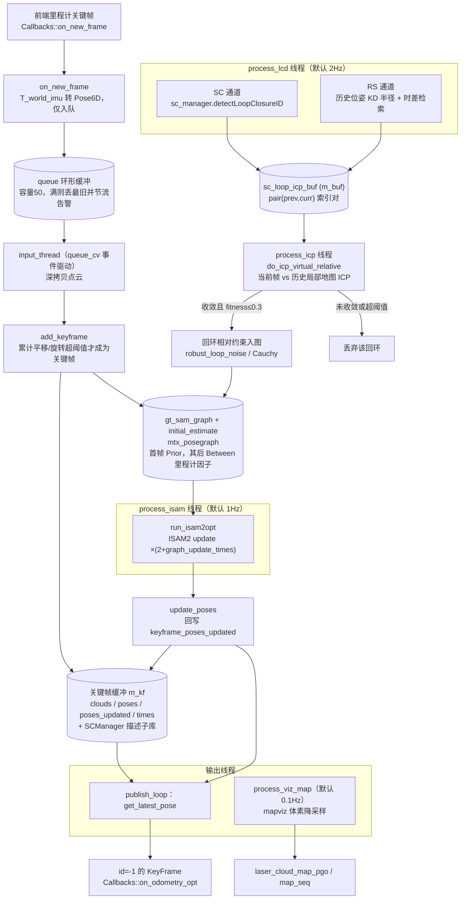

# LOAM 点面优化（modules/optimization_loam）

## 模块定位与职责澄清

本页对应 `optimization_loam.hpp`（5.3KB）/ `optimization_loam.cpp`（20.3KB，modules 目录下最大实现）。页面标题中的"点面"容易让人联想到点-线/点-面残差配准，但源码证据表明实际职责有所不同：hpp L62-64 的注释明确写道——

> SC-A-LOAM style backend: subscribes frontend keyframes, runs ScanContext + distance loop detection, ICP verification and incremental gtsam ISAM2 optimization, and emits the optimized trajectory.

也就是说，点到面的几何配准发生在五个里程计前端内部，本模块是**消费前端关键帧的后端精化器**：回环检测 + ICP 验证 + GTSAM ISAM2 位姿图优化 + 优化轨迹发布。它与 `optimization_miao` 构成可切换的优化后端，类 `OptimizationLOAM : public ExtensionModule`（hpp L65），由扩展模块机制装载。

## 主要文件与自由函数

| 文件 | 内容 |
|---|---|
| `include/asuka/modules/optimization_loam.hpp` | `Pose6D` 结构（L48-55）、四个位姿换算函数声明、`OptimizationLOAM` 类与全部线程/状态成员 |
| `src/asuka/modules/optimization_loam.cpp` | 构造/析构/stop、回调入口、六个线程循环、关键帧与回环逻辑 |

文件内的自由函数（cpp L11-54）：
- `pose6d_to_gtsam`：`Pose6D` → `gtsam::Pose3`（RzRyRx 欧拉角序）；
- `diff_transformation`：两 `Pose6D` 做仿射逆乘得相对变换，返回各轴绝对增量，供关键帧节流判定；
- `local2global`：OMP 16 线程手工矩阵变换到世界系，保留 intensity，用于拼装回环局部地图；
- `pose6d_to_affine`：`Pose6D` → `Eigen::Affine3f`。

## 构造装配（cpp L56-104）

构造函数完成五件事：

1. 建 `create_module_logger("loam")`；
2. 从 `GlobalConfig::get_config_path("config_extensions")` 的 `optimization_loam` 节读取全部行为参数；
3. 创建 `gtsam::ISAM2`（relinearizeThreshold=0.01，relinearizeSkip=1）并 `init_noises()`；
4. 配置 `SCManager` 阈值与三个 0.4m 体素滤波器（scancontext / icp / mapviz，后者用 `mapviz_filter_size`）；
5. 在 `Callbacks::on_new_frame` 上注册回调并**启动六个线程**。

关键参数默认值（均可在 config_extensions 覆盖）：

| 参数 | 默认 | 作用 |
|---|---|---|
| keyframe_meter_gap / keyframe_deg_gap | 2.0 / 10.0 | 关键帧平移/旋转阈值 |
| sc_dist_thres / sc_max_radius | 0.2 / 80.0 | ScanContext 距离阈值与最大半径 |
| history_keyframe_search_radius / time_diff / num | 10.0 / 30.0 / 25 | RS 回环空间半径、最小时差、局部地图拼帧数 |
| loop_noise_score | 0.5 | 回环因子方差 |
| graph_update_times | 2 | 每次 isam 收缩后的追加 update 次数 |
| loop_fitness_score_threshold | 0.3 | ICP 验证通过阈值 |
| loop_closure_frequency / graph_update_frequency / vizmap_frequency / publish_rate | 2.0 / 1.0 / 0.1 / 10.0 | 各线程节奏 |

噪声模型（`init_noises`，cpp L251-266）：先验 1e-12 ×6；里程计平移 1e-6、旋转 1e-4；回环因子用 `Robust::Create(Cauchy(1), Diagonal(loop_noise_score×6))`——鲁棒核用于压制错误回环对图结构的破坏。

## 六线程流水线

hpp L101-103 的注释给出关键设计约束：**体素降采样与 ScanContext 描述子构建在 input 线程执行，`on_new_frame` 回调只入队，里程计 worker 永远不会被后端阻塞**。

图中的关键节点：
- **C（入队）**：回调侧与 input 线程的唯一交界面，`boost::circular_buffer<InputFrame>` 容量 50，天然限定了后端积压上限；
- **E（关键帧门控）**：决定什么才配进入位姿图，是节点数与计算量的总闸门；
- **J（索引对缓冲）**：检测与验证两个频率域之间的解耦队列，SC/RS 两通道产出统一格式；
- **K→L**：几何验证是回环入图的最后一道闸，防止描述子误匹配污染因子图；
- **O→F**：优化结果只写 `poses_updated`，原始 `poses` 保留里程计值，两者用途必须区分。

## 数据入口与关键帧判定

**`on_new_frame`（cpp L123-149）**：`frame->cloud_imu` 为空直接丢弃；把 `frame->T_world_imu`（double）cast 成 float 后取欧拉角填 `InputFrame{stamp, pose, cloud}`；持 `queue_mutex` 入队——环形缓冲满时 `push_back` 覆盖最旧元素，`dropped_items` 计数以 `++dropped_items % 100 == 1` 节流告警（第 1、101、…次触发），随后 `notify_one`。

**`input_thread`（cpp L151-166）**：条件变量等待 `!queue.empty() || kill_switch`；退出条件是 `kill_switch && queue.empty()`，即**停机前排空残留队列**；出队后深拷贝点云（切断与前端共享指针的所有权），调用 `add_keyframe`。

**`add_keyframe`（cpp L197-249）**：
1. `diff_transformation(prev, curr)` 累加平移/旋转增量；累计器初值 1000000（hpp L140-141），**保证首帧必然成为关键帧**；
2. 超过 `keyframe_meter_gap` 或 `keyframe_rad_gap` 才继续，否则直接 return——这是位姿图规模的总闸；
3. 体素降采样后持 `m_kf` 写入四个缓冲（clouds/poses/poses_updated/times），并 `sc_manager.makeAndSaveScancontextAndKeys`；
4. 因子图：`gt_sam_graph_made` 为假时对 0 号节点加 `PriorFactor`（先验只加一次）；否则加 `BetweenFactor(prev, curr, pose_from.between(pose_to), odom_noise)` 并插入初值，每 100 个节点打一条 info。

## 回环检测双通道

`process_lcd`（cpp L411-422）按 `loop_closure_frequency` 睡眠循环：先查关键帧非空，然后依次跑两条通道。

- **SC 通道 `perform_sc_loop_closure`（L352-363）**：要求关键帧数 ≥ `sc_manager.NUM_EXCLUDE_RECENT`（排除近期帧自匹配）；`detectLoopClosureID()` 返回 -1 表示无候选，命中则把 `(历史id, 最新id)` 压入 `sc_loop_icp_buf`（`m_buf` 锁）。
- **RS 通道 `perform_rs_loop_closure` + `detect_loop_closure_distance`（L365-409）**：`loop_index_container` 先挡掉已做过回环的当前帧；把关键位姿拷成 PointXYZ 云喂 `kdtree_history_key_poses`，从最新位姿做半径 10m 检索，**且时间差必须 > 30s** 才接受——空间近但时间近的相邻帧不算回环；命中后同样压队列并登记 `loop_index_container[cur] = pre`。

两通道只产出 `(prev, curr)` 索引对，验证逻辑完全收敛到同一条 ICP 通路——这是新增回环检测器时的模板结构。

## ICP 验证与增量优化

**`do_icp_virtual_relative`（cpp L311-350）**：
- source 是当前关键帧**单帧**（`loop_find_near_keyframes(..., 0)`），target 是历史关键帧 ±25 帧经 `local2global` 拼装并降采样的局部地图；
- PCL ICP 配置：maxCorrespondenceDistance 150、maxIterations 100、双 epsilon 1e-6、RANSAC 0；
- **验收标准**：`hasConverged() && fitnessScore ≤ loop_fitness_score_threshold(0.3)`，失败打日志并返回 `Identity`（等价于丢弃该回环）；
- 通过后 `t_correct = icp变换 × 当前优化位姿`，返回 `between(修正后当前位姿, 历史优化位姿)` 作为回环相对约束。

**`process_icp`（cpp L424 起）**：2ms 轮询 `m_buf`，弹出索引对后构造 gtsam 约束（已读证据在 L443 截断于约束构造处；按 hpp L62-64 的模块注释与 `robust_loop_noise` 成员的唯一用途，该约束随后以鲁棒核加入 `gt_sam_graph`，等待 isam 线程消费）。

**`process_isam` → `run_isam2opt`（cpp L268-276）**：`isam->update(graph, initial)` 后再 update 一次，再追加 `graph_update_times` 次收缩；清空缓存图与初值；`calculateEstimate` 存入 `isam_current_estimate`。**`update_poses`（L278-290）** 持 `m_kf` 把全部估计回写 `keyframe_poses_updated`，并置 `recent_idx_updated = size-1`。

## 输出与可视化

**`publish_loop`（cpp L168-195）**：按 `publish_rate` 睡眠；`get_latest_pose` 取最新优化位姿，组装 `KeyFrame`——注意 `frame->id = -1`、`frame_id = FrameId::IMU`，注释明言"优化位姿不是关键帧：无 id/bias/cloud，宽松匹配前端 KeyFrame 语义用于轨迹输出"——然后触发 `Callbacks::on_odometry_opt` 供下游（如 RViz）消费。

> **命名陷阱（阅读风险点）**：`publish_loop` 的周期计算是 `microseconds(1e6 / publish_interval)`（L169），沿用了"除以频率"的公式；但 `publish_interval = 1.0 / publish_rate`（L75）是**周期**（默认 0.1s）。按字面语义默认实际睡眠 10s 而非 0.1s。对比 `process_lcd` 用 `1e6 / loop_closure_frequency`（频率值，得 2Hz）是正确用法。修改发布频率前应先核对这一处。

**`process_viz_map`**：按 `vizmap_frequency`（默认 0.1Hz）以 `downsize_filter_map_pgo` 维护 `laser_cloud_map_pgo` 与原子计数 `map_seq`（hpp L136-138），线程体细节在已读证据截断之后，此处仅述成员与节奏。

## 关键状态与锁的面

四把互斥锁对应四个互不重叠的域，是理解并发正确性的骨架：

| 锁 | 保护对象 | 生产者 → 消费者 |
|---|---|---|
| `queue_mutex` + `queue_cv` | `queue` 环形缓冲 | on_new_frame → input_thread |
| `m_buf` | `sc_loop_icp_buf` | lcd 线程 → icp 线程 |
| `m_kf` | 四个关键帧缓冲 | input（写）/ icp、isam、publish（读） |
| `mtx_posegraph` | `gt_sam_graph` + `initial_estimate` | input、icp（写）→ isam（读并清空） |

关键标量状态：`translation/rotation_accumulated`（关键帧节流）、`gt_sam_graph_made`（先验唯一性）、`recent_idx_updated`、`loop_index_container`（RS 回环去重）、`kill_switch`（原子停机）、`dropped_items`、`map_seq`。

## 边界条件

1. `cloud_imu` 空帧直接丢弃（L124）；
2. 队列容量 50，溢出丢最旧 + 逐百条节流告警——后端积压不反压前端，靠丢弃保实时；
3. 累计器初值 1e6 保证首帧成关键帧；`gt_sam_graph_made` 保证先验只加一次；
4. SC 通道要求关键帧数 ≥ `NUM_EXCLUDE_RECENT`；RS 通道要求时间差 > 30s 且 `loop_index_container` 去重；
5. ICP 未收敛或 fitness > 0.3 即拒绝，返回 Identity 而非抛错；
6. `loop_find_near_keyframes` 对越界索引 `continue`，局部地图拼帧自动截断；
7. `stop()` 用 `kill_switch.exchange(true)` 保证幂等，`notify_all` 后按 input→lcd→icp→isam→viz→publish 顺序 join 六线程（cpp L111-120）；input 线程退出前排空队列；
8. 析构先 `stop()` 再 `Callbacks::on_new_frame.remove(on_new_frame_id)`（L106-109）——回调移除发生在所有线程 join 之后，无悬空回调风险；
9. 回环因子使用 Cauchy 鲁棒核，单条错误回环的影响被有界化。

## 扩展点

- **全参数外置**：所有阈值与线程频率都在 config_extensions 的 `optimization_loam` 节，调参不需改码；
- **回环检测器可插拔**：`process_lcd` 内 SC/RS 双通道并存且产出统一索引对，新增检测器（如另一种描述子）只需复制该模式；
- **后端可切换**：与基于 thirdparty/miao 的 `optimization_miao` 互为替代的优化后端，二者同为 `ExtensionModule` 契约；
- **输出契约**：下游消费 `on_odometry_opt` 时必须容忍 `id=-1`、无点云的"宽松 KeyFrame"。

Sources: `src/asuka/include/asuka/modules/optimization_loam.hpp#L1-L170`
Sources: `src/asuka/src/asuka/modules/optimization_loam.cpp#L1-L340`
Sources: `src/asuka/src/asuka/modules/optimization_loam.cpp#L292-L495`

## 关联源码

- `src/asuka/src/asuka/modules/optimization_loam.cpp`
- `src/asuka/include/asuka/modules/optimization_loam.hpp`
