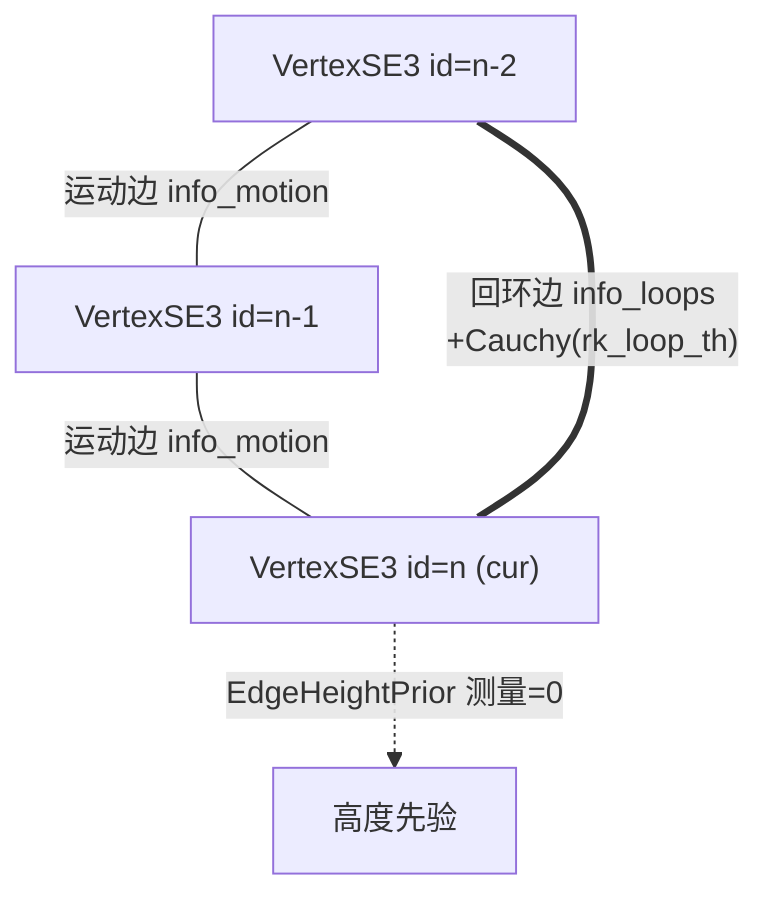

# Miao 图优化模块

## 模块定位

`modules/optimization_miao.cpp`（15KB 实现，配套 `include/asuka/modules/optimization_miao.hpp`）是位于 modules 层的后端扩展模块。类注释（hpp L66-68）完整概括了它的职责：

> MIAO style backend: subscribes frontend keyframes, runs distance-gated loop detection with multi-resolution NDT verification and incremental sparse pose-graph optimization, and emits the optimized trajectory.

即：订阅前端关键帧 → 距离门控回环检测 → 多分辨率 NDT 验证 → 增量稀疏位姿图优化 → 输出优化后轨迹。它与 `optimization_loam`（点-线/点-面残差的几何配准）同处 modules 目录，按页面定位构成可切换的配准/优化后端。与五种里程计不同，本模块继承 `ExtensionModule` 而非 `OdometryEstimation`，通过 `extern "C" create_extension_module()`（cpp L508-510）导出，由 config_extensions 的扩展插件名单控制加载。

## 主要文件

| 文件 | 角色 |
|---|---|
| `src/asuka/src/asuka/modules/optimization_miao.cpp` | 后端全部实现：参数读取、三线程、回环、NDT、位姿图 |
| `src/asuka/include/asuka/modules/optimization_miao.hpp` | 类定义、`LoopCandidate`/`BackendKeyframe`、状态与线程声明 |
| `thirdparty/miao/core/graph/optimizer.{h,cc}` | Optimizer 门面：AddVertex/AddEdge/InitializeOptimization/Optimize |
| `thirdparty/miao/core/opti_algo/*` | LM/GN/DogLeg 算法族与 `algo_select` |
| `thirdparty/miao/core/solver/*`、`core/sparse/*` | 块求解器、四种线性求解器与稀疏块矩阵 |
| `thirdparty/miao/core/types/vertex_se3.h`、`edge_se3.h`、`edge_se3_height_prior.h` | 本模块实际使用的图元素 |
| `thirdparty/miao/core/robust_kernel/*` | Cauchy 等 9 种鲁棒核 |

注意 miao 库位于 `lightning::miao` 命名空间，且 hpp 复用 `<common/eigen_types.h>`、`SE3d = ::lightning::SE3`，与 lightning 库共享同一套基础数学类型。

## 关键状态

- **双队列**：`queue`（boost::circular_buffer，容量 50，存 `InputFrame`）承接回调；`kf_queue`（std::queue）承接 `add_keyframe` 产出。
- **`all_keyframes`**（`state_mutex` 保护）：后端真值存储，所有读方先在锁内拷贝快照再出锁使用。
- **`BackendKeyframe`**（hpp L57-64）携带双位姿：`lio_pose`（前端 LIO 输出，只读基准）与 `opt_pose`（优化位姿，会被写回）。
- **`last_kf` / `last_loop_kf` / `cur_kf`**：控制流水线节奏（增量链、回环间隔门控）。
- **`kf_vert` / `edge_loops`**：记录本轮优化涉及的图元素，用于求解后写回与外点剔除。
- **`optimizer`**：`SetupOptimizer<6, 3>`，固定配置为 LEVENBERG_MARQUARDT + LINEAR_SOLVER_SPARSE_EIGEN + `incremental_mode_ = true`（cpp L33-38）——图跨关键帧持续生长，不重建。
- **`kill_switch`**（atomic）：三线程统一的幂等停止开关。

## 线程模型与调用链

```mermaid
flowchart LR
    subgraph 前端["前端（odometry worker 线程）"]
        CB["Callbacks::on_new_frame 回调<br/>on_new_frame()"]
    end
    CB -->|"仅转换+入队，满则丢最旧"| Q["circular_buffer queue (50)"]
    Q -->|"queue_cv 唤醒，深拷贝点云"| IT["input_thread"]
    IT -->|"add_keyframe：链式初值"| KQ["kf_queue"]
    KQ --> W["worker_thread"]
    W --> HK["handle_kf"]
    HK --> D["detect_loop_candidates<br/>距离/间隔双重门控"]
    D --> N["compute_loop_candidates<br/>多分辨率 NDT 验证"]
    N --> O["pose_optimization<br/>增量位姿图 + LM 求解"]
    O -->|"写回 opt_pose"| AK[("all_keyframes")]
    AK -->|"get_latest_optimized_pose"| P["publish_thread<br/>1/publish_rate 周期"]
    P -->|"on_odometry_opt (id=-1)"| OUT["优化后轨迹"]
```

关键节点解释：

- **on_new_frame（cpp L73-93）刻意做到最轻**：hpp L102-104 注释明确“回调只入队，odometry worker 永不被后端阻塞”。队列满时丢最旧关键帧并降频告警（每 100 个丢帧打一条 warn，cpp L86-90），体现“后端过载不反压前端”的设计取舍。
- **input_thread（cpp L95-110）承担点云深拷贝**，把昂贵的内存操作从前端回调线程挪走；退出条件为 `kill_switch && queue.empty()`，即停机时先排空输入队列。
- **worker_thread（cpp L161-177）** 是唯一触碰图与关键帧集合的线程，空转时 sleep 2ms 轮询。
- **publish_thread（cpp L112-137）** 按配置频率取 `all_keyframes.back()` 的 `opt_pose` 发布。发布的是 id=-1、`FrameId::IMU` 的合成 KeyFrame，注释（cpp L125-126）说明其非关键帧、只是“宽松匹配前端语义以输出轨迹”，通过 `Callbacks::on_odometry_opt` 送出。

## handle_kf 主流水线

`handle_kf`（cpp L179-201）是后端核心，依次执行：重复 id 防御（与 `last_kf` 同 id 直接丢弃）→ 存入 `all_keyframes` → `detect_loop_candidates` → `compute_loop_candidates` → `pose_optimization` → 更新 `last_kf`。

### 1. 回环检测（cpp L203-251）

三重门控收敛候选数量：

1. 首次调用只记录 `last_loop_kf` 不检测（L213-216）；
2. 距上次**触发回环的关键帧**间隔 ≤ `loop_kf_gap`(20) 则跳过（L218-221）；
3. 遍历历史时：相邻候选至少隔 `min_id_interval`(20)；与当前帧 id 距离 < `closest_id_th`(50) 直接 break（排除时序近邻的“伪回环”）；2D 平移距离 < `max_range`(30m) 才入候选，`tij` 先用 LIO 位姿差作粗初值（L232-241）。

仅当产出了候选才更新 `last_loop_kf`（L244-246），保证失败的检测不会推迟下一次尝试。

### 2. NDT 验证（cpp L253-325）

`compute_for_candidate` 先做下标越界与空云防御（score=0），然后：

- target = `build_submap(kf1->id, in_world=true)`——以 ±`submap_idx_range`(40)、步长 4 拼接邻域关键帧点云（L348-372）；
- source = kf2 单帧；
- **由粗到细四级 NDT**：`res = {10, 5, 2, 1}`，每级对双侧点云做 leaf=r×0.1 的体素降采样，上一级对齐结果 `tw2` 作为下一级初值（L304-317），最终 score 取最细一级的 transformation probability；
- score > `ndt_score_th`(1.0) 视为回环成立（L262），并将 `tij` 精化为 `kf1->opt_pose⁻¹ × T_world`（L324）。

### 3. 位姿图优化（cpp L386-492）

每个关键帧到达时增量构建图：

- 新增当前帧 `VertexSE3`（id=关键帧 id）；
- **运动边 ×2**：连接 id-1、id-2 的已有顶点，测量为前端 LIO 增量 `lio_pose⁻¹ × cur->lio_pose`，信息矩阵 `info_motion`（由 motion_trans/rot_noise 的 1/σ² 构造，cpp L40-42）；
- **高度先验**（`with_height`）：`EdgeHeightPrior`，测量 0，info=1/height_noise²（L420-426）；
- **回环边**：测量 `c.tij`，信息矩阵 `info_loops`，挂 **Cauchy 鲁棒核**（delta=`rk_loop_th`=1.04，L440-442）。

关键门控在 L448-454：**无边或无回环候选时直接返回**。也就是说，顶点与运动边持续累积，但 `InitializeOptimization + Optimize(20)` 只在回环发生时才执行——这是“增量模式”的实际含义，平时零求解开销。

求解后两步收尾：

- **外点剔除**（L461-472）：回环边 `Chi2() > Delta()` 则 `SetLevel(1)` 剔除，否则移除鲁棒核降级为普通边；
- **写回**（L478-489）：把每个顶点的 `Estimate()` 写回 `all_keyframes[vid]->opt_pose`，带 id 越界与 `kfs[vid]->id == vid` 双重防御。

## 位姿图结构

图中实线运动边永远随帧添加；虚线高度先验由 `with_height` 开关控制；双线回环边只在 NDT 验证通过后添加，且是唯一触发真正求解的边型。

## 边界条件汇总

- **队列溢出**：输入环形容器满 50 即丢最旧（L86-90），后端不阻塞前端；
- **id 连续性隐含假设**：`LoopCandidate.idx1/idx2` 既是关键帧 id 又被当作 `all_keyframes` 数组下标使用，`build_submap` 与运动边构建中都有 `kfs[id]->id != id → skip` 防御（L353、L402）——若前端关键帧 id 非从 0 连续递增，这些路径会静默跳过而非报错；
- **NDT 失败**：下标越界、空 submap 均置 score=0 自然落选（L279-294）；
- **无回环不求解**：L448-454 的双重早退；
- **停机**：`stop()` 用 `exchange` 保证幂等，依次 join 三个线程（L64-71）；析构先 stop 再摘除 `on_new_frame` 回调（L59-62）。

## 扩展点

- **参数面**：全部超参（回环间隔、距离门限、NDT 阈值、噪声、鲁棒核 delta、发布频率等）从 config_extensions 的 `optimization_miao` 节读取（cpp L17-31），可在不改代码下调优；
- **求解器面**：miao 的 `algo_select.h` 提供 GN/LM/DogLeg 三族算法，solver 目录提供 dense/eigen/ccs/pcg 四种线性求解器，切换只需改 `OptimizerConfig`；
- **鲁棒核面**：miao 备有 huber/tukey/welsch/dcs/fair/saturated 等核，当前固定 Cauchy；
- **接入面**：输入输出均走全局回调总线（`Callbacks::on_new_frame` / `on_odometry_opt`），后端与前端完全解耦；`create_extension_module` 使其作为扩展插件按配置热插。

Sources:
- `src/asuka/src/asuka/modules/optimization_miao.cpp#L1-L260`
- `src/asuka/src/asuka/modules/optimization_miao.cpp#L200-L511`
- `src/asuka/include/asuka/modules/optimization_miao.hpp#L1-L154`
- `src/asuka/thirdparty/miao/core/graph/optimizer.h#L1-L175`
- `src/asuka/thirdparty/miao/core/graph/base_binary_edge.h#L1-L28`

## 关联源码

- `src/asuka/src/asuka/modules/optimization_miao.cpp`
- `src/asuka/include/asuka/modules/optimization_miao.hpp`
- `src/asuka/thirdparty/miao/core/graph/base_binary_edge.h`
