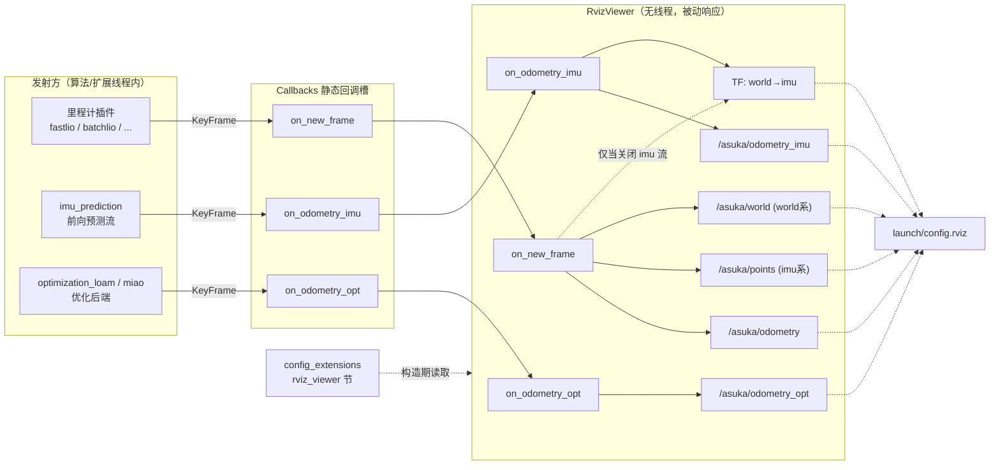

# RViz 可视化模块（RvizViewer）

## 模块职责

`RvizViewer` 位于 `src/asuka/src/asuka/modules/rviz_viewer.cpp`（约 6.4KB），是 `modules/` 下四个扩展模块中最轻的一个。它不做任何状态估计计算，职责只有一件事：**把系统运行中产生的位姿流与去畸变点云翻译成 RViz 可订阅的 ROS 话题和 TF**。RViz 端的渲染方式由 `launch/config.rviz` 决定，本模块决定 RViz "有什么可画"——`/asuka/odometry` 系列话题在 RViz 的 Odometry 显示中形成轨迹轴，累积的 `/asuka/world` 点云充当在线地图。

整个类是无内部线程、无缓冲队列的**纯被动事件响应器**：所有发布动作都发生在回调发射方的线程上。

## 装载路径与生命周期

RvizViewer 不是被直接 new 出来的，而是走扩展模块插件链路：

1. `AsukaROS` 构造末尾调用 `load_extensions()`（asuka_ros.cpp L157-L169），读取 `config_extensions` 的 `extensions.loading_extension_modules` 列表，对每个 so 名调用 `ExtensionModule::load_module`（dlopen）；
2. `rviz_viewer.cpp` 末尾导出 `extern "C" asuka::ExtensionModule* create_extension_module()`，返回 `new RvizViewer`，完成插件接入；
3. 因此该模块是**可插拔的**——`config_extensions.json` 不列出它就完全没有可视化开销；
4. 析构时按构造期保存的三个 slot id 从 `Callbacks` 静态槽退订；
5. `stop()` 是空实现：模块不拥有线程、不做发射，无需停机逻辑。`AsukaROS` 析构顺序（先 `async->stop()` join 里程计 worker、再逐个 `ext->stop()`、最后 `at_exit(map_saving_path)`）与 `extension_module.hpp` 注释中的契约配合，保证退订与析构不会与在途的 slot 发生竞争。

## 构造期装配：配置与话题注册

一个容易忽略的细节：RvizViewer 的参数**不是独立配置文件**，而是寄宿在 `config_extensions` 下的 `rviz_viewer` 节（rviz_viewer.cpp L12-L20）。构造函数读取 2 个 frame 名与 6 个发布开关：

| 参数 | 默认值 | 作用 |
|---|---|---|
| `world_frame_id` | `"world"` | Odometry/点云/TF 的 header.frame_id |
| `imu_frame_id` | `"imu"` | child_frame_id，与 `/asuka/points` 的 frame_id |
| `publish_odometry` | `true` | 前端里程计话题 |
| `publish_odometry_imu` | `true` | IMU 前向预测流话题（并接管 TF 边） |
| `publish_odometry_opt` | `true` | 优化后位姿话题 |
| `publish_cloud_imu` | `true` | IMU 系去畸变点云 |
| `publish_cloud_world` | `true` | world 系点云 |
| `publish_tf` | `true` | world→imu TF 边 |

随后注册 5 个 publisher 与 1 个 `tf2_ros::TransformBroadcaster`：

| 话题 | 类型 | 队列深度 |
|---|---|---|
| `/asuka/odometry` | `nav_msgs/Odometry` | 10 |
| `/asuka/odometry_imu` | `nav_msgs/Odometry` | 100 |
| `/asuka/odometry_opt` | `nav_msgs/Odometry` | 100 |
| `/asuka/points` | `sensor_msgs/PointCloud2` | 10 |
| `/asuka/world` | `sensor_msgs/PointCloud2` | 10 |

注意 `nh` 虽是私有句柄 `"~"`，但所有 advertise 名都以 `/` 开头（绝对名），话题不受节点命名空间影响，固定为 `/asuka/*`。两路高频位姿流给到 100 的队列深度，点云给 10。

## 数据流：三条回调输入 → 五个话题 + TF

RvizViewer 只订阅 `Callbacks` 五个静态槽中的三个（`on_insert_imu`/`on_insert_frame` 与它无关，属主数据链路的观察点）：

关键节点说明：

- **发射方**：`on_new_frame` 由前端里程计插件在每帧处理后发出；`on_odometry_imu` 的来源在代码注释中明确为 "IMU-predicted odometry"（即 imu_prediction 扩展）；`on_odometry_opt` 按命名来自优化后端。三者承载的都是同一 `KeyFrame` 快照（含 `T_world_imu`、`v_world_imu`、`cloud_imu`）。
- **TF 仲裁虚线**是本模块最重要的设计点。`on_new_frame` 中发布 TF 的条件是 `enable_tf_publish && !enable_odometry_imu_publish`（L50），注释写道："Frontend and IMU-predicted odometry are independent streams. Once the predicted stream is enabled, it is the sole owner of this TF edge."。即 **world→imu 这一条 TF 边永远只有一个写者**：imu 预测流开启时由 `on_odometry_imu` 独占，关闭时回退给前端流，避免了双写者导致的 TF 抖动。
- **CFG**：全部配置在构造期一次读入，运行期只读。

## 发布实现细节

- **`publish_odometry(frame, pub)`**（L75-L99）：把 `T_world_imu` 拆为 position + quaternion 填入 pose，`v_world_imu` 填入 `twist.linear`；header 使用 `frame->stamp`、`frame_id=world_frame_id`、`child_frame_id=imu_frame_id`。三个话题共用这一实现，仅 publisher 不同。
- **`publish_pointcloud(stamp, frame_id, cloud, pub)`**（L101-L115）：空点云直接返回；`pcl::toROSMsg` 转成 `PointCloud2` 后打 header 发布。
- **`publish_tf(frame)`**（L117-L133）：同一 `T_world_imu` 转成 `geometry_msgs::TransformStamped` 广播。
- **`prepare_clouds(frame, cloud_imu, cloud_world)`**（L135-L155）：`KeyFrame::cloud_imu` 是 32 字节精简点 `PointXYZIOffset`（含毫秒级 per-point 时间偏移），此处逐点拷贝为标准 `pcl::PointXYZI`（丢弃 offset 字段）；仅当 `enable_cloud_world_publish` 时才用 `T_world_imu.matrix().cast<float>()` 做 `pcl::transformPointCloud` 生成 world 系副本——开关关闭时省掉一次全点云矩阵乘法。

## 关键状态

模块的运行期状态极其克制，全部在构造期定死后只读：

- 3 个回调订阅 id（`on_new_frame_id` 等，初值 -1），供析构退订；
- 6 个 `bool` 发布开关 + 2 个 frame id 字符串；
- 5 个 publisher + `tf_broadcaster`；
- 无锁、无队列、无缓存、无线程（`stop()` 为空即其佐证）。

## 边界条件与线程安全

- **空指针/空点云防御**：三个回调入口都有 `if (!frame) return;`；`publish_pointcloud` 与 `prepare_clouds` 各自检查空点云（L106、L139）。
- **持有安全性**：`KeyFrame::cloud_imu` 的所有权注释（types.hpp L92-L94）明确"每帧新分配、归 KeyFrame 所有，观察者可任意持有"——这正是 RvizViewer 在回调线程内引用点云而无需拷贝生命周期的前提。
- **异常隔离**：callbacks.cpp 注册了全局回调异常处理器，观察者抛异常只会被记为 warn 日志，不会打断数据主链路——可视化模块的崩溃面被限制在自身。
- **微小精度取舍**：world 点云用 float 精度变换，与 double 位姿存在微小差异；作为纯显示用途可接受。
- **一处无害冗余**：`on_new_frame` 中 `enable_cloud_imu_publish` 在外层分支（L51）与内层（L55）各判一次。

## 扩展点

- **新增可视化流**：在 `callbacks.hpp` 增加静态槽 → 发射方填槽 → 此处订阅并新增 publisher 与开关参数，模式完全同构；
- **调整默认行为**：改 `config_extensions.json` 的 `rviz_viewer` 节即可改名 frame、默认关闭某路流，无需改代码；
- **当前未覆盖的可视化**：实现中没有 `nav_msgs/Path` 或 Marker 发布；轨迹显示依赖 RViz 对 Odometry 话题的渲染。若需要显式轨迹线/地图要素标记，可按本模块的 publisher+开关模式扩展；
- **作为新扩展模块的模板**：RvizViewer 展示了一个扩展模块的最小完整形态——`extern C` 导出 + 构造期订阅 + 析构期退订 + 空 `stop()`，是编写同类模块（如 imu_prediction、optimization_*）时可对照的最简样本。

Sources:
- `src/asuka/src/asuka/modules/rviz_viewer.cpp#L1-L162`
- `src/asuka/include/asuka/modules/rviz_viewer.hpp#L1-L66`
- `src/asuka/include/asuka/core/callbacks.hpp#L1-L17`
- `src/asuka/src/asuka/core/callbacks.cpp#L1-L34`
- `src/asuka/include/asuka/utility/extension_module.hpp#L1-L26`
- `src/asuka/src/asuka/asuka_ros.cpp#L45-L169`
- `src/asuka/include/asuka/core/types.hpp#L82-L97`

## 关联源码

- `src/asuka/src/asuka/modules/rviz_viewer.cpp`
- `src/asuka/include/asuka/modules/rviz_viewer.hpp`
