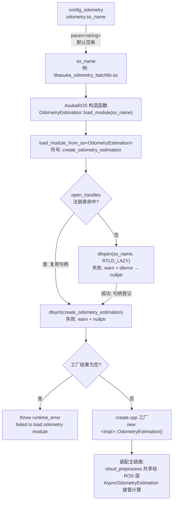

# 五种算法总览与 so_name 动态选择

本页是算法矩阵的**导航页**。仓库内五种里程计实现（batchlio / fastlio / lightning / smallpointlio / superlio）各自编译为一个动态库，进程启动时由 `config_odometry` 的 `so_name` 决定装载哪一个。本页只讲这条"选择与装载"公共链路；各算法内部主流程请阅读各自的专页。

## 1. 模块职责划分

参与选择与装载的代码非常少，且各自职责单一：

| 文件 | 职责 |
|---|---|
| `core/odometry_estimation.cpp` | 基类静态工厂，仅 11 行：`load_module(so_name)` 薄封装为 `load_module_from_so<OdometryEstimation>(so_name, "create_odometry_estimation")`，把"返回类型 + 导出符号名"这两个契约要素绑定在一起 |
| `utility/load_module.cpp` | `dlopen`/`dlsym` 原语（`load_so`/`load_symbol`）与进程级句柄注册表，是所有动态插件（含扩展模块）共用的装载通道 |
| `odometry/<impl>/create.cpp` | 每个实现导出的 `extern "C"` 工厂，五个副本均只有 181–193 字节 |
| `config/odometry/config_*.json` | 每算法一份配置，`odometry.so_name` 指定 so 文件名，其余键界定各自的参数边界 |

## 2. 调用链：构造期的一次性选择

`asuka_ros.cpp` 构造函数前 20 余行完成了整个选择过程：

1. `GlobalConfig::instance(config_dir, true)` 定位包内 config 目录后，以 `get_config_path("config_odometry")` 打开里程计配置；
2. `odometry_config.param<std::string>("odometry", "so_name", "")` 读出 so 名（默认空串）；
3. `OdometryEstimation::load_module(so_name)` 发起动态装载；
4. 若返回空指针，立即 `throw std::runtime_error("failed to load odometry module: " + so_name)`，进程拒绝启动；
5. 成功后马上执行两条装配动作：`odometry->cloud_preprocess()` 把算法私有的预处理取出共享给 ROS 接入层（`insert_frame` 中直接调用），再用 `odometry` 构造 `AsyncOdometryEstimation` 异步执行器。

**顺序有讲究**：模块装载发生在 ROS 话题/标定参数读取（L34 起）与扩展模块加载（L42）之前。算法选型失败会在任何数据通路建立之前终止进程——这是典型的 fail-fast 设计。装载完成后，运行期的 `insert_imu`/`insert_frame` → 异步队列 → `process_once` 调用全部落在被选中的那个实现上，对上层完全透明。

## 3. dlopen 细节与关键状态

`load_module.cpp` 里有三个值得记住的要点：

- **进程级注册表**：`open_handles`（`std::map<std::string, void*>`，互斥锁保护）按 so 名缓存句柄。同一次进程内重复装载同名 so 直接复用，不会重复 `dlopen`。
- **句柄永不关闭**：注释明确写出"handles are intentionally never closed today: plugin code must stay resident for the lifetime of the process"，并把这个注册表标注为**未来卸载/重载实现的接缝**。这意味着当前不支持运行时热切换——换算法必须改配置后重启。
- **`RTLD_LAZY` 懒绑定**：函数符号延迟解析；工厂符号本身通过显式 `dlsym("create_odometry_estimation")` 查找，找不到时 `spdlog::warn` 输出 `dlerror` 并返回 nullptr。

## 4. create.cpp 插件契约

以 fastlio 的 6 行文件为样板：

```cpp
extern "C" asuka::OdometryEstimation* create_odometry_estimation() {
  return new asuka::fastlio::OdometryEstimation();
}
```

`extern "C"` 关闭 C++ 名字改编，保证 `dlsym` 能按字面符号名找到工厂；工厂内 `new` 具体实现并按基类指针返回。五个目录的 create.cpp 除类型名外完全一致，是"算法接入主链路"的最小接入样板。

## 5. 装载流程图



关键节点说明：
- **so_name**：唯一的算法选择旋钮，来自 JSON 配置而非编译期决定；
- **open_handles 判断**：进程级缓存分支，保证同名 so 只 dlopen 一次；
- **dlsym → 工厂**：基类与实现之间唯一的运行时绑定点，`extern "C"` 是这个绑定点成立的前提；
- **throw 分支**：空指针沿调用链上抛为异常，构造失败即进程失败；
- **装配节点**：装载成功后有两个出口——预处理对象交给 ROS 层、估计器本体交给异步执行器，此后五种算法在框架眼中不再有区别。

## 6. 五实现文件矩阵

| 实现 | odometry_estimation.cpp | imu_preprocess.cpp | cloud_preprocess.cpp | create.cpp | 额外文件 | 配置体积 |
|---|---|---|---|---|---|---|
| batchlio | 43.8KB（最大） | 3.2KB | 5.3KB | 183B | common.cpp 4.2KB | 1294B（最详尽） |
| fastlio | 16.8KB | 8.7KB（最重） | 4.2KB | 181B | — | 512B（最精简） |
| lightning | 23.3KB | 2.9KB | 3.0KB | 185B | — | 794B |
| smallpointlio | 15.0KB | 0.7KB（最轻） | 6.4KB（最重） | 193B | — | 919B |
| superlio | 18.3KB | 1.2KB | 2.8KB | 183B | eskf.cpp 5.8KB、manifold.cpp 7.2KB | 690B |

体积分布透露了各实现的取舍方向：batchlio 把计算重心压在估计主循环（全仓库最大单文件）；fastlio 的 IMU 预处理最重，前向传播与时间同步下沉在预处理里；smallpointlio 几乎不做 IMU 预处理却拥有最重的点云预处理（特征处理）；superlio 自带 ESKF 与流形运算库，目录结构最完整；lightning 框架侧文件中等，核心逻辑在 thirdparty/lightning 库内。按矩阵挑体积异常项，是进入各专页前最省力的阅读线索。

## 7. 配置变体与参数边界

五份 `config_*.json` 同构而不同界：

- **公共骨架**：`odometry` 节（so_name + `imu_buffer_capacity`/`lidar_buffer_capacity`，两份证据中均为 1000/50）+ `preprocess` + `mapping` + `filter`；batchlio 额外多出 `batch`（dt/deskew/enable_openmp）与 `publish` 节。
- **odometry 节也承载算法私有键**：fastlio 在其中放 `max_iteration`/`laser_point_cov`，batchlio 则只放缓冲容量——同一节的名字相同，语义边界并不通用。
- **预处理边界各自独立**：`max_distance` 1000.0（batchlio）vs 100.0（fastlio）、`point_filter_num` 1 vs 3、`scan_line` 6 vs 4。切换算法即切换一整套预处理边界，不能假设参数跨实现可迁移。
- **mapping 节差异最大**：batchlio 收纳去饱和阈值、十余项协方差、ivox 网格参数、重力向量等 20+ 项；fastlio 只有 `gravity_estimation` 与 `fov_degree` 两项。

## 8. 边界条件与失败路径

- **空 so_name**：配置缺失时 `param` 返回默认空串 `""`，`dlopen` 必然失败 → nullptr → 构造函数抛异常；
- **so 文件缺失或依赖断裂**：`load_so` warn 两行（文件名 + `dlerror()` 详情）后返回 nullptr；
- **符号未导出**：实现目录漏掉 create.cpp 或未加 `extern "C"` 时，`load_symbol` warn 后返回 nullptr，同样走到 throw；
- **不可热切换**：句柄常驻、无关闭路径，算法选择只在构造期发生一次；
- **注册表线程安全**：查缓存与写入均在 `handle_mutex` 保护下进行，但缓存命中仅免除 `dlopen`，`dlsym` 每次装载路径都会执行。

## 9. 扩展点

- **新增第六种算法**：在 `odometry/` 下新建目录，实现 `OdometryEstimation` 子类与定制的 cloud/imu 预处理，补一份 create.cpp 导出工厂，再新增 `config_<name>.json` 指向新 so——core 层与 `AsukaROS` 零改动。
- **卸载/重载**：`load_module.cpp` 注释已把 `open_handles` 注册表预留为接缝，未来实现插件卸载只需在此收口。
- **同构机制**：扩展模块（ExtensionModule）复用同一条 dlopen 契约，仅导出符号不同，两种插件共享同一装载边界。

## 10. 阅读入口建议

进入任一算法专页前，建议顺序为：该目录的 create.cpp（确认接入方式）→ 矩阵中的体积异常文件（定位该实现的计算重心）→ `odometry_estimation.cpp` 主流程 → 对应 config JSON（对照参数边界）。

Sources:
- `src/asuka/src/asuka/core/odometry_estimation.cpp#L1-L11`
- `src/asuka/src/asuka/utility/load_module.cpp#L1-L61`
- `src/asuka/src/asuka/odometry/fastlio/create.cpp#L1-L6`
- `src/asuka/src/asuka/asuka_ros.cpp#L1-L130`
- `src/asuka/config/odometry/config_batchlio.json#L1-L60`
- `src/asuka/config/odometry/config_fastlio.json#L1-L25`

## 关联源码

- `src/asuka/src/asuka/asuka_ros.cpp`
- `src/asuka/src/asuka/utility/load_module.cpp`
- `src/asuka/config/odometry/config_fastlio.json`
- `src/asuka/config/odometry/config_batchlio.json`
