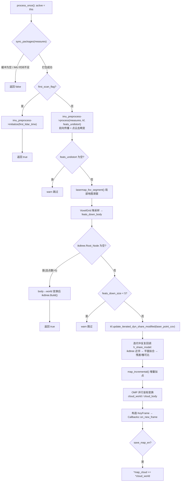
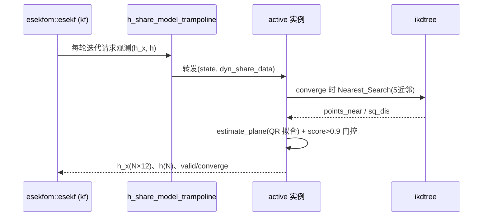

# FastLIO 里程计主流程

## 模块定位与职责

`asuka::fastlio::OdometryEstimation` 是五种里程计插件之一，继承自 `asuka::OdometryEstimation` 抽象基类（头文件 L39），实现完整的 LIO 主循环：

- **数据接入**：接收上游异步执行器转发的 IMU 与点云，维护有界环形缓冲；
- **时间同步**：将一帧激光与覆盖其扫描时段的 IMU 测量打包（`sync_packages`）；
- **IMU 前向传播与去畸变**：委托给 FastLIO 专属的 `ImuPreprocess`（另有专页详述）；
- **点面配准**：基于 `thirdparty/fastlio` 的 esekfom/ikfom 迭代误差状态卡尔曼滤波，观测模型由本类的 `h_share_model` 提供；
- **地图维护**：以 ikd_tree 增量 KD 树为局部地图，配合视域滑窗裁剪与增量加点；
- **结果输出**：每帧构造 `KeyFrame` 并通过全局回调 `Callbacks::on_new_frame` 发布，可选累积地图用于保存。

插件接入面极小：`create.cpp` 全文仅 6 行，导出 `extern "C" create_odometry_estimation()` 供 dlopen 工厂调用（create.cpp L3-L5）。

## 构造装配（odometry_estimation.cpp L10-L49）

构造函数完成四件事：

1. **创建私有预处理**：`ImuPreprocess` 与 `CloudPreprocess`（后者通过 `cloud_preprocess()` 暴露给 ROS 层，供点云入口统一调用）；
2. **读取配置**：`config_odometry` 提供 `max_iteration`（默认 4）、`laser_point_cov`（0.001）、`fov_degree`、`filter_size_surf/map`、`cube_side_length`、`max_distance`（作为 `det_range`）与缓冲容量（lidar 50 / imu 1000）；`config_ros` 的 `enable_map_saving` 决定是否累积 `map_cloud`；
3. **初始化滤波器**：`kf.init_dyn_share(ikfom::get_f, ikfom::df_dx, ikfom::df_dw, &h_share_model_trampoline, max_iterations, epsi)`——过程模型与雅可比由 `use_ikfom.hpp` 提供的 `state_ikfom`（含 rot/pos/vel/bg/ba 与雷达-IMU 外参 `offset_R_L_I/offset_T_L_I`）定义，观测函数以函数指针形式注入；收敛阈值 `epsi[23]` 全部填 0.001；
4. **初始化地图结构**：VoxelGrid 叶子大小设为 `filter_size_surf`，ikd_tree 降采样参数设为 `filter_size_map`。

## 关键状态一览

| 状态 | 作用 |
|---|---|
| `lidar_buffer` / `time_buffer` / `imu_buffer` | 有界环形缓冲，`buffer_mutex` 保护 |
| `lidar_pushed` / `pending_lidar*` / `lidar_end_time` | sync 阶段的"当前帧已取出但未凑齐 IMU"中间态 |
| `last_timestamp_imu` | `insert_imu` 更新，用于判断 IMU 是否覆盖到帧尾 |
| `lidar_mean_scantime` / `scan_num` | 扫描时长滑动均值，短帧/坏帧的兜底估计 |
| `first_scan_flag` | 首帧只做 `imu_preprocess->initialize(first_lidar_time)` 后直接返回 |
| `ekf_inited_flag` | 首帧起 `init_time`(0.1s) 后为真，门控 `map_incremental` 的去重点判断 |
| `localmap_initialized` / `local_map_points` | 局部地图包围盒状态，驱动滑窗裁剪 |
| `state_point` / `pos_lid` / `euler_cur` | 最新后验状态缓存，供坐标变换与 FOV 段使用 |
| `active`（static thread_local） | trampoline 转发用的当前实例指针（见下文） |

## process_once 主链路

关键节点说明：

- **`process_once` 的返回语义**（L99-L105）：`sync_packages` 失败返回 false（本轮无活可干）；一旦打包成功即调用 `process_scan` 并返回 true——即使 `process_scan` 内部因点数过少而提前返回，该帧也已消费。异步执行器靠循环调用本函数排空计算。
- **首帧特例**（L156-L161）：第一帧不参与估计，仅用其时间戳初始化 IMU 预处理。
- **初始建图分支**（L183-L192）：ikd树为空时，把降采样点经 `point_body_to_world`（用 `rot * (offset_R_L_I * p + offset_T_L_I) + pos` 全外参链）变换到世界系后 `ikdtree.Build`，本帧不做配准。

## sync_packages：帧-IMU 时间对齐（L107-L153）

1. 任一缓冲为空即返回 false；
2. 首次遇到一帧（`!lidar_pushed`）时计算帧尾时间：末点 `offset/1000.0`（毫秒转秒）为扫描时长；点数 ≤ 1 或时长小于 `0.5 × lidar_mean_scantime` 时退化为均值估计，否则按指数滑动更新均值（`scan_num` 递增）；
3. 若 `last_timestamp_imu < lidar_end_time`，保持 `lidar_pushed=true` 等待后续 IMU，返回 false；
4. 收集时间戳不晚于帧尾的 IMU 打入 `measures`，随后激光帧与时间戳出队、复位 `lidar_pushed`。

这一段是 rosbag 回环/丢 IMU 等异常的第一道闸门：帧只有在 IMU 完整覆盖后才进入滤波。

## 观测模型与 trampoline 模式

esekfom 要求以**裸函数指针**注册观测函数，而 `h_share_model` 需要访问实例成员。实现采用 `static thread_local OdometryEstimation* active`（hpp L121）+ 静态 trampoline（L330-L332）：`process_once` 入口处 `active = this`，滤波器每轮迭代回调 trampoline 时转发到当前线程的活跃实例。这样既满足 C 风格回调签名，又允许多线程各持一个实例。

`h_share_model` 内部（L334-L428）：

- 每个降采样体点按候选状态投到世界系；仅当 `ekfom_data.converge` 时才重新做近邻搜索（近邻数不足或最远距离平方 > 5 即剔除）；
- `estimate_plane`（hpp L70-L94）用 5 近邻做最小二乘平面拟合（`colPivHouseholderQr`），任一点到平面偏差超 0.1 即拒绝；再以 `score = 1 - 0.9·|pd2|/√‖p_body‖ > 0.9` 二次门控；
- 有效点压缩进 `laser_cloud_ori/corr_normvect`，`pd2` 暂存在法向量点的 `intensity` 字段；有效点数为 0 时置 `valid=false` 并告警；
- 雅可比每行 12 列：`[n, A, 0, 0]`，其中 `A = [p]× · R⁻¹n`；**外参列恒置零**——L418-L425 被注释的 `extrinsic_est_en` 分支保留了在线估计外参的完整实现，是现成的扩展开关；
- `h(i) = -norm_p.intensity`，即负的点到面距离残差。

## 局部地图维护

**`lasermap_fov_segment`**（L256-L309）：以雷达位置为中心维护边长 `cube_len` 的局部地图包围盒。当任一轴到盒边距离小于 `mov_threshold(1.5) × det_range` 时，整盒平移 `mov_dist`，把移出区域作为 `BoxPointType` 收进 `cub_needrm`，调用 `ikdtree.Delete_Point_Boxes` 裁剪，使地图始终跟随传感器。

**`map_incremental`**（L430-L474）：滤波收敛后逐点决定加入策略——

- 无近邻或 `ekf_inited_flag` 未置位：直接加入（要求降采样）；
- 计算该点所在体素中心 `mid_point`；若最近点在三个轴上都远离该体素（判定为互补观测），作为"无需再降采样"的点以 `downsample=false` 加入；
- 否则与 5 近邻比较到体素中心的距离，仅当新点更近才加入（`downsample=true` 交给 ikd_tree 判重）。

这个"按体素中心择优"的策略是 FastLIO 控制地图密度、避免重复点的核心。

## 输出与地图保存

每帧结束（L214-L254）：

- OMP 并行生成 `cloud_world`（世界系）与 `cloud_body`（IMU 体坐标系，经外参变换）；
- 构造 `KeyFrame`：自增 `id`、帧尾时间戳、`FrameId::IMU`、`T_world_imu`、`v_world_imu = state_point.vel`、`imu_bias`（bg/ba），并发布到 `Callbacks::on_new_frame` 供可视化/优化模块订阅；
- 注意 L237-L239 注释：`cloud_body` 是复用的成员缓冲，因此给 KeyFrame **深拷贝**一份 `cloud_imu`，观察者可任意长期持有——这是成员缓冲复用与对外发布之间的关键隔离点；
- `save_map_en` 开启时把 `cloud_world` 追加进 `map_cloud`；`save_map()` 仅在锁内返回该指针，本身不停止处理，安全依赖上层 `AsyncOdometryEstimation::save()` 先 join 工作线程的契约（与"地图保存与退出时序"页所述风险点呼应）。

## 边界条件汇总

| 条件 | 处理 |
|---|---|
| 点数 ≤ 1 或扫描时长远小于均值 | 用 `lidar_mean_scantime` 兜底并告警 |
| IMU 未覆盖到帧尾 | sync 挂起该帧继续等待 |
| 去畸变后点云为空 | 跳过本帧（帧已消费） |
| ikd树为空且降采样点 > 5 | 仅建初始地图，不做配准 |
| 降采样点 < 5 | 跳过配准 |
| 有效面点为 0 | `valid=false`，滤波器本轮拒绝更新 |
| 缓冲容量上限 | 环形缓冲自动淘汰最旧数据（lidar 50 / imu 1000） |

## 扩展点

- **外参在线估计**：取消 L418-L425 注释并接入 `extrinsic_est_en` 配置即可启用（B 块雅可比已写好）；
- **并行度**：`FASTLIO_ENABLE_OMP` / `FASTLIO_NUM_THREADS` 编译宏控制两处热点（坐标变换、近邻+拟合）的 OpenMP 并行；近邻距离缓冲走 `tls_search_sq_dis` 线程局部存储避免竞争；
- **参数面**：迭代次数、点面协方差、两级体素滤波、立方体边长、探测距离、缓冲容量均可经 `config_odometry.json` 调整；
- **换算法**：`so_name` 切到其它实现即可，本类只依赖基类契约，与框架零耦合。

## 阅读路线建议

按 `create.cpp`（最小插件样例）→ 本页主流程 → "FastLIO IMU 预处理"（前向传播细节）→ "FastLIO 点云预处理与插件注册" → thirdparty 的 `use_ikfom.hpp`/`esekfom.hpp` 与 ikd_tree 的顺序阅读，可完整覆盖该算法的数据流与数学框架。

Sources:
- `src/asuka/src/asuka/odometry/fastlio/odometry_estimation.cpp#L1-L240`
- `src/asuka/src/asuka/odometry/fastlio/odometry_estimation.cpp#L217-L487`
- `src/asuka/include/asuka/odometry/fastlio/odometry_estimation.hpp#L1-L120`
- `src/asuka/include/asuka/odometry/fastlio/odometry_estimation.hpp#L120-L185`
- `src/asuka/src/asuka/odometry/fastlio/create.cpp#L1-L6`

## 关联源码

- `src/asuka/src/asuka/odometry/fastlio/odometry_estimation.cpp`
- `src/asuka/include/asuka/odometry/fastlio/odometry_estimation.hpp`
