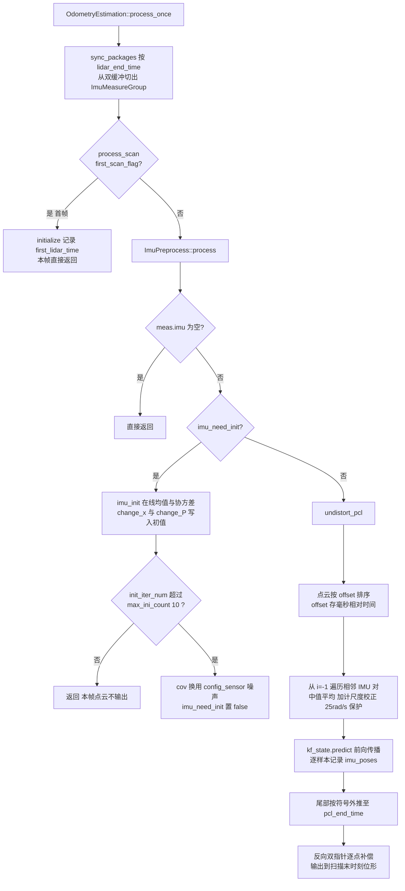

# FastLIO IMU 预处理

## 模块定位

`asuka::fastlio::ImuPreprocess` 是五种里程计算法中最重的 IMU 预处理实现（`imu_preprocess.cpp` 8.7KB，对比 Lightning 约 3KB、BatchLIO 3.2KB、SmallPointLIO 仅 0.7KB）。它继承抽象接口 `asuka::ImuPreprocess`（`core/imu_preprocess.hpp`），但对外契约的核心不是逐条 IMU 的流式接口——基类的 `insert_imu` 在此实现中**没有被覆写**，IMU 数据以批量段（`ImuMeasureGroup`）的方式经 `process()` 进入。

该模块承担两项职责：

1. **IMU 静止初始化**（`imu_init`）：在线估计加速度/陀螺均值与协方差，据此给出重力方向、陀螺偏置初值和滤波初始协方差；
2. **前向传播 + 点云去畸变**（`undistort_pcl`）：驱动 esekfom 的 `kf_state.predict` 沿时间轴推进 EKF 状态，并利用传播出的位姿时间线把每根激光点补偿到扫描末时刻的位形。

关键耦合点：`process`/`imu_init`/`undistort_pcl` 都接收 `esekfom::esekf<ikfom::state_ikfom, 12, ikfom::input_ikfom>& kf_state` 引用——**滤波器的状态推进发生在这里，而不是在 odometry 主类中**。IMU 预处理器通过 `predict`、`change_x`、`change_P` 直接改写 FastLIO 主流程所持有的 EKF。

## 数据契约：ImuMeasureGroup

定义于 `imu_preprocess.hpp#L26-L32`：

| 字段 | 含义 |
|---|---|
| `lidar_beg_time` / `lidar_end_time` | 当前扫描的起止时间（末时刻由 odometry 的 `sync_packages` 用 offset 估计） |
| `lidar` | 原始点云（`PointCloudT::ConstPtr`） |
| `imu` | 覆盖该扫描时间段的 IMU 批量样本 |

该结构体由 `fastlio::OdometryEstimation::sync_packages`（`odometry_estimation.cpp#L107-L153`）填充：odometry 持有 `lidar_buffer`/`imu_buffer` 双循环缓冲，等到 `last_timestamp_imu >= lidar_end_time` 后，把时间戳不超过扫描末时刻的 IMU 逐条弹出装段。

## 构造与配置装配

构造函数（`imu_preprocess.cpp#L9-L31`）完成三件事：

- 创建 `"preprocess"` 日志器并 `reset()` 全部状态；
- 读 `config_sensor`：先探测 `livox`/`robosense` 哪个块处于活动状态（都没有则直接 `throw std::runtime_error`），再从该嵌套块读取 `extrinsic_T`/`extrinsic_R`（→ `lidar_T_wrt_imu`/`lidar_R_wrt_imu`）、`gyro_noise`/`acc_noise`（→ `cov_gyro_scale`/`cov_acc_scale`）、`gyro_bias`/`acc_bias`（→ `cov_bias_gyro`/`cov_bias_acc`）；
- 读 `config_odometry` 的 `mapping.gravity_estimation`（默认 false），决定初始化策略分支。

## 初始化阶段：imu_init

- **在线均值/协方差**：采用单遍增量式更新（`mean += (cur - mean)/N`，协方差按 `(N-1)/N` 递推），`init_iter_num` 跨 measure group 累计；首帧用第一个 IMU 样本直接播种均值。
- **两种重力初始化**（`imu_preprocess.cpp#L106-L113`）：
  - `gravity_estimation = true`：用 `FromTwoVectors(mean_acc, (0,0,1))` 把初始旋转对齐到重力方向，重力固定为 `(0,0,-9.81)`（保持 S2 三自由度可估计）；
  - `false`：直接令 `grav = -mean_acc/|mean_acc| * 9.81`，即把均值加速度方向当作重力反方向，旋转初值不动。
- `bg = mean_gyro`：陀螺偏置初值吸收均值陀螺读数；激光-IMU 外参写入 `offset_T_L_I`/`offset_R_L_I`。
- `kf_state.change_x(init_state)` 写入状态，`change_P` 写入手工分块设定的初始协方差（下标 6-8、9-11、21-22 为 1e-5，15-17 为 1e-4，18-20 为 1e-3），对不同状态子块给出不同置信度量级。
- **完成条件**：`init_iter_num > max_ini_count(10)` 后，`cov_acc` 先按 `(g/|mean_acc|)²` 缩放、随后立即被 `cov_acc_scale`（配置的 `acc_noise`）覆盖，`cov_gyro` 同样换成配置值——即初始化结束后，传播噪声以传感器配置为准，在线估计值不再使用。

## 去畸变阶段：undistort_pcl

这是前向传播的核心路径（`imu_preprocess.cpp#L132-L257`）：

1. **排序**：点云副本按 `offset` 升序排序——offset 字段存放的是毫秒级相对时间，去畸变时除以 1000 换算为秒。
2. **位姿时间线播种**：`imu_poses` 首元素用上一帧遗留的 `acc_s_last`/`angvel_last` 和当前 EKF 状态构造，offset 为 0；`get_imu(-1)` 返回 `last_imu`，实现跨帧的 IMU 段衔接。
3. **逐区间传播**：从 `i = -1` 遍历相邻 IMU 对（head, tail）：
   - `tail->stamp < last_lidar_end_time` 的样本直接跳过（上一帧已积分）；
   - 角速度取中值 `0.5*(head+tail)`；加计取中值后乘 `g/|mean_acc|` 做尺度校正；
   - **重叠截断**：若 `head->stamp` 落在上一帧扫描末时刻之前，`dt` 改为 `tail->stamp - last_lidar_end_time`，避免重复积分；
   - 按 `cov_gyro/cov_acc/cov_bias_gyro/cov_bias_acc` 组装 12×12 过程噪声 Q，调用 `kf_state.predict(dt, Q, in)` 推进 EKF；
   - 每个尾部时刻记录 `Pose6D`（offset_time、去偏置后的机体角速度/加计、世界系 vel/pos/rot），同时更新 `angvel_last = angvel_avr - bg`、`acc_s_last = R*(acc_avr - ba) + grav` 供下一帧播种。
4. **尾部外推**：循环结束后按 `pcl_end_time` 与 `imu_end_time` 的大小关系取符号，再做一次 `predict` 把状态推到（或拉回）扫描末时刻；此时的 `imu_state` 即去畸变参考位形。
5. **反向补偿**：双指针从后向前遍历 `imu_poses` 与点云，对每个满足 `点时刻 > head->offset_time` 的点计算
   `R_i = R_head · exp(ω·dt)`，`T_ei = pos + vel·dt + ½·acc·dt² - pos_end`，再经外参链
   `P_comp = R_LI⁻¹ · (R_end⁻¹ · (R_i · (R_LI·P + T_LI) + T_ei) − T_LI)`
   把点变换到扫描末时刻的雷达机体坐标系，就地写回 x/y/z。

## 调用链全景

关键节点说明：

- **sync_packages / process_scan**：装配与首帧门控在 odometry 侧完成；首帧仅调 `initialize` 记录 `first_lidar_time` 就返回，不进入配准。
- **imu_init 循环**：初始化未完成的每个 measure group 只喂统计量，`process` 在 L70 直接 `return`——对应的点云帧被静默丢弃，直到累计超过 10 帧。
- **kf_state.predict**：全页的计算核心，IMU 预处理以"推进 EKF"的方式产出价值，输出是滤波状态 + 位姿时间线，而非独立结果。
- **反向补偿**：正向传播收集时间线、反向遍历写点，两段式结构使任意点都能插值到邻近两次传播之间。

## 关键状态一览

| 成员 | 作用 |
|---|---|
| `imu_need_init` / `b_first_frame` / `init_iter_num` / `max_ini_count=10` | 初始化阶段的状态机与完成阈值 |
| `mean_acc` / `mean_gyro` | 在线均值，用于重力对齐、偏置初值与加计尺度校正 |
| `cov_acc` / `cov_gyro` | 初始化期在线协方差；初始化完成后被配置的 `acc_noise`/`gyro_noise` 取代 |
| `cov_bias_gyro` / `cov_bias_acc` | 偏置过程噪声（config_sensor） |
| `cov_acc_scale` / `cov_gyro_scale` | 初始化完成后实际生效的传播噪声 |
| `last_imu` / `angvel_last` / `acc_s_last` | 跨帧衔接：`get_imu(-1)` 的头样本与 `imu_poses` 首元素的播种值 |
| `last_lidar_end_time` | 帧间重叠区间的裁剪边界 |
| `imu_poses` | 本次扫描内逐 IMU 样本的 Pose6D 时间线，反向补偿的直接输入 |
| `lidar_T_wrt_imu` / `lidar_R_wrt_imu` | 激光-IMU 外参（config_sensor），参与初始化与补偿公式 |
| `first_lidar_time` | 由 `initialize` 写入的时间基准 |

## 边界条件

- **空 IMU 段**：`process` 与 `undistort_pcl` 双重检查 `meas.imu.empty()`，静默返回，不产生任何状态变化。
- **初始化期吞帧**：`imu_need_init` 为真期间不输出点云，前若干帧只累积统计；调用方需依赖 `is_initialized()`（返回 `!imu_need_init`）判断就绪。
- **陀螺突跳保护**：head 或 tail 任一通道 `maxCoeff() > 25.0 rad/s` 即告警 "bad imu"，且整个 head→tail 区间被 `continue` 跳过（该区间既不传播也不记录位姿）。
- **帧间重叠**：`tail->stamp < last_lidar_end_time` 跳过；`head->stamp` 落入上一帧时 `dt` 截断为 `tail - last_lidar_end_time`。
- **外推方向**：`pcl_end_time > imu_end_time` 取 +1 否则 -1，处理激光末时刻晚于/早于最后 IMU 样本两种情况。
- **空点云/越界保护**：`pcl_out.points.empty()` 提前返回；补偿循环内 `it_pcl == begin` 时 break，防止双指针下溢。
- **offset 语义假设**：去畸变正确性完全依赖上游把每点相对时间（毫秒）写入 offset；`sync_packages` 估计 `lidar_end_time` 与扫描时长统计同样基于该字段。

## 扩展点

- **`gravity_estimation` 开关**（config_odometry 的 `mapping` 块）：在"旋转对齐 + 固定重力"与"重力取均值加速度反方向"两种初始化策略间切换。
- **config_sensor 按雷达命名空间组织噪声/外参**：构造函数通过探测活动块选择键名，新增雷达类型只需补充嵌套配置块（否则构造期抛异常快速失败）。
- **`reset()` 与 `initialize()`**：为重新初始化与外部时间基准注入留有入口（`imu_init` 的首帧分支内部也会调用 `reset()`）。
- **基类访问器契约**：`is_initialized()`/`get_mean_acceleration()`/`get_mean_gyroscope()` 把初始化进度与统计量暴露给 odometry 主流程，用于门控 EKF 就绪判断；`asuka::ImuPreprocess` 抽象基类则保证算法私有实现可替换而不影响框架其余部分。

Sources: `src/asuka/src/asuka/odometry/fastlio/imu_preprocess.cpp#L1-L261`
Sources: `src/asuka/include/asuka/odometry/fastlio/imu_preprocess.hpp#L1-L91`
Sources: `src/asuka/include/asuka/core/imu_preprocess.hpp#L1-L26`
Sources: `src/asuka/src/asuka/odometry/fastlio/odometry_estimation.cpp#L99-L160`

## 关联源码

- `src/asuka/src/asuka/odometry/fastlio/imu_preprocess.cpp`
- `src/asuka/include/asuka/odometry/fastlio/imu_preprocess.hpp`
