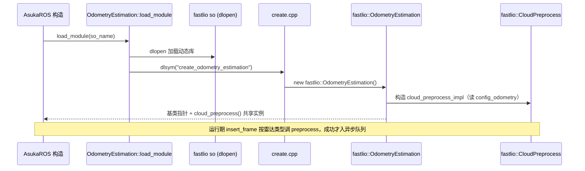
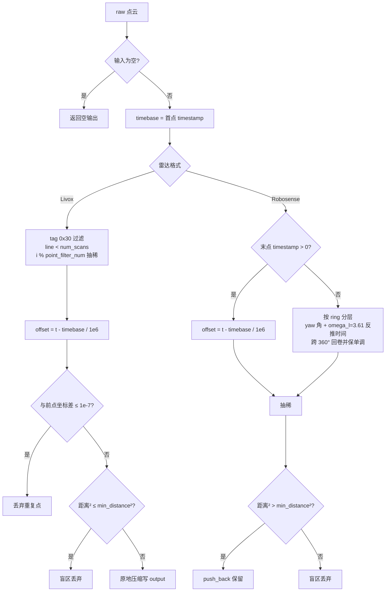

# FastLIO 点云预处理与插件注册

本页覆盖 `src/asuka/src/asuka/odometry/fastlio` 下两个互补的文件：**cloud_preprocess.cpp（4.2KB）** 实现 Livox/Robosense 两种点云到统一内部格式的转换与过滤，**create.cpp（181 字节）** 是整个算法插件机制的导出端点——六行代码完成 dlopen → dlsym → 构造算法实例的最后一环，是理解"算法模块如何接入主链路"的最小样本。

## 文件构成

| 文件 | 体量 | 职责 |
|---|---|---|
| `cloud_preprocess.cpp/.hpp` | 4.2KB / 0.9KB | 两种雷达格式的点云过滤、时间偏移计算、格式统一 |
| `create.cpp` | 181 字节 | `extern "C"` 导出插件工厂函数 |
| `odometry_estimation.hpp` | 5.6KB | 持有 cloud_preprocess 实例并暴露给上层（主流程另页详述） |

## create.cpp：插件接入的最小样本

```cpp
extern "C" asuka::OdometryEstimation* create_odometry_estimation() {
  return new asuka::fastlio::OdometryEstimation();
}
```

要点：

- **`extern "C"` 禁用名字修饰**，使 `dlsym(handle, "create_odometry_estimation")` 能以原始符号名定位入口。该函数的声明已经写在公共契约头 `asuka/core/odometry_estimation.hpp`（第 37 行），五种算法实现目录各自提供一份内容几乎相同的 create.cpp，唯一差异是 `new` 的具体类型。
- **返回裸指针、移交所有权**：`load_module(so_name)` 侧返回的是 `shared_ptr<OdometryEstimation>`（core 头第 31 行），即加载器负责用智能指针接管工厂产物，插件侧不做任何生命周期管理。
- 这个文件的存在本身就是**插件契约的可执行文档**：任何新算法要接入 asuka 主链路，只需要（a）继承 `asuka::OdometryEstimation`，编译为 so；（b）照抄这份 create.cpp。

## 核心契约：双重载的预处理接口

`asuka::CloudPreprocess`（core/cloud_preprocess.hpp）定义了两个虚函数重载——分别接受 `LivoxPoint` 与 `RobosensePoint` 的点云，且**默认实现返回 `nullptr`**。这个默认值承担"不支持"信号的角色：上游 `insert_frame` 按雷达类型分派后，只有预处理成功（非空/有效返回）才写入异步队列。fastlio 版本对两个重载都做了实现，因此同时支持两种雷达。

## 构造：从 config_odometry 读取预处理参数

构造函数从 `config_odometry` 配置读取四个参数并建 `preprocess` 日志器：

- `preprocess/min_distance`（默认 0.5）→ 盲区半径，运行时以平方值 `blind2` 参与比较；
- `preprocess/point_filter_num`（默认 1）→ 抽稀步长，用 `std::max(1, ...)` 钳位，保证除零/取模安全；
- `preprocess/scan_line`（默认 16）→ 线数 `num_scans`；
- `preprocess/scan_rate`（默认 10）→ 在所示代码中仅出现在构造期的 debug 日志，未参与实际计算（见下文 Robosense 的 `omega_l` 硬编码）。

## 两条预处理路径

两条路径共享同一骨架：取**首点 timestamp 作为 timebase**，把每个点的相对时间偏移写入输出点的 `offset` 字段（`(pt.timestamp - timebase) / 1e6`，FastLIO 系的惯例是下游去畸变/前向传播从 offset 读时间），并按盲区与抽稀过滤。注意帧级 `stamp` 参数被 `(void)stamp` 显式弃用——**逐点时间完全以点云内部 timestamp 为准，预处理不改变外部时间基准**。

**Livox 路径**：循环从 `i = 1` 开始（首点仅作 timebase，本身被丢弃）；依次做 tag 位过滤（`(tag & 0x30)` 只接受 `0x00`/`0x10` 两种取值）、线号越界过滤（`line >= num_scans` 丢弃）、抽稀（`i % point_filter_num != 0` 丢弃）、与前一保留点的坐标去重（三个轴差值均 ≤ 1e-7 视为重复）、盲区过滤。输出采用**先按输入尺寸 resize、再以 `out_idx` 原地压缩**的策略，最后收缩到实际点数。

**Robosense 路径**：先探测 `given_offset_time = 末点 timestamp > 0` 决定点云是否自带逐点时间。

- 自带时间：直接按 timebase 换算 offset，走抽稀 + 盲区后 `push_back`（`reserve(plsize)` 预留）。
- 不自带：**按 yaw 角反推时间**——每条 ring 的首点锚定 `yaw_fp[layer]` 并被跳过，后续点按 `(yaw_fp - yaw)/omega_l` 计算相对时间，跨 360° 用 `+360` 回卷，再以 `offset < time_last[layer]` 检测非单调并补一圈周期，保证同 ring 内时间单调递增。其中 `omega_l = 3.61` 是**硬编码常量**，量级对应默认 10Hz 转速（≈3.6°/ms），但并未从 `scan_rate` 配置推导——换转速雷达时这是需要留意的扩展点。

## 边界条件与风险点

- **空输入**：两条路径均在入口返回空输出，不抛错。
- **Livox 首点永久丢失**：`for (i = 1; ...)` 使第 0 个点只充当 timebase。
- **Robosense 缺少线号校验**：与 Livox 路径不同，Robosense 路径**没有** `line/ring >= num_scans` 的过滤，而 `yaw_fp`/`time_last` 等向量按 `num_scans` 分配、以 `pt.ring` 直接索引——若 `scan_line` 配置小于实际线数（如 16 配 32 线雷达），存在越界写风险，这是该文件最值得警惕的边界条件。
- **时间探测只看末点**：`given_offset_time` 仅检查最后一个点的 timestamp，若点云时间字段填充不完整可能误判分支。
- **去重阈值 1e-7 是浮点比较**，依赖坐标值域，对极近点有误杀可能，属可接受的工程取舍。

## 调用链



关键节点：`create.cpp` 是序列中唯一的 fastlio 侧代码，其余环节（dlopen 注册表、异步执行器）分别有专页；`cloud_preprocess()` 返回共享实例，使 ROS 层在数据入口就能用算法私有的预处理，而不必知道 fastlio 的存在。



关键节点：两分支的**输出契约一致**（`PointCloudT` + offset 承载相对时间），差异只在过滤顺序与时间来源；Robosense 的无时间戳回退分支是整套预处理中最"重"的逻辑，也是越界风险所在。

## 扩展点

- **新雷达类型**：需在 `asuka::CloudPreprocess` 基类新增虚重载（默认 nullptr），各算法按需覆盖——接口即扩展边界。
- **新算法接入**：复制 create.cpp 六行模板，替换 `new` 的类型即可，无需触碰加载器。
- **性能调优**：`min_distance`（盲区）与 `point_filter_num`（抽稀）是 config_odometry 中直接影响下游点数与算力的两个旋钮。
- **待改进处**：Robosense 路径的 ring 越界防护、`omega_l` 与 `scan_rate` 配置打通，是阅读该文件后最直接的两个候选修改点。

Sources:
- `src/asuka/src/asuka/odometry/fastlio/cloud_preprocess.cpp#L1-L136`
- `src/asuka/src/asuka/odometry/fastlio/create.cpp#L1-L6`
- `src/asuka/include/asuka/odometry/fastlio/cloud_preprocess.hpp#L1-L39`
- `src/asuka/include/asuka/core/cloud_preprocess.hpp#L1-L32`
- `src/asuka/include/asuka/core/odometry_estimation.hpp#L1-L40`
- `src/asuka/include/asuka/odometry/fastlio/odometry_estimation.hpp#L1-L110`

## 关联源码

- `src/asuka/src/asuka/odometry/fastlio/cloud_preprocess.cpp`
- `src/asuka/src/asuka/odometry/fastlio/create.cpp`
