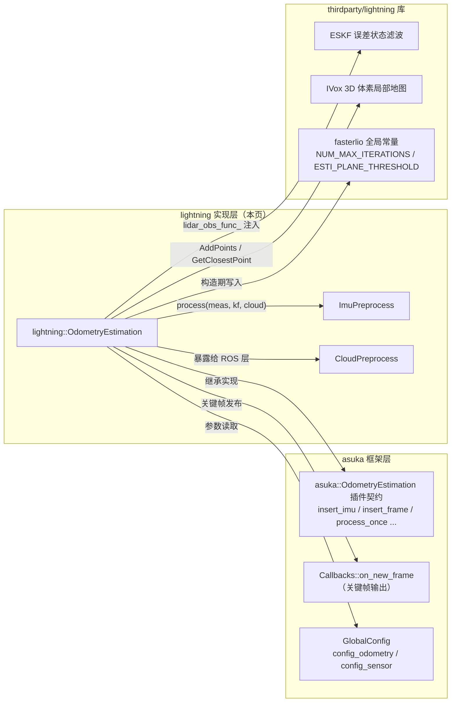
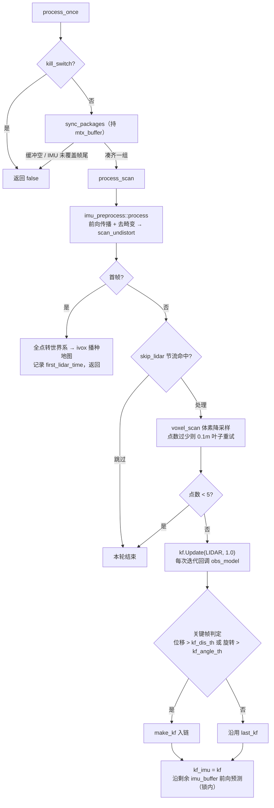

# Lightning 里程计主流程

## 模块定位与文件构成

`asuka::lightning::OdometryEstimation` 是五种里程计插件中"第三方算法库 + asuka 框架"结合方式的典型样本：它自身不做滤波与地图算法，而是把 thirdparty/lightning 库的三件核心组件——`core/lio/eskf.hpp`（误差状态滤波）、`core/ivox3d/ivox3d.h`（三维体素局部地图）、`core/lio/imu_processing.hpp`（IMU 处理）——组装进 `asuka::OdometryEstimation` 插件契约（`insert_imu / insert_frame / process_once / workload / stop / save_map / cloud_preprocess`）。

| 文件 | 体量 | 职责 |
|---|---|---|
| `odometry_estimation.hpp` | 4.6KB | 类声明：双 ESKF、ivox、三重缓冲、配准暂存、全部参数成员 |
| `odometry_estimation.cpp` | 23.3KB | 主流程实现（本页主体） |
| `imu_preprocess.cpp` / `cloud_preprocess.cpp` | 约 3KB | 轻量预处理，逻辑下沉在 lightning 库内 |
| `create.cpp` | 185B | 插件导出 |

头文件以 `IVoxType = ::lightning::IVox<3, IVoxNodeType::DEFAULT, PointType>` 实例化局部地图，并持有 `kf` 与 `kf_imu` **两份** `::lightning::ESKF`、当前状态 `state_point`（NavState）、关键帧链（`all_keyframes` / `last_kf` / `proj_kfs`）以及去畸变→降采样→世界系三级点云（`scan_undistort` → `scan_down_body` → `scan_down_world`）。

图中关键点：实现类对 ESKF 的唯一耦合点是构造期注入的 `lidar_obs_func_` lambda（cpp L79-81），库的滤波框架因此保持通用；对 ivox 既是写入（地图增量）也是读取（近邻查询）。注意 `fasterlio::NUM_MAX_ITERATIONS` 等是**库级全局常量**，构造函数直接对其赋值——同类常量在进程内共享，多实例场景是潜在风险点。

## 构造装配：两份配置文件决定全部行为

构造函数（cpp L13-88）依次完成：

1. 创建 `"odometry"` 日志器，实例化 lightning 版 `ImuPreprocess` 与 `CloudPreprocess`。
2. 读 `config_odometry`，映射为库全局常量与成员：`max_iteration`/`esti_plane_threshold` → `fasterlio::NUM_MAX_ITERATIONS`/`ESTI_PLANE_THRESHOLD`；残差与开关类 `use_aa`（Anderson 加速）、`enable_icp_part`、`plane_icp_weight`（1.0）、`icp_weight`（100.0）、`min_pts`（300）；关键帧阈值 `kf_dis_th`（2m）、`kf_angle_th`（15°，构造时转弧度）；跳帧节流 `skip_lidar_num`（>0 才启用）；`proj_kfs`/`max_proj_kfs`；缓冲容量 `lidar_buffer_capacity`（默认 50，lidar 与 time 共用）、`imu_buffer_capacity`（1000），均为 `boost::circular_buffer`（满员自动丢弃最旧数据）。
3. 读 `mapping` 段：`filter_size_scan` / `filter_size_map`、`ivox_grid_resolution`（0.2）、`ivox_nearby_type`（0/6/18/26 → CENTER/NEARBY6/NEARBY18/NEARBY26，非法值回退 NEARBY18），据此构造 `ivox`。
4. 读 `config_sensor`：经 `active_lidar_key()` 按 `config_ros.lidar_type` 选择 `livox` 或 `robosense` 块，块不存在则抛 `std::runtime_error`（插件装载即失败）；其 `extrinsic_R/T` 存为 `offset_r_lidar_fixed`/`offset_t_lidar_fixed`（lidar→IMU 外参），贯穿点云转世界与观测模型。
5. 配置 `ESKF::Options`（迭代上限、收敛阈值 `epsi_=1e-3`、`use_aa_`、观测回调）并 `kf.Init(...)`。

两个值得注意的细节：`keep_first_imu_estimation` 读入后立即 `(void)` 丢弃，是尚未生效的配置接缝；`stop()` 只做 `kill_switch = true` 加锁清空三缓冲（析构自动调用）。

## 数据入口与双 ESKF 状态设计

- **insert_imu**：asuka `ImuData` 转为 `::lightning::IMU`；锁内若 `imu_preprocess->is_initialized()` 则对 **kf_imu** 执行 `Predict(dt, q, gyro, acc)` 实时前向（`dt = stamp - last_timestamp_imu`，该水印同时是 sync_packages 的覆盖判定基准），最后更新水印并入 `imu_buffer`。时间回环不做处理——检测统一在 `AsukaROS::handle_loop_back` 告警。
- **insert_frame**：对点云**深拷贝**后与时间戳分别入 `lidar_buffer`/`time_buffer`。

双 ESKF 的分工是本实现的核心状态设计：`kf` 是"LIO 修正态"，只在 `kf.Update` 时被观测改变；`kf_imu` 是"实时前向态"，随每条 IMU 即时预测，每帧处理完后用 `kf_imu = kf` 对齐、再沿剩余 `imu_buffer` 前向补齐（cpp L336-345）。这保证了不依赖配准完成时刻的即时位姿可用。

## 主循环：process_once → sync_packages → process_scan

`workload()` 仅返回 `lidar_buffer.size()`（与全局页所述"只反映输入缓冲"一致）。`process_once` 先检查 `kill_switch`，再 `sync_packages` 凑数据，成功则 `process_scan`。

图后说明几个关键节点：

- **sync_packages**（L177-235，全程持锁）：`lidar_pushed` 标志把"取帧"与"凑 IMU"两阶段解耦。帧尾时间 `lidar_end_time` 由尾点 `offset/1000`（即扫描时长，秒）估计，并维护运行均值 `lidar_mean_scantime`；点数 ≤1 或尾点时长小于半倍均值时退回均值兜底；超长扫描钳制到 `5 × lidar_time_interval`。均值还会回写库内全局变量 `::lightning::lo::lidar_time_interval`——又一处全局状态写入。只有 `last_timestamp_imu >= lidar_end_time` 才倾倒 IMU（时间 ≤ 帧尾的全部转入 `measures.imu`）。值得注意的是插入时 asuka→lightning 转换、这里又转回 asuka `ImuData` 填入 `::lightning::MeasureGroup`，说明库的 MeasureGroup 在本仓库被适配为承载 asuka 类型。
- **首帧分支**：不做配准，只把全部去畸变点转世界系后 `ivox->AddPoints` 播种地图，记录 `first_lidar_time`。
- **跳帧节流**：`skip_lidar_cnt` 循环计数，仅每 `skip_lidar_num` 帧真正处理一次，以降频换实时。
- **初始化标志**：`ekf_inited_flag` = 运行时长 ≥ `fasterlio::INIT_TIME`；另有断流告警（与上帧间隔 > 0.5s）。
- **降采样与守门**：`voxel_scan`（叶子 `filter_size_scan`）产出 `scan_down_body`；若点数 < 输入 10% 或 < `min_pts`，改 0.1m 叶子重试；仍 <5 点整帧跳过。
- **迭代更新**：`kf.Update(ESKF::ObsType::LIDAR, 1.0)` 触发迭代 ESKF，每次迭代经注入的 lambda 回调 `obs_model`；`delta_translation`/`delta_rotation_deg` 被计算后 `(void)` 丢弃，属诊断残留。

## 观测模型 obs_model：点面残差 + 可选 ICP 项

`obs_model`（L423 起）是 ESKF 与 ivox 的交汇处：

1. 并行（`std::execution::par_unseq`）逐点：按当前状态与外参把 body 点投到世界系（`R_wl = R·R_l`，`t_wl = R·t_l + p`）；`ivox->GetClosestPoint` 取 `NUM_MATCH_POINTS` 近邻；近邻数 ≥ `MIN_NUM_MATCH_POINTS` 才继续；`esti_plane` 以 `ESTI_PLANE_THRESHOLD` 拟合平面；点面残差 `pd2` 受距离门限 `p_body.norm() > 81·pd2²` 约束（FAST-LIO 系经典门限，容忍度随距离平方放大）。
2. 结果压缩进 `corr_pts`/`corr_norm`，统计 `effect_feat_surf`/`effect_feat_icp`；有效面点 <20 时置 `obs.valid_ = false` 并告警，本次迭代放弃观测。
3. 第二个并行段按 `J = [n, (p×)·Rᵀn]`（1×`pose_obs_dim_`）逐点算 `JTJ`/`JTr`，随后**串行归约**乘 `plane_icp_weight` 累入 `obs.HTH_`/`obs.HTr_`——"并行填充 per-point 数组 + 串行求和"避免了并行累加竞争。同时输出残差平方的中位数/最大值（`obs.lidar_residual_mean_`/`lidar_residual_max_`）供质量评估。
4. `enable_icp_part` 开启时追加 ICP 残差项（`icp_weight` 默认 100，远高于点面项权重 1.0）。已读证据在 L549 处截断，该 ICP 项的完整构建与常规帧地图写入（`map_incremental`）的具体调用位置位于已读范围之外。

## 地图维护与导出

`point_body_to_world` 实现 `p_w = R·(R_l·p + t_l) + t`。`map_incremental`（L368-421）并行把 `scan_down_body` 转世界系后逐点判定是否入图：若最近邻点与目标体素中心三轴偏差均超过半个体素则"无需降采样"直接加；否则仅当没有比当前点更靠近中心的已有点时才加入，两批分别 `ivox->AddPoints`——且未初始化期（`ekf_inited_flag` 为假）无条件全部加入。ivox 因此既是配准的近邻查询结构也是增量地图本身。`save_map()`（L112-118）持 `mtx_buffer` 调 `get_global_map(true)` 把地图导出为 asuka `PointCloudT`。

## 关键状态一览

| 状态 | 守护方式 | 含义 |
|---|---|---|
| `lidar_buffer` / `time_buffer` / `imu_buffer` | `mtx_buffer` | 三重输入缓冲，circular_buffer 满员丢弃 |
| `kill_switch` | `atomic<bool>` | stop 置位，process_once 直接退出 |
| `lidar_pushed` / `lidar_end_time` / `lidar_mean_scantime` / `scan_num` | `mtx_buffer` | sync_packages 两阶段配准状态 |
| `last_timestamp_imu` | `mtx_buffer` | 前向预测 dt 与 IMU 覆盖判定的基准 |
| `first_scan_flag` / `ekf_inited_flag` / `skip_lidar_cnt` | 单 worker 隐式串行 | 初始化与节流状态 |
| `kf` vs `kf_imu` | worker + insert_imu 锁内 | LIO 修正态 / 实时前向态 |
| `state_point` / `all_keyframes` / `last_kf` | worker | 当前 NavState 与关键帧链 |
| `fasterlio::NUM_MAX_ITERATIONS` 等 / `lo::lidar_time_interval` | 进程级全局 | 库内全局常量/变量，构造与运行期写入 |

## 边界条件

- **时间回环**（rosbag 循环）：算法内不检测、不处理，由 `AsukaROS::handle_loop_back` 统一告警；回退数据按新时间线继续流入。
- **退化输入**：点云 ≤1 点用均值扫描时长兜底；降采样后过少两档重试，仍 <5 点跳帧；有效面点 <20 时本次迭代放弃观测。
- **配置缺失**：`config_sensor` 无 `lidar_type` 对应的雷达块 → 构造抛异常。
- **停机**：stop 后 `process_once` 恒返回 false；析构自动 `stop()`，缓冲在锁内清空，无残留线程。

## 扩展点

- **观测模型注入**：ESKF 经 `lidar_obs_func_` 回调耦合，替换数据关联/残差只需改 `obs_model`。
- **全参数化**：权重、阈值、ivox 分辨率与邻域类型、缓冲容量、跳帧率均出自 `config_odometry`，无需改代码。
- **预留开关**：`keep_first_imu_estimation`（当前被 `(void)` 空置）、`proj_kfs_en`/`max_proj_kfs`（投影关键帧，成员 `proj_kfs` 已就位）。
- **kf_imu 实时位姿**：可为前向预测等扩展模块提供不依赖配准完成的即时状态。

本目录的预处理与插件导出细节见下一页（Lightning 预处理与插件注册）。

Sources:
- `src/asuka/include/asuka/odometry/lightning/odometry_estimation.hpp#L1-L153`
- `src/asuka/src/asuka/odometry/lightning/odometry_estimation.cpp#L1-L120`
- `src/asuka/src/asuka/odometry/lightning/odometry_estimation.cpp#L120-L330`
- `src/asuka/src/asuka/odometry/lightning/odometry_estimation.cpp#L330-L540`
- `src/asuka/src/asuka/odometry/lightning/odometry_estimation.cpp#L534-L700`

## 关联源码

- `src/asuka/src/asuka/odometry/lightning/odometry_estimation.cpp`
- `src/asuka/include/asuka/odometry/lightning/odometry_estimation.hpp`
