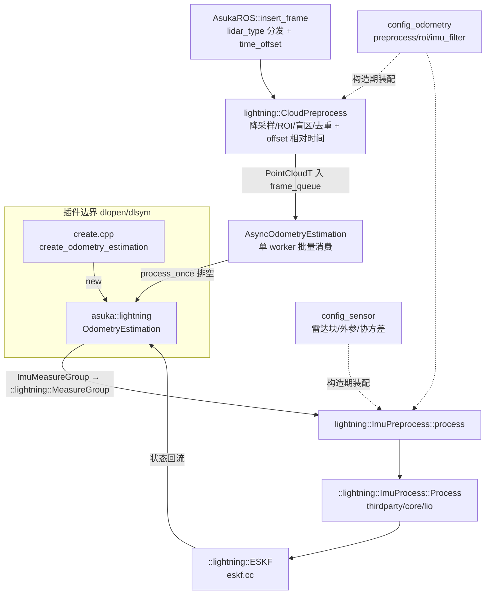

# Lightning 预处理与插件注册

## 模块定位

`src/asuka/src/asuka/odometry/lightning/` 目录共四个文件：主流程 `odometry_estimation.cpp`（23.3KB，另页详述）之外，剩下三个薄文件构成本页主题：

| 文件 | 体量 | 职责 |
|---|---|---|
| `imu_preprocess.cpp` | ~2.9KB | 装配 thirdparty 的 `ImuProcess`，并在运行期做 asuka→lightning 类型桥接 |
| `cloud_preprocess.cpp` | ~3.0KB | 两种雷达的点云滤波流水线，写相对时间到 offset |
| `create.cpp` | 185B | `extern "C"` 工厂，把算法接入 dlopen 插件体系 |

这一组文件的设计取向非常明确：**不实现算法，只做翻译和挂载**。IMU 前向传播、去畸变、ESKF 状态估计全部下沉在 `thirdparty/lightning/core/lio/`（`imu_processing.hpp` 12KB、`eskf.cc` 12.7KB 等），asuka 侧只保留配置装配与数据结构转换的胶水代码。

## IMU 预处理：构造期装配 + 运行期桥接

### 构造期：从两份配置装配库内处理器

`ImuPreprocess` 构造函数（`imu_preprocess.cpp#L9-L41`）持有 `std::shared_ptr<::lightning::ImuProcess>`（注意顶层命名空间的 `::lightning` 是 thirdparty 库，与 `asuka::lightning` 区分），并完成三段装配：

1. **传感器外参**（`imu_preprocess.cpp#L14-L27`）：读 `config_sensor`，按 `has("livox")` → `has("robosense")` 的优先级确定活动雷达块；两者都不存在则直接 `throw std::runtime_error`——**配置错误在进程启动即暴露，而不是在首帧数据时才失败**。外参缺省值为平移零、旋转单位阵，经 `SetExtrinsic` 注入。
2. **噪声协方差**（`imu_preprocess.cpp#L29-L36`）：`gyr_cov`/`acc_cov` 缺省 0.1，`b_gyr_cov`/`b_acc_cov` 缺省 0.0001，四个 `Vec3d` 分别注入。
3. **库内滤波开关**（`imu_preprocess.cpp#L38-L40`）：读 `config_odometry` 的 `odometry.imu_filter`（缺省 false），决定 thirdparty 的 `imu_filter.h` 路径是否生效。

### 运行期：一次结构转换，一次委托

`process()`（`imu_preprocess.cpp#L47-L64`）做的事纯粹是类型翻译：

- 把 asuka 侧的 `ImuMeasureGroup`（`lidar_beg_time`/`lidar_end_time`/`lidar`/`imu`，见 `imu_preprocess.hpp#L25-L31`）逐字段转成 `::lightning::MeasureGroup`；`scan_` 与 `scan_raw_` 共享同一指针，原始扫描副本交给库内自行处理。
- IMU 样本逐条转为 `::lightning::IMU`（timestamp/角速度/线加速度），随后一次性委托 `pimu->Process(lmeas, kf_state, pcl_out)`。

三个值得注意的接口细节：

- **`process` 不是基类虚函数**（头文件中无 `override`，且签名带 `::lightning::ESKF&`）。它只能被同样依赖 lightning 库的 `odometry_estimation.cpp` 调用——ESKF 由主流程持有，预处理只是往里喂数据，这是算法私有接口而非框架契约。
- **初始化职责完全在库内**：`initialize(lidar_start_time)` 是空实现（`imu_preprocess.cpp#L43-L45`），`is_initialized()` 直接委托 `pimu->IsIMUInited()`，`get_mean_acceleration()/get_mean_gyroscope()` 恒返回零向量。对比 FastLIO 那份 8.7KB、需要外部累计均值做重力对齐的 IMU 预处理，这是"逻辑下沉"最直观的证据。
- **`q()` 暴露库内 12×12 噪声阵 `pimu->Q_`**（`imu_preprocess.hpp#L45`），供主流程配置 ESKF 时直接取用，是 asuka 侧预留的调参窗口。

## 点云预处理：一套参数、两条路径

构造函数（`cloud_preprocess.cpp#L11-L18`）从 `config_odometry` 读五个参数：`preprocess.min_distance`（缺省 0.1）、`preprocess.point_filter_num`（缺省 4）、`preprocess.scan_line`（缺省 32，**读入 `num_scans` 但在所示代码路径中未使用**，属配置兼容面）、`roi.height_max/height_min`（缺省 ±1.0）。

两条 `preprocess` 重载共享同一套滤波骨架，但细节有差异：

| 环节 | Livox 路径（L20-L63） | Robosense 路径（L65-L100） |
|---|---|---|
| 等间隔降采样 | `i % point_filter_num == 0` 才保留 | 同左 |
| 高度 ROI | 有 | 有（顺序在盲区之后） |
| 平方盲区 | `range² > min_distance²` | 同左 |
| 相邻重复点剔除 | 有（相邻三点差 < 1e-7，L41-L45） | **无** |
| offset 时间基准 | `points[0].timestamp` 作 timebase，`(t - timebase)/1e6` | 传入的 `stamp` 作基准，`(t - stamp)*1e3` |

两条路径换算常数方向相反（÷1e6 与 ×1e3），但都归一到毫秒量级写入 `offset`——这个字段承载每个点的相对时间，正是后续 thirdparty `ImuProcess::Process` 做运动补偿的输入。**两者基准不同（首点时间戳 vs 扫描起始戳）是移植或对齐其他实现时最容易踩的坑**；Livox 路径的 `stamp` 参数甚至被显式 `(void)` 丢弃。

共同收尾：`width`/`height=1`、`is_dense=false`（下游不应假设稠密）、debug 日志输出前后点数；空点云在入口即早退。另注意 `output` 是成员缓冲、每次调用 `clear()` 后复用并返回同一指针——调用方须在下次调用前消费完毕。

## create.cpp：185 字节的最小插件样本

```cpp
extern "C" asuka::OdometryEstimation* create_odometry_estimation() {
  return new asuka::lightning::OdometryEstimation();
}
```

全部内容如上（`create.cpp#L1-L6`）。`OdometryEstimation::load_module` 以 `dlopen` 打开 so 后，按符号名 `create_odometry_estimation` 解析此工厂，得到向上转型为基类指针的算法实例——五种实现统一遵循此模式，这里是理解插件边界的最小样例。

## 调用链总览



关键节点解读：**点云预处理发生在 ROS 层入队之前**（AsukaROS 取出插件共享的 `cloud_preprocess` 先行调用），而 **IMU 预处理发生在 worker 线程内、由主流程携带 ESKF 调用**——两者位于链路的不同层，这正是 `process` 签名不对称的原因。虚线为构造期一次性配置流，实线为每帧数据流。

## 边界条件与扩展点

- **配置 fail-fast**：`config_sensor` 无活动雷达块则构造抛异常；换雷达必须同步改配置块与 `lidar_key` 分支。
- **Livox timebase 取首点**：首点时间戳异常会污染整帧 offset。
- **`scan_line` 参数悬空**：读入未用，删除或启用它都是合理的清理点。
- **扩展新雷达类型**：`cloud_preprocess` 加一个重载 + `imu_preprocess.cpp#L15-L20` 加一个 `else if` 分支 + `config_sensor` 加配置块，三处缺一不可。
- **调参面**：`imu_filter` 开关切换库内滤波路径；`q()` 直通库内噪声阵；`preprocess/roi` 两组参数控制点云密度与范围。

Sources: `src/asuka/src/asuka/odometry/lightning/imu_preprocess.cpp#L1-L80` | `src/asuka/src/asuka/odometry/lightning/cloud_preprocess.cpp#L1-L104` | `src/asuka/src/asuka/odometry/lightning/create.cpp#L1-L6` | `src/asuka/include/asuka/odometry/lightning/imu_preprocess.hpp#L1-L55`

## 关联源码

- `src/asuka/src/asuka/odometry/lightning/imu_preprocess.cpp`
- `src/asuka/src/asuka/odometry/lightning/cloud_preprocess.cpp`
- `src/asuka/src/asuka/odometry/lightning/create.cpp`
