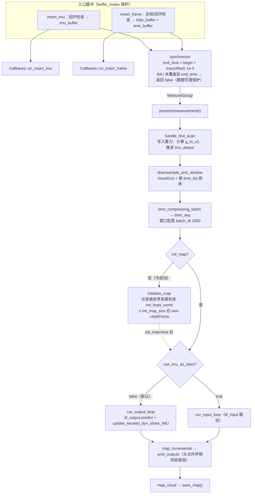

# BatchLIO 里程计主流程（odometry_estimation）

## 定位与文件构成

`src/asuka/src/asuka/odometry/batchlio/odometry_estimation.cpp`（43.8KB）是五种里程计实现中最大的单文件，与 6.6KB 的同名头文件共同承载批量式 LIO 的状态估计主循环。子模块内的其余文件围绕它服务：

| 文件 | 体量 | 角色 |
| --- | --- | --- |
| `odometry_estimation.cpp/.hpp` | 43.8KB / 6.6KB | 主估计循环、双 ESKF、缓冲与地图维护 |
| `common.hpp/.cpp` | 4.9KB / 4.2KB | `batch::state_input/state_output`、`MeasureGroup`、`IVoxType`、`time_compressing_batch`/`time_list`、`reset_cov`、`get_f_input/df_dx_*` 等批处理公共件 |
| `so3.hpp` | 4.0KB | SO(3) 流形运算（状态中 `rot` 为 `batch::SO3`） |
| `cloud_preprocess.cpp` / `imu_preprocess.cpp` | 5.3KB / 3.2KB | 数据入口的算法私有预处理 |
| `create.cpp` | 183B | `extern C` 插件导出 |

类声明 `class OdometryEstimation : public asuka::OdometryEstimation`（且显式 delete 拷贝），完整实现了基类契约：`insert_imu / insert_frame / process_once / workload / stop / clear_buffers / save_map / cloud_preprocess`，其中 `cloud_preprocess()` 返回内部 `cloud_preprocess_impl` 供 ROS 层在入队前调用。

## 构造装配：三份配置 + 双滤波器

构造函数一次读齐三份配置：

- **config_odometry**：`batch`（dt=0.001、deskew、enable_openmp）、`mapping`（约 20 个键：imu_en、各类协方差、plane_thr、match_s、init_map_size、use_imu_as_input、gravity 等）、`odometry`（四个 circular_buffer 容量）、`filter`（surf/map 体素尺寸）；
- **config_ros**：仅取 `enable_map_saving` 决定是否维护 `map_cloud`；
- **config_sensor**：探测 `livox`/`robosense` 哪个块处于活动状态，读取外参 `extrinsic_T/extrinsic_R`；**无活动雷达块直接 throw**，这是构造期唯一硬失败点。

滤波器装配的核心是**双 ESKF 并存**：

```cpp
kf_input.init_dyn_share_modified_2h(get_f_input, df_dx_input, &h_model_input_trampoline);
kf_output.init_dyn_share_modified_3h(get_f_output, df_dx_output,
                                     &h_model_output_trampoline, &h_model_imu_output_trampoline);
```

两套滤波器对应同一状态的不同参数化：匿名命名空间的 `reset_state_input/output` 展示了字段——`state_input` 含 `pos/rot/offset_R_L_I/offset_T_L_I/vel/bg/ba/gravity` 共 8×3 = **24 维**；`state_output` 额外携带 `omg/acc`，共 **30 维**。即 input 模式把 IMU 当控制输入（状态里只需 bias），output 模式把 IMU 当量测（状态里必须显式携带角速度/比力）。`use_imu_as_input`（默认 false）决定运行路径。随后 `reset_cov` → `change_P` 初始化协方差，`process_noise_cov_input/output` 生成 24×24 / 30×30 过程噪声。

局部地图用 `batch::IVoxType`：分辨率来自 `ivox_grid_resolution`（默认 2.0m），`ivox_nearby_type` 把 0/6/18/26 映射到 CENTER/NEARBY6/18/26，非法值回退 NEARBY18。OpenMP 线程数在 `batch_omp` 开启时取 `min(omp_get_max_threads(), 16)`。

## 关键状态分组

| 分组 | 成员 | 说明 |
| --- | --- | --- |
| 输入缓冲 | `lidar_buffer`/`time_buffer`/`imu_buffer`（环形，容量可配）+ `last_imu_stamp`/`last_lidar_stamp` | 全部由 `buffer_mutex` 保护；环形写满覆盖最旧 |
| IMU 初始化 | `initializing_imu`、`imu_initialization`、`last_synchronized_imu` | 初始化期样本额外转交 `imu_preprocess` |
| 双 ESKF | `kf_input`(24)/`kf_output`(30)、`p_input/p_output/q_input/q_output` | `use_imu_as_input` 二选一 |
| 批处理工作区 | `feats_down_body/world`（预分配 10000）、`normvec`（100000）、`point_selected_surf[100000]`、`time_seq`、`nearest_points`、`crossmat_list` | 大容量预分配，避免迭代中反复申请 |
| 局部地图 | `ivox`、`init_feats_world`、`init_map`、`init_map_size`(默认100) | 冷启动累积 → 注入 IVox |
| 帧内时序 | `imu_deque`、`imu_last/imu_next`、`time_current`、`time_update_last`、`time_predict_last_const` | 输出循环里在点时刻间插值推进 IMU |
| 输出 | `map_cloud`、`pcd_save_en` | `save_map()` 直接返回 `map_cloud` |

## 调用链：从 insert 到 process_once

上层 `AsyncOdometryEstimation` 先成批喂 `insert_imu/insert_frame`，再循环调 `process_once()` 排空计算。两个 insert 都做**时间回环检查**（stamp 回退即丢弃并告警——这是 asuka_ros 层之后算法内的第二道防线），随后在锁外触发 `Callbacks::on_insert_imu/on_insert_frame` 事件。主循环结构如下：



图中 `synchronize → process` 为源码直接证据（L214-218）；`process` 内部的阶段顺序按私有方法族与文件内定义顺序重构（process 主体位于证据片段之外），`map_incremental/emit_outputs` 为头文件声明的管线收尾。

### synchronize 的三个细节

1. **扫描结束时刻**由点云内 `offset` 最大值（每点相对时刻，毫秒）推得：`end_time = begin_time + max_offset * 1e-3`；
2. **数据饥饿保护**：`imu_enabled && last_imu_stamp < end_time` 时返回 false，本帧留待下一轮——保证任何窗口都有完整 IMU 覆盖；
3. 初始化期把窗口内 IMU 复制进 `imu_initialization` 并挂到 `measurements.imu_initialization`；正常运行后若窗口无 IMU，则复用 `last_synchronized_imu` 兜底；窗口后第一条 IMU 单独放入 `imu_after_end`。

`process_once` 在 `process` 后检查 `imu_preprocess->imu_need_init`，一旦初始化完成即清空 `imu_initialization` 并置 `initializing_imu=false`，完成初始化状态的交接闭环。`workload()` 只返回 `lidar_buffer.size()`，与异步执行器页所述"workload 只反映输入缓冲"一致。

### run_output_loop：传播与更新的节奏（证据至 L429）

按 `time_seq` 划分的每个窗口，循环做两件事：

- **IMU 推进**：维护 `imu_last/imu_next` 双指针扫过 `imu_deque`，当 `time_current > imu_next.stamp` 时取新 IMU 值写入 `angvel_avr/acc_avr`；
- **双段 predict**：`kf_output.predict(dt, q_output, input_in, true, false)` 在两个 IMU 时刻间推进状态；随后以 `predict(dt_cov, …, false, true)` 传播协方差并调 `kf_output.update_iterated_dyn_share_IMU()`——即把 IMU 本身作为量测做迭代更新（这正是 output 模式的语义）。

无 IMU 模式下（`imu_en=false`）`handle_first_scan` 直接把 `acc` 置为 `-gravity` 并强制 `imu_need_init=false`，整条 IMU 链路被旁路。

## 双 ESKF 与 trampoline 量测回调

esekfom 的量测回调是 C 风格静态函数，而残差计算需要访问实例状态。本实现用 `static thread_local OdometryEstimation* active` 解决：`process_once` 在进入 `process` 前执行 `active = this`，三个 `h_model_*_trampoline` 借此转发到实例的 `h_model_input`（点面残差）、`h_model_output`（点面 + IMU 量测残差）、`h_model_imu_output`。这三个函数是整个配准数学的定制点，也是阅读本文件后半部分（L750 之后）的主线索。

## 标志位与生命周期边界

| 标志 | 初值 | 翻转时机 |
| --- | --- | --- |
| `first_scan_flag` | true | `handle_first_scan` 首次执行（记录首帧/首 IMU 时刻、设重力） |
| `is_first_frame` | true | `run_output_loop` 处理第一个窗口时 |
| `initializing_imu` | true | `process_once` 检测到 `!imu_need_init` 后 |
| `init_map` | false | `init_feats_world ≥ init_map_size`，注入 IVox 后 |
| `reset_flag` | true→false | `reset()` 执行期间（整体复位含新建 IVox、重置双滤波器） |

防御性边界汇总：空点云直接丢弃；IMU/激光时间回环丢弃并告警；IMU 未覆盖窗口尾则整帧等待；`config_sensor` 无活动雷达块抛异常；`ivox_nearby_type` 非法值回退；析构函数调 `stop()` 清空三个缓冲。`stop()` 与 `clear_buffers()` 有意区分：前者只清缓冲（静默化），后者额外清 `imu_initialization`、复位同步水位与 `initializing_imu`——即"遗忘全部同步历史"，服务回环重放场景。

## 扩展点

- **`use_imu_as_input`**：24 维/30 维双模式切换，是理解本文件分支的第一开关；
- **`batch_dt / batch_deskew / batch_omp`**：批窗口粒度、去畸变开关与并行度（线程上限 16）；
- **`h_model_*` 三量测模型**：替换点面/IMU 残差即改变配准行为；
- **被注释的 `extrinsic_est_en` 块**（构造与 reset 各一处）：雷达-IMU 外参在线估计是预留未启用的扩展位；
- **IVox 分辨率与近邻类型**：局部地图密度/查询范围的直接旋钮；
- **`Callbacks::on_insert_*`**：入口处的事件出口，供扩展模块监听数据流。

## 阅读建议

建议顺序：构造函数（参数全景）→ `synchronize`（数据契约）→ `run_output_loop` 证据段（传播-更新节奏）→ 其余 `h_model_*` 与 `run_input_loop/map_incremental/emit_outputs` 段落；同时对照 `common.hpp` 中 `state_input/state_output` 字段与 `MeasureGroup` 定义，可覆盖本页未能展开的后半程。

Sources: `src/asuka/include/asuka/odometry/batchlio/odometry_estimation.hpp#L1-L188`, `src/asuka/src/asuka/odometry/batchlio/odometry_estimation.cpp#L1-L220`, `src/asuka/src/asuka/odometry/batchlio/odometry_estimation.cpp#L155-L470`, `src/asuka/src/asuka/odometry/batchlio/odometry_estimation.cpp#L352-L750`

## 关联源码

- `src/asuka/src/asuka/odometry/batchlio/odometry_estimation.cpp`
- `src/asuka/include/asuka/odometry/batchlio/odometry_estimation.hpp`
