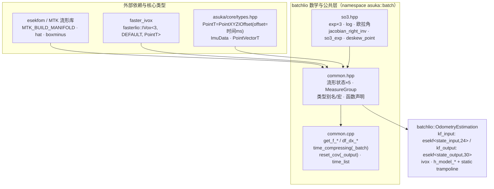

# BatchLIO 数学工具与公共结构

本页覆盖 `batchlio` 子目录的地基层：`so3.hpp`（SO(3) 流形运算，header-only）与 `common.hpp/cpp`（状态流形定义、测量组、平面拟合与时间分窗工具）。上一页的 43.8KB 主流程中，IMU 传播、批内去畸变、点面残差、初始协方差——每一个环节都建立在这三个文件之上。阅读顺序上建议与"BatchLIO 里程计主流程"页对照：本页回答"状态长什么样、残差怎么算、批窗口怎么切"。

一个先要分清的结构细节：数学层统一位于命名空间 `asuka::batch`，而主流程类位于 `asuka::batchlio`（`batchlio::OdometryEstimation` 继承 `asuka::OdometryEstimation`），主流程通过 `batch::MeasureGroup`、`batch::state_input` 等限定名跨命名空间引用数学层。

## so3.hpp：SO(3) 流形运算

全部为 `asuka::batch` 命名空间下的模板函数（可同时服务 `float`/`double` 实例化），围绕 Rodrigues 公式组织：

| 函数 | 语义 | 小角度处理 |
|---|---|---|
| `skew_sym_mat` + 宏 `SKEW_SYM_MATRX` | 反对称（hat）矩阵，其余函数的公共底座 | — |
| `exp(ang)` | 旋转向量 → 旋转矩阵 | norm ≤ 1e-7 返回单位阵 |
| `exp(ang_vel, dt)` | 角速度 × dt 积分为旋转（IMU 传播用） | 同上 1e-7 |
| `exp(v1, v2, v3)` | 三标量入参版本 | 阈值放宽至 1e-5 |
| `log(R)` | 旋转矩阵 → 旋转向量 | trace > 3−1e-6 判为单位旋转；\|theta\| < 0.001 用一阶近似 `0.5·k` |
| `rot_mat_to_euler` | ZYX 欧拉角 | sy < 1e-6 进入万向锁分支（z 置 0） |
| `jacobian_right_inv` | SO(3) 右雅可比逆 | norm ≤ 1e-6 返回 I |

两个值得注意的实现细节：

- `jacobian_right_inv` 的模板参数 `T` 实际未参与返回类型（固定返回 `Eigen::Matrix3d`），且形参是非 const 引用——阅读时不要被签名误导为通用精度版本。
- 末尾的 `so3_exp` 是 inline 非模板特化版，`th < 1e-11` 时直接返回 `I + k` 一阶线性化，比模板版阈值更紧；紧随其后的 `deskew_point` 带有源码注释：按 Point-LIWO 论文式 3.44–3.47，在恒速假设下把批窗口内 t_j 时刻采样的 body 点映射到窗口参考时刻——`r_j = so3_exp(omg·dt)`，平移项 `r_iᵀ·vel·dt`。它与主流程的 `batch_deskew` 开关（odometry 头文件 L171）配套，是"批量式"LIO 区别于逐点去畸变的关键算子。

## common.hpp/cpp：状态、测量组与工具

### 依赖与命名溯源

`common.hpp` 一口气引入了 `esekfom/esekfom.hpp`（MTK 流形宏）、`faster_ivox/ivox3d.h`（局部地图）、`core/types.hpp`（共享点类型）与本地 `so3.hpp`。源码中的分段注释保留了上游文件名——`common_lib.h`、`Estimator.cpp`、`parameters.cpp`——说明这一层是从上游 batchlio（Point-LIWO 系）代码移植而来，需要对照上游实现时可按注释定位。注意 `IVoxType` 的 include 路径是 `faster_ivox`，但实际使用 `fasterlio::IVox` 命名空间。

### 流形状态定义（EKF 的骨架）

| 流形 | 维度 | 字段 | 角色 |
|---|---|---|---|
| `state_input` | 24 | pos, rot, offset_R_L_I, offset_T_L_I, vel, bg, ba, gravity | IMU 输入模式状态 |
| `state_output` | 30 | 上述去掉输入、加上 omg, acc | 输出模式状态（角速度/加速度提升为状态量） |
| `input_ikfom` | 6 | acc, gyro | EKF 控制输入 |
| `process_noise_input` | 12 | ng, na, nbg, nba | 过程噪声 |
| `process_noise_output` | 15 | vel, ng, na, nbg, nba | 过程噪声 |

`DIM_STATE=24`、`DIM_PROC_N=12` 与 input 轨严格对应。`S2<double, 98090, 10000, 1>`（FastLIO 经典参数）虽被 typedef，但五个流形字段均未用到，属上游遗留的可用品。点类型别名 `PointType/PointCloudXYZI/PointVector` 直接复用 `core/types.hpp` 的 `PointXYZIOffset`——其 `offset` 字段按仓库约定存放"点相对帧起点的毫秒级时间偏移"，这是下面时间分窗能工作的前提。`NUM_MATCH_POINTS=5`、`MAX_INI_COUNT=100` 等宏同样来自上游。

### MeasureGroup：批处理的核心载荷

这是 `synchronize()` 的产出物、`process()` 的输入（主流程头文件 L54–55 的签名即围绕它展开）：

- `lidar_begin_time / lidar_end_time / lidar_last_time`：批窗口的时间边界；
- `lidar`：帧点云；`imu`：窗口内 IMU 序列；
- `imu_initialization`：初始化专用 IMU 序列（对应主流程的 `initializing_imu` 标志）；
- `imu_after_end`：恰在帧结束后的那条 IMU，供窗口收尾使用。

### 过程模型与雅可比（common.cpp）

四个无状态自由函数，因为 esekfom 只接受自由函数回调；主流程用 `static trampoline` + `thread_local active` 指针把成员观测模型桥接进来（odometry 头文件 L74–81）：

| 函数 | 维度 | 语义要点 |
|---|---|---|
| `get_f_input` | →24 | pos˙=vel，rot˙=gyro⊟bg，vel˙=R(acc−ba)+g |
| `get_f_output` | →30 | omg/acc 直接取自状态本身 |
| `df_dx_input` | 24×24 | ∂a/∂rot=−R·hat(acc−ba)，∂a/∂ba=−R，∂a/∂g=I，∂ω/∂bg=−I |
| `df_dx_output` | 30×30 | output 版本，偏置列符号取正 |

### 时间分窗与平面拟合

- `time_compressing`：按 `offset` 递增分段，返回每个时间组的点数（即主流程的 `time_seq` 成员）；
- `time_compressing_batch(cloud, win_ms)`：把时间量化到 `win_ms` 毫秒窗口再计数——**"批"粒度的调节旋钮**；空点云返回空、`win_ms ≤ 0` 回退到逐时刻版本；
- `estimate_norm_vector`（可变点数 + 逐点残差校验）与 `estimate_plane`（固定 5 点，输出归一化 4 维平面系数 `(n/|n|, 1/|n|)`）：两者供观测模型 `h_model_input/output` 计算点面残差，主流程的 `normvec`、`point_selected_surf`、`plane_thr` 字段与之配套。注意一个易踩的坑：前者在**未归一化**系数上校验残差（后再 normalize），后者在**归一化**后校验，同一数值阈值在两处的物理含义（点到面距离的倍率）不同，复用参数时需换算。

### 参数与协方差工具

`so3_to_euler` 是 `rot_mat_to_euler` 的 `MTK::SO3` 版（逻辑重复，双份实现需同步维护）；`reset_cov/reset_cov_output` 给出初始协方差基线——input 轨 24×24=0.1·I、gravity 块(21,21)=1e-4、(bg,ba) 6×6 块(15,15)=1e-3；output 轨 30×30=0.01·I、其余块同理右移到 (21,21)/(24,24)；`time_list` 按 `offset` 升序的排序谓词，用于点云按时间重排。

## 调用链与依赖图

关键节点解读：`common.hpp` 是汇聚点，把第三方流形库、局部地图与仓库共享点类型融合成 `asuka::batch` 的领域词汇；`common.cpp` 只实现声明，二者构成"声明/实现"薄层；主流程类以 `batch::` 限定名消费这一切——`synchronize()` 填 `MeasureGroup`，`time_seq` 来自 `time_compressing(_batch)`，`kf_input/kf_output` 的模板参数直接绑定流形状态，`deskew_point` 服务批内去畸变。头文件私有方法序列（`handle_first_scan → downsample_and_window → initialize_map → run_output_loop / run_input_loop → map_incremental → emit_outputs`）勾勒出 process 的骨架，其迭代内核全部落到本页这些纯函数上。

## 边界条件与扩展点

**边界条件**集中在数值稳健性：三档 exp 小角度阈值（1e-7/1e-5/1e-11）、log 的 trace 判据与一阶近似、欧拉角万向锁分支、`jacobian_right_inv` 的小角回退、`time_compressing_batch` 的空点云与 `win_ms ≤ 0` 回退、两个平面拟合模板的残差失败返回 `false`（对应观测模型中剔除该点的 `point_selected_surf` 机制）。

**扩展点**：
1. **input/output 双轨**：`use_imu_as_input`（默认 false）切换两条 EKF 轨道，数学层已备好两套 f/Jacobian/协方差，切换不需要动数学层；
2. **批处理参数**：`batch_dt`（默认 1ms）、`batch_deskew`、`batch_omp`、`win_ms` 全部作为 odometry 参数存在，数学层保持纯函数、无状态，便于并行（`batch_omp`）与调参；
3. **修改状态维度的连带清单**：`MTK_BUILD_MANIFOLD`、`DIM_STATE/DIM_PROC_N`、`get_f_*`/`df_dx_*`、`reset_cov(_output)`、主流程的 `p_input/p_output/q_input/q_output` 必须同步修改，维度在编译期由模板锁死，改漏会直接编译失败（这反而是保护）；
4. **模板精度**：平面拟合模板支持 float/double 双实例化，但右雅可比与 `so3_exp` 固定 double，混用前需确认。

Sources:
- `src/asuka/include/asuka/odometry/batchlio/so3.hpp#L1-L118`
- `src/asuka/include/asuka/odometry/batchlio/common.hpp#L1-L155`
- `src/asuka/src/asuka/odometry/batchlio/common.cpp#L1-L128`
- `src/asuka/include/asuka/odometry/batchlio/odometry_estimation.hpp#L1-L188`
- `src/asuka/include/asuka/core/types.hpp#L1-L96`
- `src/asuka/src/asuka/odometry/batchlio/odometry_estimation.cpp#L1-L160`

## 关联源码

- `src/asuka/include/asuka/odometry/batchlio/so3.hpp`
- `src/asuka/include/asuka/odometry/batchlio/common.hpp`
- `src/asuka/src/asuka/odometry/batchlio/common.cpp`
