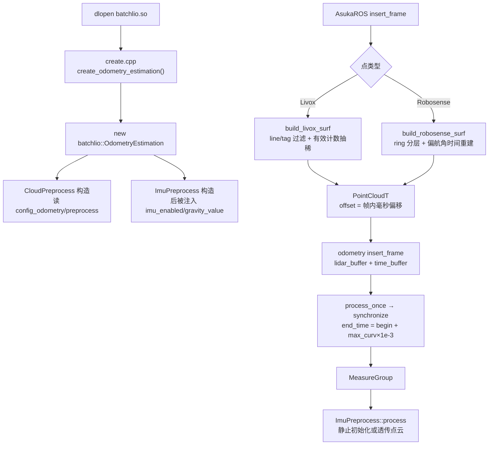
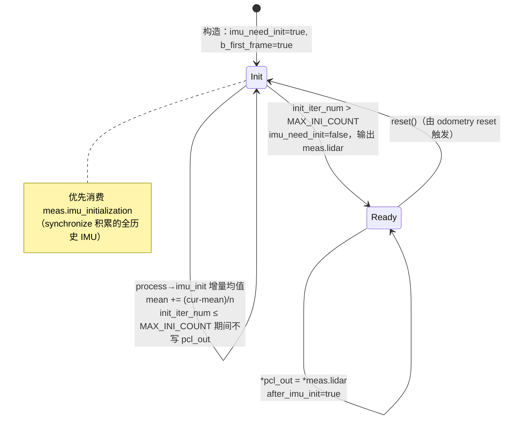

# BatchLIO 预处理与插件注册

## 模块定位与文件构成

本页覆盖 `src/asuka/src/asuka/odometry/batchlio` 子模块中除主估计器之外的数据入口三件套：

| 文件 | 体量 | 职责 |
| --- | --- | --- |
| `create.cpp` | 183 B | `extern "C"` 导出插件构造符号，是 dlopen 装载的唯一接缝 |
| `cloud_preprocess.cpp` | 5.3 KB | Livox / Robosense 两路点云的过滤、抽稀与帧内时间标记 |
| `imu_preprocess.cpp` + `.hpp` | 3.2 KB + 1.5 KB | IMU 静止初始化（均值累计）与重力方向对齐，实现核心抽象基类 `asuka::ImuPreprocess` |

三者共同回答两个问题：**这个算法的 so 是如何被进程接上的**，以及**原始传感器数据在进入 43.8KB 主估计器之前经历了什么**。

## create.cpp：最小插件入口

```cpp
extern "C" asuka::OdometryEstimation* create_odometry_estimation() {
  return new asuka::batchlio::OdometryEstimation();
}
```

全部 6 行只做一件事：以 C 链接导出 `create_odometry_estimation` 符号，返回裸指针新实例。这与核心层 `OdometryEstimation::load_module` 工厂在 `dlopen` 后查找的符号名严格对应；句柄由进程级注册表持有且永不关闭，所有权随指针移交给装载方。构造 `OdometryEstimation` 的副作用并不轻——其构造函数（`odometry_estimation.cpp` L41-153）会立即 `make_shared` 出本页的两个预处理器并读取三份 JSON 配置，因此**插件实例化的瞬间即完成预处理器的装配**。

## CloudPreprocess：点云预处理

### 配置装载与钳位

构造函数从 `config_odometry` 的 `preprocess` 段读参，所有参数带代码内兜底值并做防御性钳位：

| 配置键 | 默认值 | 说明 |
| --- | --- | --- |
| `min_distance` / `max_distance` | 0.5 / 300 | 球形距离窗口，`max_distance` 负值被钳为 0 |
| `point_filter_num` | 2 | 抽稀步长，钳位 ≥1 |
| `scan_line`（→`num_scans`） | 6 | 线数，钳位 ≥1 |
| `scan_rate` | 10 | 仅 Robosense 时间重建使用 |

两个 `preprocess` 重载按点类型分发到 Livox/Robosense 私有实现，`stamp` 参数被显式忽略（`(void)stamp`）——帧时间由上层 `insert_frame` 单独传递，预处理只负责点级变换。

### Livox 路径：`build_livox_surf`

逐点执行四级检查：① `line >= num_scans` 剔除超线束点；② `tag & 0x30` 位掩码过滤噪声点；③ 按**有效点计数** `valid_count % point_filter_num` 抽稀；④ 距离窗口 + 与 `full[i-1]` 做 1e-7 容差的重合点剔除。`offset` 写入 `(timestamp - time_base) * 1e-6`，即**相对帧首的毫秒偏移**。

注意一个细节：通过前三级检查的点总是先写入定长数组 `full[i]` 再判断是否入 `surf`，因此重合点比较的参照物是"前一原始下标的槽位"——若前一点被更早的检查过滤掉，该槽位仍是默认零点，此次去重实际不生效。

### Robosense 路径：`build_robosense_surf`

支持两种时间来源，按 `raw.back().timestamp > 0` 整帧二选一：

- **自带偏移时间**：`offset = (timestamp - time_head) * 1e3`，与 Livox 同为毫秒约定。
- **无偏移时间**：按 ring 分层，用偏航角扫掠重建时间——`omega_l = 0.361 * scan_rate`（deg/ms，10Hz 时一圈约 100ms，与转速吻合），跨 0°/360° 用 `yaw_first` 差值加 360° 处理，并用 `time_last` 单调性修正跨圈回绕。

与 Livox 路径的三处不对称值得留意：抽稀按**原始下标** `i % point_filter_num`（而非有效计数）；多一道 `finite_point` 有限性检查（Livox 路径没有）；逐层维护 `is_first/yaw_first/yaw_last/time_last` 四组状态向量。

### 跨文件契约：offset 即毫秒

主估计器的 `synchronize`（L236-237）以 `end_time = begin_time + max_offset * 1e-3` 收帧尾时间——预处理写入的毫秒偏移在此被换算回秒。这是点云预处理与主流程之间**最重要的隐式契约**，改动任何一方的单位都会破坏 IMU/点云同步。



关键节点：`B` 是唯一的动态装载边界；`D/E` 表明预处理器生命周期由主估计器构造函数统一创建；`J→L` 的边承载毫秒约定契约；`N` 是 IMU 预处理进入主链路的位置。

## ImuPreprocess：静止初始化状态机

类继承核心抽象基类 `asuka::ImuPreprocess`，对外暴露 `is_initialized()`、`get_mean_acceleration()`、`get_mean_gyroscope()` 三个只读查询，供上层探测初始化进度。



几个源码级要点：

- **首帧播种**：`b_first_frame` 为真时先 `reset()` 并以首个 IMU 样本初始化 `mean_acc/mean_gyro`，之后每个 `MeasureGroup` 用增量均值 `mean += (cur - mean) / n` 收敛，无需缓存全部样本。
- **初始化数据源优先级**：`process` 检查 `meas.imu_initialization` 非空则用它替代当前 `meas.imu` 做初始化——配合主估计器 `synchronize` 在 `initializing_imu` 期间把每条同步 IMU 追加进 `imu_initialization`（L250），使初始化统计覆盖**完整历史**而非单帧。
- **初始化期间丢弃点云**：`imu_need_init` 为真时 `process` 提前 `return`，不写 `pcl_out`；只有计数越过 `MAX_INI_COUNT` 才首次输出 `*meas.lidar`。主流程在 `process_once` 中检测 `!imu_need_init` 后清掉 `initializing_imu` 标志与 `imu_initialization` 缓冲（L219-223），两侧状态就此闭合。
- **一处源码特征**：L84 `imu_need_init = true;` 在初始化分支内被重复置真，随后 L85 的计数判断才允许翻假——冗余但显式地表达了"只有计数达标才离开此状态"。

**`set_init` 重力对齐**：用 `gravity_value`（由主估计器从 `mapping/gravity` 配置注入，L146）与量测重力 `tmp_gravity` 的叉积（hat 矩阵）构造旋转轴，`batch::exp` 生成对齐旋转。退化保护：叉积范数 < 1e-6 时两向量近平行/反平行，按点积符号返回单位阵或负单位阵（180° 翻转）。

## 与主流程的集成调用链

端到端串起来是五步：① dlopen 后 `create_odometry_estimation` 实例化主估计器并连带创建两个预处理器；② 构造函数把 `imu_en` 与 `gravity` 配置**推入** `imu_preprocess`，`reset()` 时重新推入（L145-146、L305-307），保证预处理器与主估计器配置始终一致；③ ROS 层借共享的 `CloudPreprocess` 把原始点云转成带毫秒偏移的 `PointCloudT` 后进入 `insert_frame`；④ `process_once → synchronize` 用 max-offset 收帧并打包 `MeasureGroup`；⑤ 主流程内 `ImuPreprocess::process` 完成静止初始化判定后把点云交给估计主循环（主循环细节见 BatchLIO 里程计主流程页）。

## 边界条件清单

- 空点云：两个 `build_*_surf` 对 `size == 0` 直接返回空 surf。
- 距离窗口双向过滤；Livox 中距离超限点仍计入 `valid_count`（影响抽稀相位）但不入 surf。
- `finite_point` 检查仅在 Robosense 路径存在，Livox 路径不含有限性校验。
- Robosense 时间来源整帧二选一，以最后一个点的时间戳是否 >0 判定；偏航重建仅对 `ring < num_scans` 的层生效。
- IMU 侧：`meas.imu` 与 `imu_initialization` 同时为空时 `process` 直接返回，不动 `pcl_out`；初始化未完成期间所有帧被静默消费。
- `set_init` 的近平行/反平行退化分支如上所述。

## 扩展点

- **参数面**：`preprocess` 段五个键均可改 `config_batchlio.json` 热调，无需改代码；`MAX_INI_COUNT` 控制静止初始化时长。
- **雷达类型面**：新增雷达只需添加对应点类型的 `preprocess` 重载，并在 ROS 层 `lidar_type` 分发处接入，主估计器与 IMU 侧零改动。
- **接口面**：`ImuPreprocess` 实现的核心基类查询接口（均值加速度/陀螺）可被上层用于初始化监控或自适应噪声估计。
- **插件面**：`create.cpp` 的模式（导出符号 → new 派生类）是五个算法共享的契约，作为理解其余四份同名文件的最小样本。

Sources: `src/asuka/src/asuka/odometry/batchlio/cloud_preprocess.cpp#L1-L132`
Sources: `src/asuka/src/asuka/odometry/batchlio/imu_preprocess.cpp#L1-L100`
Sources: `src/asuka/src/asuka/odometry/batchlio/create.cpp#L1-L6`
Sources: `src/asuka/include/asuka/odometry/batchlio/imu_preprocess.hpp#L1-L52`
Sources: `src/asuka/src/asuka/odometry/batchlio/odometry_estimation.cpp#L1-L400`

## 关联源码

- `src/asuka/src/asuka/odometry/batchlio/cloud_preprocess.cpp`
- `src/asuka/src/asuka/odometry/batchlio/imu_preprocess.cpp`
- `src/asuka/src/asuka/odometry/batchlio/create.cpp`
