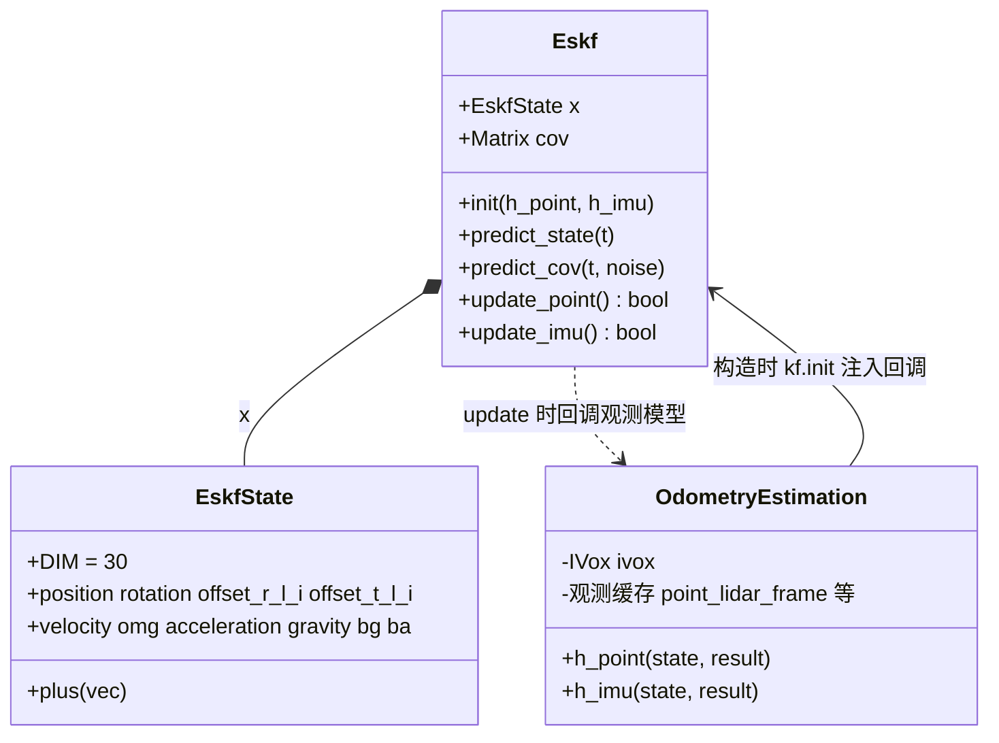
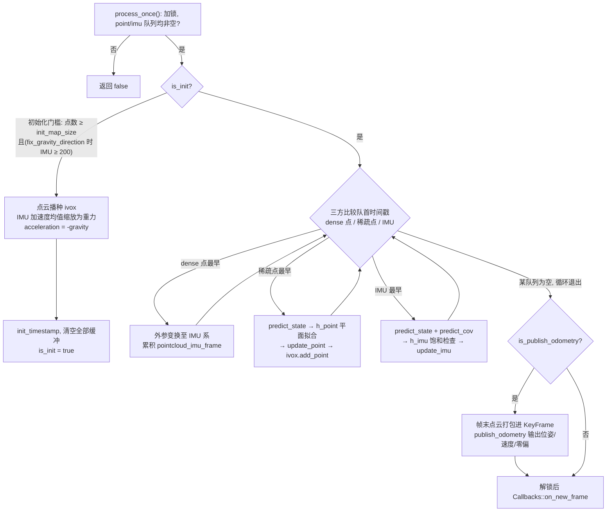

# SmallPointLIO 主流程与自带 ESKF

## 模块定位

SmallPointLIO 是五种里程计插件中的"轻量点面"实现，经 `config_odometry` 的 `so_name` 动态装载。它在 asuka 框架内最显著的特点是**滤波与地图完全自持**：FastLIO 依赖 thirdparty 的 esekfom/ikfom，Lightning 复用 lightning 库的 eskf，而本实现的误差状态卡尔曼滤波由目录内自带的 `eskf.hpp`（8KB，目录内最大头文件）配合 `so3.hpp` 独立完成，局部地图则直接使用原库全局命名空间 `::smallpointlio::IVox`（L72）。它是阅读"一套 LIO 滤波需要哪些要素"的最小完整样本。

## 文件构成与职责

| 文件 | 体量 | 职责 |
| --- | --- | --- |
| `odometry_estimation.cpp` | 15KB | 主类 `asuka::smallpointlio::OdometryEstimation`：缓冲管理、初始化、三方时间戳归并、观测模型 `h_point`/`h_imu`、关键帧输出 |
| `odometry_estimation.hpp` | 3.5KB | 主类声明与全部状态成员（互斥锁、双点队列、`kf`、`ivox` 等） |
| `eskf.hpp` | 8KB | 30 维 `EskfState`、两类量测结果结构、header-only `Eskf`（双时钟预测 + 点/IMU 两路更新） |
| `so3.hpp` | 1.4KB | SO(3) 运算 `exp`/`hat`/`a_matrix`，供状态注入与协方差传播使用 |
| `cloud_preprocess.cpp` | 6.4KB | 点云预处理（含特征处理），输出以 `offset` 携带逐点相对时间的点云 |
| `imu_preprocess.cpp` | 0.7KB | 极简 IMU 预处理，仅维护公开的 `imu_deque` |
| `create.cpp` | 193B | extern C 导出 `create_odometry_estimation` 插件入口 |

## 构造装配（L19-L90）

构造函数完成三件事：

1. **读取两份配置**：`config_odometry` 的 `filter` 段给出量测/过程噪声与门限（`laser_point_cov=0.01`、`velocity_cov=20`、`acceleration_cov=500`、`omg_cov=1000`、`plane_threshold=0.1`、`match_squared=81`、`map_resolution=0.5`、`init_map_size=10` 等）；`imu` 段给出饱和检查（`satu_acc=3×0.99`、`satu_gyro=35×0.99`）、重力向量与 `acc_norm`——算法侧自算 `imu_acceleration_scale = ‖gravity‖/acc_norm`（L45），即在 ROS 层 `acc_scale` 之外又叠加一层尺度补偿。`config_sensor` 按 `livox`/`robosense` 块读取 lidar-IMU 外参，缺块直接抛异常（L51-L57）。
2. **依赖注入滤波器**：`kf.init(两个 lambda)` 把 `h_point`/`h_imu` 以 `std::function` 注入 ESKF（L63-L65），形成"Eskf 持有模型回调"的控制反转。
3. **初始化地图与协方差**：`IVox(map_resolution, 1000000)`；`kf.cov` 取单位阵×0.01，重力块 1e-4、`bg`/`ba` 块 1e-3（L73-L76）；过程噪声由 `process_noise_cov()` 一次性构建缓存。

值得注意：外参在线估计代码（`extrinsic_est_en`）在构造函数与 `h_point` 中均被注释（L67-L70、L289-L293、L326-L340），但 30 维状态里 `offset_r_l_i`/`offset_t_l_i` 槽位已保留——这是一个预制好的扩展接缝。

## ESKF 核心（eskf.hpp）

**状态布局**：`EskfState::DIM=30`，9 个三分量块依次为 position(0)、rotation(3)、offset_r_l_i(6)、offset_t_l_i(9)、velocity(12)、omg(15)、acceleration(18)、gravity(21)、bg(24)、ba(27)。`plus()` 是唯一的"误差注入"入口：向量块直接加，rotation 与 offset_r_l_i 右乘 `exp(δ)`（L43-L54）。

**预测**：`predict_state` 以匀速 + 匀角速度模型前推位置、姿态与速度（含 `rotation·acceleration + gravity` 项，L91-L99）；`predict_cov` 组装 30×30 转移阵 F——rotation 块用 `exp(-omg·dt)`，rotation↔omg 耦合用 `a_matrix`（SO(3) 雅可比相关矩阵），velocity↔rotation 用 `-R·hat(acceleration)`——随后 `cov = F·cov·Fᵀ + noise·dt²`（L101-L115）。两步各持独立时钟 `time_predict_state_last`/`time_predict_cov_last`，且 `dt>0` 才推进。

**点更新**：`update_point` 是标量量测（h 为 1×12），利用 h 只触及前 12 维的特点，增益分母只取 `cov` 前 12 行计算（L123-L124）；`temp==0` 有 1e-6 数值护栏（L125-L127）。

**IMU 更新**：`update_imu` 为 6 维量测（角速度/加速度残差），雅可比由 `cov` 中 omg/bg/acceleration/ba 的行列直接拼出，6×6 用 LDLT 求解、失败即返回 false（L165-L168）。**继承性缺陷**：代码 NOTE 明确标注，加速度行的饱和门控误用了陀螺标志 `satu_check[i]`（而非 `satu_check[i+3]`），与原版 small_point_lio 保持一致（eskf.hpp L146-L152、L158-L161）——阅读与魔改时必须知晓。

图中关键点是**控制反转**：`Eskf` 本身不含任何几何/传感器语义，每次 `update_point`/`update_imu` 都回调回 `OdometryEstimation` 取量测；观测量（当前点、最新 IMU 读数）以成员变量暂存在主类中，回调时读取。

## 主循环 handle_once（L145-L264）

`process_once` 持锁检查两队列非空后调用 `handle_once`，解锁后才经 `Callbacks::on_new_frame` 逐个发出关键帧（L132-L143）——回调永不持自身锁执行。`insert_imu` 转发给 `imu_preprocess`；`insert_frame` 把每个点拆成 `RawPoint{stamp + offset/1000, position}` **同时**压入 `dense_point_deque` 与 `point_deque`（L100-L112）：dense 队列只用于帧末拼装关键帧点云，稀疏队列驱动逐点量测更新，二者入口相同、消费角色不同。`workload()` 只反映 `point_deque` 长度；`save_map()` 返回空指针（L128-L130），即本实现的地图只存在于 IVox，不随退出落盘。

关键节点解释：

- **初始化阶段**：需积累 `init_map_size`（默认 10）个点；若开启重力对齐还需 200 条 IMU。重力取 IMU 加速度均值并缩放到 `-‖gravity‖`（静止假设），`acceleration` 置为 `-gravity` 保证首帧预测自洽；随后**清空全部缓冲**——初始化消耗的数据不产出任何位姿。
- **三方归并**：以 `time_current` 单调推进；时间戳早于 `time_current` 的过期点/IMU 直接弹出丢弃（L206-L208、L224-L226），这是乱序防御。点分支在 `update_point` 前把点写入成员 `point_lidar_frame`，`h_point` 内部再把配准后的点写入成员 `point_odom_frame` 供 `ivox->add_point` 回填地图——成员变量充当回调通道。
- **发布门控**：`is_publish_odometry` 要求三队列非空且 `imu.front < point.back`（L187-L188），近似"帧边界"发布；`publish_odometry_without_downsample=true` 时改为逐点发布且不拼帧末点云。`KeyFrame` 携带 `T_world_imu`、速度与打包成 6 维的 `imu_bias(bg|ba)`（L266-L283）。

## 观测模型

- **h_point（L285-L343）**：点经固定外参转 IMU 系、再经状态转世界系，向 IVox 取 5 个最近点拟合平面（质心 + 协方差 + 最小特征向量为法向）。三道门槛：近邻数不足即失效；任一近邻到平面距离超 `plane_threshold` 即失效；`‖p_lidar‖ ≤ match_squared·d²` 的距离门控拒绝距平面过远的匹配。输出 1×12 雅可比 `[nᵀ, (p_imu×Rᵀn)ᵀ, 0…]` 与 `z=-d`。
- **h_imu（L345-L364）**：残差 = 量测 −（状态 + 零偏），加速度乘 `imu_acceleration_scale`；逐轴饱和检查——超限的分量把 z 置零而非丢弃整帧 IMU。

## 边界条件与扩展点

**边界**：`process_once` 双队列任一为空即短路；初始化门槛与缓冲全清；过期数据丢弃；预测双时钟 `dt>0` 护栏；`temp==0` 与 LDLT 失败两处数值护栏；饱和门控误用陀螺标志的继承行为；`save_map` 恒空。

**扩展点**：① 外参在线估计——状态槽位与注释代码俱在，解开 `extrinsic_est_en` 即可启用；② `dense/sparse` 双队列在 `insert_frame` 处同源注入，是接入稠密/稀疏特征分流的位置；③ `save_map` 导出 IVox 地图；④ 全部滤波超参集中在 `config_odometry` 的 `filter`/`imu`/`publish` 三段，调参无需改码。

Sources:
- `src/asuka/src/asuka/odometry/smallpointlio/odometry_estimation.cpp#L1-L260`
- `src/asuka/src/asuka/odometry/smallpointlio/odometry_estimation.cpp#L260-L385`
- `src/asuka/include/asuka/odometry/smallpointlio/eskf.hpp#L1-L185`

## 关联源码

- `src/asuka/src/asuka/odometry/smallpointlio/odometry_estimation.cpp`
- `src/asuka/include/asuka/odometry/smallpointlio/eskf.hpp`
- `src/asuka/include/asuka/odometry/smallpointlio/so3.hpp`
