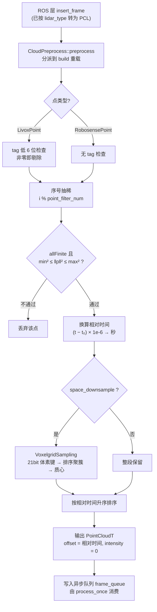

# SmallPointLIO 预处理与插件注册

## 模块定位与文件构成

SmallPointLIO 子目录的预处理层由三份源文件构成，与其余四种算法实现保持同构布局：

| 文件 | 体量 | 职责 |
| --- | --- | --- |
| `cloud_preprocess.cpp` / `.hpp` | 6.4KB / 1.4KB | 点云过滤、序号抽稀、可选体素降采样、按时间重排 |
| `imu_preprocess.cpp` / `.hpp` | 0.7KB / 0.6KB | IMU 循环缓冲 + 时间回退丢弃 |
| `create.cpp` | 193B | `extern "C"` 工厂，完成插件导出 |

（`odometry_estimation.cpp` 15KB、`eskf.hpp` 8KB、`so3.hpp` 1.4KB 属主流程与滤波，见另页。）

本页最醒目的特征是**体量对比**：点云预处理 6.4KB，是全仓库各实现中较重的一份；IMU 预处理仅 0.7KB，是所有实现中最轻的。这个不对称并非缺失，而是刻意取舍——该实现把 IMU 积分、前向传播等职责上移到自带的 ESKF（`eskf.hpp`，目录内最大头文件）与 `odometry_estimation.cpp` 主循环中，预处理层只负责"数据整形 + 防御性检查"。对比 FastLIO 那份 8.7KB、承担前向传播与时间同步的 IMU 预处理，可以直观看到计算重心被放到了滤波与配准一侧。

## 点云预处理：CloudPreprocess

`CloudPreprocess` 继承公共抽象基类 `asuka::CloudPreprocess`，实现 Livox 与 Robosense 两个 `preprocess` 重载，二者都委托给私有的 `build` 重载。构造函数从 `GlobalConfig::get_config_path("config_odometry")` 解析出的 JSON 中读取 `"preprocess"` 段参数——即**与选择 `so_name` 的是同一份配置文件**，算法参数与实现选择天然绑定。

### 参数面

| 参数（`preprocess` 段） | 默认值 | 作用 |
| --- | --- | --- |
| `min_distance` | 0.5 | 近距剔除阈值（米），以平方形式比较 |
| `max_distance` | 100.0 | 远距剔除阈值（米） |
| `point_filter_num` | 1 | 每 N 个点取 1 个的序号抽稀，构造时钳制为 ≥1 |
| `space_downsample` | `false` | 是否启用体素降采样 |
| `space_downsample_leaf_size` | 0.5 | 体素边长（米） |

### 处理流水线

两个 `build` 重载共享同一骨架，**唯一差异**是 Livox 分支多一道 `tag` 检查：`(pt.tag & 0b00111111) != 0` 的点被剔除，即按 Livox 点属性位（低 6 位）过滤；Robosense 分支无此步骤。共同步骤为：

1. 以**第 0 个点的时间戳为帧内基准** `timebase`，逐点换算相对时间 `(pt.timestamp - timebase) * 1e-6`——原始时间戳按微秒解释，输出为秒。注意接口形参 `stamp` 在 `build` 可见代码中并未参与计算，仅作为接口签名透传，真正的时间基准来自点云自身；
2. 剔除非有限坐标（`allFinite()`）与距离窗外（`squaredNorm` 对平方阈值，避免开方）的点；
3. 可选 `VoxelgridSampling` 空间降采样，否则整段 `std::move`；
4. **无条件按相对时间升序 `std::sort`**——这一步对降采样路径尤其关键，因为体素输出序是键序而非时间序；
5. 填充输出点：`intensity` 强制为 0，`offset` 写入逐点相对时间。这是该实现与主流程的核心契约——几何上不做边缘/平面特征提取，"特征"体现为 `offset` 承载的逐点时间，供下游 ESKF 配准与去畸变使用。

### VoxelgridSampling 实现要点

自研体素降采样（非 PCL 依赖）：

- `fast_floor` 用"cast + 比较修正"替代 `std::floor`，是纯性能手法；
- 每轴 21 bit、偏移 `1 << 20` 居中，三轴打包进一个 `uint64_t` 体素键（共 63 bit）；
- 越界坐标标记为 `invalid_coord`（`UINT64_MAX`）并在聚簇阶段**整点丢弃**，而非 clamp；
- 排序后相邻同键点归为一簇：位置取质心，时间戳取**组内最后累加的点**（非均值也非最大值）——后续全局时间排序会按这个时间戳安放质心点；
- `coord_pt` 是类成员，但 `VoxelgridSampling sampler` 在每次 `build` 中临时构造，因此无跨调用共享状态。

## IMU 预处理：0.7KB 的极简缓冲

`ImuPreprocess` 全部逻辑只有两件事：

- **构造**：从同一份 config_odometry 的 `"odometry"` 段读 `imu_buffer_capacity`（默认 1000），设定 `boost::circular_buffer` 容量——内存有界，满后自动挤掉最旧数据；
- **`insert_imu`**：检测 `imu->stamp < last_timestamp_imu` 则打 error 日志并丢弃该帧（时间回退防御，与 ROS 层 `handle_loop_back` 构成双保险，相等时间戳允许通过）；否则入队并更新 `last_timestamp_imu`（初始 -1.0）。

值得注意的是 `imu_deque` 是 **public 成员**：没有额外的消费接口，主流程（`odometry_estimation.cpp`，另页）直接读取该缓冲。积分、去偏置、前向传播统统不在这里——这正是 0.7KB 与 8.7KB 差距的根源。

## 预处理流水线总览



关键节点说明：

- **C（点类型分派）**：对应 ROS 层 `lidar_type` 分发后的第二级重载分派，两条路径仅在 tag 检查处分叉，其余逻辑逐行对称；
- **G（距离与有效性窗）**：距离用平方比较是热路径优化，`allFinite` 防御 NaN/Inf 污染后续排序与配准；
- **J（降采样开关）**：两条密度路线（抽稀保留原始密度 vs 体素质心降密度）都收敛到 M 的时间排序，保证 `offset` 单调递增是无论开关与否都成立的不变量；
- **N（输出契约）**：`offset` 字段承载逐点相对时间是本实现的约定，主流程据此做扫描内时间传播；
- **O（队列边界）**：预处理成功是写入异步队列的前提，预处理层与异步执行器在此交接。

## create.cpp：六行完成插件导出

```cpp
extern "C" asuka::OdometryEstimation* create_odometry_estimation() {
  return new asuka::smallpointlio::OdometryEstimation();
}
```

全部 193 字节只做一件事：以 `extern "C"` 规避 C++ 名字修饰，使 `dlopen` 后 `dlsym("create_odometry_estimation")` 可解析，返回裸 `new` 出的实例（所有权由基类 `load_module` 侧的智能指针接管，见插件契约页）。`OdometryEstimation` 构造时会连带创建 `CloudPreprocess`/`ImuPreprocess`，二者各自读取 config_odometry——预处理参数因此随插件加载而生效。这份文件与 FastLIO 等其余四种实现完全同构，是"新增算法接入成本恒定"的最小样例。

## 关键状态一览

- **`ImuPreprocess::last_timestamp_imu`**（私有，初始 -1.0）：单调性守卫，只在 `insert_imu` 中推进；
- **`ImuPreprocess::imu_deque`**（public）：容量受限的循环缓冲，主流程直接消费；
- **`CloudPreprocess` 的 5 个超参**：构造期从 config_odometry 读定，运行期只读；
- **`VoxelgridSampling::coord_pt`**：单次调用内的排序暂存，无跨调用生命周期。

## 边界条件

- 空点云输入直接返回空输出，后续各阶段均不会触达；
- `point_filter_num` 构造时 `std::max(1, ...)` 钳制，避免取模为零；
- 体素坐标超出 ±2²⁰ 范围的点被整体丢弃而非 clamp，远处稀疏离群点可能因此消失；
- 时间回退的 IMU 帧被丢弃并告警，不会阻塞后续正常数据；
- Livox tag 检查只看低 6 位，若更换 Livox 型号需确认 tag 位语义是否一致；
- 帧内时间基准取第 0 个点的 `timestamp`，隐含"首点时间有效且点云整体按时间大致有序"的假设；
- 降采样质心的时间戳取组内最后累加点，属近似语义，依赖后续全局排序兜底。

## 扩展点

- **调参不改码**：`preprocess` 段 5 个参数加 `imu_buffer_capacity` 覆盖密度、距离窗与缓冲深度；
- **新增雷达类型**：为 `CloudPreprocess` 增加一对 `build`/`preprocess` 重载，并同步公共抽象基类；
- **替换降采样策略**：`VoxelgridSampling` 与主流程仅通过 `RawPoint` 向量交互，可整体替换；
- **调整 tag 掩码**：`0b00111111` 是 Livox 分支唯一的传感器语义常量；
- **接入新算法**：复制这份六行 `create.cpp` 模式即可满足框架的 dlopen 契约。

Sources:
- `src/asuka/src/asuka/odometry/smallpointlio/cloud_preprocess.cpp#L1-L178`
- `src/asuka/src/asuka/odometry/smallpointlio/imu_preprocess.cpp#L1-L27`
- `src/asuka/src/asuka/odometry/smallpointlio/create.cpp#L1-L6`
- `src/asuka/include/asuka/odometry/smallpointlio/cloud_preprocess.hpp#L1-L56`
- `src/asuka/include/asuka/odometry/smallpointlio/imu_preprocess.hpp#L1-L29`

## 关联源码

- `src/asuka/src/asuka/odometry/smallpointlio/cloud_preprocess.cpp`
- `src/asuka/src/asuka/odometry/smallpointlio/imu_preprocess.cpp`
- `src/asuka/src/asuka/odometry/smallpointlio/create.cpp`
