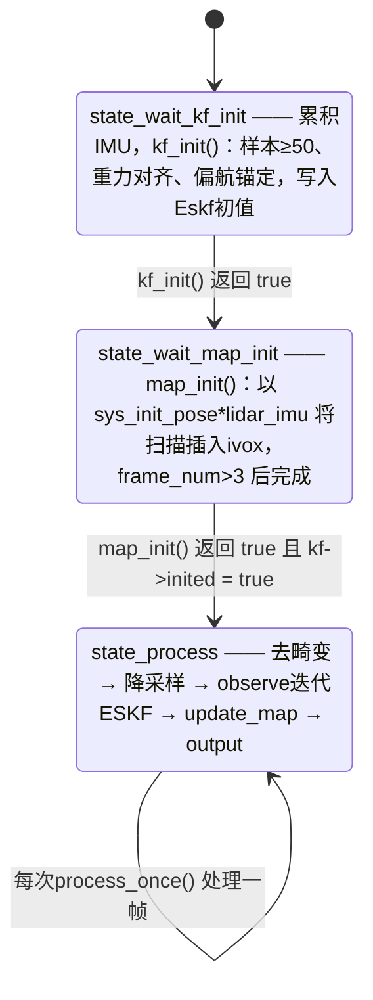
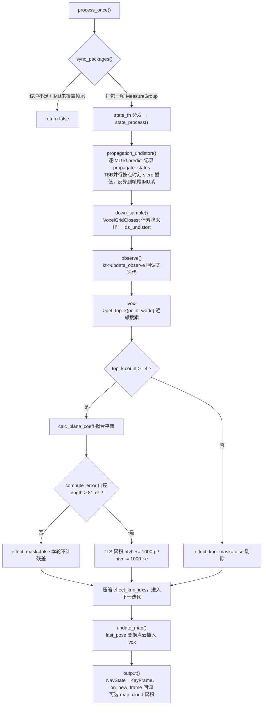

# SuperLIO 里程计主流程

SuperLIO 的主估计流程集中在 `odometry_estimation.cpp`（18.3KB）与同名头文件中。它是五种里程计实现中目录结构最完整的一个：主类自身只负责**帧同步、状态机调度与各阶段管线编排**，而滤波（`eskf`）、流形数学（`manifold`）、八叉体素地图（`octvoxmap`）、近邻结构（`voxel_grid_closest`/`hknn_tables`）与预处理均有独立的子模块文件，各自拥有专页导读。本页只覆盖主流程本身。

## 主要文件与模块分工

| 文件 | 职责 |
|---|---|
| `odometry_estimation.hpp/.cpp` | 主类：实现 `asuka::OdometryEstimation` 插件契约，状态机、帧同步、去畸变、观测、地图更新与输出 |
| `eskf.hpp/.cpp` | 误差状态卡尔曼滤波，`predict` 前向传播 + `update_observe` 回调式迭代更新（详见专页） |
| `manifold.hpp/.cpp` | `Se3`/`So3` 流形运算（指数/对数/扰动），被 ESKF 与主流程共同使用 |
| `octvoxmap.hpp` | `OctVoxMap<V3, Scalar>` 八叉体素地图：`insert` 写入、`get_top_k` 近邻查询 |
| `voxel_grid_closest.hpp` | 体素降采样器（`voxel_grid_filter`），承担 `down_sample` 阶段 |
| `imu_preprocess` / `cloud_preprocess` | 算法私有预处理；`cloud_preprocess()` 虚函数把前者暴露给 ROS 共享链路 |
| `alias.hpp` / `types.hpp` / `timer.hpp` | 类型别名（`V3`/`Se3`/`Scalar`）、`MeasureGroup`/`LidarData`/`DynamicState` 等数据结构、计时器 |
| `create.cpp` | 导出 `create_odometry_estimation`，供 `so_name` 动态装载（183 字节，最小插件样例） |

## 构造装配：三份配置、外参与预分配

构造函数按固定顺序装配（`odometry_estimation.cpp#L72-L148`）：

1. **创建私有组件**：`ImuPreprocess` 与 `CloudPreprocess` 实例、日志器 `"odometry"`。
2. **读取 `config_odometry`**：滤波超参（`kf.max_iterations=4`、`kf.quit_eps=0.001`、`kf.align_gravity=true`）、IMU 噪声（`imu_na/ng=0.1`、`imu_nba/nbg=0.0001`、`gravity_norm=9.7946`）、地图（`hash_capacity=2000000`、`vox_resolution=0.5`）、预处理（`voxel_filter_size=0.5`）与评估开关（`eva.timer`）。
3. **缓冲容量**：`lidar_buffer`（循环缓冲，容量 50）与 `measures.imu`（容量 1000）。
4. **两级外参**：
   - `extrinsic.odom_robo`（6 个数，角度制 ZYX 欧拉角 + 平移）构成 `Se3 odom_robo`，其 yaw 分量单独抽出为 `lidar_robo_yaw`——用于把初始航向锚定到机器人坐标系；
   - `config_sensor` 中与 `config_ros.lidar_type` 对应的 `livox`/`robosense` 块（经 `active_lidar_key()` 解析）提供 `extrinsic_T/R`，构成雷达到 IMU 的 `Se3 lidar_imu`；块不存在则直接抛异常。
5. **读 `mapping.enable_map_saving`**（`config_odometry`）决定是否累积 `map_cloud`。
6. **创建核心对象**：`ivox`（OctVoxMap）与 `kf`（Eskf），设置体素滤波叶大小，预分配四块点云复用缓冲、21000 点容量与 20000 长度的 mask/平面参数数组。
7. **初始状态置为 `state_wait_kf_init`**。

注意：`kf_align_gravity` 与 `enable_downsample` 虽被读入成员，但在当前 `odometry_estimation.cpp` 全文中没有参与任何分支（去畸变后的降采样无条件执行），属于配置面保留项。

## 数据入口与线程边界

`insert_imu` / `insert_frame` / `workload` / `stop` / `save_map` 全部以 `buffer_mutex` 保护，是异步执行器（AsyncOdometryEstimation）与算法之间的唯一并发接缝：

- `insert_imu`：持锁转发给 `imu_preprocess->insert_imu`（时间回环不在算法内处理，检测统一在 asuka_ros 告警）；
- `insert_frame`：用 `stamp + points.back().offset / 1000.0` 计算 `end_time`——即约定点云内点按时间序排列、`offset` 存毫秒级相对时间偏移；随后打包 `LidarData` 入 `lidar_buffer`；
- `workload()` 只返回 `lidar_buffer.size()`，上层据此判断积压；
- `stop()` 清空双缓冲并复位 `lidar_pushed`；
- `save_map()` 持锁返回 `map_cloud` 指针。

## 帧同步：sync_packages

`process_once()` 先调 `sync_packages`（持同一把锁），成功后才按 `state_fn` 分发。同步逻辑处理了三种情形：

1. **双缓冲任一为空** → 返回 false；
2. **过期帧丢弃**：`last_timestamp_lidar > meas.lidar.end_time` 时弹出队首（rosbag 回退场景的兜底）；
3. **IMU 未覆盖帧尾**：`imu_preprocess->last_timestamp < end_time` 时等待，覆盖后持续弹出 IMU 直至 `end_time`，打包为 `MeasureGroup`。

`lidar_pushed` 标志保证跨多次 `process_once` 调用时队首帧不被重复取出。

## 状态机：三阶段推进

- **`state_wait_kf_init` → `kf_init()`**：对本包 IMU 逐条 `accumulate`，不足 50 条则继续等待；静止段均值 `mean_acc` 的方向给出初始重力，经 `FromTwoVectors` 对齐到参考重力 `(0,0,-g)`，再从旋转首列提取并剥离任意 yaw，最后乘 `lidar_robo_yaw` 锚定到机器人航向；`imu_scale = gravity_norm/|mean_acc|` 作为加计尺度修正传入 `set_initial_conditions`，随后手动覆写 `state.rot` 与 `state.p = odom_robo.t` 并 `set_x`。初始位姿存入 `sys_init_pose`。
- **`state_wait_map_init` → `map_init()`**：每帧以 `sys_init_pose * lidar_imu` 把点云并行变换到世界系并 `ivox->insert`，累计 `frame_num > 3` 后返回 true，置 `kf->inited = true`——即用最初几帧纯推演建图，之后才进入闭环观测。
- **`state_process`**：常驻主状态；`time_eva` 开启时用 `Timer` 逐段计时四个阶段，最后统一 `output()`。

## 单帧处理管线

**propagation_undistort（前向传播 + 去畸变）**：从当前动态状态出发，对包内每条 IMU 执行 `kf->predict` 并把 `DynamicState`（rot/p/v/a/w/time）逐帧存入 `propagate_states`。每个点按 `start_time + offset/1000` 求查询时刻，在状态序列中线性查找相邻对，旋转用四元数 `slerp`、平移用 `p + v·τ + ½a·τ²` 插值，再统一反算到帧尾 IMU 系。**边界分支**：查询时刻超出最后状态时，保持与正常分支一致的帧尾体系变换，源码注释明确说明上游 Super-LIO 此处跳过了反旋转、混合了查询时刻系与帧尾系——这是移植时修正的一个差异点。

**down_sample**：`scan_undistort_full` 经 `voxel_grid_filter` 降采样到 `ds_undistort`，是后续观测与建图的公共输入。

**observe（迭代观测）**：通过 `kf->update_observe` 把数据关联与残差计算以回调形式交给 ESKF，每次迭代回调收到最新 `KfState`（含位姿与 `need_converge` 标志）。回调内部：
- 用 `pose * point_body` 把体坐标点投到世界系，`ivox->get_top_k`（`KnnHeap<5, V3>`）取近邻；不足 4 个则剔除；
- `calc_plane_coeff` 以 `colPivHouseholderQr` 解平面法向量（约定常数项归一），法向量模长 `< 1e-6` 或任一点距离 `> 0.1` 视为拟合失败；
- `compute_error` 以 `length > 81·error²` 做随距离放宽的门控（等价 `|e| < length/9`）；
- 雅可比取 `j = [p_body × (Rᵀn); n]`，法方程贡献 `H += 1000·j·jᵀ`、`g -= 1000·j·e`（等价 0.001 的固定测量噪声）；用 `tbb::enumerable_thread_specific<ThreadAcc>` 做无锁归约；
- `need_converge` 为真时跳过近邻搜索与平面重拟合，仅复用缓存的平面参数重算残差后提前返回；
- 否则按 `effect_knn_mask` 压缩 `effect_knn_idxs`，下一迭代只处理仍有效的点——近邻集合随位姿收敛逐轮收紧。

**update_map**：取 `kf->get_se3()` 为 `last_pose`，把 `points_body` 变换到世界系后 `ivox->insert`；空点云直接返回。

**output**：从 `kf->get_nav_state()` 构造 4×4 变换得到 `world_pc`；组装 `KeyFrame`（`FrameId::IMU`、位姿、速度、IMU 零偏），**对 `ds_undistort` 做深拷贝**赋给 `frame->cloud_imu`——源码注释说明该缓冲是会被后续循环复用的成员，必须让观察者可长期持有；经 `Callbacks::on_new_frame` 发布给下游（如 RViz、优化模块）；`enable_map_saving` 开启时把 `world_pc` 追加进 `map_cloud`。

## 关键状态一览

| 状态 | 说明 |
|---|---|
| `state_fn` | 成员函数指针，状态机当前态；初始 `state_wait_kf_init` |
| `kf` / `kf->inited` | ESKF 实例；`inited` 在地图初始化完成后置位，是常驻主状态的门槛 |
| `propagate_states` | 本次扫描逐 IMU 的 `DynamicState` 序列，去畸变插值的唯一依据 |
| `sys_init_pose` / `last_pose` | 初始位姿（含 odom_robo 锚定）/ 最近帧位姿缓存 |
| `lidar_buffer` + `lidar_pushed` + `last_timestamp_lidar` | 帧缓冲与同步游标，`workload` 与 `sync_packages` 的核心 |
| `effect_knn_idxs/mask`、`effect_mask`、`abcd_vec`、`effect_knn_num` | 观测阶段的数据关联缓存：有效点索引、近邻达标标志、残差可用标志、平面参数 |
| `scan_undistort_full` / `ds_undistort` / `world_pc` / `map_cloud` | 四块跨帧复用的点云缓冲（深拷贝风险点在 output 处处理） |
| `frame_num` / `frame_counter` | 状态推进计数（kf/map 初始化与观测共用）/ 输出 KeyFrame 自增编号 |

ESKF 对外暴露的状态接口被主流程完整使用：`set_initial_conditions`/`set_x`/`get_sys_state` 写读全量状态，`get_dynamic_state`/`get_se3`/`get_nav_state` 提供三种视图，`predict`/`update_observe`/`set_obs_time`/`set_last_obs_time` 构成传播-观测闭环。

## 边界条件汇总

- **时间回退**：`sync_packages` 丢弃 `end_time` 早于游标的帧；
- **初始化门槛**：KF 初始化需 ≥50 条 IMU；地图初始化需累计 >3 帧；
- **几何门控**：平面拟合（法模 `<1e-6`、内点距离 `>0.1`）、近邻 `<4`、误差门 `81·e²` 三层逐级剔除；
- **点时刻越界**：超出传播末端时退化为帧尾系变换（与上游实现的差异在注释中标注）；
- **缓冲复用**：`output` 深拷贝 `ds_undistort`，防止观察者与下一帧处理共享内存；`update_map` 对空点云早退；
- **小瑕疵**：`output` 末尾 debug 日志的 `map_size` 恒打印 0（`ivox ? 0 : 0`），为占位实现。

## 扩展点

- **配置面**：所有超参走 `config_odometry` 的 `param<T>`，调参无需改码；`enable_downsample`/`kf_align_gravity` 已入成员，可作为接通开关的现成挂点；
- **状态机**：`StateFn` 函数指针模式天然支持插入新状态（如回环检测、休眠态），只需新增成员函数并改写 `state_fn`；
- **观测模型**：`Eskf::update_observe` 的回调签名是观测方程的接缝，可把平面残差替换为其它几何约束而不动滤波器；
- **地图与近邻**：`OctVoxMap`、`KnnHeap`、`VoxelGridClosest` 均为独立模板组件，可替换实现（对应专页《八叉体素地图与近邻结构》）；
- **下游消费**：`Callbacks::on_new_frame` 发布携带深拷贝点云的 `KeyFrame`，扩展模块可直接订阅；
- **插件入口**：`create.cpp` 导出 `create_odometry_estimation`，由 `so_name` 决定装载，与其它四种实现可互换。

Sources: `src/asuka/include/asuka/odometry/superlio/odometry_estimation.hpp#L1-L142`, `src/asuka/src/asuka/odometry/superlio/odometry_estimation.cpp#L1-L200`, `src/asuka/src/asuka/odometry/superlio/odometry_estimation.cpp#L200-L420`, `src/asuka/src/asuka/odometry/superlio/odometry_estimation.cpp#L414-L574`, `src/asuka/include/asuka/odometry/superlio/eskf.hpp#L1-L120`

## 关联源码

- `src/asuka/src/asuka/odometry/superlio/odometry_estimation.cpp`
- `src/asuka/include/asuka/odometry/superlio/odometry_estimation.hpp`
