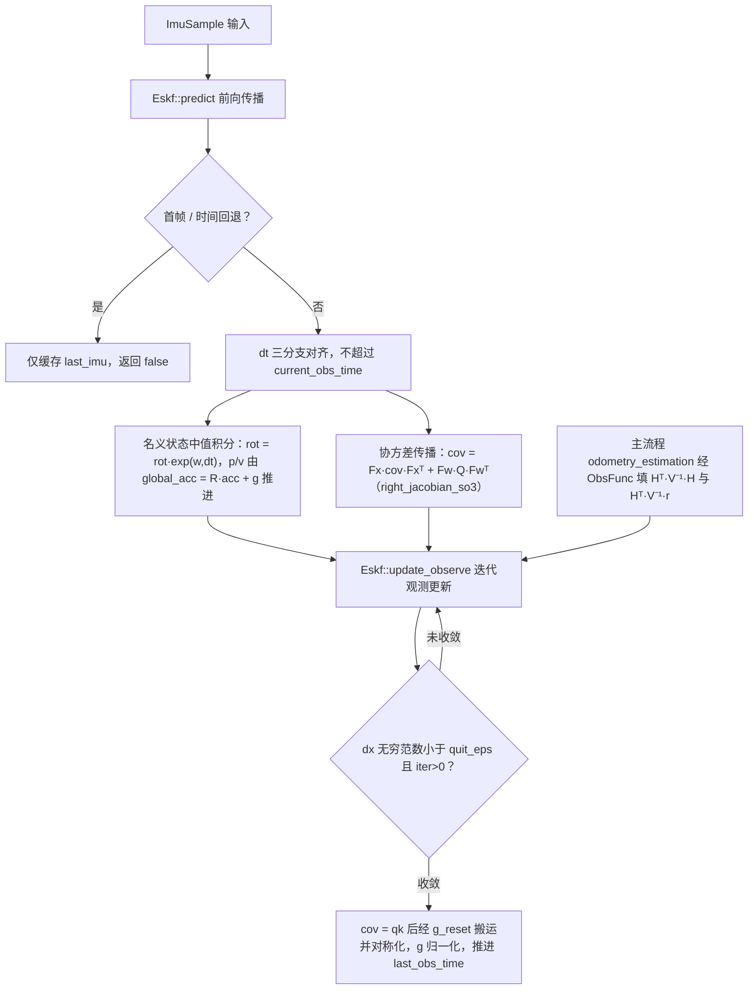

# SuperLIO ESKF 与流形运算

本页覆盖 SuperLIO 子模块的数学底座：`manifold.hpp/cpp`（7.2KB）提供 SO(3)/SE(3) 李群值类型与指数/对数运算，`eskf.hpp/cpp`（5.8KB）在其上实现 18 维误差状态卡尔曼滤波。二者位于 `asuka::superlio` 命名空间内，是 `odometry_estimation.cpp`（主流程页）状态估计的引擎，与 FastLIO 依赖的第三方 esekfom/ikfom 不同，这是一份完全自包含的 ESKF 实现。

## 模块职责与分层

```
odometry_estimation.cpp（主流程，18.3KB）
    │  ImuSample 驱动 / ObsFunc 回调
    ▼
eskf.hpp / eskf.cpp          ← 18 维误差状态滤波：predict + update_observe
    │  rot 成员、exp/log/update
    ▼
manifold.hpp / manifold.cpp  ← So3 / Se3 值类型 + hat/vee/exp/log/伴随
    │
    ▼
alias.hpp（V3/M3/M18/Quat 等别名）+ types.hpp（ImuSample/SysState/NavState/...）
```

两个头文件共同依赖 `alias.hpp` 的标量与矩阵别名；ESKF 对外输出的 `SysState/NavState/DynamicState/PoseT` 等状态结构则来自子模块的 `types.hpp`。

## 流形层：So3 与 Se3

**So3** 内部仅存一个 `M3 r` 旋转矩阵，围绕它提供完整流形运算：

- **构造**：可从矩阵 `M3`、旋转向量 `V3`（内部走 `apply_exp(hat(w))`）或拷贝构造；
- **hat/vee**：静态反对称矩阵与向量互转；
- **exp 三个变体**：`exp(ang)`（Rodrigues 公式，范数 >1e-10 才走三角函数，否则返回单位阵）；`exp(ang_vel, dt)`（角度 = 角速度范数 × dt，阈值 1e-12）；`exp_m3(ang_vel, dt)` 只返回矩阵、小角（squared_norm < 1e-6）时用 Taylor 系数近似，是快速路径；
- **log**：先转四元数并规范化（`q.w() < 0` 时整体翻转，保证转角落在主值区间），再由向量部分范数区分小角路径与 `atan2` 路径，返回 hat 形式的 `M3`，可通过出参带出转角 θ；`log_vee` 再做 vee；
- **左右两种更新约定**：`update(dw)` 左乘 `dr·r`，`update_rhs(dw)` 右乘 `r·dr`，供不同残差定义（左扰动/右扰动）选择；
- **辅助量**：`adjoint()` 返回 Rᵀ，`distance()` 取 `log(this·rhs⁻¹)` 的范数，`yaw()` 带 `sy < 1e-6` 的奇异性保护。

**Se3** 内部维护 `M4 mat` 并缓存 `r/t`，可从 `M4`、六维李代数 `V6`（经自由函数 `hat6/vee6` 与 `apply_exp`）以及 So3/Quat+平移等多种形式构造；`operator*` 完成变换复合与点变换（`r·p + t`），`update/update_rhs` 同样区分左右乘，另提供 `log/log_vee/transform/inverse/adjoint/distance`。ESKF 的 `get_se3()` 与 `KfState.pose` 都以 Se3 形式对外交付位姿。

## ESKF：18 维误差状态滤波

### 状态布局

误差状态 `dx`（18×1）与名义状态的对应关系、以及私有 `update()` 的注入方式如下：

| dx 区间 | 名义状态成员 | update() 注入方式 |
|---|---|---|
| [0:3) | `rot`（So3） | `rot = rot * exp(δθ)`，右乘 |
| [3:6) | `p` | 直接相加 |
| [6:9) | `v` | 直接相加 |
| [9:12) | `bg` 陀螺零偏 | 直接相加 |
| [12:15) | `ba` 加计零偏 | 直接相加 |
| [15:18) | `g` 重力向量 | 相加后强制 `g = gravity_norm * g.normalized()` |

重力受到**范数约束**——每次注入后都归一化回 `gravity_norm`，方向自由而模长锁定。头文件还声明了 17 维的 `StateDof`（重力仅 2 自由度扰动的参数化），是为另一种重力建模预留的类型接口。

`Options` 给出迭代次数（默认 `num_iterations=3`）与收敛阈值（`quit_eps=1e-6`），以及四组噪声方差（gyro/acce/bias_gyro/bias_acce），`build_noise` 将其填为 12×12 对角阵 `q_noise`。`set_initial_conditions` 把协方差初始化为 `1e-4·I₁₈`、旋转块特设为 0.1°（弧度），并接收初始零偏、重力与 `imu_scale` 尺度标定系数。

### predict：IMU 前向传播

`predict(imu)` 先做两道闸门：首帧（`last_imu_time < 0`）只缓存样本返回 false；`imu.secs <= last_obs_time` 的样本直接丢弃，防止时间回退造成重复传播。随后 dt 取三分支：

1. `last_imu_time < last_obs_time`：从上一观测时刻重新起算；
2. `imu.secs > current_obs_time`：把传播截断在 `current_obs_time`（`current_time` 同步钳到观测时刻）；
3. 否则正常取相邻 IMU 间隔。

传播本身是**中值积分**：加速度取两帧均值、乘 `imu_scale`、去 `ba`；`body_omega` 取角速度均值去 `bg`。协方差按 `cov = Fx·cov·Fxᵀ + Fw·Q·Fwᵀ` 推进，其中 `right_jacobian_so3`（eskf.cpp 内的 file-static 函数，纯 double 实现）给出 SO(3) 右雅可比——非有限输入直接返回单位阵，`theta < 1e-6` 走 Taylor 展开避免除零。Fx 的关键块：旋转块 `exp(-ω, dt)`、旋转对 bg 的 `-Jr·dt`、p 对 v 的 `I·dt`、v 对旋转的 `-R·hat(acc)·dt`、v 对 ba 的 `-R·dt`、v 对 g 的 `I·dt`；Fw 覆盖陀螺/加计白噪声与零偏随机游走。名义状态则按 `global_acc = R·acc + g` 推进 p、v，姿态右乘 `exp(body_omega, dt)`。

### update_observe：信息形式的迭代观测更新

观测接口是本实现的特色接缝：

```cpp
using ObsFunc = std::function<void(const KfState& kf_state,
                                   M6& ht_vinv_h, V6& ht_vinv_r)>;
```

调用方（主流程的配准残差计算）只填 **Hᵀ·V⁻¹·H（6×6）与 Hᵀ·V⁻¹·r（6×1）**，ESKF 完全不感知地图与观测模型。每次迭代：

- 先用 `dx_prior`（旋转项取 `(r_pred⁻¹·rot).log_vee()`，即局部右扰动误差）构造一阶搬运阵 `g_prior`（旋转块 `J = I − 0.5·hat(δθ)`），得 `pk = g_prior·cov_pred·g_priorᵀ`；
- 把 6×6 的 `htvh` 嵌入 18×18 的 `htrh`，按信息形式求 `qk = (pk⁻¹ + htrh)⁻¹`（后验协方差），`k_x = qk·htrh` 等价于卡尔曼增益；
- 误差增量 `dx = qk·b + (k_x − I)·dx_prior`，其中 b 的前 6 维放 `htvr`——`dx_prior` 项补偿线性化点移动带来的先验偏差，这正是 IEKF 的迭代结构；
- 调私有 `update()` 注入 dx，`||dx||∞ < quit_eps` 且 `iter > 0` 时提前退出；`iter > 2` 仍需迭代则置 `need_converge = true`（经 `get_kf_state` 暴露给调用方判断）。

收尾阶段：`cov = qk` 后再做一次 `g_reset` 搬运并**对称化**（`0.5(cov + covᵀ)`），`dx` 清零，`last_obs_time = current_obs_time` 推进观测时间基线。

## 边界条件与数值防护

- **小角分支**：`exp` 阈值 1e-10/1e-12、`exp_m3` 与右雅可比 1e-6、`apply_exp` 1e-12 一阶近似，全部避免除零；
- **log 规范化**：四元数 w<0 翻转保证对数主值；向量部分范数过小时走 `2·v` 直接近似；
- **时间回退**：predict 丢弃不早于 last_obs_time 之前的样本；dt 钳制不越过 current_obs_time；
- **重力范数锁定**与**协方差对称化**维持数值健康；
- **yaw 奇异性**（`sy < 1e-6` 返回 0）与右雅可比的非有限输入保护。

## 调用链与扩展点



图中关键节点：**G1/SKIP** 是时间鲁棒性闸门，rosbag 循环等异常时间流在此被吸收；**DT** 的钳制逻辑保证传播精确停在观测时刻，与逐点去畸变的时间对齐需求配合；**NOM/COV** 是误差状态滤波的"名义状态积分 + 线性化协方差传播"双轨；**OBS** 是本模块最重要的扩展接缝——主流程在回调内完成点面配准残差（配合下一页的 octvoxmap/voxel_grid_closest），ESKF 对地图结构零依赖；**CONV/FIN** 体现 IEKF 迭代收敛与收尾的协方差搬运/对称化。

扩展面上，`StateDof`（17 维、重力 2 自由度）是已声明的备选参数化；`set_x/set_cov` 支持外部状态整体恢复（如关键帧回溯）；`imu_scale` 为尺度标定预留入口；`So3/Se3` 的左右双更新约定可适配不同残差的扰动定义。对外 getters 覆盖 `SysState/NavState/DynamicState/PoseT/Se3/KfState/Cov` 多种形态，其中 `DynamicState` 额外带出 `body_omega` 与 `global_acc` 两个瞬时运动量，供主流程与前向预测等消费者取用。

Sources:
- `src/asuka/include/asuka/odometry/superlio/eskf.hpp#L1-L120`
- `src/asuka/include/asuka/odometry/superlio/manifold.hpp#L1-L100`
- `src/asuka/src/asuka/odometry/superlio/eskf.cpp#L1-L235`
- `src/asuka/src/asuka/odometry/superlio/manifold.cpp#L1-L260`

## 关联源码

- `src/asuka/src/asuka/odometry/superlio/eskf.cpp`
- `src/asuka/include/asuka/odometry/superlio/eskf.hpp`
- `src/asuka/src/asuka/odometry/superlio/manifold.cpp`
- `src/asuka/include/asuka/odometry/superlio/manifold.hpp`
