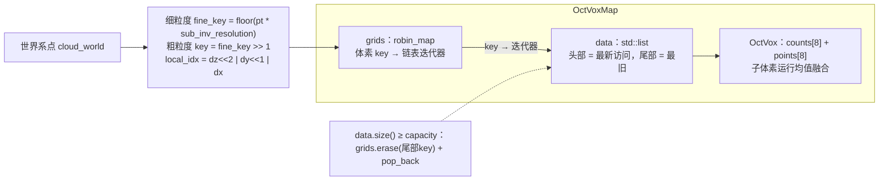
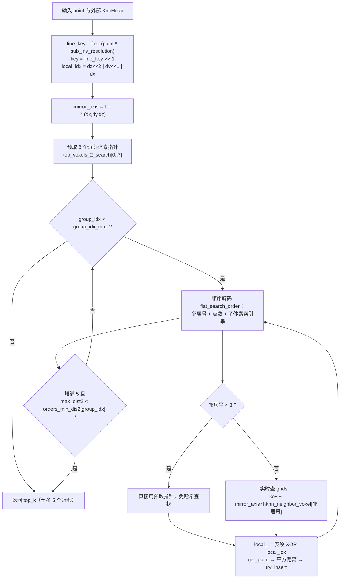

# SuperLIO 八叉体素地图与近邻结构

本页覆盖 SuperLIO 子模块的地图与数据关联层：`octvoxmap.hpp` 提供持久化的八叉体素地图与 5 近邻查询，`hknn_tables.hpp` 提供查询所需的预编译搜索表，`voxel_grid_closest.hpp` 提供扫描侧的降采样滤波器。三者共同回答两个问题：**地图点如何存放与融合**，以及**新扫描的每个点如何在地图中找到对应支撑点**。

## 文件与职责一览

| 文件 | 体量 | 角色 |
| --- | --- | --- |
| `octvoxmap.hpp` | 9.2KB | `OctVoxMap`（哈希 + LRU 链表地图）、`OctVox`（8 子体素融合单元）、`KnnHeap<K>`（定容近邻堆），header-only 全模板实现 |
| `hknn_tables.hpp` | 4.9KB | 纯常量表：60 个体素偏移、6 组扁平搜索序、分组剪枝阈值，无任何逻辑 |
| `voxel_grid_closest.hpp` | 2.0KB | `VoxelGridClosest`：每体素保留"距格心最近点"的降采样器，基于 `robin_hood::unordered_flat_map` |

两个哈希容器均来自 `src/asuka/thirdparty/superlio/tsl`（`octvoxmap.hpp` 用 `tsl/robin_map.h`，`voxel_grid_closest.hpp` 用 `tsl/robin_hood.h`），保证高频路径下的低开销查找。

## OctVoxMap：哈希 + LRU 链表的八叉体素地图

### 存储布局

`OctVoxMap<Point, Scalar>` 内部是两条互补的结构（`octvoxmap.hpp#L208-L216`）：

- `grids`：`tsl::robin_map<Key, DataIter, HashVec>`，把整数体素坐标 `Key = Eigen::Vector3i` 映射到链表迭代器，实现 O(1) 定位；`HashVec` 用黄金比率常数 `0x9e3779b9` 与 murmur 风格常数混合三个分量。
- `data`：`std::list<std::pair<Key, OctVoxType>>`，维护体素的**访问新近度**，头部最新、尾部最旧。

关键节点：**粗细双粒度编码**是整个设计的核心——地图的外层键是 `resolution`（默认 0.5m）粒度的粗体素，粗体素内部再按 `resolution/2`（0.25m）切成 8 个子体素，`local_idx` 用 `(dz<<2)|(dy<<1)|dx` 三个比特位编码点落在哪个子体素。**LRU 淘汰**（`insert` 中 L246-L249）保证地图内存有硬上界：新建体素 `emplace_front`，命中体素 `splice` 到链表头，超过 `capacity` 时从链表尾淘汰最久未访问的体素。

### 子体素融合规则（`OctVox::add_point`，L92-L106）

每个子体素只存**一个**点，按运行均值融合，但有两条丢弃门限：

- 未初始化（`counts == uninit_mask`）→ 直接写入，计数置 1；
- 计数已达 `max_points_per_subvoxel = 20` → 丢弃；
- 与已存点的平方距离超过 `distance_threshold_sq = 0.01`（即 0.1m）→ 丢弃——防止把不同表面（如墙面两侧）的点融成一个；
- 否则 `stored_point = (stored_point * cnt + pt) / (cnt + 1)`，计数加一。

这使单个体素的内存固定为 `8 个 Point + 8 个 uint8_t`，同时用"均值 + 距离门限"压制重复观测的噪声。

### 延迟复位机制

`insert` 开头（L220-L226）检查 `reset_map`：置位后连续 `reset_map_count` 次插入被直接跳过，计数归零后自动清除标志恢复写入。设置该标志的入口不在已读证据中（成员声明在 L196-L197），推测供里程计层在地图失效/传送等场景下冻结地图若干帧。

## KnnHeap：定容 5 近邻堆

`KnnHeap<K, Point>`（L19-L79）是一个无堆操作的"近邻收集器"：`count / worst / max_dist2 / dist2[K] / points[K]` 全部平铺，缓存友好。

- 未满时：`try_insert` 直接追加并更新 `max_dist2` 与 `worst` 下标，O(1)；
- 已满时：若新点平方距离小于 `max_dist2`，覆盖 `worst` 位置，再用 `update_worst_unrolled` 以**完全展开的两两比较**（5 个数的锦标赛选择，无循环）重找最大者。

实例化为 `KnnHeap<5, V3>`（见 `odometry_estimation.hpp#L61-L62` 的别名），K=5 与主估计器声明的 `calc_plane_coeff(int n, const std::array<V3,5>&, ...)` 平面拟合恰好呼应：**取 5 个近邻点拟合一张平面作为残差约束**。

## hknn_tables：预编译的分组搜索序

`hknn_tables.hpp` 全部是 `inline const` 常量：

- `hknn_neighbor_voxel`：60 个 `Eigen::Vector3i` 偏移（`alignas(16)`），分量范围约 [-2, 1]，覆盖查询粗体素周边的两圈邻域；
- `flat_search_order_offsets = {0, 43, 135, 219, 321, 465, 593}`：把 593 字节的 `flat_search_order` 切成 **6 组**，按"离查询越近越先搜"排列；
- 表内编码为三元组流：`[邻居体素号, 点数, 点数个子体素索引]`；
- `orders_min_dis / orders_min_dis2`：各组对应的**最坏情况距离保证**（如 0.25、0.3536、0.5……，恰为子体素尺寸 0.25m 乘以 √1、√2、√4、√5、√6），用作逐组搜索后的早退阈值。

两个巧妙的坐标变换使静态表适用于任意查询位置：

1. **镜像轴** `mirror_axis = (1-2dx, 1-2dy, 1-2dz)`：表按查询点位于粗体素"正卦限"的规范位置编写，实际查询落在其它子体素时，用 `mirror_axis` 逐分量翻转邻居偏移，使搜索始终朝向查询点一侧；
2. **XOR 适配**：查表得到子体素索引后以 `local_i = 表项 ^ local_idx` 变换为真实子体素号，同样完成规范位置到实际位置的镜像。

## get_top_k：查询与早退

关键节点解释：

- **预取（L271-L281）**：先对最常用的 8 个邻居做一次集中哈希查找并缓存裸指针，后续组内条目若邻居号 < 8 就零查找命中；
- **分组迭代（L285-L331）**：`flat_search_ptrs[group_idx]` 指向各组起始字节，逐条解码；查不到的邻居体素直接 `group_it += data_size` 跳过其索引串；
- **早退（L326-L330）**：每搜完一组，若已凑满 5 个近邻且当前最远距离小于该组的保证阈值，说明后续组的候选点不可能更近，立即终止——这是该数据关联在精度不损失前提下的主要提速来源；
- **搜索深度** `group_idx_max` 初始为 6（搜完全部 6 组）；`decrease_max_group()` 可逐级收缩（下限 4，即只搜组 0–3）以降低耗时，`reset_max_group()` 恢复全量搜索，构成运行时可调的成本旋钮。

## VoxelGridClosest：保格心最近点的降采样

`VoxelGridClosest<PointType>`（`voxel_grid_closest.hpp#L13-L77`）是扫描入口侧的滤波器，与地图侧的 `OctVoxMap` 分工不同：

- 体素索引用 `round(pt * inv_voxel_size)` 取整（格心锚定在 `voxel_size` 的整数倍上）；
- 键打包为 `(z<<30) | (y<<15) | x`，打包前坐标加 `offset(1000,1000,1000)` 平移为正——**15 bit/轴隐含索引范围约 [-1000, 31767]**，超出该范围的坐标会导致键冲突，是隐含边界条件；
- 同一体素内**保留距格心最近的点**（而非首点或均值，L60-L68），对保持表面几何更友好；
- 内部 `points / dist2 / voxel_map` 每次 `filter` 重建（预 reserve 10000），结果经 `swap` 零拷贝写入输出并补齐 width/height/header。

## 与里程计主流程的接线

`odometry_estimation.hpp` 明确声明了两件装备（L61-L62、L84-L86）：`OctVoxMapType::Ptr ivox`（即 `OctVoxMap<V3, Scalar>`）与 `VoxelGridClosest<PointT> voxel_grid_filter`，配套默认参数 `ivox_resolution = 0.5f`、`ivox_capacity = 2000000`、`voxel_filter_size = 0.5f`、`enable_downsample = true`。据此可推断调用链为：`down_sample()` → `voxel_grid_filter.filter()`；`observe()`（配准）→ 逐点 `ivox->get_top_k(point, heap)` + `KnnHeap<5>` + `calc_plane_coeff` 平面拟合；`update_map()` → `ivox->insert(world_cloud)`。`odometry_estimation.cpp` 未在本次证据中，该接线属合理推断；头文件中引入的 TBB 并行设施与 `alignas(64)` 的 20000 长度掩码数组也提示配准阶段是按点并行查询的。

## 关键状态与边界条件

- **LRU 长度**：`data.size()` 被硬性压在 `capacity` 以内，淘汰发生在插入新体素之后；
- **搜索深度**：`group_idx_max ∈ [4, 6]`，是精度/耗时的运行时权衡旋钮；
- **早退正确性**：`orders_min_dis2` 是按默认子体素尺寸（0.25m）硬编码的阈值，改 `resolution` 不会同步缩放该表——阈值偏大可能提前终止导致次优近邻，属于隐含耦合（扩点）；
- **子体素饱和**：单子体素计数封顶 20、0.1m 距离门限，超出即静默丢弃观测；
- **降采样键域**：`VoxelGridClosest` 的 15 bit 键域与 +1000 偏移限定有效坐标范围；
- **地图复位**：`reset_map` 计数冻结期间地图不接受任何新点。

## 扩展点

- `OctVoxMap` 的模板参数 `Point / Scalar` 与 `KnnHeap` 的 `K` 均可替换（如需更多平面拟合点，仅需同步表大小与 `calc_plane_coeff`）；
- `Options(resolution, capacity)` 是调参入口，分辨率变化需重估 `orders_min_dis2` 与搜索表覆盖范围（现仅 [-2,1]³ 邻域）；
- `grids` 的 `HashVec` 与 `VoxelGridClosest` 的 `robin_hood` 容器可替换为仓库内其它高性能哈希（如 ankerl unordered_dense）而无需改动算法逻辑；
- `reset_map` 的触发入口、`decrease_max_group` 的调用策略均在上层（`odometry_estimation.cpp`），是下一页阅读 SuperLIO 主流程时的衔接点。

Sources: `src/asuka/include/asuka/odometry/superlio/octvoxmap.hpp#L1-L336`
Sources: `src/asuka/include/asuka/odometry/superlio/hknn_tables.hpp#L1-L180`
Sources: `src/asuka/include/asuka/odometry/superlio/voxel_grid_closest.hpp#L1-L81`
Sources: `src/asuka/include/asuka/odometry/superlio/odometry_estimation.hpp#L1-L140`

## 关联源码

- `src/asuka/include/asuka/odometry/superlio/octvoxmap.hpp`
- `src/asuka/include/asuka/odometry/superlio/hknn_tables.hpp`
- `src/asuka/include/asuka/odometry/superlio/voxel_grid_closest.hpp`
