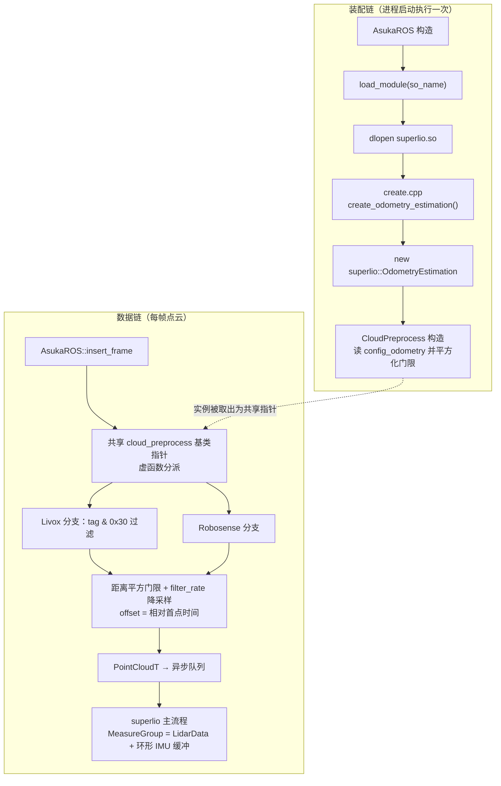

# SuperLIO 辅助设施与预处理

本页收尾 SuperLIO 子模块（`src/asuka/include/asuka/odometry/superlio` 与对应 `src` 目录）：类型别名、公共状态结构、计时器三个基础设施头，点云与 IMU 预处理，以及 `create.cpp` 插件导出。它们不承担状态估计本身，但定义了这个实现的数据契约、精度基调与接入主链路的边界。

## 文件构成与角色

| 文件 | 体量 | 角色 |
|---|---|---|
| `alias.hpp` | 2.2KB | 全子模块共享的标量/向量/矩阵/四元数别名 |
| `types.hpp` | 2.2KB | 状态快照与帧级数据结构（`SysState`/`MeasureGroup` 等） |
| `timer.hpp` | 1.6KB | 函数级耗时统计 `Timer` |
| `cloud_preprocess.hpp/.cpp` | 0.8KB + 2.8KB | 点云预处理，Livox/Robosense 双分支 |
| `imu_preprocess.hpp/.cpp` | 各约 1.2KB | IMU 预处理（本页证据仅含文件清单，未展开内容） |
| `create.cpp` | 183B | `extern "C"` 插件工厂，dlopen 入口 |

## alias.hpp：单精度基调

`alias.hpp` 只做一件事——为整个 `asuka::superlio` 命名空间固化数学类型：

- `Scalar = float`：该子模块默认以单精度运算，这与以 double 为主的其它实现形成精度取向差异；
- `V2`~`V18`/`VX` 向量、`M1`~`M18` 方阵及 `M3_2`/`M2_3` 非方阵，全部基于 `Scalar`；`VV3`/`VV4` 为带 Eigen 对齐分配器的向量数组；
- `V2d`~`M18d`、`Quatd` 等 `d` 后缀的 double 变体，用于与外部接口（如秒级时间戳）交互；
- 常量 `Eye3`/`ZeroV3`/`EyeV3` 提供零成本默认初值。

其中 15/17/18 维向量与方阵别名正是 LIO 误差状态滤波的典型状态/协差维度，与同目录 `eskf.hpp` 的状态设计呼应（详见 SuperLIO ESKF 页面）。

## types.hpp：状态快照与帧级数据契约

`types.hpp` 依赖 `alias.hpp` 与 `manifold.hpp`（`So3`/`Se3`），定义四组载体：

- **滤波状态快照**：`SysState`（timestamp + rot + p + v + bg + ba，即带零偏的完整 ESKF 状态，可由 `Se3`+速度构造）、`NavState`（仅 rot/p/v）、`PoseT`（仅 rot/p）。三者都提供 `get_se3()`，把内部表示统一折叠为流形上的位姿，方便向下游（可视化、扩展模块）输出；
- **动态中间量**：`DynamicState` 用裸 `M3` 存旋转并附 w/a，偏向数值迭代过程中的瞬时量而非几何对象；
- **IMU 样本**：`ImuSample`（secs/acc/gyr），带 `EIGEN_MAKE_ALIGNED_OPERATOR_NEW` 保证 16 字节对齐；
- **帧级同步组**：`LidarData`（start_time/end_time + `PointCloudT::ConstPtr`）与 `MeasureGroup`（LidarData + `boost::circular_buffer<ImuSample>`）。环形容器意味着 IMU 窗口有界，`start_time`/`end_time` 的成对出现为去畸变提供点云时间跨度。

## timer.hpp：轻量耗时统计

`Timer` 是一个无锁的 `std::map<std::string, TimerRecord>`：模板方法 `evaluate(func, name)` 用 `high_resolution_clock` 包裹任意可调用对象，按函数名累积毫秒耗时；`print_all()` 通过 spdlog 输出每个名字的平均耗时与调用次数，`clear()` 清空。它只适合单线程或阶段性剖析（map 无锁），是主流程做性能归因时的随手工具。

## cloud_preprocess：点云预处理

`superlio::CloudPreprocess` 继承共享抽象基类 `asuka::CloudPreprocess`，重载 Livox/Robosense 两个 `preprocess`。ROS 层只持有基类指针，具体过滤策略对上层不可见。

**配置期（构造函数）**：读 `config_odometry` 的 `preprocess` 段——`min_distance`（默认 2.0m）、`max_distance`（默认 60.0m）、`filter_rate`（默认 3，`std::max(1, ...)` 兜底）。前两者在构造时预平方为 `min/max_distance_squared`（4.0/3600.0），运行期比较免开方；三个参数构造后只读。

**运行期（每帧）**：

1. 空（Livox 分支还要求 `size >= 2`）直接返回空输出；
2. 取首点 `timestamp` 作时间基准 `timebase`；
3. 按 `filter_rate` 步进降采样（`reserve(raw->size()/filter_rate + 1)` 预留）；
4. Livox 分支额外做 tag 位段过滤：`(tag & 0x30)` 既非 `0x10` 也非 `0x00` 的点剔除，Robosense 分支无此检查；
5. 距离平方落在 `(min, max)` 之外（`<=min` 或 `>=max`）的点剔除；
6. 输出 `PointT`：xyz/intensity 直拷，`offset = (timestamp - timebase) / 1e6`，即把绝对时间转为相对首点的时间，供下游去畸变使用。

值得注意的细节：函数签名保留了 `stamp` 参数但两个实现体内均未使用——时间信息完全由点级相对时间承载。

## imu_preprocess 与 create.cpp

`imu_preprocess.hpp/.cpp` 各约 1.2KB，从清单与命名看与 `cloud_preprocess` 同属“算法私有实现挂接共享基类”的模式；其体量与 FastLIO 版 8.7KB 的 IMU 预处理形成鲜明对比，可推断 SuperLIO 把 IMU 前向传播等重活收进了主流程与 ESKF，预处理层极薄。

`create.cpp` 全文仅 6 行：`extern "C"` 导出 `create_odometry_estimation()`，`new` 一个无参 `superlio::OdometryEstimation` 返回裸指针。没有删除器、没有异常处理——生命周期完全交给上层 dlopen 注册表（句柄永不关闭、插件常驻），是五种算法中最小、最标准的插件接入样例。

## 调用链全景

关键节点：**装配链**中 `create.cpp` 是 so 与框架之间唯一命名约定；`CloudPreprocess` 随主估计器一起构造，参数在此时固化。**数据链**中 ROS 层通过基类指针回调到本页实现，过滤降采样后的点云携带相对时间进入异步队列，最终在主流程内与 `circular_buffer` 中的 IMU 样本组装成 `MeasureGroup` 供 ESKF 消费——本页类型定义正是这条链上各环节的交接口径。

## 边界条件与扩展点

**边界条件**：

- 空点云与近空点云（Livox 分支 `size < 2`）返回空输出而非报错；
- 距离门限为闭式剔除（`<=min` 或 `>=max`），平方比较避免 sqrt；`filter_rate` 被 clamp 到 ≥1，防 步进为 0；
- Robosense 分支缺少 `size<2` 检查，但 `empty` 已拦截，取 `points[0]` 仍安全；
- `Timer` 的 records 无锁，跨线程共用需外部同步；
- 工厂函数无参、无配置注入，配置错误只能靠 `param<T>` 的默认值兜底。

**扩展点**：

- 接入新雷达类型：基类新增 `preprocess` 重载后在本实现补一个分支（照 Robosense 分支裁剪）；
- 预处理调参只动 `config_odometry` 的 `preprocess` 段，无需改代码；
- `Timer::evaluate` 可包裹任意 lambda 增加统计点，`print_all` 手动触发汇总；
- 若需整体切换精度，改 `alias.hpp` 的 `Scalar` 一处即可（需同步评估 ESKF 数值稳定性）；
- `types.hpp` 新增状态结构体并实现 `get_se3()`，即可向可视化/扩展模块暴露新的状态快照。

Sources:
- `src/asuka/include/asuka/odometry/superlio/types.hpp#L1-L96`
- `src/asuka/include/asuka/odometry/superlio/alias.hpp#L1-L73`
- `src/asuka/include/asuka/odometry/superlio/timer.hpp#L1-L58`
- `src/asuka/include/asuka/odometry/superlio/cloud_preprocess.hpp#L1-L32`
- `src/asuka/src/asuka/odometry/superlio/cloud_preprocess.cpp#L1-L82`
- `src/asuka/src/asuka/odometry/superlio/create.cpp#L1-L6`

## 关联源码

- `src/asuka/include/asuka/odometry/superlio/types.hpp`
- `src/asuka/include/asuka/odometry/superlio/alias.hpp`
- `src/asuka/include/asuka/odometry/superlio/timer.hpp`
- `src/asuka/src/asuka/odometry/superlio/cloud_preprocess.cpp`
- `src/asuka/src/asuka/odometry/superlio/imu_preprocess.cpp`
- `src/asuka/src/asuka/odometry/superlio/create.cpp`
