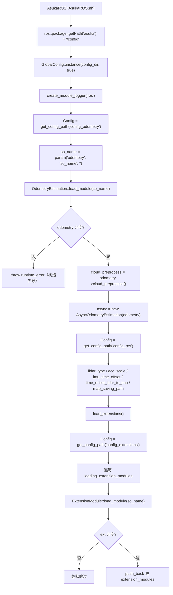
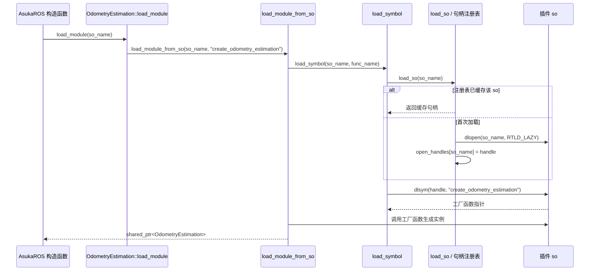

# AsukaROS 构造装配与模块装载

`AsukaROS` 的构造函数（`asuka_ros.cpp` L19-L43）是整个进程的装配中枢：它把「配置系统 → 里程计插件 → 异步执行器 → ROS 边界参数 → 扩展模块」五部分按固定顺序组装成一条可运行的数据链路。本页只讲构造阶段的装配逻辑与模块装载机制；数据流入后的处理见后续页面。

## 装配顺序总览

关键节点解释：

- **GlobalConfig 初始化先于一切**：config 目录用 `ros::package::getPath("asuka") + "/config"` 定位，随后 `GlobalConfig::instance(config_dir, true)` 以单例方式建立（第二个布尔参数传 `true`，其确切语义见「配置系统」页）。此后所有 `get_config_path` 调用都依赖这一步。
- **logger 紧随其后**：`create_module_logger("ros")` 建立本类的日志通道，保证后续步骤的运行期日志有归属。
- **里程计装载是唯一硬失败点**：`odometry` 为空即抛出 `runtime_error("failed to load odometry module: " + so_name)`，构造直接失败。
- **`cloud_preprocess` 的外提是关键装配动作**：点云预处理实例由算法插件内部创建，再通过基类虚函数 `cloud_preprocess()` 交给 ROS 层持有。后续 `insert_frame` 用它把 Livox/Robosense 原始点云转成算法私有的 `PointCloudT`——这是 ROS 层与算法私有预处理解耦的接合点。
- **异步执行器必须在 odometry 之后创建**：`AsyncOdometryEstimation` 构造时直接持有 odometry，从此 worker 线程开始按队列消费数据。
- **扩展模块最后装载**：核心链路（里程计 + 执行器）已可用后才加载扩展，扩展失败不影响主链路。

## dlopen 装载链路与句柄注册表

`OdometryEstimation::load_module` 是一个薄工厂：转发到模板 `load_module_from_so<OdometryEstimation>(so_name, "create_odometry_estimation")`，真正的装载工作在 `utility/load_module.cpp` 完成。

关键节点解释：

- **进程级句柄注册表**：`open_handles` 是以 so 名为键的 `std::map`，由 `handle_mutex` 保护。同一 so 重复装载（如多次构造、或里程计与扩展模块引用同一库）会命中缓存直接返回，不会重复 `dlopen`。
- **`RTLD_LAZY`**：延迟符号绑定，库打开更快；装载失败时用全局 `spdlog::warn` 输出 so 名与 `dlerror()` 内容并返回空指针。
- **句柄永不关闭**：源码注释明确说明插件代码必须常驻进程生命周期，注册表是未来 unload/reload 实现的「接缝」。`load_module.hpp` 头注释甚至写好了尚未实现的三步卸载顺序：先停所有可能发射回调的线程，再销毁模块让其退订回调槽，最后从注册表取句柄 `dlclose` 并删除条目。
- **extern "C" 工厂契约**：`odometry_estimation.hpp` 中直接声明 `extern "C" OdometryEstimation* create_odometry_estimation()`，五种算法实现各自在 `create.cpp` 导出该符号。模板中将 `dlsym` 返回的 `void*` 强转为 `Module* (*)()` 并调用，结果包进 `shared_ptr` 接管所有权。

## 关键状态：构造后可用的成员清单

| 成员 | 默认值 | 装配来源 | 后续用途 |
|---|---|---|---|
| `odometry` | nullptr | `load_module(so_name)` | 算法实例，`save()` 时调 `save_map()` |
| `async` | nullptr | `make_unique(odometry)` | worker 线程与双队列所有者 |
| `cloud_preprocess` | nullptr | `odometry->cloud_preprocess()` | `insert_frame` 的预处理（允许为空） |
| `extension_modules` | 空 vector | `load_extensions()` | 析构时统一 `stop()` + `at_exit` |
| `lidar_type` | `LIVOX` | `parse_lidar_type(config_ros.lidar_type)` | 点云分派分支 |
| `acc_scale` / `imu_time_offset` | 1.0 / 0.0 | config_ros | `insert_imu` 中的标定叠加 |
| `time_offset_lidar_to_imu` | 0.0 | config_ros | `insert_frame` 的时间对齐 |
| `map_saving_path` | "" | config_ros | `save()` 与析构 `at_exit` 的目标 |
| `last_timestamp_lidar/imu` | -1.0 | 类内默认初始化 | 回环检测基线（首帧必然通过） |
| `logger` | nullptr → "ros" | `create_module_logger` | 全部运行期日志 |

注意所有 config 参数读取都带默认值回落（`param` 的第三参），缺配置不会让构造失败——真正的硬失败点只有里程计装载一处。

## 边界条件

1. **`so_name` 缺省为空串**：`load_module` 找不到符号返回空指针，构造抛异常，进程无法启动——这是「配置了不存在的算法库」时的显式失败路径。
2. **严格性不对称**：里程计装载失败是致命的（throw）；扩展模块装载失败只是 `if (ext)` 守卫下静默跳过，主链路照常运行。
3. **`cloud_preprocess` 允许为空**：基类默认实现返回 nullptr，`insert_frame` 中以三目运算守卫（`cloud_preprocess ? ... : nullptr`）；预处理返回空同样直接丢弃该帧、不入异步队列。
4. **注册表的检查与 dlopen 不在同一临界区**：先查缓存、解锁后 `dlopen`、再加锁插入。构造阶段是单线程执行，此窗口无实际影响；若未来在运行期并发装载模块则需留意。
5. **卸载未实现**：句柄永不关闭 + `RTLD_LAZY` 意味着插件代码一旦载入就常驻进程，unload/reload 只是注释中的设计预留。

## 扩展点

- **切换算法**：只改 `config_odometry` 的 `so_name` 即可在五种实现间切换，构造代码零改动。
- **新增扩展模块**：在 `config_extensions` 的 `loading_extension_modules` 列表追加 so 名，构造循环自动装载，与 `OdometryEstimation` 共用同一套 dlopen 工厂模式。
- **unload/reload**：句柄注册表 + 头注释中的三步卸载顺序是预留接缝。
- **新增 ROS 边界参数**：构造函数的 config_ros 读取段（L34-L40）是传感器标定类修正的唯一收敛点。

## 生命周期对照

构造顺序（odometry → async → extensions）在析构中被精确逆序回收：先 `async->stop()` join worker，再逐个 `ext->stop()`，最后逐个 `ext->at_exit(map_saving_path)`；cpp 注释解释了这是为了确保没有任何在途的回调槽发射后再销毁模块（详见「地图保存与退出时序」页）。

Sources:
- `src/asuka/src/asuka/asuka_ros.cpp#L19-L43`
- `src/asuka/src/asuka/asuka_ros.cpp#L157-L169`
- `src/asuka/include/asuka/asuka_ros.hpp#L44-L60`
- `src/asuka/include/asuka/core/odometry_estimation.hpp#L11-L37`
- `src/asuka/src/asuka/core/odometry_estimation.cpp#L6-L8`
- `src/asuka/include/asuka/utility/load_module.hpp#L8-L28`
- `src/asuka/src/asuka/utility/load_module.cpp#L13-L58`

## 关联源码

- `src/asuka/src/asuka/asuka_ros.cpp`
- `src/asuka/include/asuka/asuka_ros.hpp`
