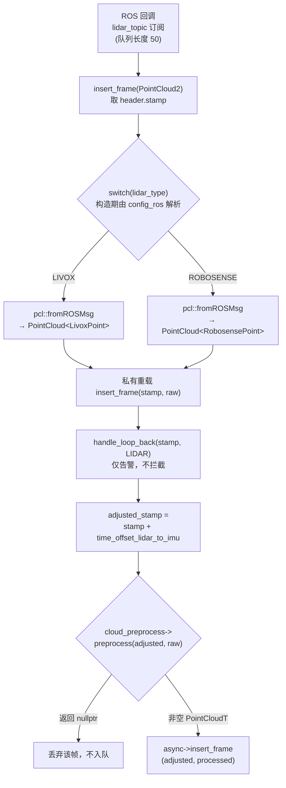

# 点云接入与雷达类型分发

## 模块职责

`AsukaROS::insert_frame` 重载族是整个系统的点云唯一入口，承担三层类型收敛与一次分发：

1. **ROS 消息 → 厂商点类型**：按构造期确定的 `lidar_type`，把 `sensor_msgs::PointCloud2` 经 `pcl::fromROSMsg` 反序列化为 `LivoxPoint` 或 `RobosensePoint` 的带时间戳 PCL 点云；
2. **时间轴对齐**：统一叠加 `time_offset_lidar_to_imu`，并在此之前用原始时间戳做回环检测；
3. **厂商点类型 → 统一算法点类型**：调用当前里程计插件共享出的 `cloud_preprocess->preprocess`，把原始点云转为 `PointCloudT`（`asuka::PointXYZIOffset`，其 `offset` 按约定存放"相对扫描起始的毫秒偏移"），**只有返回非空指针才写入异步队列**。

这条边界的设计意图是：ROS 封装层不解析点的几何语义，算法插件层不接触 ROS 消息类型；所有雷达差异在入口处被消化掉。

## 调用链

**关键节点说明：**

- **分发点 `switch(lidar_type)`**（asuka_ros.cpp L74-87）：`lidar_type` 来自 `config_ros.json` 的 `ros.lidar_type` 字符串（默认 `"livox"`），经 `parse_lidar_type` 在构造期解析为枚举，进程内不可变。枚举只有 `LIVOX`/`ROBOSENSE` 两个值，且 `parse_lidar_type` 对未知字符串直接 `throw`，因此 switch 无需 default 分支。
- **两个对称的私有重载**（L90-96 与 L98-104）：Livox 与 Robosense 版本逐行同构——回环检测 → 叠加时间偏移 → 预处理 → 判空 → 入队。类型系统层面区分两种原始点云，代价是新增雷达时需复制一份。
- **回环检测在偏移之前**：`handle_loop_back` 用未修正的原始 stamp 与 `last_timestamp_lidar` 比较，回退只打 warn 日志，帧仍继续走完整流程。
- **预处理同步执行**：`preprocess` 在 ROS 回调线程（`ros::spin`）内同步调用，真正的配准/建图重活由 `async->insert_frame` 之后异步 worker 承担。
- **判空是准入门槛**：`processed` 为 `nullptr` 即静默丢弃，不进入异步队列。

## 关键状态

| 状态 | 位置 | 含义 |
|---|---|---|
| `lidar_type` | `AsukaROS` 成员，默认 `LIVOX` | 构造期由 `ros.lidar_type` 决定，之后不可变 |
| `time_offset_lidar_to_imu` | `AsukaROS` 成员 | 激光时间轴向 IMU 时间轴的整体偏移（IMU 侧对应 `imu_time_offset`） |
| `cloud_preprocess` | 从 `odometry->cloud_preprocess()` 取出的共享实例 | 算法私有预处理，ROS 层只依赖基类接口 |
| `last_timestamp_lidar` | 由 `handle_loop_back` 维护 | 激光最新时间戳，用于回退告警 |

## 边界条件

- **未知雷达类型**：`parse_lidar_type` 抛 `std::runtime_error`，发生在 `AsukaROS` 构造期——配置错误的雷达类型是 fail-fast，进程根本不会启动。
- **接口默认 nullptr 是静默丢弃点**：`CloudPreprocess` 基类的两个 `preprocess` 虚函数默认实现都返回 `nullptr`。若某算法只覆盖了 Livox 重载而配置成 Robosense（或反之），每帧都会在此被丢弃且无任何日志——这是排查"点云消失"时的首要怀疑点。`cloud_preprocess` 本身为空（插件未提供）同样走这条路。
- **空点云 ≠ 失败**：契约上只以 `nullptr` 表示"本帧不处理"。以 fastlio 实现为例，空输入返回非空指针的空点云，仍会入队。
- **厂商点字段差异在类型里**：Livox 靠 `tag`（位标志过滤）与 `line`（扫描线号），Robosense 靠 `ring`；二者都带每点 `timestamp`，缺失时（fastlio 的 Robosense 路径按 `timestamp > 0` 判断）用偏航角与转速常量 `omega_l=3.61` 推算时间偏移。

## 扩展点

**新增雷达类型**需要四处联动：
1. `types.hpp` 新增点结构并用 `POINT_CLOUD_REGISTER_POINT_STRUCT` 注册字段布局；
2. `LidarType` 枚举加值、`parse_lidar_type` 加字符串分支；
3. `asuka_ros.cpp` 的 switch 加 case，并复制一份私有 `insert_frame` 重载（回环 → 偏移 → 预处理 → 入队四步）；
4. 各算法的 `CloudPreprocess` 子类按需覆盖对应重载——基类默认 nullptr 意味着"未覆盖即不支持"。

**新增算法**则零改动 ROS 层：只需提供 `CloudPreprocess` 子类并经 `odometry->cloud_preprocess()` 暴露，其支持哪些雷达由覆盖的重载集合隐式声明。

## 主要文件

- `src/asuka/src/asuka/asuka_ros.cpp` — 分发与注入的实现本体（L72-104 为本页核心，L34-39 为配置读取）；
- `src/asuka/include/asuka/asuka_ros.hpp` — 成员状态与两个私有重载声明；
- `src/asuka/include/asuka/core/types.hpp` — `LidarType`、`LivoxPoint`/`RobosensePoint`、`PointT` 与 `parse_lidar_type`；
- `src/asuka/include/asuka/core/cloud_preprocess.hpp` — 双重载抽象接口（默认返回 nullptr）；
- `src/asuka/apps/asuka_rosnode.cpp` — 订阅入口，点云队列长度 50（IMU 为 1000）；
- 各算法 `odometry/*/cloud_preprocess.cpp` — 接口的具体实现，fastlio 版展示了两种雷达各自的过滤与时间补偿细节。

Sources: `src/asuka/src/asuka/asuka_ros.cpp#L72-L104` · `src/asuka/src/asuka/asuka_ros.cpp#L19-L43` · `src/asuka/include/asuka/asuka_ros.hpp#L38-L61` · `src/asuka/include/asuka/core/types.hpp#L29-L57` · `src/asuka/include/asuka/core/cloud_preprocess.hpp#L11-L29` · `src/asuka/apps/asuka_rosnode.cpp#L23-L26` · `src/asuka/src/asuka/odometry/fastlio/cloud_preprocess.cpp#L24-L132`

## 关联源码

- `src/asuka/src/asuka/asuka_ros.cpp`
