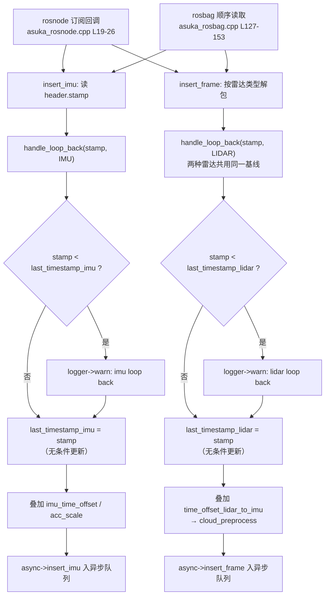

# 时间戳回环检测 handle_loop_back

## 模块职责

`AsukaROS::handle_loop_back(double stamp, const FrameId& frame_id)` 是数据进入主链路前的**第一道防线**：它分别为 IMU 与激光雷达各维护一个"最新时间戳"基线，一旦发现新到的消息时间戳早于基线（时间回退，典型场景是 rosbag 循环播放），就通过 `"ros"` 模块日志输出 warn 告警。

需要特别强调其设计取向：**这是一个"只观测、不拦截"的哨兵**。函数体（asuka_ros.cpp L171-L183）中没有任何数据丢弃、状态重置或流程中断——即使检测到回环，调用方仍会继续走标定补偿与入队流程。它的价值在于把时间异常显式暴露到日志层，为下游算法可能出现的异常提供排查线索。

## 在调用链中的位置

`handle_loop_back` 是 AsukaROS 的私有方法（asuka_ros.hpp L40），共三个调用点，全部位于入口函数的最前端、所有补偿与预处理之前：

- **IMU 通路**：`insert_imu`（asuka_ros.cpp L59-L70）在构造 `ImuData` 并读取 `header.stamp` 后立即调用 `handle_loop_back(imu->stamp, FrameId::IMU)`（L62），**之后**才叠加 `imu_time_offset` 与 `acc_scale`；
- **点云通路**：Livox 与 Robosense 两个 `insert_frame` 重载（L90-L104）在解包点云后各调用一次 `handle_loop_back(stamp, FrameId::LIDAR)`（L91、L99），同样先于 `time_offset_lidar_to_imu` 的叠加与 `cloud_preprocess->preprocess`。

由于独立节点（`asuka_rosnode.cpp` 的 ros::spin 订阅回调）与 rosbag 回放（`asuka_rosbag.cpp` 的顺序读取，L130/L150）都汇聚到同一组 `insert_imu`/`insert_frame`，两种运行形态天然共享这道检查。

图中关键节点：`handle_loop_back` 卡在**原始时间戳**上做检查（先于任何 offset 修正）；warn 分支之后两条通路**殊途同归**地无条件更新基线并继续放行，体现了"告警但不拦截"的语义。

## 关键状态

| 状态 | 位置 | 说明 |
|---|---|---|
| `last_timestamp_lidar{-1.0}` | asuka_ros.hpp L57 | 激光基线，初始化为 -1.0 保证首帧必通过 |
| `last_timestamp_imu{-1.0}` | asuka_ros.hpp L58 | IMU 基线，同上 |
| `FrameId` 枚举 | types.hpp L18 | `{WORLD=0, LIDAR=1, IMU=2}`，本函数只处理后两者 |
| `logger`（"ros" 通道） | asuka_ros.cpp L23 | 告警输出通道 |

两条通路独立跟踪、互不干扰；检测发生在加 offset **之前**，由于 offset 是常数，不改变时间戳的相对次序，因此在原始时间戳上判断回退与修正后判断等价，且不受配置错误的双倍影响。

## 检测逻辑逐条解读

1. **严格小于判定**（`stamp < last_timestamp_*`）：时间戳相等不算回退，静默通过；
2. **告警内容**：`"lidar/imu loop back detected: {旧} -> {新}"`，同时打印回退前后的两个时间戳，便于直接定位 rosbag 回绕点；
3. **基线无条件更新**：无论是否告警，`last_timestamp_*` 都被覆盖为新 stamp。这意味着回环发生后基线自然"落地"到回绕后的较小时间，后续数据以新基线比较，不会反复刷告警；
4. **FrameId 分派**：`WORLD` 枚举值没有对应分支——传入时两个 if 都不命中，函数静默无操作。

## 边界条件

- **首帧判定**：基线初始化为 -1.0，任何非负 ROS 时间戳的首帧都不会误报；
- **回退与乱序不可区分**：任何向后跳变（包括传感器偶发乱序）都会触发同一条"loop back"告警，函数不做幅度分级；
- **两种雷达共享一个基线**：Livox 与 Robosense 重载都写 `last_timestamp_lidar`，正常配置下只启用一种雷达类型，混用时次序检查跨类型生效；
- **线程安全依赖调用形态**：函数本身无锁。现有两个入口分别是单线程 `ros::spin()` 与 rosbag 顺序读取，`last_timestamp_*` 实际只被单线程访问；若未来引入多线程 spinner 或 AsyncSpinner，这两个裸 double 将存在数据竞争，属于隐性约束；
- **无恢复动作**：检测到回环后状态估计器内部的累计状态（如 IMU 前向传播、地图）不会被重置，回环后的数据仍会按新时间线继续喂给算法。

## 扩展点

当前实现是纯日志哨兵，自然的演进方向包括：检测到回环时**丢弃该帧或清空异步队列**（`AsyncOdometryEstimation` 的双队列已有清空语义可复用）、触发算法侧的 `clear_buffers` 状态重置、或通过 `callbacks`/`CallbackSlot` 机制向扩展模块广播回环事件。由于检查点位于所有补偿与预处理之前，任何拦截策略在此处生效成本最低。

Sources: `src/asuka/src/asuka/asuka_ros.cpp#L1`

## 关联源码

- `src/asuka/src/asuka/asuka_ros.cpp`
