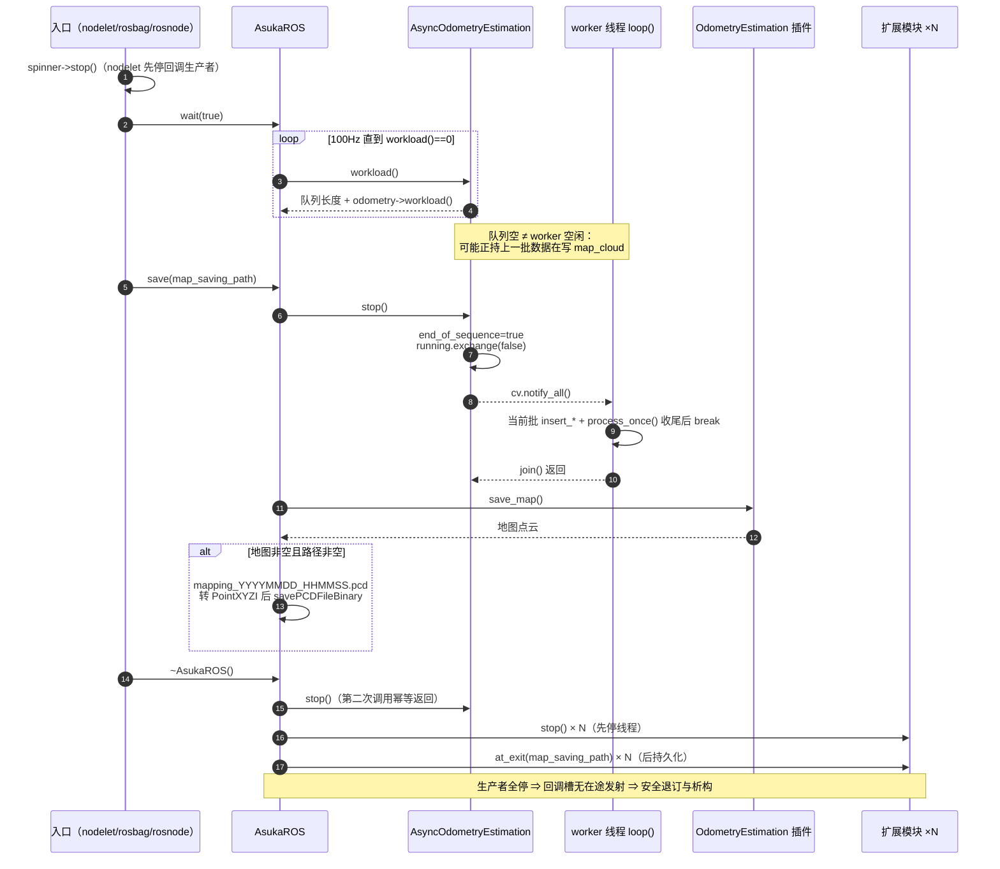

# 地图保存与退出时序（含风险点）

## 模块职责与涉及文件

本页覆盖进程收尾阶段的三件事：**停机同步、地图持久化、无竞态析构**。核心角色如下：

| 角色 | 文件 | 职责 |
|---|---|---|
| `AsukaROS::save()` | `src/asuka/src/asuka/asuka_ros.cpp` (L118-L155) | 先停 worker 再读地图，落盘为 `mapping_*.pcd` |
| `AsukaROS::~AsukaROS()` | 同上 (L45-L57) | 按 worker → 扩展模块 stop → 扩展模块 at_exit 的固定次序析构 |
| `AsyncOdometryEstimation::stop()` | `src/asuka/src/asuka/core/async_odometry_estimation.cpp` (L52-L57) | 幂等的停止 + join，是整条退出链路的同步原语 |
| 三种入口 | `apps/asuka_rosnode.cpp`、`apps/asuka_rosbag.cpp`、`apps/asuka_nodelet.cpp` | 各自收敛到 `wait(true)` → `save(map_saving_path)` → 析构 |

`map_saving_path` 在构造函数中从 `config_ros` 读取（asuka_ros.cpp L40），贯穿 save 与 at_exit 两条持久化路径。

## 退出主链路：三个入口的汇聚

三种运行形态在收尾时几乎相同：

- **rosnode**（asuka_rosnode.cpp L28-L31）：`ros::spin()` 结束 → `asuka_ros.wait(true)` → `asuka_ros.save(map_saving_path)` → `return 0` 时触发 `~AsukaROS()`。
- **rosbag**（asuka_rosbag.cpp L171-L172）：bag 播放循环结束后同样 `wait(true)` → `save(...)`。
- **nodelet**（asuka_nodelet.cpp L39-L47）：析构中先 `spinner->stop()` 掐断 ROS 回调这一生产者，再 `wait(true)`、`save(...)`，随后 `unique_ptr` 析构 `AsukaROS`。

`wait(bool auto_quit)`（asuka_ros.cpp L110-L116）以 100Hz 轮询 `workload()==0`。关键在于：**这只是逻辑排空的近似判断，不是线程级同步**——见下一节。

## save()：为什么必须先 stop —— 数据竞争剖析

`save()` 的第一步不是读地图，而是 `async->stop()`（L124）。源码注释（L119-L123）给出了完整理由：

> workload() 只反映输入缓冲；worker 此刻可能仍在 `process_scan()` 内部写 `map_cloud`，而 `save()` 同时去读它（数据竞争 / 堆损坏）。此处 join worker；析构函数里的 `stop()` 是幂等的。

拆解这层风险：

1. **workload 的语义边界**：`workload()` 返回的是事件队列长度 + `odometry->workload()`，全部是"待处理量"。worker 的 loop 逐条取出事件后置 `processing=true`，先发射输入槽再喂给算法并循环 `process_once()`。在此期间队列已空、算法自报负载也可能已归零，但**地图仍在被 worker 线程写入**。
2. **检查-动作间隙**：即使 `wait(true)` 观察到 `workload()==0`，从该观察到 `save_map()` 执行之间没有任何同步屏障。
3. **join 是唯一硬屏障**：`stop()` 中 `worker.join()` 保证 worker 把当前事件的 `insert_*` 与 `process_once()` 循环完整跑完后才返回；此后算法内部状态（含地图）对 save 线程是静默的。注意执行器层面驱动的是 `process_once()`，注释中的 `process_scan()` 指各算法内部实际写地图的函数，两者是"外层循环驱动 / 内层写地图"的关系。

因此正确的次序被固化为：**stop（join）→ save_map → 落盘**，任何绕过 stop 直接调 `save_map` 的用法都会复现上述竞争。

## 地图命名与 PCL 二进制落盘

拿到 `odometry->save_map()` 返回的点云后（L125），保存逻辑有几条分支（L126-L154）：

- 地图为空或路径为空 → 整体跳过，无日志。
- 路径**带扩展名** → 视作完整文件名直接使用（L134-L135）。
- 否则视为目录：`create_directories(path)` 后生成文件名 `mapping_ + %Y%m%d_%H%M%S + .pcd`（L136-L138）。
- 点云被逐点拷贝为 `pcl::PointCloud<pcl::PointXYZI>`（仅保留 x/y/z/intensity，L141-L148），以 `pcl::io::savePCDFileBinary` **二进制格式**写盘（L149）。
- 成功打 info 日志（点数 + 路径）；捕获 `pcl::IOException` 仅 warn（L151-L153），**保存失败不会阻断退出流程**。

## stop() 的幂等状态机与关键状态

`AsyncOdometryEstimation` 的三个原子标志决定了整个停机协议的行为：

| 状态 | 作用 |
|---|---|
| `running` (atomic) | stop 的幂等闸门：`running.exchange(false)` 只有首次调用者拿到 true，负责 `cv.notify_all()` + `join()`；后续调用直接 return（L54） |
| `end_of_sequence` (atomic) | stop 一进入就置位（L53）；`insert_imu/insert_frame` 检查 `!running \|\| end_of_sequence` 即丢弃新数据（L20-L21、L28-L29） |
| `processing` (atomic) | 标记 worker 正在批内计算，供更严格的 `wait_idle()` 轮询用（L47）；但入口用的 `AsukaROS::wait` 只看 workload，这正是 save 必须额外 join 的原因 |

```mermaid
stateDiagram-v2
    [*] --> 运行中: 构造函数启动 worker
    运行中 --> 停止中: stop() 首次调用<br/>end_of_sequence=true; running=false
    停止中 --> 已join: worker 跑完当前批后 break<br/>cv.notify_all + join 返回
    已join --> [*]
    note right of 运行中
        insert_* 正常入队并 notify
    end note
    note right of 停止中
        insert_* 开始丢弃新数据
        再次 stop() 直接返回（幂等）
    end note
```

图中"停止中 → 已join"的转移是**不可逆**的：`end_of_sequence` 没有任何复位路径，一旦 stop 就没有 restart 接口——这是当前设计的明确取舍。

## 析构次序：worker → 扩展模块 → at_exit

`~AsukaROS()`（L45-L57）严格执行三步，注释（L46-L49）说明了排序依据：

> 先停所有生产者再销毁任何东西：先 odometry worker，再所有模块线程。当所有 `stop()` 都返回后，回调槽上不再有在途发射（in-flight slot emissions），模块才可以退订回调槽并无竞争地析构。

1. `async->stop()` —— 即便 `save()` 已停过一次，这里再次调用也因 `running.exchange` 幂等而立即返回；**save 的 stop 与析构的 stop 形成双重保险**。
2. 逐个 `ext->stop()` —— 停掉全部扩展模块线程（L51-L53）。
3. 逐个 `ext->at_exit(map_saving_path)` —— 所有线程静默后才让扩展模块持久化自身状态（L54-L56）。

顺序不能颠倒：若某扩展模块还在通过 CallbackSlot 发射事件，而另一模块已进入析构/退订，就是对已销毁订阅者的销毁竞态。"全部 stop 返回"是整个进程唯一的"无在途发射"证明点。

## 完整退出时序图

**关键节点解读**：

- **节点 5-7（stop 的内部展开）**：`end_of_sequence` 先行保证 stop 发起后新数据被拒之门外；`running.exchange(false)` 是幂等闸门，决定谁执行 notify+join；join 等待 worker 跑完手头这批——三者合起来把"逻辑排空"升级为"物理静默"。
- **节点 9-11（save_map）**：只在 join 之后执行，是整个风险点消除的证明；`save_map()` 是算法插件虚函数，各算法返回自己的地图表达。
- **节点 14-16（析构三连）**：第二次 `stop()` 体现幂等价值；扩展模块"先 stop 后 at_exit"复刻了同一并发纪律。

## 边界条件

- **空地图 / 空路径**：静默跳过保存，不产生任何日志。
- **路径带扩展名**：被当作完整文件名，**不会**创建目录；不带扩展名才走"建目录 + 时间戳文件"分支。
- **保存失败**：`pcl::IOException` 仅 warn，进程照常退出。
- **stop 后到达的数据**：`insert_imu/insert_frame` 直接丢弃，不排队不处理。
- **重复 stop 三重安全**：`save()`、`~AsukaROS()`、`~AsyncOdometryEstimation()` 各自都会调 stop，幂等性使其可任意叠加。
- **nodelet 的额外前置**：必须先 `spinner->stop()` 停掉 ROS 回调线程，否则 save/析构期间回调仍会写入队列（虽会被丢弃，但属于应避免的无谓竞争面）。

## 扩展点

- **`save_map()` 契约**：返回值只需是可转 PointXYZI 的点云（x/y/z/intensity 之外的字段在落盘时会被丢弃），新算法实现无需关心文件命名与 IO。
- **`at_exit(map_saving_path)` 契约**：扩展模块获得与主地图同一路径参数的退出持久化钩子，但必须先正确实现幂等的 `stop()` 才有资格进入该阶段。
- **新入口形态**：任何新的 executable/nodelet 必须复用 `wait(true) → save → 析构` 次序，不得直接调 `save_map`。
- **潜在改造接缝**：当前 stop 不可逆（无 restart），若未来要支持"保存后继续运行"或周期性落盘，需要重新设计 `end_of_sequence` 的生命周期，或在 save 路径中改用不终结 worker 的排空 + 屏障方案。

Sources:
- `src/asuka/src/asuka/asuka_ros.cpp#L45-L155`
- `src/asuka/src/asuka/core/async_odometry_estimation.cpp#L17-L83`
- `src/asuka/include/asuka/core/async_odometry_estimation.hpp#L15-L42`
- `src/asuka/apps/asuka_rosnode.cpp#L28-L31`
- `src/asuka/apps/asuka_rosbag.cpp#L171-L172`
- `src/asuka/apps/asuka_nodelet.cpp#L39-L47`

## 关联源码

- `src/asuka/src/asuka/asuka_ros.cpp`
