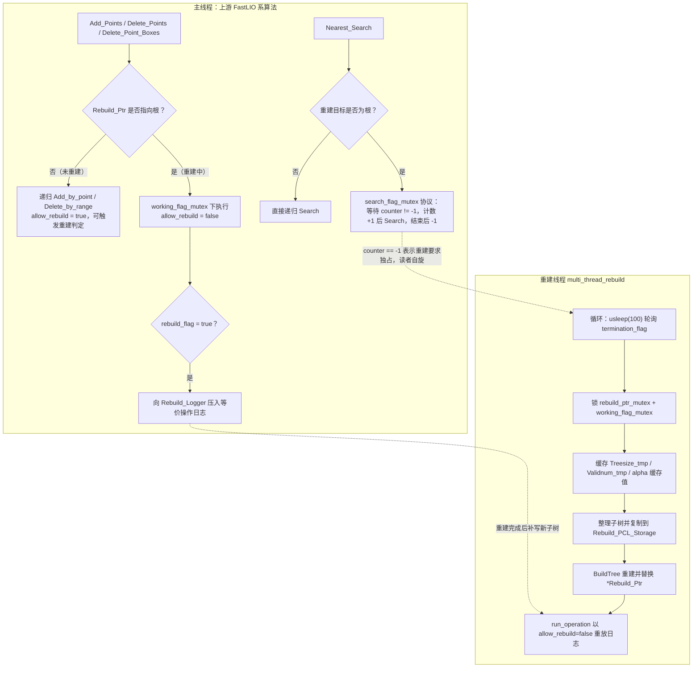

# ikd_tree 增量 KD 树

## 模块定位与文件构成

`src/asuka/thirdparty/ikd_tree` 是内置的第三方成果（源码头注释注明作者 Yixi Cai，HKU，"ikd-Tree: an incremental k-d tree for robotic applications"），仅由两个文件构成：

- `ikd_tree.hpp`（8.9KB）：`KD_TREE<PointType>` 模板类声明、节点结构、手写堆/队列，以及一组编译期宏常量；
- `ikd_tree.cpp`（61.3KB）：全部模板实现，单文件承载递归建树、增删、检索、降采样与多线程重建逻辑，是本目录的绝对主体。

它在本仓库中的角色是**为 FastLIO 系算法充当动态点云地图容器**：上游里程计在状态迭代时用它做 k 近邻查询（点面配准的数据关联），在 IMU 预测后用它增量写入新点、按盒删除滑动窗口外的旧点。两处仓库适配痕迹值得注意：cpp 顶部 `#include <asuka/core/types.hpp>` 打通了与仓库公共点类型的实例化链路；头文件中注释掉的 `pcl::PointXYZINormal` 别名说明点类型由使用方以模板参数注入，结构本身不绑定具体点云格式。

## 核心数据结构

- **`KD_TREE_NODE`**（hpp L44-66）：除点值与 `division_axis`（分割轴）外，关键是三类字段——
  - 子树统计：`TreeSize`、`invalid_point_num`（已删除点数）、`down_del_num`（降采样删除数）；
  - 懒删除标记四元组：`point_deleted / tree_deleted / point_downsample_deleted / tree_downsample_deleted`，配合 `need_push_down_to_left/right` 延迟下推；
  - 平衡与几何：`alpha_bal / alpha_del`（重建准则输入）、`node_range_x/y/z` 子树包围盒（剪枝用）、每节点一把 `push_down_mutex_lock`。
- **`Operation_Logger_Type` + `operation_set`**：六种操作（`ADD_POINT / DELETE_POINT / DELETE_BOX / ADD_BOX / DOWNSAMPLE_DELETE / PUSH_DOWN`）的日志单元，是重建期间主线程与重建线程之间的契约。
- **`MANUAL_HEAP`**：基于数组的二叉堆，元素 `PointType_CMP` 携带距离，容量写满后 `push` 直接丢弃（hpp L111）。
- **`MANUAL_Q`**：容量 `Q_LEN=1000000` 的环形队列，专用于 `Rebuild_Logger`；实现上 `push` 未见满溢检查，仅靠 `tail %= Q_LEN` 回绕，依赖容量足够大。
- **`BoxPointType`**：轴向包围盒（`vertex_min/max[3]`），盒删除、盒搜索、降采样体素共用。

## 公开接口面（调用链入口）

| 公开接口 | 内部递归实现 | 用途 |
|---|---|---|
| `Build` | `BuildTree` + `Update` | 全量建树；先删旧树，经哑根 `STATIC_ROOT_NODE` 挂出 `Root_Node`（cpp L344-355） |
| `Add_Points` | `Add_by_point` / `Search_by_range` / `Delete_by_range` | 增量加点，可选体素降采样 |
| `Delete_Points` / `Delete_Point_Boxes` | `Delete_by_point` / `Delete_by_range` | 按点 / 按盒懒删除 |
| `Nearest_Search` | `Search` | k 近邻（手动堆容量 2k），FastLIO 配准核心依赖 |
| `Box_Search` / `Radius_Search` | `Search_by_range` / `Search_by_radius` | 区域/半径检索 |
| `flatten` + `acquire_removed_points` | — | 按 `NOT_RECORD / DELETE_POINTS_REC / MULTI_THREAD_REC` 三种模式回收被删点 |
| `reconstruct`、`size`、`validnum`、`root_alpha`、`tree_range` | — | 整树重建与状态查询（重建期有降级语义，见下） |

## 写路径：增量插入与体素降采样

`Add_Points`（cpp L407 起）是最能体现本结构设计意图的函数，每处理一个点都要走一次"重建分支判断"：

1. `downsample_switch = downsample_on && DOWNSAMPLE_SWITCH`——宏是全局总开关；
2. 开启降采样时：把点折算到 `downsample_size` 体素盒（`floor(x/size)*size`），`Search_by_range` 收集盒内已有点，选**离盒中心 `mid_point` 最近者**为幸存点；
3. 仅当"盒内点数 > 1 或新点即幸存点"时才实际写树：`Delete_by_range(is_downsample=true)` 清盒 + `Add_by_point` 插入幸存点——即新点只有"取代旧代表"或"盒空"时才落地；
4. 关键分叉在"是否正在重建"：`Rebuild_Ptr` 为空或非根时，递归函数以 `allow_rebuild=true` 直接执行并可触发重建判定；否则在 `working_flag_mutex` 保护下以 `allow_rebuild=false` 执行，并在 `rebuild_flag` 置位时把等价操作（`DOWNSAMPLE_DELETE` + `ADD_POINT`）压入 `Rebuild_Logger`（cpp L443-461），由重建线程事后在新子树上一致重放。

**懒删除**贯穿所有删除路径：删除只置标记并累加 `invalid_point_num / down_del_num`，物理摘除推迟到重建或 `PUSH_DOWN` 下推；`run_operation` 的 `PUSH_DOWN` 分支（cpp L325-337）展示了标记合并与统计回填的完整语义。`validnum = TreeSize - invalid_point_num`。

## 平衡维护与后台重建线程（本模块的并发核心）

树是否失衡由 `Criterion_Check` 依据节点 `alpha_bal / alpha_del` 与两个准则参数（默认 0.5 / 0.7）判定，并受宏 `Minimal_Unbalanced_Tree_Size=10`（小树不折腾）与 `ForceRebuildPercentage=0.2` 约束；重建规模由 `Multi_Thread_Rebuild_Point_Num=1500` 控制。与静态 kd-tree 不同，本类**构造即启动重建线程**（`start_thread` 初始化 6 把互斥锁并 `pthread_create`），析构时 `stop_thread` 置 `termination_flag` 后 `join`，再删节点、清存储——线程生命周期与对象严格同构。

图中关键节点：

- **`Rebuild_Ptr` 分叉**：它是二级指针（指向 `Root_Node` 或某个子树指针），主线程与重建线程都通过它判断"我操作的区域是否正在被重建"，这是全部双路径逻辑的单一判定点；
- **`Rebuild_Logger` 重放**：重建期间主线程的写操作不丢失，而是记日志由重建线程经 `run_operation`（覆盖六种操作）补写到新子树，保证增量语义在重建前后一致；
- **读侧两套协议**：`size / validnum / root_alpha / tree_range` 走 `trylock` 快速路径，拿不到锁就返回重建线程缓存的 `*_tmp` 值（`validnum` 返回哨兵 `-1`、`tree_range` 返回全零盒）；`Nearest_Search` 则走 `search_mutex_counter` 计数协议——计数器为 `-1` 表示重建线程要求独占，读者自旋让路，否则多读者可并行计数进入（cpp L367-381）。

## 边界条件与风险点

- `Build` 收到空点云直接返回，不分配哑根（cpp L348）；
- 重建窗口内的状态查询是**弱一致读**：`validnum` 可能返回 `-1`、`tree_range` 返回零盒，上游必须处理这些哨兵值；
- `MANUAL_HEAP` 满容量丢元素、`MANUAL_Q` 无满溢检查，分别依赖"容量 2k 足够"与"日志量远小于 `Q_LEN`"的隐含假设；
- `Nearest_Search` 实际返回 `min(k_nearest, 堆内结果数)` 个点，近邻不足 k 时不报错；
- 线程收敛依赖 100µs 轮询 + `join`，析构顺序（停线程 → 关闭删除记录 → 删节点 → 清存储）保证了无悬挂引用。

## 扩展点

- **模板点类型**：任何含 `x/y/z` 的 PCL 点类型均可实例化，cpp 中的 `asuka/core/types.hpp` 引入即为此服务；
- **三个运行时参数**：删除准则、平衡准则、降采样盒长，可经构造函数或 `Set_delete_criterion_param / Set_balance_criterion_param / set_downsample_param`（`InitializeKDTree` 一次设齐）调整，对应各算法配置文件中的地图分辨率等超参；
- **宏级调参**：`DOWNSAMPLE_SWITCH`（降采样总开关）、`Minimal_Unbalanced_Tree_Size`、`Multi_Thread_Rebuild_Point_Num`、`ForceRebuildPercentage`、`Q_LEN` 提供行为级开关；
- **被删点回收**：`flatten / acquire_removed_points` 的三种记录模式让需要感知"地图点被删事件"的上层（裁剪统计、可视化等）取回数据，`Delete_Storage_Disabled` 可整体关闭记录以省内存。

上游 FastLIO 系算法对这组接口的具体调用位置（配准时的近邻查询、预测后的地图更新与滑窗裁剪）属于 FastLIO 主流程页的内容，本页只需记住：所有地图动态性都经由上表接口进入，双路径并发协议全部封装在本模块内部，调用方无感知。

Sources: `src/asuka/thirdparty/ikd_tree/ikd_tree.hpp#L1-L283`
Sources: `src/asuka/thirdparty/ikd_tree/ikd_tree.cpp#L1-L620`

## 关联源码

- `src/asuka/thirdparty/ikd_tree/ikd_tree.cpp`
- `src/asuka/thirdparty/ikd_tree/ikd_tree.hpp`
