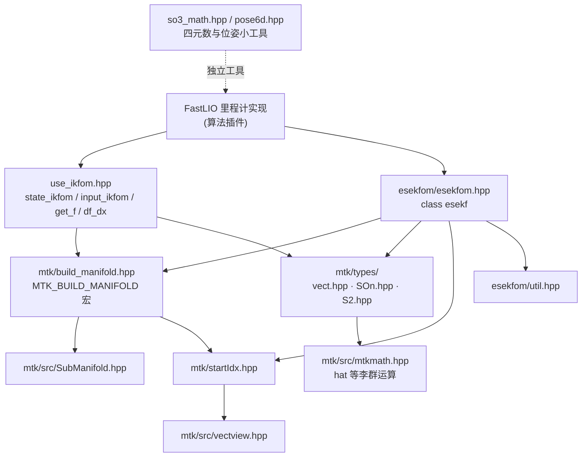
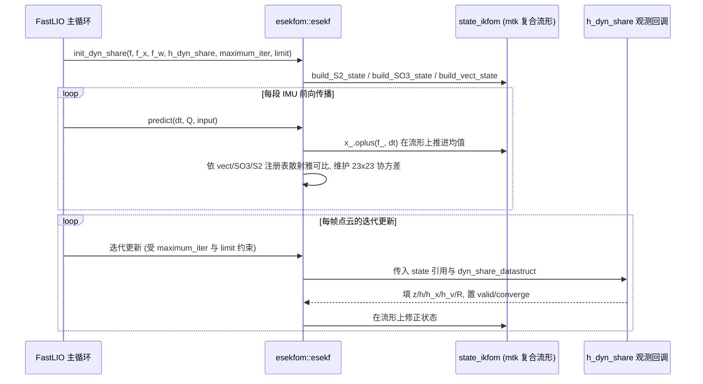

# esekfom 与 mtk 流形库

`src/asuka/thirdparty/fastlio` 是 FastLIO 里程计实现所依赖的滤波与数学底座：`esekfom/esekfom.hpp`（约 78KB，单头文件）提供迭代误差状态 Kalman 滤波器（IESKF）模板类，`mtk/` 子树提供"流形上的状态表示"，而 `use_ikfom.hpp` 是把这两者绑定到 FastLIO 具体问题的用户层定义。版权头显示 esekfom 来自港大 2019–2023 的修改版（Dongjia HE），mtk 核心源自不莱梅大学 2008–2011 的 MTK 实现（`build_manifold.hpp` 头部直接引用了 Hertzberg 等人 2011 年的流形封装论文）。

## 文件地图

| 文件 | 体量 | 职责 |
| --- | --- | --- |
| `esekfom/esekfom.hpp` | 78KB | IESKF 模板类 `esekf`：预测、迭代更新、六种模型注册入口 |
| `esekfom/util.hpp` | 2.3KB | 滤波器配套小工具，被 `esekfom.hpp` 直接包含 |
| `use_ikfom.hpp` | 4.7KB | 定义 `state_ikfom`/`input_ikfom`/过程噪声与过程模型、雅可比 |
| `mtk/build_manifold.hpp` | 12.6KB | `MTK_BUILD_MANIFOLD` 宏：从字段序列自动生成复合流形 |
| `mtk/startIdx.hpp` | 12.9KB | 成员指针 → 切向子向量索引的换算（`MTK::subvector`） |
| `mtk/src/SubManifold.hpp` | 4.9KB | 每个状态字段的包装，携带 IDX/DIM/TYP 常量 |
| `mtk/src/vectview.hpp` | 6.8KB | 切片视图类型，`subvector` 返回值的载体 |
| `mtk/src/mtkmath.hpp` | 10.5KB | `MTK::hat` 等李群基础运算 |
| `mtk/types/vect.hpp` | 15.1KB | 欧式向量流形 `MTK::vect<N, T>` |
| `mtk/types/SOn.hpp` | 10.9KB | 旋转群流形 `MTK::SO3<T>` |
| `mtk/types/S2.hpp` | 10.7KB | 单位球面流形 `MTK::S2`（三维存储、二维切空间） |
| `mtk/types/wrapped_cv_mat.hpp` | 3.3KB | OpenCV Mat 包装，FastLIO 状态未用到 |
| `so3_math.hpp` / `pose6d.hpp` | 3.3KB / 1.5KB | 四元数/SO(3) 小函数与 6 自由度位姿结构，独立于滤波框架 |

## 分层：mtk 管"状态怎么存"，esekfom 管"状态怎么估"



关键节点：`use_ikfom.hpp` 是唯一的"问题定义层"，向上把 `state_ikfom` 等类型交给 FastLIO 里程计，向下完全构建在 mtk 之上；`esekfom.hpp` 不认识具体状态，只通过模板参数和函数指针与外界交互。`so3_math.hpp` 与 `pose6d.hpp` 不参与这套流形簿记，只是配准与位姿代码顺手复用的数学小件。

## mtk：宏展开的复合流形

### `MTK_BUILD_MANIFOLD` 做了什么

`use_ikfom.hpp` 中的写法是：

```cpp
MTK_BUILD_MANIFOLD(state_ikfom,
  ((vect3, pos))((SO3, rot))((SO3, offset_R_L_I))((vect3, offset_T_L_I))
  ((vect3, vel))((vect3, bg))((vect3, ba))((S2, grav)))
```

这个宏借助 Boost.Preprocessor 遍历字段序列，为每个字段生成一个 `MTK::SubManifold<类型, IDX, DIM>` 成员，并展开出一整套成员函数：

- `MTK_BOXPLUS` / `MTK_OPLUS` / `MTK_BOXMINUS`：对每个子流形调用其 `boxplus/oplus/boxminus`，内部用 `MTK::subvector(__vec, &self::id)` 按成员指针从切向量中取出属于自己的切片（由 `startIdx.hpp` 换算索引、`vectview.hpp` 提供视图）；
- 索引注册：`build_S2_state()` / `build_SO3_state()` / `build_vect_state()` 按 `TYP` 编码把各字段登记进容器——`TYP==0` 为 vect（记 `(IDX, DIM)` 与 DOF）、`TYP==1` 为 S2、`TYP==2` 为 SO3；
- S2 专用分发：`S2_hat` / `S2_Nx_yy` / `S2_Mx` 按 `id.IDX == idx` 匹配目标子流形后转发。

这套注册表是 esekfom 与 mtk 的真正接缝：滤波器在预测/更新时必须知道"哪一段协方差对应哪个流形"，尤其是 S2 这种 DOF≠DIM 的流形需要特殊映射。

### 基础类型

- `vect<N, T>`：最简单的欧式流形，DOF=DIM=N；
- `SO3<T>`：四元数存储、三维切空间；
- `S2<T, 98090, 10000, 1>`：三维单位向量存储、二维切空间，模板尾参（98090/10000/1）固定了其内部数值方案与半球约定，属于类型签名的一部分，不可随意改动；
- `SubManifold` / `startIdx` / `vectview` / `mtkmath` 是支撑设施，用户一般不直接接触，但读 `df_dx` 这类手写雅可比时会遇到 `MTK::hat`（来自 `mtkmath.hpp`）。

## use_ikfom.hpp：把滤波器绑定到 FastLIO 问题

### state_ikfom 的字段与维度

| 字段 | 类型 | DOF | 含义 |
| --- | --- | --- | --- |
| `pos` | vect3 | 3 | IMU 位置 |
| `rot` | SO3 | 3 | IMU 姿态 |
| `offset_R_L_I` / `offset_T_L_I` | SO3 / vect3 | 3 / 3 | 雷达→IMU 外参旋转/平移 |
| `vel` | vect3 | 3 | 速度 |
| `bg` / `ba` | vect3 | 3 / 3 | 陀螺/加计零偏 |
| `grav` | S2 | 2 | 重力方向 |

合计 **DOF = 23**（切空间维，即协方差维数），**DIM = 24**（存储维，grav 占三维）。这正是文件头注释强调 *"The order of fields matters because the IESKF update relies on the compiled SO3/S2 index bookkeeping"* 的原因：字段顺序决定 IDX 编号，进而决定注册表与手写雅可比里的所有分块位置。

配套定义了 `input_ikfom`（`acc`/`gyro`）与 `process_noise_ikfom`（`ng`/`na`/`nbg`/`nba`，共 12 维），以及默认对角过程噪声 `process_noise_cov()`（ng/na 取 0.0001，nbg/nba 取 0.00001）。

### 过程模型与雅可比

- `get_f(s, in)` 返回 24 维连续时间过程导数：位置导数为 `vel`，姿态导数为 `gyro - bg`，速度导数为 `rot * (acc - ba) + grav`；
- `df_dx` 返回 24×23 矩阵，硬编码了各分块位置：速度行对位置的恒等块、`-rot * hat(acc - ba)` 与 `-rot` 块、用 `s.S2_Mx(grav_matrix, vec, 21)` 把二维重力切向映射到第 21 列起的 3×2 块、陀螺行的 `-I`；
- `df_dw` 返回 24×12 矩阵，登记噪声进入通道。

注意 **21 这个魔法数字**：它是 `grav` 的 DOF 起点（3×7 个三维字段之后）。这属于"宏生成索引"与"手写雅可比"之间的契约——改字段顺序必须同步改 `df_dx`/`df_dw` 里的所有数字。`SO3ToEuler` 是纯辅助函数，把 SO3 四元数转成角度制欧拉角（含 ±90° 俯仰的奇异分支），供日志与可视化使用。

## esekfom::esekf：迭代误差状态滤波器

### 模板与维度约定

```cpp
template <typename state, int process_noise_dof, typename input = state,
          typename measurement = state, int measurement_noise_dof = 0>
class esekf
```

类内 `n = state::DOF`（23）、`m = state::DIM`（24）、`l = measurement::DOF`；协方差类型 `cov` 是 **n×n（23×23）**，而 `flatted_state` 是 m 维（24）——阅读时不要把两者混为一谈。默认构造 `P = Identity`；`USE_sparse` 宏默认注释关闭，打开后部分矩阵走稀疏路径（`spMt`）。文件包含 `<omp.h>` 与 `boost/bind.hpp`。

### 六种模型注册入口

`init` 系列成员函数按"观测如何表达"分为三档，再按"是否 share"分两档：

| 入口 | 观测形式 | 回调数量 |
| --- | --- | --- |
| `init` | 固定维流形 | h / h_x / h_v 三个 |
| `init_dyn` | 动态长度 Eigen 向量 | h_dyn / h_x_dyn / h_v_dyn |
| `init_dyn_runtime` | 维度与类型都动态 | 只注册 h_x / h_v |
| `init_share` / `init_dyn_share` | 一次回调同时产出 z/h/h_x/h_v/R | 单个 share 回调 |
| `init_dyn_runtime_share` | 同上，运行期动态 | 单个 share 回调 |

每个入口的收尾动作完全一致：保存 `maximum_iter`、逐维拷贝收敛阈值 `limit[n]`，然后调用 `build_S2_state/build_SO3_state/build_vect_state` 编译索引簿记。

`dyn_share_datastruct` 是理解 FastLIO 用法的关键：它携带 `valid` 与 `converge` 两个标志位加动态尺寸的 `z/h/h_x/h_v/R`。注释明确其设计意图是"迭代更新中一次回调同时算出残差、估计、两份雅可比与噪声协方差"——对每帧点云残差数量不定、且需要按点剔除的场景（`valid=false` 丢弃该次观测），动态 share 版本是最贴合的入口。

### predict 的数据流



`predict(dt, Q, i_in)`（Q 按步传入）中可清晰看到 mtk 注册表的用途：先求 `f/f_x/f_w`，用 `x_.oplus(f_, dt)` 推进均值；随后 `F_x1 = Identity` 起步，遍历 `x_.vect_state` 把"模型侧按 DIM 排布"的雅可比块逐字段散射进 DOF 空间的 `f_x_final/f_w_final`；接着进入 SO3 分支（`res_temp_SO3`、`seg_SO3`），S2 分支同理需要 `S2_Mx`/`S2_Nx_yy` 做 3↔2 维映射。**若没有 mtk 的索引簿记，滤波器无法正确处理混合流形状态的协方差传播**，这就是两层库互锁的原因。

## 与 FastLIO 里程计的调用链

从构成可见目标用法：FastLIO 里程计实现（见其专页）以 `state_ikfom` 为状态、`input_ikfom` 为输入、12 维过程噪声实例化 `esekf`，用 `init_dyn_share` 注册 `use_ikfom.hpp` 中的 `get_f/df_dx/df_dw` 与自己的观测回调；每段 IMU 调 `predict` 前向传播，每帧点云进入由 `maximum_iter` 与 `limit[]` 控制的迭代更新，观测侧点面配准依赖 ikd_tree 提供的近邻。滤波器对象本身不含任何同步设施，生命周期归属里程计的单个工作线程（与异步执行器页面的单 worker 模型衔接）。

## 边界条件与阅读注意

- **字段顺序敏感**：`state_ikfom` 字段顺序被注释明示不可随意调换，`df_dx`/`df_dw` 中的分块下标（如 grav 的 21）与之硬耦合；
- **DOF≠DIM 只发生在 S2**：协方差 23×23、接口矩阵 24×23，排查维度问题时先想到 grav；
- **收敛控制**：`maximum_iter` 全局 + `limit[n]` 逐维，是迭代更新退出条件的一部分；share 回调里的 `converge` 标志也参与该判定；
- **S2 模板常量**（98090/10000/1）固定数值方案，属类型签名；
- **稀疏路径默认关闭**，改动前注意 `USE_sparse` 注释；
- **依赖 Boost 预处理器与 Boost.Bind**，mtk 宏的可读性差，调试建议看宏展开后的语义而非宏体本身。

## 扩展点

- **新增/调整状态字段**：改 `MTK_BUILD_MANIFOLD` 序列即可自动重算索引与注册表，但必须同步修订 `df_dx`/`df_dw` 的手写分块与 `get_f` 的填充位置；
- **更换观测模型**：固定维传感器选 `init`，点云类变长残差选 `init_dyn_share`，运行期维度都变的场景才有必要用 runtime 系列；
- **复用 mtk 类型**：`vect/SO3/S2` 可被其它估计器直接取用；对照阅读时注意 SmallPointLIO 与 SuperLIO 走的是各自自带的 ESKF/流形实现，并不共享本目录代码。

Sources:
- `src/asuka/thirdparty/fastlio/use_ikfom.hpp#L1-L124`
- `src/asuka/thirdparty/fastlio/esekfom/esekfom.hpp#L1-L260`
- `src/asuka/thirdparty/fastlio/esekfom/esekfom.hpp#L180-L560`
- `src/asuka/thirdparty/fastlio/mtk/build_manifold.hpp#L1-L200`

## 关联源码

- `src/asuka/thirdparty/fastlio/esekfom/esekfom.hpp`
- `src/asuka/thirdparty/fastlio/use_ikfom.hpp`
- `src/asuka/thirdparty/fastlio/mtk/build_manifold.hpp`
- `src/asuka/thirdparty/fastlio/so3_math.hpp`
