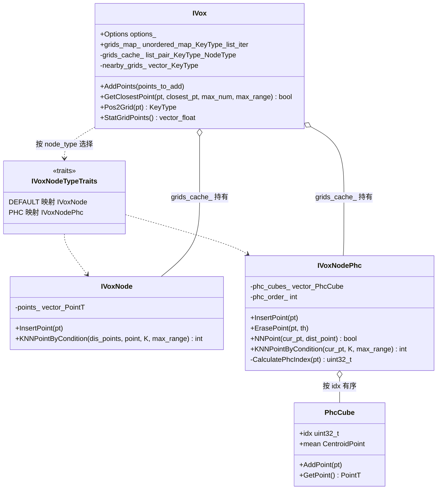
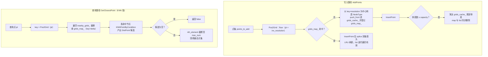

# ivox 增量局部地图

## 模块定位

ivox（incremental voxel）是一套**基于体素哈希的三维增量局部地图**，为 LIO 算法的"扫描到地图"配准提供近邻查询能力。仓库中存在**两份同源副本**：

- `thirdparty/faster_ivox/`：上游原始实现，代码位于 `fasterlio` 命名空间，由 `ivox3d.h`、`ivox3d_node.hpp`、`hilbert.hpp` 与 `eigen_types.h` 四个头文件组成；
- `thirdparty/lightning/core/ivox3d/`：同源副本，供 Lightning 算法使用，三个同名头文件体量均略小（如 hilbert.hpp 28.3KB vs 18.1KB），说明分叉后各自演化，适合对照阅读差异。

同为局部地图数据结构，FastLIO 走的是 ikd_tree 路线（另页详述），而 ivox 以"哈希体素 + LRU 缓存"换取 O(1) 的网格定位与有界的内存占用。

## 文件构成与职责

| 文件 | 职责 |
|---|---|
| `ivox3d.h` | `IVox` 主类：体素哈希表 `grids_map_` + LRU 链 `grids_cache_` + 近邻偏移表 `nearby_grids_`；提供 `AddPoints` / `GetClosestPoint` / `Pos2Grid` |
| `ivox3d_node.hpp` | 体素内节点的两种实现（线性 `IVoxNode` 与 PHC `IVoxNodePhc`），以及 `distance2` / `ToEigen` 工具与点类型特化 |
| `hilbert.hpp` | 希尔伯特曲线编码，被 `ivox3d_node.hpp` 引入，支撑 `CalculatePhcIndex` 把体素内子立方坐标映射为一维索引 |
| `eigen_types.h` | 提供 `hash_vec<dim>`（`grids_map_` 整型键的哈希器，见 `ivox3d.h` 中 `grids_map_` 的声明用法） |

## IVox 主类：哈希体素 + LRU 缓存

`IVox<dim=3, node_type=DEFAULT, PointType=pcl::PointXYZ>` 是三参数模板（`ivox3d.h` L38）：

- **键与网格化**：`KeyType` 是 `Eigen::Matrix<int, dim, 1>` 整型体素坐标；`Pos2Grid` 对点坐标乘 `inv_resolution_` 后取 floor。构造函数从 `Options`（分辨率默认 0.2m、邻域默认 NEARBY6、容量默认 100 万体素）反算 `inv_resolution_ = 1/resolution` 并调用 `GenerateNearbyGrids()` 预生成 NEARBY6/18/26 三种偏移表。
- **核心状态**：`grids_map_` 是 `unordered_map<KeyType, list迭代器, hash_vec<dim>>`，`grids_cache_` 是 `list<pair<KeyType, NodeType>>`。**存迭代器而非指针是关键设计**：`std::list::splice` 移动节点时不使迭代器失效，因此 LRU 搬移后哈希表无需重建，节点地址（`DistPoint` 持有裸指针）也保持稳定。
- **对外接口面**：`AddPoints`、三个 `GetClosestPoint` 重载（单点 1-NN / 单点 KNN / 整云批量）、`NumPoints` / `NumValidGrids` / `StatGridPoints` 统计。值得注意的是 faster 副本把 `grids_map_`、`Pos2Grid` 与 `Pos2Grid_` 放在了 **public 区**，其中 `Pos2Grid_` 支持传入自定义分辨率（按除法而非乘逆分辨率），这是为算法侧访问与多分辨率实验留出的接缝。

## 体素节点：线性与 PHC 两种实现

`IVoxNodeType` 枚举给出 `DEFAULT`（linear）与 `PHC` 两个选项，`IVoxNodeTypeTraits` 特化把选项映射为 `IVoxNode` 或 `IVoxNodePhc`——**新增节点类型只需补充 traits 特化**。

- **`IVoxNode`（线性）**：`points_` 裸 vector 直接 `emplace_back`，不去重。`KNNPointByCondition` 线性扫点，距离平方小于 `max_range²` 才加入候选，并对本节点新增段做 `nth_element` 只保留 K 个，保证候选总量有界。可见代码中该节点**没有** `ErasePoint`。
- **`IVoxNodePhc`（伪希尔伯特曲线）**：体素内部再按 `2^phc_order`（断言 ≤8）细分为子立方；`PhcCube` 只保存 `pcl::CentroidPoint` 质心——重复插入同一子立方时做**均值合并**而非堆点；`phc_cubes_` 按 Hilbert 索引**有序**存放，插入、删除、查询均用 `lower_bound` 定位。`NNPoint` 在定位点前后各取一个立方比较距离，属近似最近邻；`KNNPointByCondition` 以查询点索引为起点向前后双向迭代，扩展规模由 `max_range` 换算的子立方边长与 `8 × side³` 的索引阈值共同约束。

## 关键流程

图中关键节点：`IVox` 只依赖 traits 产出的 `NodeType` 统一契约（`InsertPoint` / `NNPoint` / `KNNPointByCondition` / `DistPoint`），两种节点可互换；`PhcCube` 的质心合并使 PHC 节点以少量内存表达稠密体素。

图中关键节点：

- **写入路径**：LRU 淘汰只发生在"新体素插入且超容量"时，一次淘汰整个体素（含其全部点），内存上界由体素数决定；命中路径的 `splice` + 更新 `grids_map_` 是 LRU 语义的核心三行。
- **查询路径**：先网格定位，再按偏移表扫周边体素，候选收集交给节点；`nth_element` 做部分选择而非全排序，最后再排一次把最近点放到首位。
- **重载差异**：单点 1-NN 版本内部走 `NodeType::NNPoint`，可见代码中只有 `IVoxNodePhc` 定义了它；批量版又转调单点 1-NN 版。因此**KNN 重载（依赖 `KNNPointByCondition`）才是两种节点类型通用的查询路径**。

## 边界条件与阅读提示

- 批量查询对找不到近邻的点填**默认构造的 `PointType()`（全零坐标）**，上层必须自行过滤，否则会把原点噪声引入配准。
- `nearby_type` 非法时 `GenerateNearbyGrids` 的报错日志被注释掉，`nearby_grids_` 保持为空，查询会**静默失败**。
- `IVoxNodePhc::ErasePoint` 中 `erase_distance_th_` 分支为空实现，属占位代码。
- 距离比较全程使用平方距离（`d < max_range * max_range`），避免开方。
- `INNER_TIMER` 统计宏默认关闭，开启后按每 10 万次打印一次体素内耗时分布。
- `StatGridPoints` 返回 `{valid_num, ave, max, min, stddev}`，`stddev` 对 `num <= 1` 做了除零保护。
- 可见代码中**没有任何互斥锁**（头文件虽引入 `<thread>`），增删查须在单线程上下文进行——与 asuka 单 worker 的里程计消费模型天然契合。

## 扩展点

- **新点类型**：为 `ToEigen` 补特化即可接入（现有 `pcl::PointXYZ` / `PointXYZI` / `PointXYZINormal` 三个特化可作样例）。
- **新节点实现**：特化 `IVoxNodeTypeTraits`，并满足 `DistPoint` / `NNPoint` / `KNNPointByCondition` 契约。
- **邻域扩展**：在 `GenerateNearbyGrids` 中追加新的 `NearbyType` 分支。
- **调参面**：`Options` 的 `resolution` / `nearby_type` / `capacity` 直接权衡查询精度、召回与内存上界。

## 与上层算法的衔接

Lightning 算法使用 `thirdparty/lightning/core/ivox3d` 副本：配准迭代中 `GetClosestPoint` 提供点面/点点的对应关系，状态收敛后 `AddPoints` 把新扫描并入局部地图；容量淘汰机制使地图随运动自然"遗忘"远处的体素。faster_ivox 一份保留上游形态，两相对照可以看出 Lightning 侧的裁剪与演化痕迹（hilbert.hpp 少约 10KB、ivox3d 两个文件各小数百字节），是理解"同一数据结构在不同算法中如何被取舍"的最佳对照组。

Sources:
- `src/asuka/thirdparty/faster_ivox/ivox3d.h#L1-L316`
- `src/asuka/thirdparty/faster_ivox/ivox3d_node.hpp#L1-L412`
- `src/asuka/thirdparty/faster_ivox/hilbert.hpp#L1`
- `src/asuka/thirdparty/faster_ivox/eigen_types.h#L1`
- `src/asuka/thirdparty/lightning/core/ivox3d/ivox3d.h#L1`
- `src/asuka/thirdparty/lightning/core/ivox3d/ivox3d_node.hpp#L1`
- `src/asuka/thirdparty/lightning/core/ivox3d/hilbert.hpp#L1`

## 关联源码

- `src/asuka/thirdparty/faster_ivox/ivox3d.h`
- `src/asuka/thirdparty/faster_ivox/ivox3d_node.hpp`
- `src/asuka/thirdparty/faster_ivox/eigen_types.h`
- `src/asuka/thirdparty/lightning/core/ivox3d/ivox3d.h`
