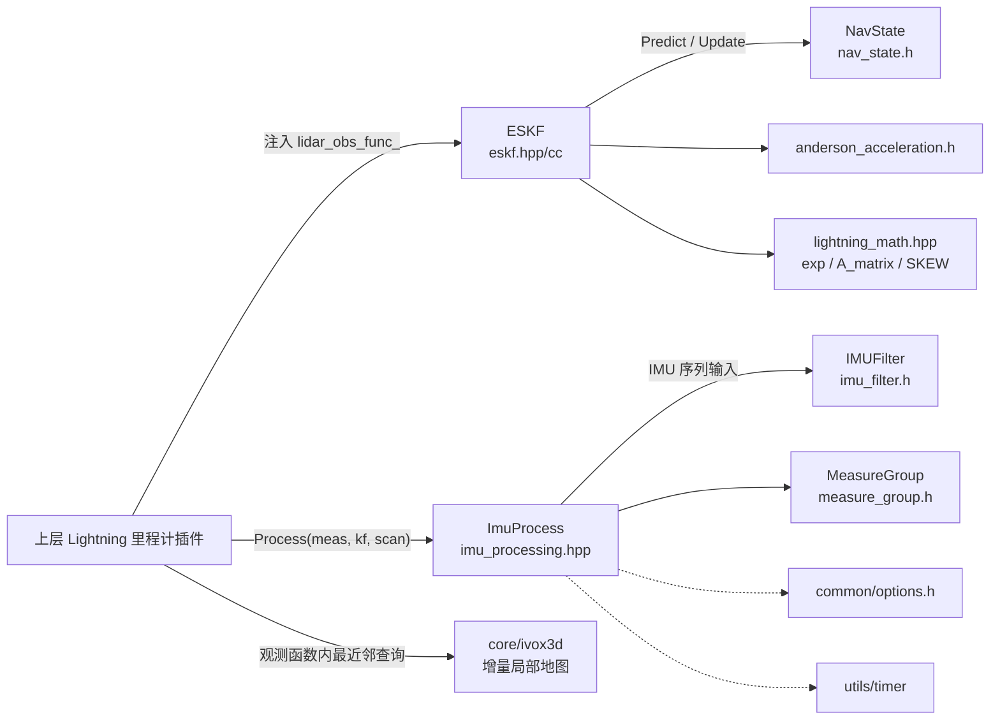
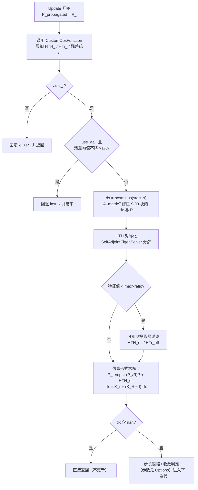

# Lightning 算法库（thirdparty/lightning）

## 定位与目录鸟瞰

`src/asuka/thirdparty/lightning` 是 Lightning 里程计的算法底座：asuka 侧的 Lightning 插件（见 Lightning 里程计主流程页）只保留薄封装，真正的 IMU 处理、误差状态滤波与数值计算都下沉在本库内。目录按"数据类型 → 核心算法 → 数学工具 → 基础设施"分层：

```text
thirdparty/lightning/
├── common/                  # 数据契约与配置
│   ├── nav_state.h/cc       # ESKF 固定状态载体（6.2KB，含流形运算）
│   ├── measure_group.h      # IMU+点云时间窗聚合（Process 的输入单元）
│   ├── options.h/cc         # 库级配置
│   ├── keyframe.h / loop_candidate.h   # 关键帧、回环候选（后端预留）
│   ├── imu.h / odom.h / pose_rpy.h / point_def.h
│   └── eigen_types.h / constant.h / std_types.h
├── core/
│   ├── lio/                 # LIO 核心
│   │   ├── eskf.hpp / eskf.cc          # 误差状态卡尔曼滤波（12.7KB 实现）
│   │   ├── imu_processing.hpp          # IMU 初始化 + 去畸变（12.2KB）
│   │   ├── imu_filter.h                # 陀螺多级降噪（7.5KB）
│   │   ├── anderson_acceleration.h     # 迭代加速器
│   │   └── pose6d.h
│   ├── ivox3d/              # 增量局部地图（与 faster_ivox 同源副本）
│   └── lightning_math.hpp   # 25KB 数值算法集中地（SO3 exp / A_matrix / SKEW 等）
└── utils/                   # timer（计时）、pointcloud_utils（点云小工具）
```

## LIO 核心调用链

核心三角由 `ImuProcess`、`ESKF`、`IMUFilter` 构成：上层 Lightning 插件持有 `ESKF` 实例并向其注入 `lidar_obs_func_` 观测函数（在 ivox3d 局部地图上做最近邻并累加 `HTH_/HTr_`），每帧把 `MeasureGroup` 交给 `ImuProcess::Process` 完成初始化与去畸变，再调用 `ESKF::Update` 融合点面观测。



关键节点说明：

- **ESKF 由外部传入**：`Process(const MeasureGroup&, ESKF&, CloudPtr&)` 的签名表明状态滤波器归上层所有，`ImuProcess` 只负责驱动它，二者是"驱动者—状态载体"关系。
- **观测函数注入**：`ESKF::Options` 中的 `CustomObsFunction` 槽位（lidar / wheelspeed / acc_as_gravity / gps / bias 五个）是库与使用者的分界——库负责迭 代更新方程，使用者负责残差与 `HTH_/HTr_` 的计算。
- **ivox3d 的位置**：局部地图不进入 ESKF 内部，而是在观测函数中被上层使用；库内携带的是同源副本，可与 `thirdparty/faster_ivox` 对照阅读。

### ImuProcess：初始化与去畸变

`ImuProcess` 承担两件事：

1. **静止初始化（IMUInit）**：首帧触发 `Reset()`，之后以增量均值/协方差更新（Welford 风格）在线估计 `mean_acc_/mean_gyr_` 及其协方差，计数由 `max_init_count_ = 20` 控制；初始化状态经 `imu_need_init_` 对外暴露（`IsIMUInited()`），并把统计结果写入 `kf_state.GetX()` 作为初始状态。
2. **去畸变（UndistortPcl）**：从成员 `imu_pose_`（逐 IMU 时刻位姿缓存）与 `Process` 输出签名可推断，其按 IMU 时间序列做前向传播并反算每个点的位姿补偿，输出 `pcl_out`。

构造时的默认噪声骨架已经固定：`Q_` 对角为 6×1e-4（位姿/速度通道）、3×1e-5（陀螺偏置通道）、3×0，`cov_acc_/cov_gyr_` 默认 0.1，`mean_acc_` 初始为 (0,0,-1) 暗示重力对齐方向。外参（`SetExtrinsic`）与四类协方差（gyr/acc/bias_gyr/bias_acc）均通过 setter 注入；`SetUseIMUFilter` 可整体关闭前置滤波。

### ESKF：固定状态的迭代误差状态滤波

设计哲学在头文件注释中写得很直白：**拒绝 MTK 宏组合状态，固定使用 NavState（pos / rot / vel / bg）**。由此带来几个硬编码常量：过程噪声 12 维、激光观测仅约束位姿 6 维、状态维度 `NavState::dim`。

**Predict（IMU 前向传播）**：`eskf.cc` 的实现是教科书式的流形 ESKF 传播——

- `x_.get_f/df_dx/df_dw` 取得动力学及其对状态/噪声的雅可比，`x_.oplus(f_, dt)` 推进状态；
- 遍历 `x_.SO3_states_`，用 `math::exp(seg_SO3, 0.5)`（中点积分）填充 `F_x1_` 的 SO3 对角块，用 `math::A_matrix` 左乘修正 `f_x_/f_w_` 的 SO3 行；
- 协方差按 `P = F_x1_ P F_x1_ᵀ + (dt·f_w) Q (dt·f_w)ᵀ` 传播，再整体乘 `predict_cov_inflation_(1.01)` 膨胀，最后交 `SymmetrizeAndFloorCovariance` 清洗。

**Update（观测迭代更新）** 是本库数值上最讲究的一段，流程如下：



关键节点解释：

- **迭代从 i=-1 起算**：第一次只是记录初始残差 `init_res` 并校验观测有效性，不产生更新；作者注释明确指出原版实现"未收敛时不计算最近邻"，而本版本每次迭代都会调用观测函数（即重算最近邻），用时间换线性化点精度，是有意为之的取舍。
- **AA 回退**：开启 Anderson 加速后，若某次迭代残差均值反而上升（≥ 上次×1.01），立即回退到 `last_x` 终止，防止加速发散；且该判断仅对 LIDAR/WHEEL_SPEED_AND_LIDAR 两类观测生效。
- **信息空间融合**：不构造传统卡尔曼增益，而是把先验写成信息矩阵 `(P_/R)⁻¹`，加上投影后的观测信息 `HTH_eff`，取逆后直接切出 `K_r/K_H` 块完成 `dx = K_r + (K_H − I)·dx`。注释解释了传 `HᵀH` 而非 `H` 的原因——残差维度不定时，累加形式才能正确融合各类残差。
- **简并处理**：对 `HTH` 做特征分解，低于 `max×1e-3` 的方向被 `observable_mask` 置零，经特征向量重构出投影器过滤观测信息，配合 `degeneracy_cov_inflation_` 应用于走廊/隧道等退化场景。

一个容易踩的小细节：`ESKF` 构造函数默认 `use_aa = true`，但 `Options::use_aa_` 默认为 `false` 且 `Init()` 会用 Options 覆盖成员——**走完 Init 后 AA 默认是关闭的**，想启用必须显式在 Options 中打开。

### IMUFilter：陀螺多级降噪

`IMUFilter` 是可插在 IMU 前向传播之前的信号级滤波器，只处理 `angular_velocity` 三轴（加计原样透传）。单样本流程：毛刺检测（窗口中位数 ± `spike_threshold`×标准差，需累计 `sample_count_ > 100` 且历史窗口满）→ 中值滤波 → 移动平均 → 速率限制（仅当 dt ∈ (0, 0.1s) 生效）。`updateStatistics` 持续维护各轴均值/方差供自适应阈值使用。参数 setter 带合法性校验（如中值窗口必须为奇数且 ≥3）。

## 关键状态一览

| 状态 | 所在位置 | 含义 |
|---|---|---|
| `x_ / P_ / stamp_` | ESKF | 导航状态、协方差、时间戳；提供 `ChangeX/ChangeP/ChangeStamp` 供外部重置 |
| `imu_need_init_ / b_first_frame_ / init_iter_num_` | ImuProcess | 初始化状态机三件套 |
| `imu_pose_` | ImuProcess | 逐 IMU 时刻预测位姿，去畸变的数据基础 |
| `use_aa_` | ESKF | Anderson 加速开关（Init 后以 Options 为准） |
| `custom_obs_model_.valid_/converge_` | ESKF | 观测有效性与收敛标志，驱动回滚逻辑 |
| `buffer_ / gyro_*_history_ / sample_count_` | IMUFilter | 滤波历史窗口与自适应统计 |

## 边界条件与数值防御

- **协方差健康检查**：`SymmetrizeAndFloorCovariance` 强制对称化，对角元素 clamp 到 `[1e-9, 100]`，nan/inf 直接替换为 1.0 并告警。
- **观测无效即回滚**：`valid_ == false` 时 `x_` 与 `P_` 均回退到传播值，坏帧不污染状态。
- **数值短路**：`dx` 中出现 nan 直接返回；`HTH` 特征分解失败则 `continue` 本轮迭代。
- **滤波器冷启动**：`IMUFilter` 在累计样本不足 100 帧时不启用毛刺检测，前几帧只做中值/均值平滑。
- **静态统计变量的隐患**：`Update` 内 `iterated_num / update_num` 是函数级 `static`，仅作统计但跨实例、跨线程共享，多线程或多次实例化时计数会互相叠加（不影响估计结果，但日志统计会失真）。

## 扩展点

- **多观测源融合**：`ObsType` 已枚举 LIDAR / WHEEL_SPEED / WHEEL_SPEED_AND_LIDAR / ACC_AS_GRAVITY / GPS / BIAS，`Options` 中对应五个 `CustomObsFunction` 槽位，接入轮速或 RTK 只需注入函数，无需改动滤波本体。
- **迭代加速可插拔**：`use_aa_` 一键开关 Anderson 加速；加速器实现独立于 `core/lio/anderson_acceleration.h`。
- **滤波前置层可关**：`SetUseIMUFilter(false)` 可退化为原始 IMU 输入，便于对比消融。
- **后端预留**：`keyframe.h / loop_candidate.h` 表明库为关键帧管理与回环检测预留了数据结构，当前开源链路以 LIDAR 观测为主。
- **局部地图同源可替换**：`core/ivox3d` 与 `thirdparty/faster_ivox` 互为副本，可作为局部地图实现的对照与替换实验场。

Sources: `src/asuka/thirdparty/lightning/core/lio/eskf.hpp#L1-L120`
Sources: `src/asuka/thirdparty/lightning/core/lio/eskf.cc#L1-L240`
Sources: `src/asuka/thirdparty/lightning/core/lio/eskf.cc#L213-L260`
Sources: `src/asuka/thirdparty/lightning/core/lio/imu_processing.hpp#L1-L160`
Sources: `src/asuka/thirdparty/lightning/core/lio/imu_filter.h#L1-L130`
Sources: `src/asuka/thirdparty/lightning/core/lightning_math.hpp#L1-L36`

## 关联源码

- `src/asuka/thirdparty/lightning/core/lio/eskf.cc`
- `src/asuka/thirdparty/lightning/core/lio/imu_processing.hpp`
- `src/asuka/thirdparty/lightning/core/lio/imu_filter.h`
- `src/asuka/thirdparty/lightning/core/lightning_math.hpp`
- `src/asuka/thirdparty/lightning/common/nav_state.h`
