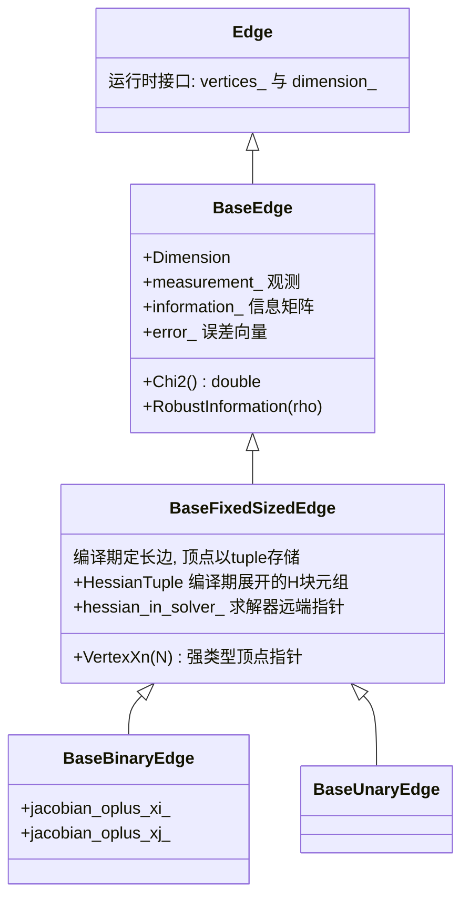
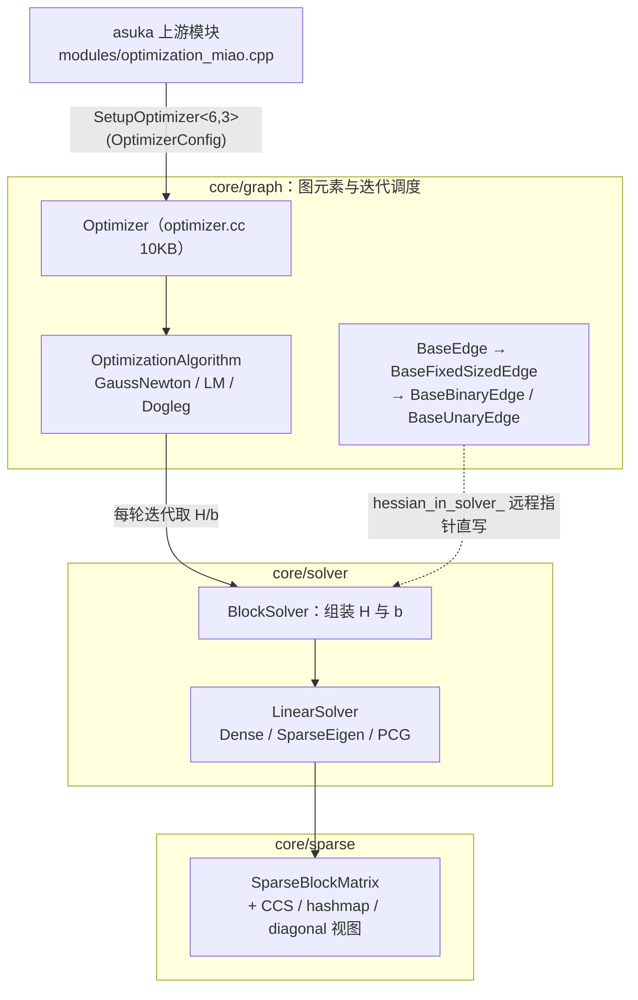

# miao 图优化库

## 模块定位

`src/asuka/thirdparty/miao` 是仓库内置的图优化框架，命名空间为 `lightning::miao`。从类命名（`BaseEdge` / `BaseFixedSizedEdge` / `BaseBinaryEdge` / `BlockSolver` / `SparseBlockMatrix`）到目录划分，它与 g2o 高度同构，可视为一份针对本项目裁剪重写的 g2o 风格实现。它在 asuka 中的唯一上游消费者是 `src/asuka/src/asuka/modules/optimization_miao.cpp`（15KB 扩展模块）：该模块构造时调用 `::lightning::miao::SetupOptimizer<6, 3>(opt_config)` 建立优化器，用 SE(3) 位姿顶点与二元边维护一张增量位姿图，与 `optimization_loam` 构成可切换的配准/优化后端。

与 odometry 插件走 dlopen 的运行期边界不同，miao 是**编译期依赖**：图元素全部以头文件模板形式存在，仅 `optimizer.cc`、`graph.cc`、各 `opti_algo_*.cc`、`block_solver.hpp`、`string_tools.cc` 等少量实现文件参与编译。库本身只依赖 Eigen（各图元素头统一引入 `common/eigen_types.h`），不含任何 ROS/PCL 头，属于纯算法层。

## 目录分层

```
thirdparty/miao/
├── core/
│   ├── common/        config.h(优化器配置)  math.h(旋转↔四元数及解析导数)  string_tools  macros
│   ├── graph/         vertex/edge 模板族 + graph(容器) + optimizer(迭代调度)
│   ├── opti_algo/     optimization_algorithm 基类 + GaussNewton/LM/Dogleg + algo_select
│   ├── solver/        block_solver(H、b 组装) + linear_solver(Dense/SparseEigen/PCG/CCS)
│   ├── sparse/        sparse_block_matrix 及 CCS/hashmap/diagonal 视图
│   ├── robust_kernel/ 基类 + huber/cauchy/tukey/welsch/dcs/fair/mc_clure/pseudo_huber/saturated
│   ├── math/          marginal_covariance_cholesky(边缘化协方差)  matrix_operations  misc
│   └── types/         现成 SE2/SE3 顶点与边(vertex_se3/edge_se3/prior/height_prior/vertex_pointxyz)
└── utils/             tuple_tools.h(元编程小工具)
```

## 图元素模板体系

边一侧的继承链是整个库的核心：

- **`Edge`（edge.h）**：运行时抽象接口，维护 `vertices_` 容器与 `dimension_`；
- **`BaseEdge<D, E>`（base_edge.h）**：加入编译期维度 `Dimension`、观测类型 `Measurement`、误差向量 `ErrorVector` 与信息矩阵 `InformationType`；`Chi2()` 实现为 `error_·(information_·error_)`；`RobustInformation(rho)` 直接返回 `rho[1] * information_`——即鲁棒核只以一阶权重缩放信息矩阵，这是与 robust_kernel 目录的对接约定；
- **`BaseFixedSizedEdge<D, E, VertexTypes...>`（base_fixed_sized_edge.h/hpp）**：注释明确"编译期确定 size 的 edge，unary/binary/multi 都可从这类定义……真正实用化的 edge"。顶点以 tuple 存储，`VertexXn<N>()` 返回强类型顶点指针，`VertexDimension<N>()` 编译期取维度。关键设计是 `HessianType<DN, DM>` 的**双地址**结构：本地 `hessian_` 矩阵 + `hessian_in_solver_` 远程指针，边写雅可比/海森时可直接落进求解器预分配内存，实现零拷贝组装。`internal` 命名空间里 `PairToIndex`/`IndexToPair` 把顶点两两组合的线性索引映射为编译期 对，配合 `std::make_index_sequence` 展开 `HessianTuple`/`HessianTupleTransposed`（顶点组合数 `nr_of_vertex_pairs_`），大量模板展开的具体实现沉在同名 `.hpp`（8.7KB）；
- **`BaseBinaryEdge<D, E, VertexXi, VertexXj>`（base_binary_edge.h）**：二元边只是便捷封装——把 tuple 第 0/1 块雅可比绑定为引用 `jacobian_oplus_xi_`/`jacobian_oplus_xj_`，子类只需向这两个矩阵填充解析导数。位姿图中的里程计约束、回环约束都直接落在这个类上；
- **`BaseUnaryEdge`** 与顶点侧的 `vertex.h`/`base_vertex.h`/`base_vec_vertex.h` 构成同族对应物。



继承链各层职责：`BaseEdge` 管"边自身"（观测/信息/卡方），`BaseFixedSizedEdge` 管"边与顶点的关系"（tuple 化顶点与成对海森块），`BaseBinaryEdge` 只做雅可比引用的绑定。上游自定义约束时继承最末层即可。

## 优化器与求解链

`OptimizerConfig`（common/config.h）是整条求解链的配置入口，字段与默认值本身就是行为说明书：

- `algo_type_`：GAUSS_NEWTON / LEVENBERG_MARQUARDT（默认）/ DOGLEG，对应 opti_algo 目录的三个实现（optimization_algorithm.h 为公共基类，algo_select.h 按 config 分派；GN 实现仅 1.2KB，LM 4.2KB 含阻尼策略，Dogleg 5.9KB）；
- `linear_solver_type_`：默认 `LINEAR_SOLVER_SPARSE_EIGEN`，可选 DENSE 与 PCG（注释标注"快但是糙一些"）；CSPARSE 与 CHOLMOD 仅留注释，**未移植**，linear_solver_ccs.h 也只是接口壳；
- `is_dense_`：注释规定"稠密问题不允许有 marg；稀疏问题可有可无"；
- `incremental_mode_` 与 `max_vertex_size_`：增量模式面向实时定位/实时 pose graph，`max_vertex_size_ = -1` 不限制顶点数，为正时优化器用新顶点替换最旧顶点、**保持 block solver 结构不变**（滚动窗口）；
- `parallel_` 并发开关与 `eps_chi2_`（默认 1e-4）卡方收敛退出阈值。

迭代调度由 `Optimizer`（optimizer.cc，10KB）承担，操作对象是 `graph.h/graph.cc` 提供的顶点/边容器；每次迭代把问题交给 `BlockSolver`（block_solver.hpp 21KB，全库最重的模板实现）组装 H 与 b，再交给选定的 `LinearSolver` 在 `SparseBlockMatrix`（sparse 目录，hpp 15KB 配 CCS/hashmap/diagonal 三种视图）上求解；`math/marginal_covariance_cholesky` 用于求解后从稀疏 H 提取边缘化协方差。



关键节点说明：`Optimizer` 只负责外层迭代收敛判据（`eps_chi2_`），数值核心全部在 `BlockSolver` + `LinearSolver`；虚线是本库最有特点的一条路径——边不经拷贝、通过 `hessian_in_solver_` 指针直接把海森块写进求解器内存，这也是增量模式能"换顶点不换求解器结构"的前提。

## 数学与公共工具

- **common/math.h**（11KB）：`_q2m` 按 Shepperd 分支法从旋转矩阵提取四元数（依迹与对角优势分四路，返回分支序号）；`compute_dq_dR_w/x/y/z` 输出四元数各分量对旋转矩阵 9 个元素的 3×9 解析导数。它们是 SE(3) 边解析雅可比的数学底座——顶点用四元数参数化旋转，边对位姿增量求导时先经这组函数换算；
- **robust_kernel/**：`robust_kernel.h` 基类加 9 种核（Huber 最大 1.1KB，其余数百字节），经 `robust_kernel_all.h` 汇总，与 `BaseEdge::RobustInformation` 的 `rho[1]` 缩放约定配合；
- **types/**：`vertex_se3/vertex_se2/vertex_pointxyz` 与 `edge_se3/edge_se2` 及 prior/height_prior 先验边，是图元素模板的现成实例化样例。上游 `SetupOptimizer<6, 3>` 的模板参数正与 6 维 `vertex_se3`、3 维 `vertex_pointxyz` 的组合相对应；
- **common/string_tools、macros、utils/tuple_tools.h**：字符串解析与元编程基础设施，服务于配置读取和模板展开。

## 上游接线：optimization_miao 如何使用本库

从 optimization_miao.cpp 前 53 行可见完整接线方式：

1. 从 `config_extensions` 读取回环间隔、NDT 分数阈值、运动/回环平移旋转噪声、`rk_loop_th`、高度先验等参数；
2. 构造 `OptimizerConfig(LEVENBERG_MARQUARDT, LINEAR_SOLVER_SPARSE_EIGEN, is_dense=false)` 并打开 `incremental_mode_`，调 `SetupOptimizer<6, 3>`；
3. 用噪声倒数平方生成 `info_motion`/`info_loops` 两个 6×6 信息矩阵，填入对应二元边的 `information_`；
4. 订阅 `Callbacks::on_new_frame`，另起 `input_thread` 与 `worker_thread` 双线程——miao 自身不做任何线程管理，并发边界完全留在 asuka 侧，库内仅有 `OptimizerConfig::parallel_` 这一个并发开关。

## 关键状态与边界条件

- **海森块双地址的生命周期**：边的本地 `hessian_` 与求解器远端 `hessian_in_solver_` 成对存在；增量模式下顶点滚动替换时依赖 block solver 结构不变这一前提，两块内存的一致性由库内部维护；
- **增量模式的硬约束**（config.h 注释逐条写明）：不支持带 Marg 的顶点（Hessian index 需重排）；目前不支持 `SetFixed` 节点（会跳过 fixed nodes 导致索引重排）；稠密问题不允许 marg；
- **未移植能力**：CSPARSE、CHOLMOD 求解器与 CCS 线性求解器仅保留接口/注释位；
- **收敛与并发**：`eps_chi2_` 决定迭代退出，`parallel_` 决定求解是否走并发路径。

## 扩展点

- **新增约束类型**：继承 `BaseBinaryEdge`（多顶点约束用 `BaseFixedSizedEdge`），实现误差与雅可比填充；types/ 下 SE2/SE3 系列是最直接的参考样例；
- **新增优化算法**：继承 `OptimizationAlgorithm` 并在 `algo_select.h` 登记分派；
- **新增线性求解器**：实现 `LinearSolver` 接口，CCS 壳已预留位置；
- **新增鲁棒核**：按 `robust_kernel_all.h` 的汇总方式追加，无需改动边侧代码。

Sources:
- `src/asuka/thirdparty/miao/core/graph/base_binary_edge.h#L1-L28`
- `src/asuka/thirdparty/miao/core/graph/base_edge.h#L1-L64`
- `src/asuka/thirdparty/miao/core/graph/base_fixed_sized_edge.h#L1-L170`
- `src/asuka/thirdparty/miao/core/common/config.h#L1-L69`
- `src/asuka/thirdparty/miao/core/common/math.h#L1-L260`
- `src/asuka/src/asuka/modules/optimization_miao.cpp#L1-L200`

## 关联源码

- `src/asuka/thirdparty/miao/core/graph/base_binary_edge.h`
- `src/asuka/thirdparty/miao/core/common/math.h`
- `src/asuka/thirdparty/miao/core/common/config.h`
