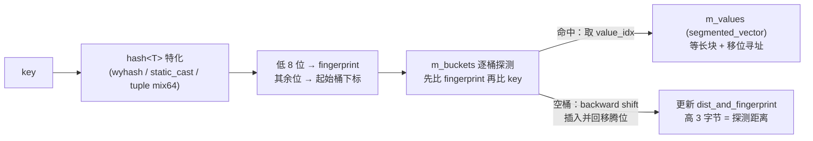

# ankerl 高性能哈希容器

## 模块定位与职责

`src/asuka/thirdparty/ankerl` 是 vendored 进仓库的第三方单头库：martinus/unordered_dense **v4.8.1**（MIT 许可，L1-27），自述为 "A fast & densely stored hashmap and hashset based on robin-hood backward shift deletion"（L3），即基于 robin hood 哈希 + 后移删除的稠密哈希 map/set。目录仅两个文件：

- `unordered_dense.h`（88KB）：全部容器实现；
- `stl.h`（4KB）：配套工具头，本身不含容器逻辑。

在本仓库中，它的消费者集中在高频数据关联路径：SuperLIO 子模块的八叉体素地图 `octvoxmap.hpp`、哈希近邻查表 `hknn_tables.hpp`、体素级最近点搜索 `voxel_grid_closest.hpp`。这些路径每帧点云配准都要做大量体素键查找/插入，因此选型上强调缓存友好的稠密存储，而非 `std::unordered_map` 的链地址法。

## 两个文件的分工

`stl.h` 的职责是**环境探测 + 标准头聚合**：一次性包含 `<array>` `<cstdint>` `<functional>` `<memory>` `<vector>` 等十余个标准头（stl.h L32-47），并集中处理三处平台差异——MINGW64 + GCC≥13 + win32 线程模型下禁用 `<memory_resource>`（L49-66）、PMR 可用性探测（`ANKERL_UNORDERED_DENSE_PMR` 指向 `std::pmr` 或 `std::experimental::pmr`，L68-76）、MSVC x64 的 `_umul128` 内建（L78-81）。`unordered_dense.h` 在非 STD_MODULE 模式下 `#include "stl.h"`（L93-95）。把标准库包含收敛到独立小头，使平台差异只改一处，也便于编译缓存复用。

## 主头文件的自顶向下组织

1. **版本与 ABI 隔离**（L33-45, L116-117）：三个版本宏拼出 inline namespace `v4_8_1`，不同版本符号天然隔离。
2. **硬性门槛**（L84-85）：C++17 以下直接 `#error`。
3. **平台与优化宏**：`PACK`（GCC attribute / MSVC pragma pack，L53-59）、异常探测（L62-66）、`LIKELY/UNLIKELY`（C++20 attribute 或 `__builtin_expect`，L97-114）、UBSAN 无符号溢出检查抑制（L73-82）。
4. **错误处理边界**（L121-147）：三个 `noinline` 终止函数 `on_error_key_not_found` / `on_error_bucket_overflow` / `on_error_too_many_elements`。有异常时分别抛 `out_of_range`（`at()` 未命中）、`overflow_error`（桶数达上限）、`out_of_range`；无异常构建退化为 `abort()`。注释明确：慢路径不内联，避免拖累其它内联决策。
5. **哈希体系**（L151 起）：`detail::wyhash` 是 wyhash 精简版——硬编码 seed/secret、去掉大端支持。对外是 `hash<T>` 主模板及特化：整型族经 `ANKERL_UNORDERED_DENSE_HASH_STATICCAST` 直接 `static_cast<uint64_t>`（bool/char/int/long 等，L388-419）；`tuple`/`pair` 逐元素 `to64`（整型直转、复合类型递归 hash）后 `mix64` 混合（L341-385）。`is_avalanching` 嵌套类型配合 `detect_avalanching`（L470-471）标记哈希值是否已充分扩散；`is_transparent` 检测（L473-489）启用异构查找。
6. **桶编码**（L425-445）：`bucket_type::standard` 是两个 `uint32_t`——`m_dist_and_fingerprint`（高 3 字节为到原始桶的探测距离，低 1 字节为哈希指纹）与 `m_value_idx`（指向 `m_values` 的下标），共 8 字节；`bucket_type::big` pack 成 12 字节，`m_value_idx` 升为 `size_t`，突破 4G 元素上限。
7. **基础设施**（L447-507）：`base_table_type_map`/`base_table_type_set` 区分 map（有 mapped_type）与 set；`has_reserve`、`is_detected` 等 enable_if 助手。

## segmented_vector：稠密值的物理载体

`segmented_vector`（L509 起）自述"Very much like std::deque, but faster for indexing"：等长块挂进 `m_blocks` 指针数组，块内元素数为 2 的幂（由 `MaxSegmentSizeBytes=4096` 与 `sizeof(T)` 推出，L537-548），寻址仅用移位+掩码 `m_data[m_idx >> num_bits][m_idx & mask]`（L633-639）。与 `std::vector` 不同，扩容**不整体翻倍搬移**，只追加新块（L511-513）——这意味着桶表里存的 `value_idx` 在扩容后依然有效，正是"robin hood 桶表 + 稠密值数组”能正交组合的关键；代价是每次索引多一跳间接。迭代器 `iter_t<IsConst>` 单模板兼任 iterator/const_iterator，forward 类别（L550-670）。

## 查找/插入路径

关键节点：所有键进入同一条 wyhash 管线，整型键（体素坐标编码是典型）零成本直转；桶内常驻 1 字节指纹，把绝大多数不相等挡在真实 key 比较之前；头注释点名的 *backward shift deletion*（L3）使删除不留墓碑、后继前移补位。值本体在 `m_values` 中稠密排布，遍历整表时按值数组线性扫——体素地图导出/遍历正受益于此。

本页证据覆盖该头前 820 行（宏、哈希、桶、存储层）；基于上述组件组装的 `table` 模板与 `map`/`set` 公开别名位于其后，从 `base_table_type_map/set` 与桶注释中的 `m_values` 可反推其“桶表 + 稠密值数组"双结构组装方式。

## 边界条件与扩展点

- **边界**：元素数逼近 `standard` 桶 `uint32` 下标上限需换 `big` 桶类型，越界触发 `on_error_bucket_overflow`；`-fno-exceptions` 构建下 `at()` 未命中直接 `abort()`，实时/嵌入式配置需留意；MINGW64 特定组合下 PMR 被静默禁用。
- **扩展**：为 `hash<T>` 添加特化即可接入自定义键（充分扩散的哈希加 `using is_avalanching = void;`）；Hash/KeyEqual 同时带 `is_transparent` 启用异构查找；Allocator 模板参数、`MaxSegmentSizeBytes` 块大小与 PMR 别名可定制内存策略；升级 vendor 版本只需改三个版本宏，inline namespace 自动整体切换。

**阅读建议**：把本页当工具书，读 SuperLIO 地图层时只需记住三点——桶 8 字节双 32 位、值存 `segmented_vector` 且下标扩容稳定、无异常构建下错误路径是 `abort()`；其余 80KB 模板细节按需检索。

Sources: `src/asuka/thirdparty/ankerl/unordered_dense.h#L1-L230`
Sources: `src/asuka/thirdparty/ankerl/unordered_dense.h#L340-L560`
Sources: `src/asuka/thirdparty/ankerl/unordered_dense.h#L509-L820`
Sources: `src/asuka/thirdparty/ankerl/stl.h#L1-L83`

## 关联源码

- `src/asuka/thirdparty/ankerl/unordered_dense.h`
- `src/asuka/thirdparty/ankerl/stl.h`
